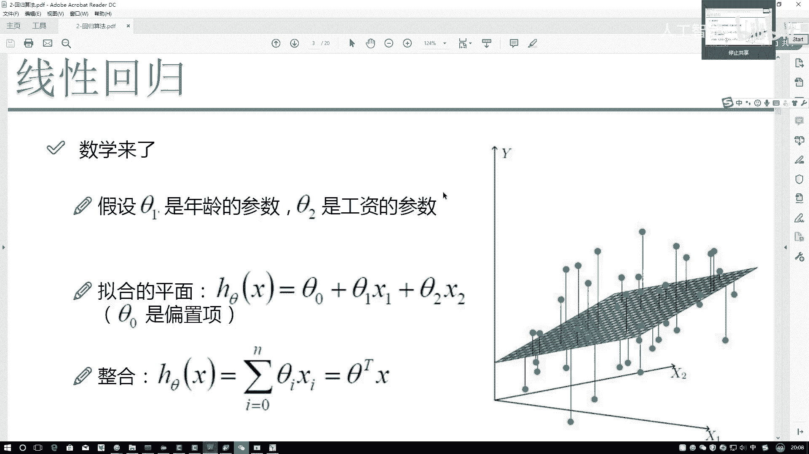
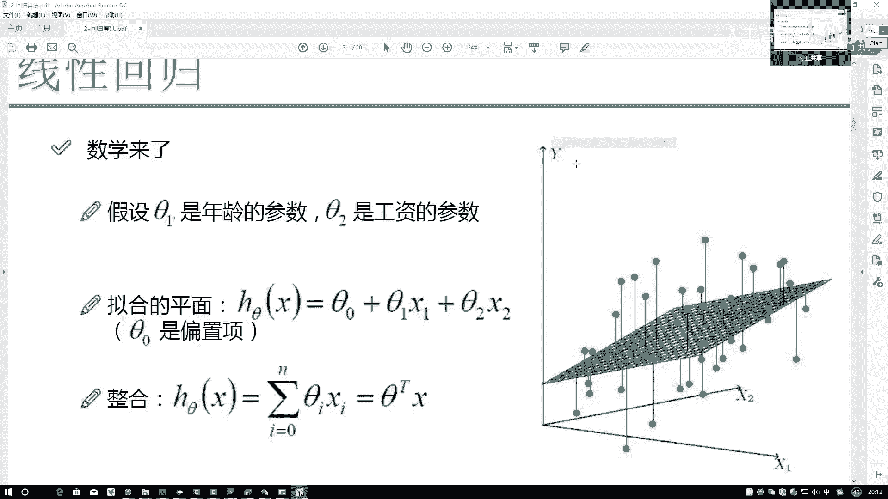
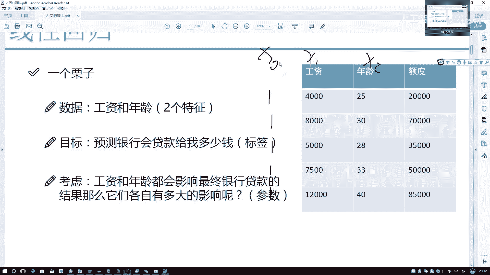
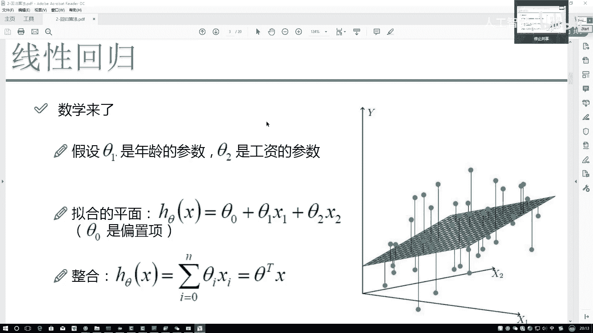
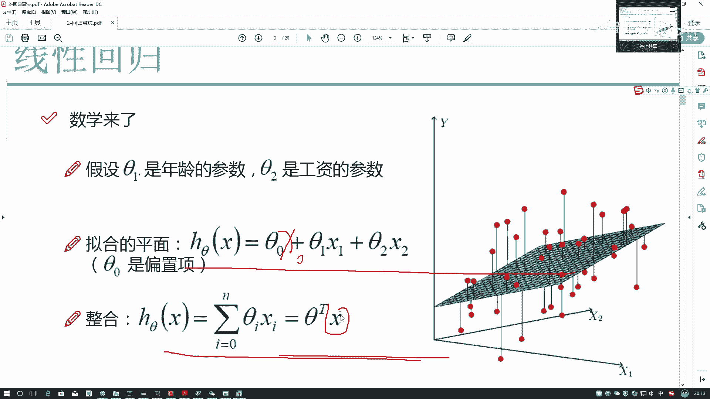
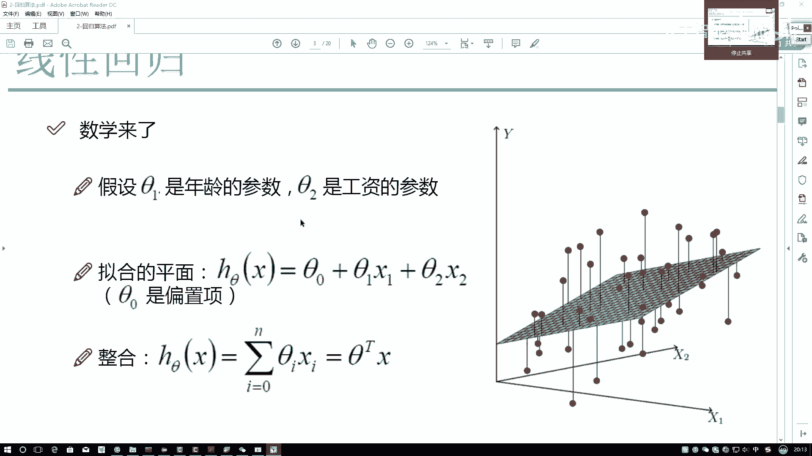
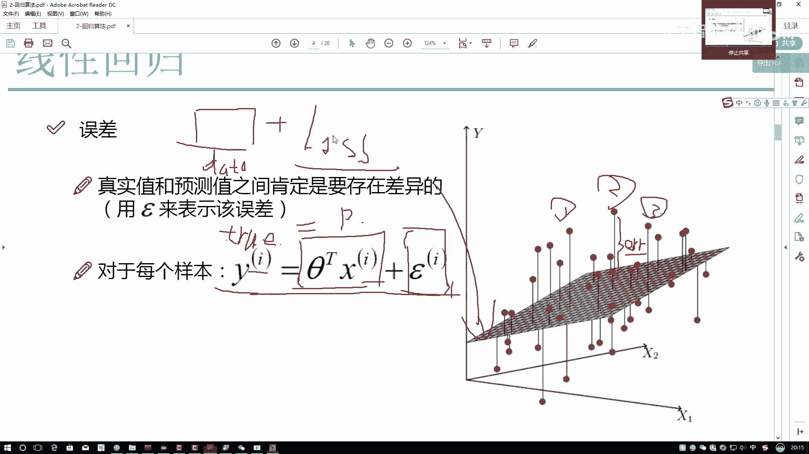
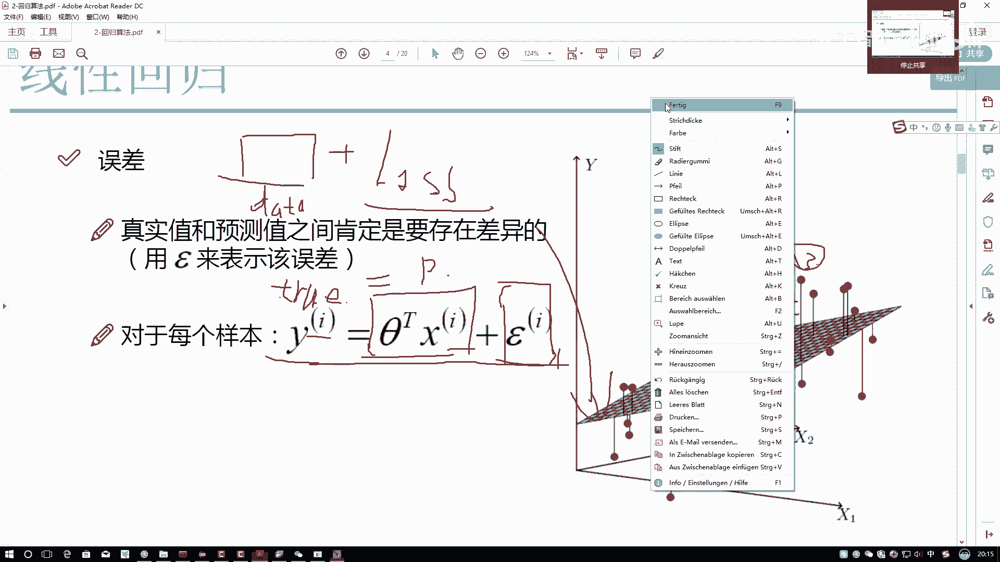
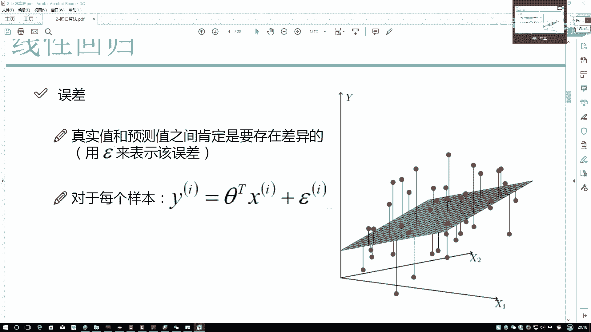

# Python金融分析与量化交易实战教程：P51：2-误差项定义 📊

## 概述
在本节课中，我们将学习线性回归模型中的一个核心概念——误差项。我们将探讨如何构建一个拟合数据的平面（即回归方程），并理解真实值与预测值之间的差异是如何被定义和衡量的。这是理解机器学习模型如何“学习”和优化的基础。

---

## 构建线性回归方程

上一节我们介绍了线性回归的基本思想，即用一个平面来拟合数据点。本节中我们来看看如何用数学公式来描述这个平面。

首先，我们写出线性回归方程的一般形式。假设我们有两个特征：工资（X1）和年龄（X2），用来预测贷款额度（Y）。我们的模型可以表示为：

**公式：** `h_θ(X) = θ₀ + θ₁X₁ + θ₂X₂`

在这个公式中：
*   `h_θ(X)` 代表我们的预测平面。
*   `θ₁` 和 `θ₂` 被称为**权重项**。它们分别衡量了特征 `X₁`（工资）和 `X₂`（年龄）对最终结果的影响程度。
*   `θ₀` 被称为**偏置项**。它的作用是**微调**整个平面，使其在垂直方向（Y轴方向）上整体向上或向下平移，以更好地拟合数据。它不依赖于任何输入特征。

需要强调的是，偏置项的作用是微调，模型的核心影响因素仍然是权重项 `θ₁` 和 `θ₂`。

---

## 转换为矩阵形式

我们之前提到，数据处理通常基于矩阵运算。然而，当前的公式 `θ₀ + θ₁X₁ + θ₂X₂` 由于 `θ₀` 的独立存在，不方便直接写成矩阵乘法形式。

为了解决这个问题，我们需要对公式进行一个巧妙的转换。观察发现，如果能为 `θ₀` 也配对一个特征 `X₀`，那么整个公式就可以统一写成矩阵形式。

以下是实现转换的关键步骤：

我们引入一个新的特征 `X₀`。与具有实际意义的 `X₁`（工资）和 `X₂`（年龄）不同，`X₀` 是我们为了计算方便而**构造**出来的。

为了使 `θ₀ * X₀ = θ₀` 成立，`X₀` 的值应该恒等于 **1**。

因此，在数据预处理阶段，我们通常会在原始数据矩阵的最前面**添加一列**，且这一列的所有值都为1。这一操作的目的纯粹是为了**将方程转换为矩阵形式，便于后续计算**，并没有额外的物理含义。

转换后，我们的特征矩阵 `X` 增加了一列 `X₀`，参数向量 `θ` 包含了 `θ₀`。此时，预测方程可以简洁地写成：

**公式/代码：** `h_θ(X) = X · θ` （其中 `·` 表示矩阵乘法）

这里，`X` 是已知的数据矩阵，`θ` 是包含所有权重和偏置的未知参数向量，也是我们需要通过模型学习求解的目标。

---

## 定义误差项

现在，我们有了预测方程 `h_θ(X)`。接下来，我们以一个具体的数据点（样本）为例，来审视预测值与真实值之间的关系。

假设我们有一个样本（图中红点），其特征 `X₁` 和 `X₂` 是已知的。
*   将该点的 `X₁` 和 `X₂` 代入我们的预测平面 `h_θ(X)`，会得到平面上的一个点（图中蓝点）。这个蓝点对应的Y值，就是模型给出的**预测值**。
*   而原始数据中该红点自身的Y值，则是**真实值**（例如，银行历史记录中实际批贷的金额）。

预测值与真实值之间的垂直距离（即它们在Y轴上的差值），就是我们所说的**误差项**。

**公式：** `error⁽ⁱ⁾ = y⁽ⁱ⁾ - h_θ(X⁽ⁱ⁾)`
其中，上标 `(i)` 表示第 `i` 个样本。显然，**每个样本都有其对应的误差值**。

---

## 从误差到损失函数

机器学习可以通俗地理解为：我们给机器提供**数据**，并告诉它一个**学习目标**（即损失函数），机器则会自动寻找一组参数 `θ`，使得这个目标达到最优。

那么，我们的学习目标应该是什么？基于误差项的定义，我们自然希望模型的预测尽可能准确，即**误差项越小越好**。最理想的情况是误差为零，表示预测完全正确。

因此，在机器学习中，我们通过定义一个**损失函数**（或目标函数）来量化所有样本的总体误差。模型训练的过程，就是寻找能够最小化这个损失函数的参数 `θ` 的过程。

几乎所有损失函数的设计都遵循这一核心原则：**损失函数的值越小，模型性能越好；当损失函数为零时，达到完美拟合。**

---

## 总结
本节课中我们一起学习了线性回归模型误差项的核心概念。我们首先构建了包含权重项和偏置项的回归方程，并通过添加值为1的 `X₀` 列将其转换为矩阵形式。接着，我们定义了单个样本的预测值与真实值之间的差异为误差项。最后，我们引出了机器学习的关键——通过定义损失函数来最小化总体误差，从而指导模型进行学习。理解误差项是理解所有监督学习算法优化过程的基础。