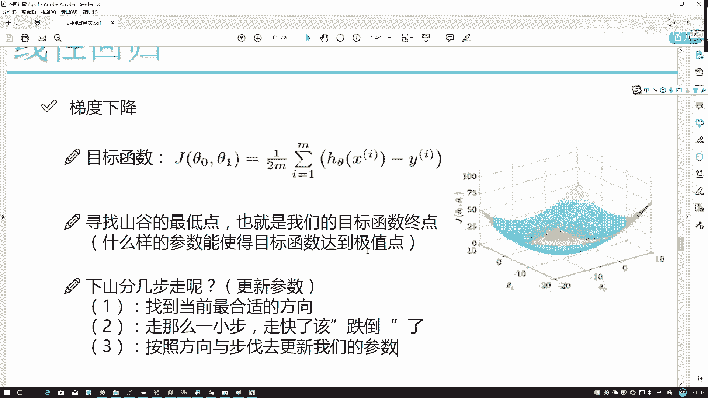
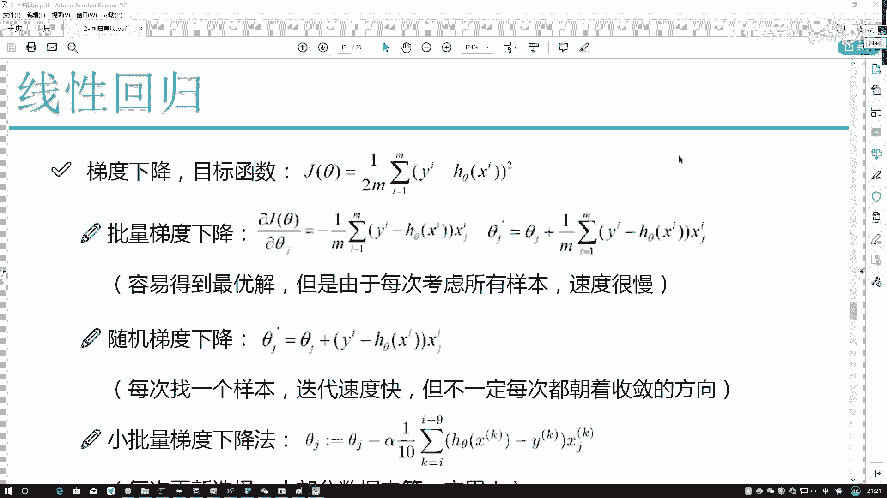

# Python金融分析与量化交易实战教程：P56：参数更新方法 📈

在本节课中，我们将学习机器学习模型训练的核心步骤——参数更新。我们将深入探讨梯度下降算法如何通过计算损失函数的梯度，并沿着梯度的反方向更新模型参数，从而找到使模型性能最优的参数值。

---

上一节我们介绍了损失函数的概念，它是衡量模型预测值与真实值差距的指标。本节中我们来看看如何通过优化算法来最小化这个损失函数，即如何更新模型的参数。

在优化过程中，我们需要找到最优的参数值，例如 `θ₀` 和 `θ₁`。这里有一个关键问题：这些参数是应该同时更新，还是分别更新？

大家可以先思考一下。正确的做法是**分别更新**。为什么不是一起更新呢？虽然 `θ₀` 和 `θ₁` 都会影响最终结果，但不要忘记，它们各自对应的特征 `x₀` 和 `x₁` 在数据样本中是相互独立的。既然特征之间没有关系，那么对应的参数在优化过程中也应当被视为独立的。因此，在优化时，我们需要分别计算 `θ₀` 和 `θ₁` 的更新方向。

可以这样形象地理解：在一个三维空间中，`θ₀` 和 `θ₁` 代表两个坐标轴。我们要寻找山谷（损失函数）的最低点，就需要分别找到 `θ₀` 和 `θ₁` 各自最合适的下降方向，然后让它们各自沿着自己的方向前进一小步，最终共同到达一个更优的位置。

这意味着，在每一步更新中，我们需要：
1.  用损失函数 `J` 对 `θ₀` 求偏导，得到 `θ₀` 的更新方向。
2.  用损失函数 `J` 对 `θ₁` 求偏导，得到 `θ₁` 的更新方向。
这两个过程是独立进行的。

---

寻找损失函数最低点（即模型最优参数）的整体流程可以概括为以下三步，并且这是一个不断重复的迭代过程：

以下是梯度下降的核心步骤：
1.  **计算梯度（求偏导）**：计算损失函数关于每个参数的偏导数，以确定下降方向。
2.  **沿反方向移动一小步**：沿着梯度反方向（即下降最快的方向）移动一个很小的步长。**步长必须很小**，如果步长太大，可能导致“跌倒”，即优化过程不收敛或收敛效果很差。
3.  **更新参数**：用当前参数值减去（或加上）这一步的移动量，得到新的参数值。然后，基于新的参数值，回到第一步重新计算，如此循环。

---

上一节我们介绍了优化的步骤，本节中我们来看看如何在数学上描述这个“下山”任务。首先，我们需要一个能评估整体模型性能的损失函数。

之前我们定义了单个样本的损失。但评估一个模型的好坏，不能只看一个样本，而要看所有样本的平均表现。因此，整体的损失函数 `J(θ)` 通常是所有样本损失的平均值，并且为了放大预测误差的影响，我们常使用平方误差。

假设我们有 `m` 个样本，模型预测函数为 `h_θ(x)`，则损失函数（均方误差）定义为：
`J(θ) = (1/(2m)) * Σ (y_i - h_θ(x_i))²` （其中 `i` 从 1 到 `m`）
公式中的 `1/2` 是为了后续求导时消去平方项产生的系数 `2`，让表达式更简洁。

---

现在，我们要对这个损失函数 `J(θ)` 求偏导，以更新某一个特定参数 `θ_j`。求导过程需要注意角标，`i` 代表第 `i` 个样本，`j` 代表第 `j` 个特征（参数）。

对 `θ_j` 求偏导时，由于 `h_θ(x_i)` 是 `θ_j * x_j` 的线性组合，根据求导法则，只有包含 `θ_j` 的项（即 `θ_j * x_ij`）的导数不为零。求导过程如下：
`∂J/∂θ_j = (1/m) * Σ (h_θ(x_i) - y_i) * x_ij`

**推导解释**：
*   `(1/(2m))` 中的 `2` 与平方项求导产生的 `2` 相乘，简化为 `(1/m)`。
*   `(y_i - h_θ(x_i))²` 对 `h_θ(x_i)` 求导得到 `2*(y_i - h_θ(x_i))`，再对 `θ_j` 求导，`h_θ(x_i)` 关于 `θ_j` 的导数是 `x_ij`。
*   合并后得到 `(1/m) * Σ (h_θ(x_i) - y_i) * x_ij`。注意符号，因为是对 `(y_i - h_θ(x_i))` 求导，会产生一个负号，从而将 `(y_i - h_θ(x_i))` 变为 `(h_θ(x_i) - y_i)`。

这个偏导数 `∂J/∂θ_j` 就是参数 `θ_j` 当前的**梯度**。梯度指明了损失函数增长最快的方向。

---

我们知道了梯度方向是上升最快的方向，那么为了最小化损失函数，我们需要沿着梯度的**反方向**前进。这就是“梯度下降”中“下降”的含义。

因此，参数 `θ_j` 的更新公式为：
`θ_j := θ_j - α * (∂J/∂θ_j)`
**代码表示**：`theta_j = theta_j - learning_rate * gradient`

**公式解释**：
*   `:=` 表示赋值更新。
*   `α` (alpha) 称为**学习率**，它控制着我们沿着梯度反方向前进的“步长”大小，即之前提到的“一小步”。
*   `- α * (∂J/∂θ_j)` 整体代表了沿着梯度反方向移动的位移。梯度 `∂J/∂θ_j` 本身带有方向，加上负号即反转方向，再乘以学习率 `α` 确定步长。
*   用当前的 `θ_j` 减去这个位移，就得到了更新后的、更优的 `θ_j` 值（记为 `θ_j'`）。

这个更新公式是梯度下降算法的核心。通过不断重复“计算梯度 -> 沿反方向更新参数”的过程，模型参数会逐步逼近使损失函数最小化的最优值。

---

本节课中我们一起学习了机器学习模型训练的关键——参数更新方法。我们首先明确了参数需要分别独立更新的原则，然后梳理了梯度下降“计算-移动-更新”的三步迭代流程。接着，我们从数学上推导了基于均方误差损失函数的梯度计算公式，并最终得到了核心的参数更新公式 `θ_j := θ_j - α * (∂J/∂θ_j)`。理解这个公式是掌握梯度下降乃至其他优化算法的基础。在接下来的课程中，我们将学习如何设置学习率等超参数，并了解梯度下降的不同变种。