# Python金融量化：P11：01 股票数据预处理 📊

## 概述
在本节课中，我们将学习如何使用Python进行股票数据的预处理。我们将通过一个实际案例，获取茅台股票的历史行情数据，并将其进行清洗、转换和整理，为后续的金融量化分析打下基础。你将学习到如何使用`tushare`财经数据接口包获取数据，以及如何使用`pandas`库对数据进行基本操作。

---

## 上一节回顾与本节目标
在上一节中，我们学习了`DataFrame`的基础操作。本节中，我们将通过两个小项目来巩固这些操作，特别是对`DataFrame`索引和切片操作的掌握。第一个项目是一个初步的股票分析案例，旨在巩固基础；第二个项目（将在下一节介绍）是真实的“双均线”股票买卖策略案例。

通过本节的案例，你将初步感受如何使用数据分析进行金融量化，并了解需要掌握的相关技能。

---

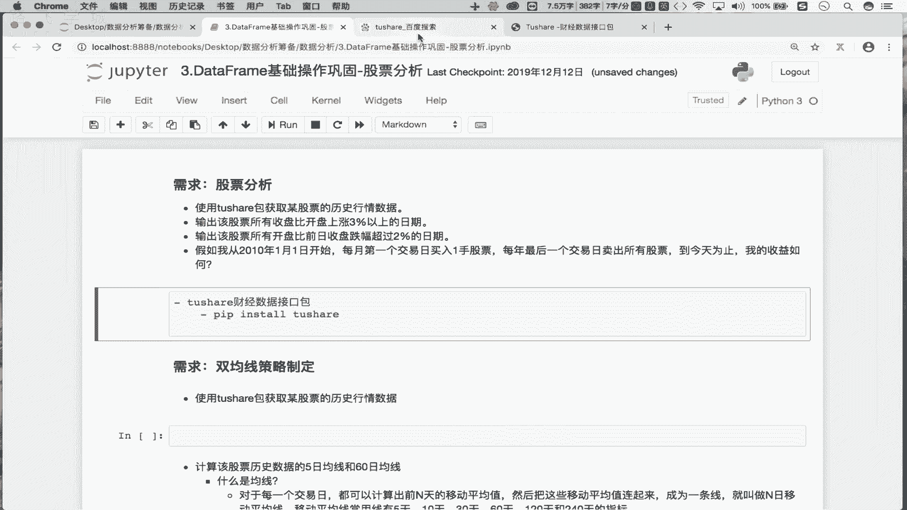

## 项目需求分析
要进行股票买卖策略分析，首先需要获取股票的历史交易数据。历史数据是公开透明的，我们可以基于对历史数据的分析来预判未来走势。

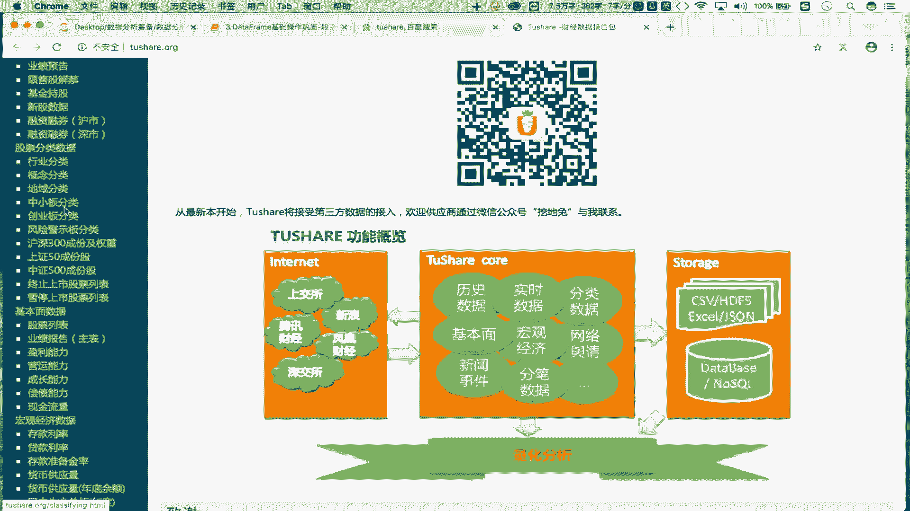

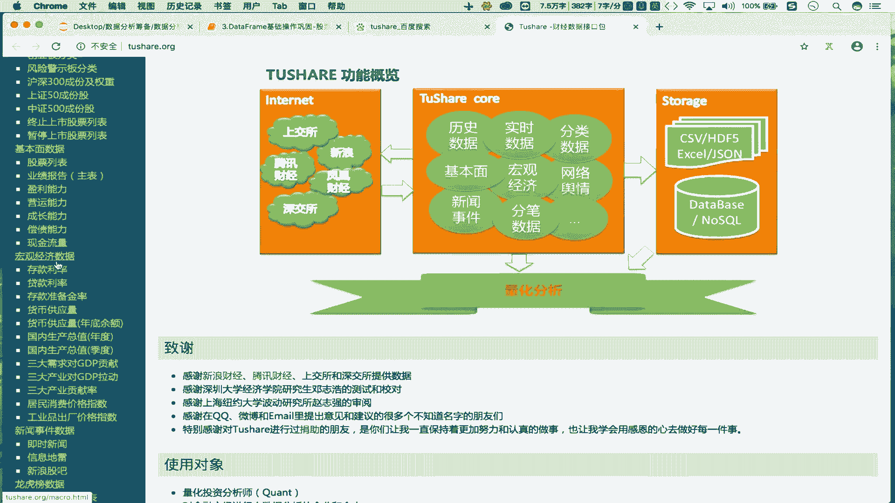

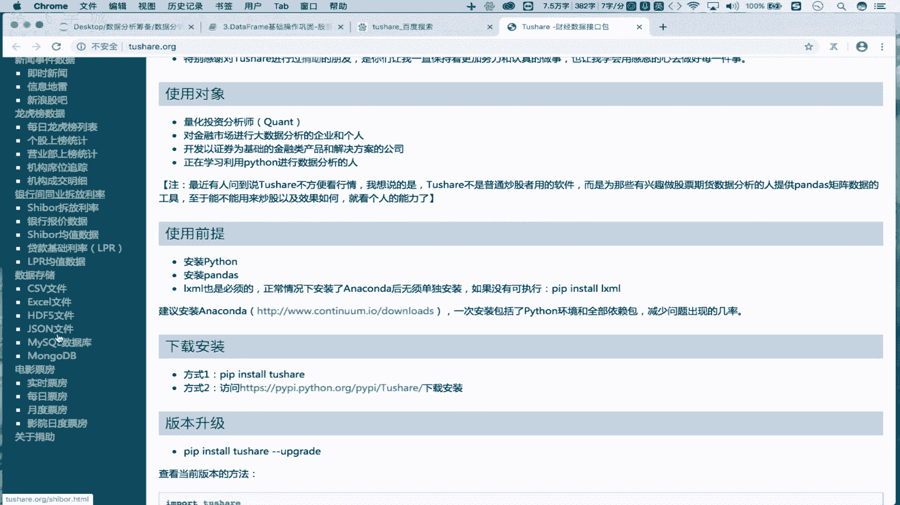

以下是本项目的具体需求：
1.  使用`tushare`包获取某只股票的历史行情数据。
2.  将获取的互联网数据存储到本地。
3.  将本地存储的数据读入到`DataFrame`中。
4.  对读取的数据进行清洗和处理（如删除无用列、转换数据类型、设置索引等）。

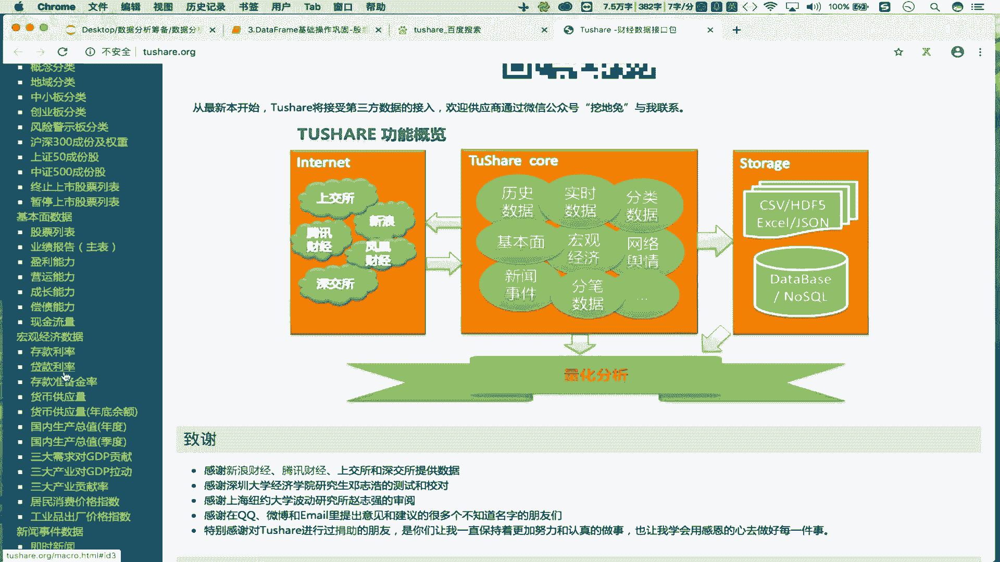

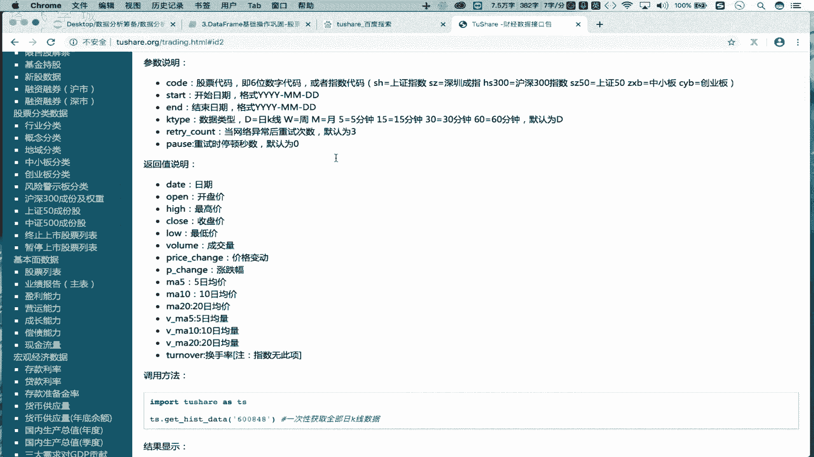

---

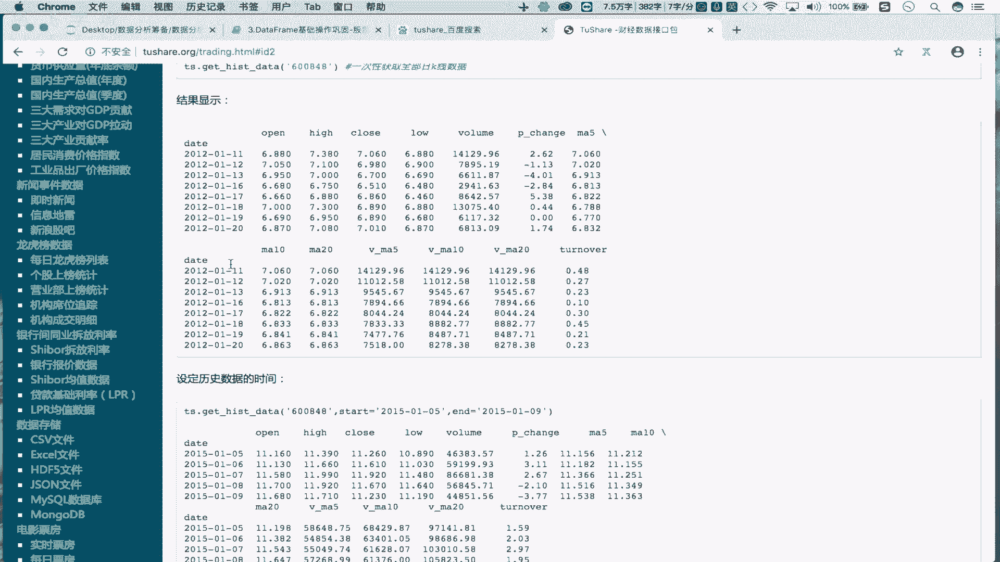

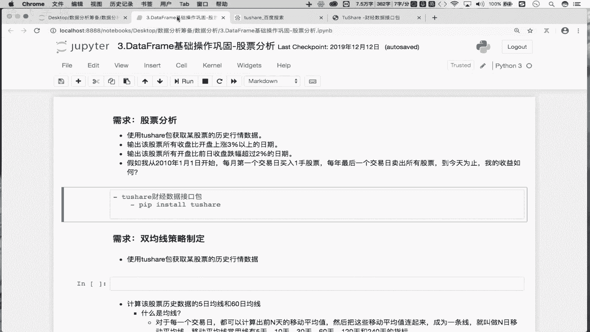

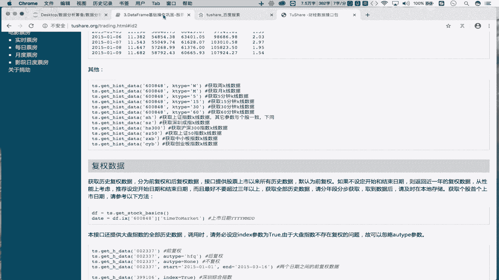

## 第一步：获取股票历史数据

### 1. 安装与导入必要库
首先，我们需要安装并导入`tushare`和`pandas`库。

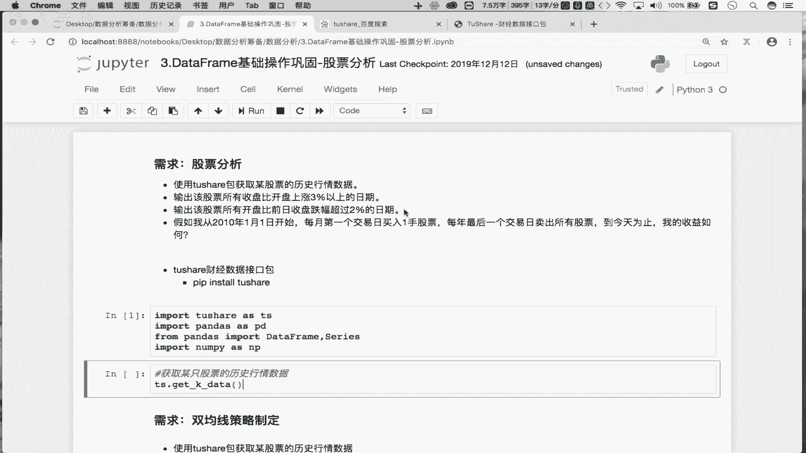

以下是安装和导入的代码：
```python
# 安装 tushare (在命令行中执行)
# pip install tushare

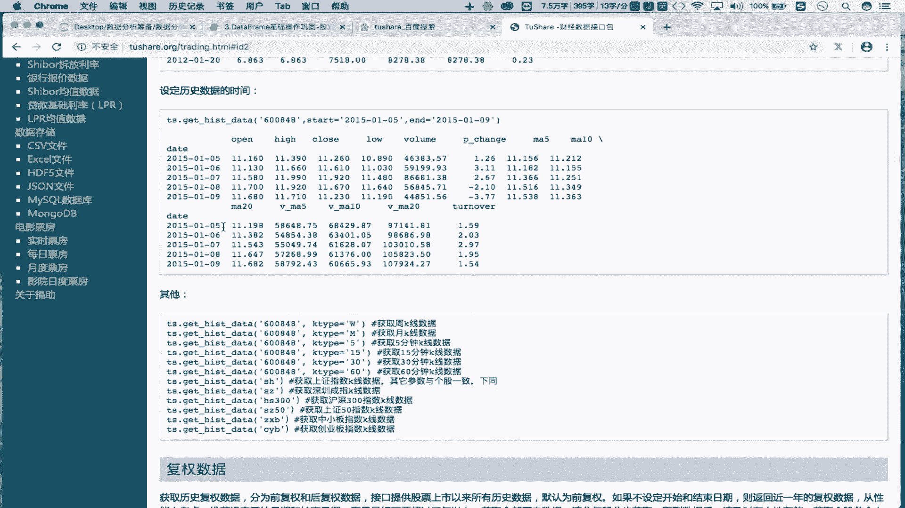

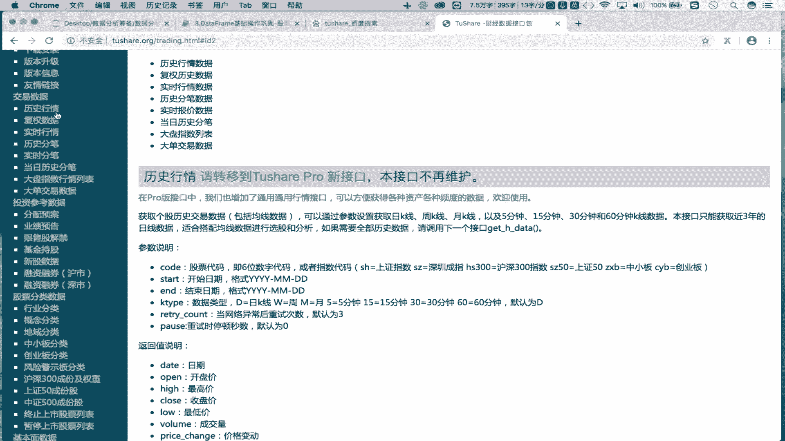

# 在Python脚本中导入库
import tushare as ts
import pandas as pd
from pandas import DataFrame, Series
import numpy as np
```

### 2. 使用 tushare 获取数据
`tushare`是一个免费的财经数据接口包。我们可以使用它的`get_k_data`方法来获取股票历史行情。

以下是获取数据的代码：
```python
# 获取股票代码为‘600519’（贵州茅台）的历史数据
# start参数可以设一个较早的日期，end不填则默认获取到最近一个交易日
df = ts.get_k_data(code=‘600519‘, start=‘2000-01-01‘)
print(df)
```
执行以上代码，你将得到一个包含日期(`date`)、开盘价(`open`)、收盘价(`close`)、最高价(`high`)、最低价(`low`)、成交量(`volume`)和股票代码(`code`)的`DataFrame`。

---

## 第二步：数据存储与读取

### 1. 将数据存储到本地
为了避免每次分析都从网络获取数据，我们可以将数据保存到本地CSV文件。

以下是保存数据的代码：
```python
# 将DataFrame中的数据写入到本地的CSV文件
df.to_csv(‘maotai.csv‘)
```
执行后，当前目录下会生成一个名为`maotai.csv`的文件。

### 2. 从本地读取数据
接下来，我们从本地CSV文件将数据读入`DataFrame`。

以下是读取数据的代码：
```python
# 从本地CSV文件读取数据到DataFrame
df = pd.read_csv(‘maotai.csv‘)
print(df.head())
```

---

## 第三步：数据清洗与预处理
从本地读取数据后，我们需要对其进行清洗，使其更适合分析。

以下是需要进行的处理步骤：

### 1. 删除无用列
读取的CSV文件会自动生成一个无用的索引列（列名为`Unnamed: 0`），我们需要将其删除。

以下是删除列的代码：
```python
# 删除名为‘Unnamed: 0‘的列
# axis=1 表示操作列，inplace=True 表示直接修改原DataFrame
df.drop(labels=‘Unnamed: 0‘, axis=1, inplace=True)
print(df.head())
```

### 2. 查看数据信息
在处理前，我们先查看数据的整体信息和各列数据类型。

以下是查看信息的代码：
```python
# 查看DataFrame的摘要信息，包括每列的非空值数量和数据类型
df.info()
```
通过`info()`方法，我们发现`date`列是对象(`object`)类型，即字符串，而不是时间类型。

### 3. 转换日期列数据类型
为了便于时间序列分析，我们需要将`date`列转换为`datetime`类型。

以下是转换数据类型的代码：
```python
# 将‘date‘列转换为datetime类型
df[‘date‘] = pd.to_datetime(df[‘date‘])
# 再次查看信息，确认类型已转换
df.info()
```

### 4. 将日期列设置为行索引
在时间序列分析中，将日期作为索引非常方便。

以下是设置索引的代码：
```python
# 将‘date‘列设置为DataFrame的行索引
df.set_index(‘date‘, inplace=True)
print(df.head())
```
现在，`date`列已不再是普通列，而是变成了数据的行索引。数据的列剩下：开盘价(`open`)、收盘价(`close`)、最高价(`high`)、最低价(`low`)、成交量(`volume`)和股票代码(`code`)。

---

## 总结
本节课我们一起学习了股票数据预处理的全流程：
1.  **获取数据**：使用`tushare.get_k_data()`函数从网络获取股票历史行情。
2.  **存储数据**：使用`DataFrame.to_csv()`方法将数据保存到本地文件。
3.  **读取数据**：使用`pd.read_csv()`函数从本地文件加载数据。
4.  **数据清洗**：
    *   使用`df.drop()`删除无用列。
    *   使用`df.info()`查看数据概况。
    *   使用`pd.to_datetime()`将字符串日期转换为时间序列。
    *   使用`df.set_index()`将日期列设置为行索引。

经过以上步骤，我们得到了一份干净、结构化的股票历史数据`DataFrame`，其行索引是日期，列是各类价格和成交量信息。这为后续的股票分析（如计算指标、可视化、制定策略）做好了准备。

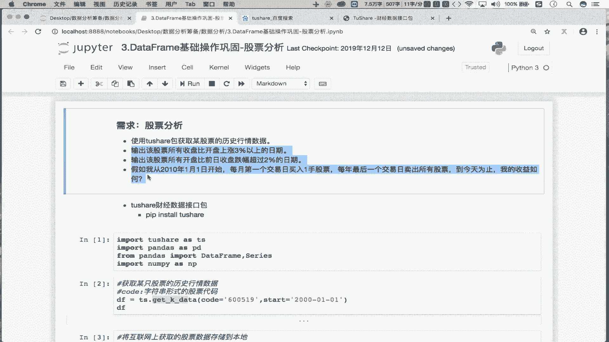

在下一节中，我们将利用处理好的数据，实现一个真实的“双均线”金融量化策略。