# Python金融量化：P13：03 捕获股票跌幅的日期 📉

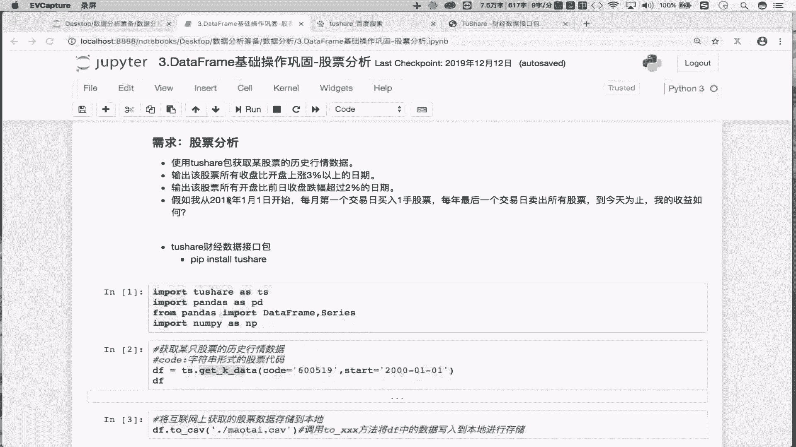

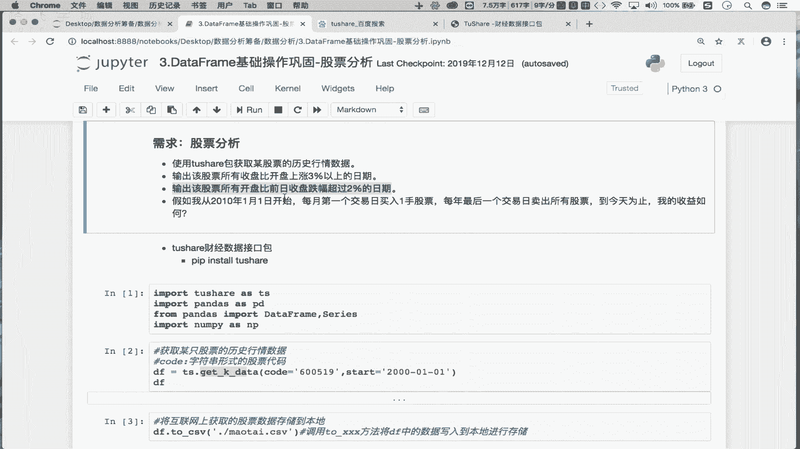


在本节课中，我们将学习如何从股票数据中筛选出特定条件下的日期。具体来说，我们将实现一个需求：**找出某支股票所有开盘价比前一日收盘价跌幅超过2%的日期**。我们将通过分析数据、编写伪代码，并最终用一行简洁的Pandas代码来实现这个功能。

## 需求分析与伪代码

上一节我们介绍了如何计算涨跌幅。本节中我们来看看如何根据更复杂的条件（开盘价相对于前收盘价的跌幅）来筛选数据。

我们的目标是：找到所有满足 `(当日开盘价 - 前一日收盘价) / 前一日收盘价 < -0.02` 的日期。

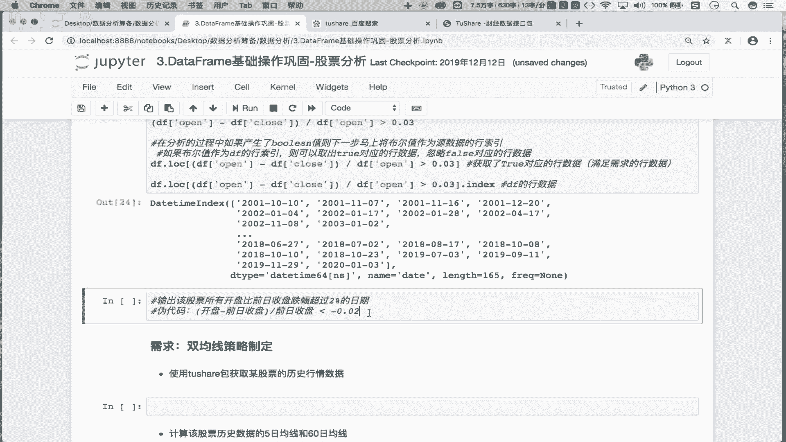

以下是实现这个逻辑的步骤分解：
1.  **计算前一日收盘价**：我们需要将`收盘价(close)`这一列整体向下移动一行，这样每一行的“前收盘价”就对齐了当日的“开盘价”。
2.  **计算涨跌幅**：使用公式 `(open - pre_close) / pre_close` 计算开盘价相对于前收盘价的涨跌幅。
3.  **设置筛选条件**：判断计算出的涨跌幅是否小于 `-0.02`（即跌幅超过2%）。注意，`-0.03`（跌幅3%）是小于 `-0.02` 的。
4.  **应用筛选**：将上述条件产生的布尔值序列作为原数据表的行索引，从而筛选出所有满足条件的行。
5.  **提取日期**：从筛选出的结果中，提取出对应的日期索引。

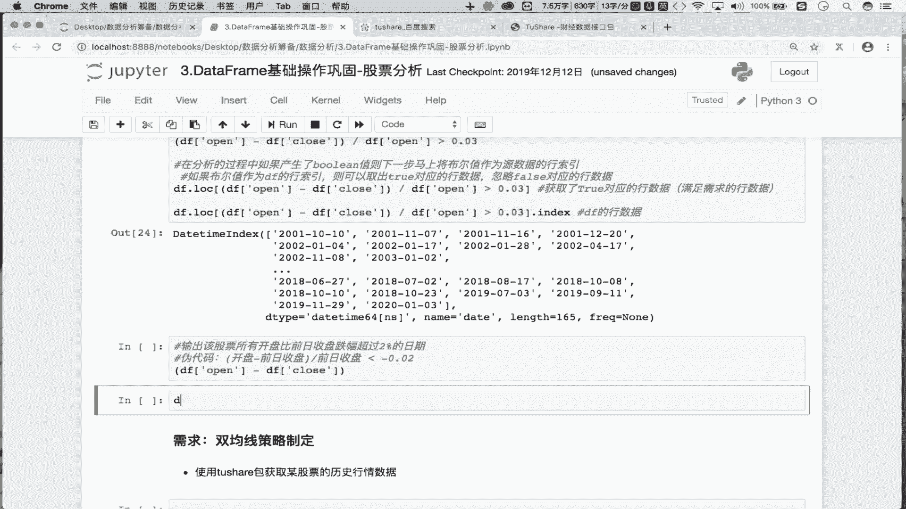

## 代码实现与讲解

理解了逻辑之后，我们现在将其转化为实际的Python代码。我们将使用Pandas库的`shift`方法来实现“前一日”的概念。

首先，我们看看如何获取“前一日收盘价”。在Pandas中，`DataFrame`列的`shift(1)`操作可以将数据整体向下移动一行。


```python
pre_close = df[‘close’].shift(1)
```

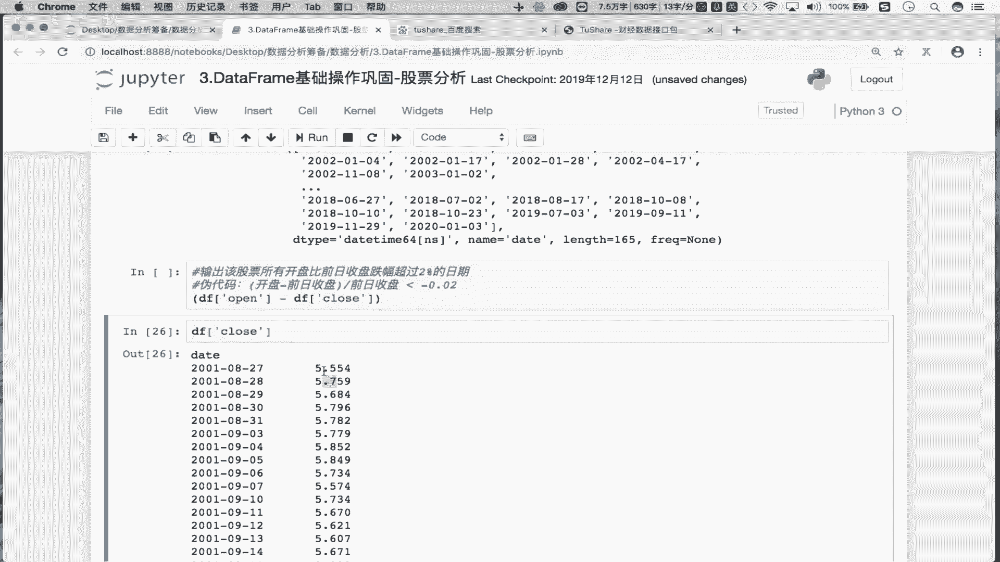


接下来，我们计算涨跌幅并设置条件：

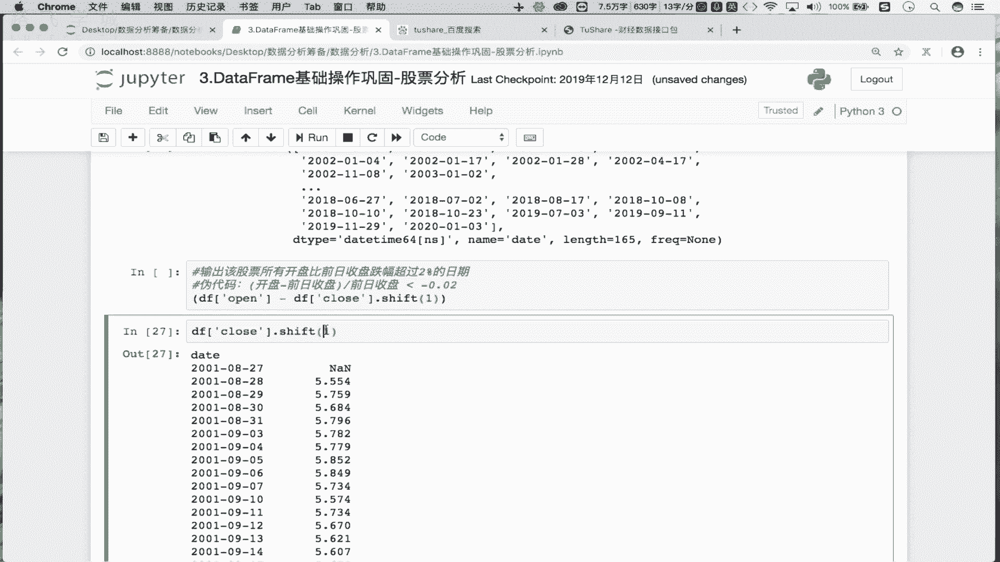

```python
condition = (df[‘open’] - pre_close) / pre_close < -0.02
```


这个`condition`是一个布尔序列，其中`True`值对应的行就是满足“开盘跌幅超过2%”条件的行。

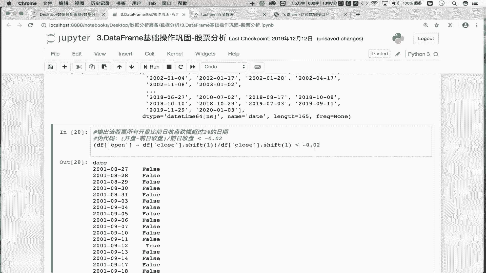

最后，我们使用这个条件来筛选原始数据，并提取日期：


```python
result_dates = df.loc[condition].index
```

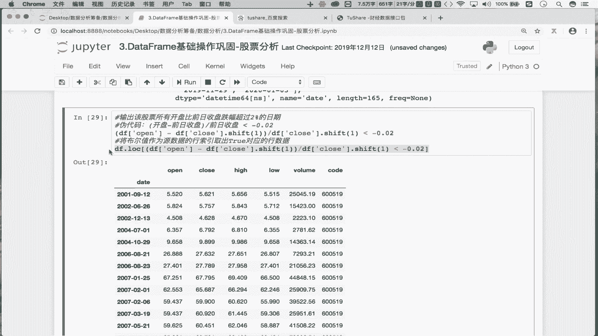

将以上步骤合并，就得到了一行完整的实现代码：

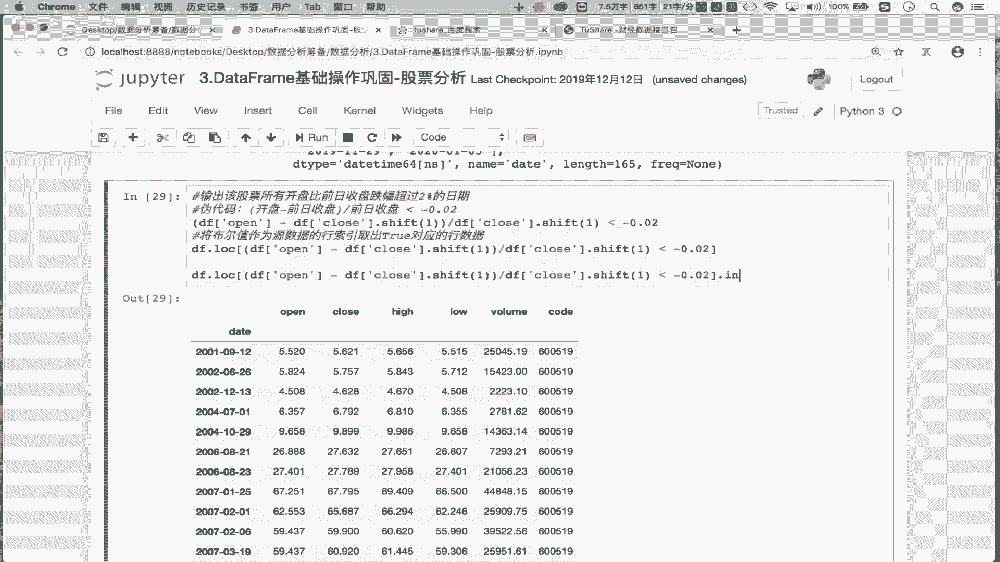

```python
result_dates = df.loc[(df[‘open’] - df[‘close’].shift(1)) / df[‘close’].shift(1) < -0.02].index
```

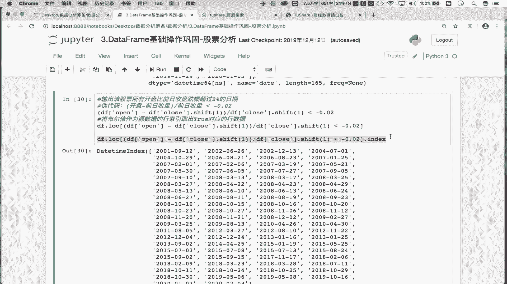

## 总结

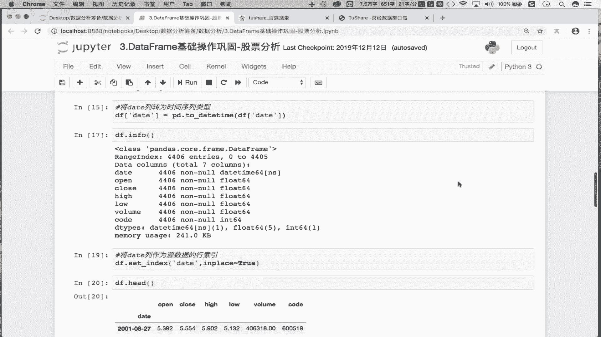


本节课中我们一起学习了如何捕获股票特定跌幅的日期。我们首先分析了需求，将其转化为 `(开盘价 - 前收盘价) / 前收盘价 < -0.02` 的数学条件。然后，我们引入了`shift(1)`方法来便捷地获取“前一日”的数据。最终，我们通过组合布尔索引和`.index`属性，用一行高效的Pandas代码实现了从数据中提取满足条件的日期。这个方法的核心在于理解数据对齐和布尔筛选，是金融数据分析中的常用技巧。