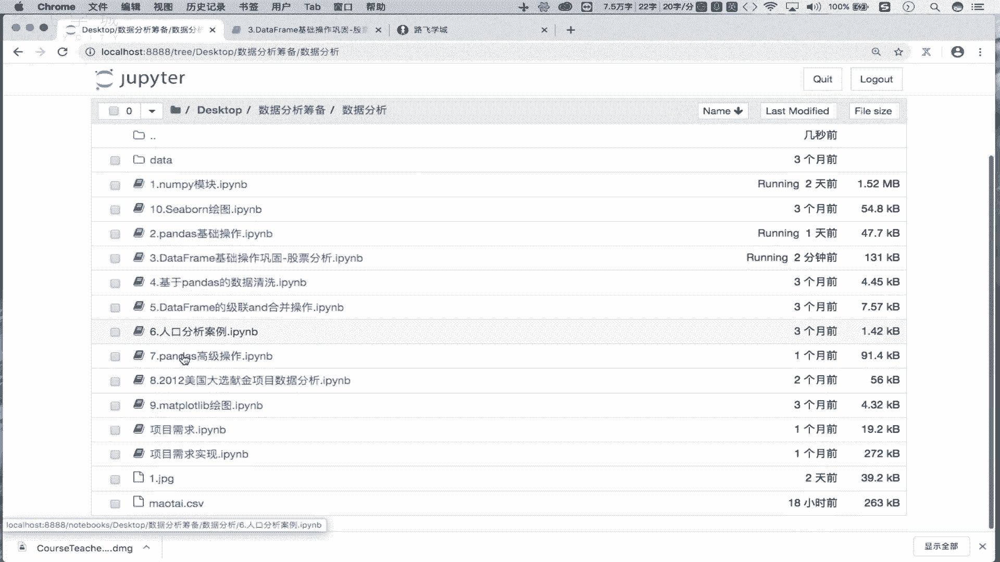
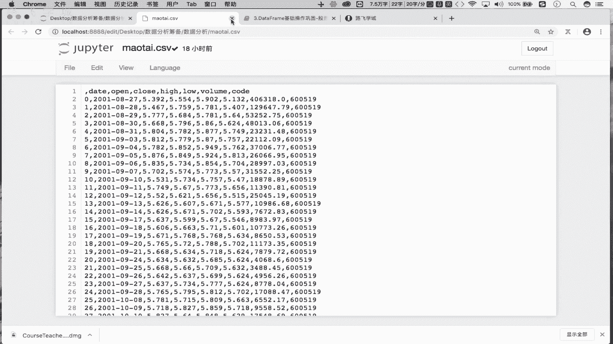
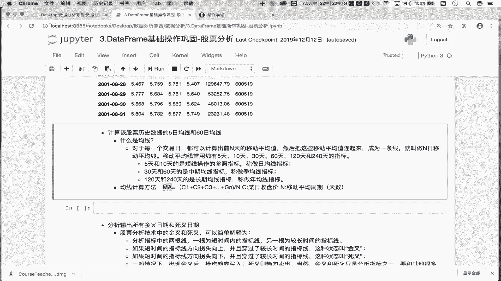
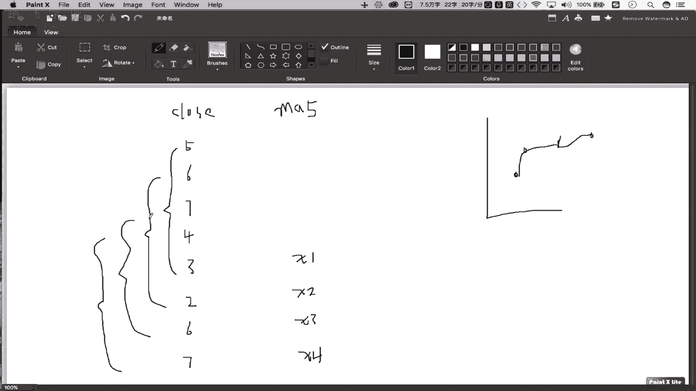
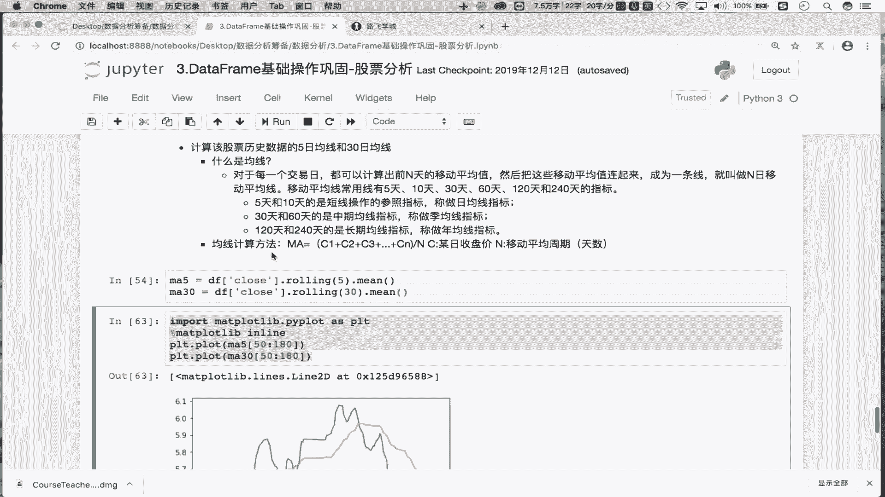

# Python金融量化实战：P15：01：双均线策略-均线的计算分析 📈

## 概述
在本节课中，我们将学习金融量化分析中一个基础且重要的策略——双均线策略。我们将从获取股票历史数据开始，逐步讲解均线的概念、计算方法，并最终计算出5日和30日移动平均线。通过本课，你将掌握使用Python进行基础量化分析的核心步骤。

## 数据准备：获取与处理股票历史行情

上一节我们介绍了量化分析的基本流程，本节中我们来看看如何准备分析所需的数据。

首先，我们需要获取目标股票的历史行情数据。我们已经通过`tushare`包获取了贵州茅台（`600519.SH`）的历史数据，并将其保存到了本地的`茅台.csv`文件中。

以下是数据读取与处理的步骤：

1.  **读取数据**：使用`pandas`库的`read_csv`函数从本地文件读取数据。
    ```python
    import pandas as pd
    df = pd.read_csv(‘茅台.csv’)
    ```

2.  **清理数据**：原始数据中可能包含无用的列（例如默认的索引列），需要将其删除。
    ```python
    df = df.drop(labels=‘Unnamed: 0’, axis=1)
    ```
    *   `axis=1` 表示删除列。

3.  **设置时间索引**：为了便于时间序列分析，需要将日期列转换为时间类型，并设置为数据框的行索引。
    ```python
    df[‘date’] = pd.to_datetime(df[‘date’])
    df.set_index(‘date’, inplace=True)
    ```

完成以上步骤后，我们就得到了一个以日期为索引、包含开盘价、收盘价、成交量等信息的整洁数据框，可以用于后续分析。






## 核心概念：什么是移动平均线（均线）？

数据准备就绪后，接下来我们引入本节课的核心概念——移动平均线。

在股票走势图中，我们常看到几条蜿蜒的曲线，这些曲线大多就是移动平均线。移动平均线（Moving Average， MA）是一种追踪趋势的技术指标。它的计算方法是：对于每一个交易日，计算前N个交易日收盘价的算术平均值，并将这些平均值连接起来，形成一条平滑的曲线。

这条曲线就被称为N日移动平均线，简称均线。常用的均线周期有5日、10日（短期均线）、30日、60日（中期均线）、120日、240日（长期均线）等。

**均线的计算公式如下：**



`MA(N) = (C1 + C2 + C3 + ... + CN) / N`

其中：
*   `MA(N)` 代表第N日的N周期移动平均值。
*   `C1, C2, ..., CN` 分别代表第1日、第2日、...、第N日的收盘价。

**理解均线计算**：假设我们有连续8天的收盘价：[5, 6, 7, 4, 3, 2, 6, 7]。
*   第一个5日均值 `MA5_1` = (5+6+7+4+3)/5 = 5.0
*   第二个5日均值 `MA5_2` = (6+7+4+3+2)/5 = 4.4
*   第三个5日均值 `MA5_3` = (7+4+3+2+6)/5 = 4.4
*   第四个5日均值 `MA5_4` = (4+3+2+6+7)/5 = 4.4

将 `MA5_1`, `MA5_2`, `MA5_3`, `MA5_4` 这四个点在图表上连接起来，就得到了5日移动平均线。30日、60日均线的计算原理与此完全相同，只是计算的窗口期（N）更大。


## 实战计算：5日与30日移动平均线



理解了均线的概念与公式后，我们使用Python来实际计算茅台股票的5日和30日移动平均线。

在Pandas中，我们可以非常方便地使用`.rolling()` 和 `.mean()` 方法来完成这个计算。

以下是计算步骤：

1.  **计算5日均线（MA5）**：对收盘价序列应用滚动窗口计算。
    ```python
    ma5 = df[‘close’].rolling(5).mean()
    ```
    *   `.rolling(5)` 创建一个宽度为5的滚动窗口。
    *   `.mean()` 对窗口内的数据计算平均值。
    *   结果 `ma5` 是一个序列（Series），其前4个值为`NaN`（因为前4天无法构成一个完整的5日窗口），从第5天开始才有有效的5日均值。

2.  **计算30日均线（MA30）**：使用同样的方法，但窗口改为30。
    ```python
    ma30 = df[‘close’].rolling(30).mean()
    ```
    *   同理，`ma30` 序列的前29个值为`NaN`。

现在，`ma5` 和 `ma30` 这两个序列就分别存储了每日对应的5日和30日移动平均值。将这些值连接成线，便是我们要的移动平均线。

## 数据可视化：绘制均线图

计算出均线数据后，我们可以将其绘制成图表进行直观观察。这里我们使用`matplotlib`库进行简单的绘图。

```python
import matplotlib.pyplot as plt
# 设置魔法命令，在Jupyter Notebook中显示图表
%matplotlib inline

# 绘制5日均线
plt.plot(ma5[50:80], label=‘MA5’)
# 绘制30日均线
plt.plot(ma30[50:80], label=‘MA30’)

plt.legend() # 显示图例
plt.show()
```

为了更清晰地观察两条均线的交叉情况，代码中截取了第50到80个交易日的数据进行绘图。在图表中，短期均线（MA5）波动更为剧烈，长期均线（MA30）则更加平滑。两条线的交叉点（金叉或死叉）是双均线交易策略的重要信号来源。




## 总结
本节课中我们一起学习了双均线策略的基础——移动平均线的计算与分析。我们首先完成了股票历史数据的获取与清洗，然后深入讲解了移动平均线的定义与计算公式。接着，我们使用Pandas的`.rolling().mean()`方法，实战计算了贵州茅台股票的5日和30日移动平均线。最后，通过简单的可视化，我们直观地看到了两条均线的形态与相互关系。理解并能够计算均线，是构建更复杂量化交易策略的基石。在接下来的课程中，我们将基于这些均线来制定具体的买卖信号规则。