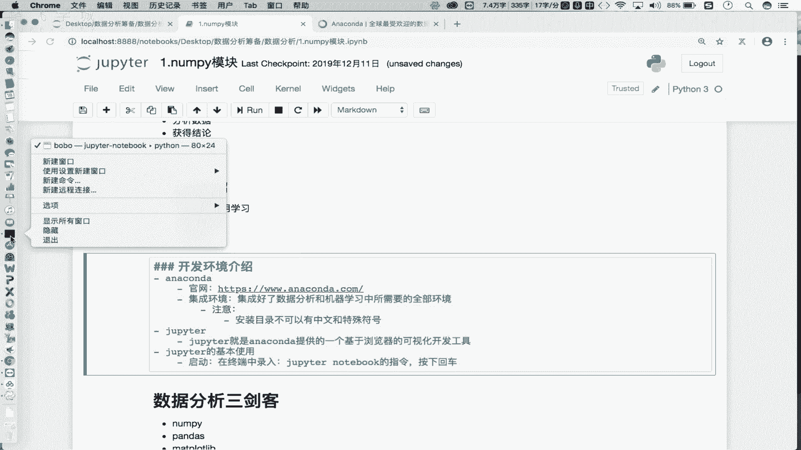
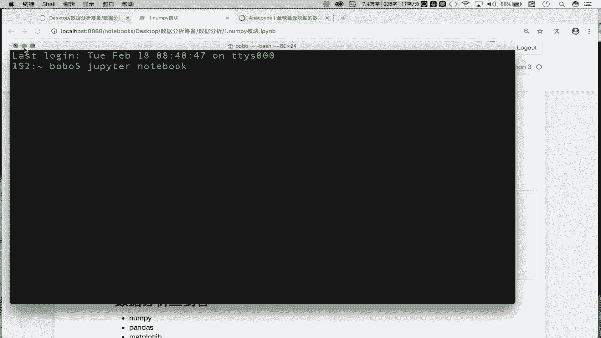
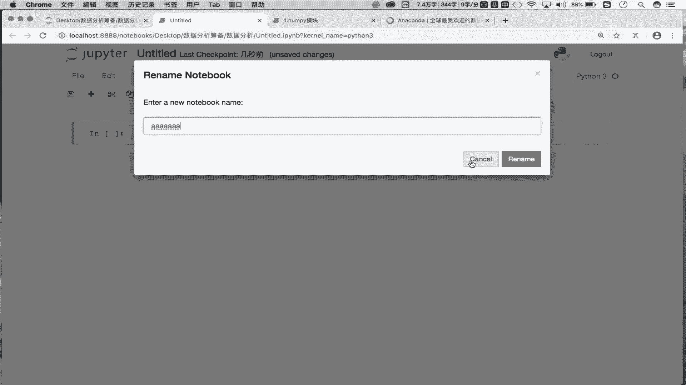
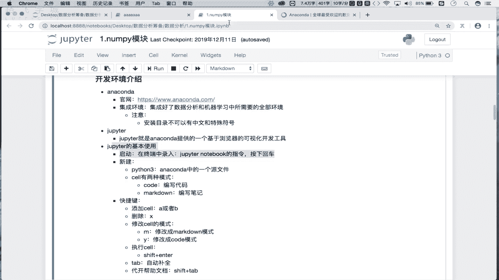

# Python金融量化：P3：02 修炼前的准备-环境搭建 🛠️

## 概述
在本节课中，我们将学习如何搭建数据分析的开发环境。我们将介绍两个核心工具：Anaconda和Jupyter Notebook，并详细讲解它们的安装与基本使用方法。

---

## Anaconda：集成环境介绍

上一节我们对数据分析进行了初步介绍。本节中，我们来看看数据分析所对应的开发环境搭建流程。

首先，我们需要一个集成环境。Anaconda就是这样一个集成了数据分析和机器学习所需全部环境的工具。它是一个集成环境，意味着它已经预先打包好了我们开发所需的各种库和工具。

**核心概念**：Anaconda是一个**集成环境**，它集成了数据分析和机器学习开发所需的全部环境。

我们需要从Anaconda官网下载对应操作系统的安装包（Windows、macOS或Linux）。下载后，按照安装向导进行“下一步”安装即可。

以下是安装时的注意事项：
*   **安装目录**：安装路径不能包含中文或特殊符号，建议安装在某个磁盘的根目录下。

安装好Anaconda后，我们就拥有了进行数据分析和机器学习开发的基础环境。

---

## Jupyter Notebook：可视化开发工具





拥有了开发环境后，我们还需要一个编写和运行代码的工具。Jupyter Notebook就是Anaconda提供的一个基于浏览器的可视化开发工具。

**核心概念**：Jupyter Notebook是Anaconda提供的**基于浏览器的可视化开发工具**，用于编写和执行代码。

Jupyter Notebook无需单独安装，安装Anaconda后即可使用。

### 启动与基本使用


以下是启动和使用Jupyter Notebook的基本步骤：



1.  **启动**：在系统终端（或Anaconda Prompt）中输入命令 `jupyter notebook` 并回车。
    ```bash
    jupyter notebook
    ```
    执行后，会自动启动本地服务并打开浏览器，显示当前目录的文件结构界面。

2.  **新建文件**：在浏览器界面点击“New”按钮，选择“Python 3”，即可创建一个新的源代码文件（后缀为 `.ipynb`）。

3.  **编写与执行代码**：新建的文件由多个“单元格”（Cell）组成。在单元格中可以直接编写Python代码，例如：
    ```python
    print(“Hello World”)
    ```
    编写后，点击工具栏的“Run”按钮或使用快捷键，即可执行该单元格的代码并查看结果。

---

## 单元格（Cell）的两种模式

在Jupyter Notebook中，单元格有两种主要模式，用于不同目的。

*   **Code模式**：用于编写和运行程序代码。
*   **Markdown模式**：用于编写格式化的文本笔记和说明。

您可以通过单元格工具栏的下拉菜单或快捷键在两种模式间切换。两种模式的单元格都需要执行（Run）才能看到效果（代码输出结果或渲染后的文本）。

以下是切换单元格模式的快捷键：
*   按 **`M`** 键：将当前单元格切换到 **Markdown** 模式。
*   按 **`Y`** 键：将当前单元格切换到 **Code** 模式。

---

## 常用快捷键

熟练使用快捷键可以极大提升在Jupyter Notebook中的工作效率。以下是一些最常用的快捷键：

*   **添加单元格**：
    *   按 **`A`** 键：在当前单元格**上方**插入一个新单元格。
    *   按 **`B`** 键：在当前单元格**下方**插入一个新单元格。
*   **删除单元格**：按 **`X`** 键删除当前选中的单元格。
*   **执行单元格**：按 **`Shift + Enter`** 执行当前单元格，并跳转到下一个单元格。
*   **代码自动补全**：在输入代码时，按 **`Tab`** 键可以触发自动补全建议。
*   **查看帮助文档**：将光标放在函数名上，按 **`Shift + Tab`** 可以弹出该函数的帮助文档，快速了解其用法。

---

## 总结

本节课中我们一起学习了数据分析开发环境的搭建。
1.  我们首先介绍了 **Anaconda**，它是一个集成了数据分析和机器学习所需全部环境的集成平台，我们需要下载并安装它。
2.  接着，我们学习了 **Jupyter Notebook**，它是内置于Anaconda中的基于浏览器的开发工具，我们可以在其中创建 `.ipynb` 文件，在单元格中编写代码和笔记。
3.  我们明确了单元格的两种模式：**Code模式**用于写代码，**Markdown模式**用于写文档。
4.  最后，我们掌握了一系列提高效率的**快捷键**，例如添加/删除单元格、执行代码和查看帮助文档。



请根据介绍完成环境的安装与配置。准备好环境后，我们将正式进入数据分析的代码实战阶段。