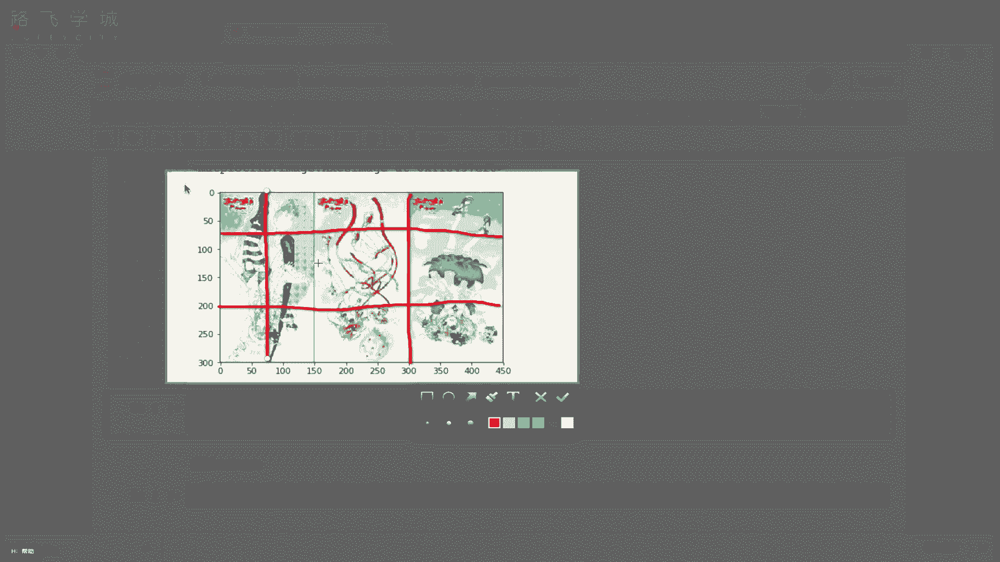
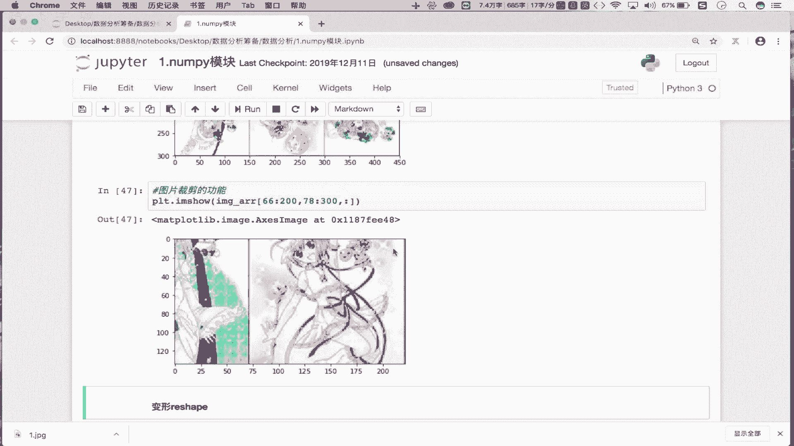

# Python金融量化：P6：Numpy索引与切片操作详解 🧮

在本节课中，我们将深入学习NumPy模块的核心功能之一：索引与切片。这些操作是高效处理和分析数组数据的基础，尤其在金融数据分析中至关重要。我们将从基础概念讲起，逐步深入到灵活的应用场景，包括数组的选取、反转以及图像处理等实战操作。

## 索引操作

上一节我们介绍了NumPy数组的创建。本节中，我们来看看如何从数组中提取数据。索引操作与Python列表的索引方式一致，用于获取数组中的特定元素或子集。

首先，我们创建一个示例数组：

```python
import numpy as np
arr = np.random.randint(1, 100, size=(5, 6))
print(arr)
```

这是一个5行6列的二维数组。要获取数组中的元素，我们使用方括号 `[]`。

以下是索引操作的具体用法：

*   **获取单行数据**：`arr[0]` 获取的是数组的第一行数据。
*   **获取多行数据**：`arr[[1, 3, 4]]` 可以同时获取下标为1、3、4的行数据。

## 切片操作

索引用于获取特定位置的数据，而切片则用于获取一个连续的数据范围。NumPy的切片操作比列表更为灵活，因为它可以同时在多个维度上进行。

切片的基本语法是 `start:stop:step`。在二维数组中，我们使用逗号 `,` 来分隔不同维度的切片。逗号左边控制行，右边控制列。

以下是切片操作的具体用法：

*   **切出前两行**：`arr[0:2, :]` 或简写为 `arr[:2, :]`。逗号左边 `:2` 表示行切片，右边 `:` 表示所有列。
*   **切出前两列**：`arr[:, 0:2]`。逗号左边 `:` 表示所有行，右边 `:2` 表示列切片。
*   **切出前两行的前两列**：`arr[:2, :2]`。这结合了行和列的切片。

## 数组反转

切片操作的一个强大功能是实现数组的反转。通过调整步长 `step` 为负数，我们可以轻松倒置数组。

以下是实现数组反转的方法：

*   **行倒置**：`arr[::-1, :]`。行维度步长为-1，实现上下翻转。
*   **列倒置**：`arr[:, ::-1]`。列维度步长为-1，实现左右翻转。
*   **所有元素倒置**：`arr[::-1, ::-1]`。行和列同时倒置，相当于将数组旋转180度。

## 实战应用：图片处理

理解了基础操作后，我们来看一个有趣的实战应用：利用NumPy切片处理图片。一张图片在NumPy中可以表示为一个三维数组 `(高度， 宽度， 颜色通道)`。

首先，读取并显示一张图片：

```python
import matplotlib.pyplot as plt
image_arr = plt.imread('1.jpg')
plt.imshow(image_arr)
plt.show()
```


以下是基于切片实现的图片处理功能：



*   **图片左右翻转**：即列倒置。`plt.imshow(image_arr[:, ::-1, :])`
*   **图片上下翻转**：即行倒置。`plt.imshow(image_arr[::-1, :, :])`
*   **图片局部裁剪**：通过对行和列进行范围切片，可以截取图片的任意区域。例如，截取从第66行到200行，第78列到300列的区域：`plt.imshow(image_arr[66:200, 78:300, :])`



本节课中我们一起学习了NumPy的索引与切片操作。我们从基础的数组数据选取开始，掌握了单行、多行以及行列组合的切片方法。接着，我们探索了利用切片步长实现数组反转的技巧。最后，我们将这些知识应用于实际的图片处理场景，实现了图片的翻转与裁剪。这些操作是进行高效数据预处理和特征提取的基石，请务必熟练掌握。