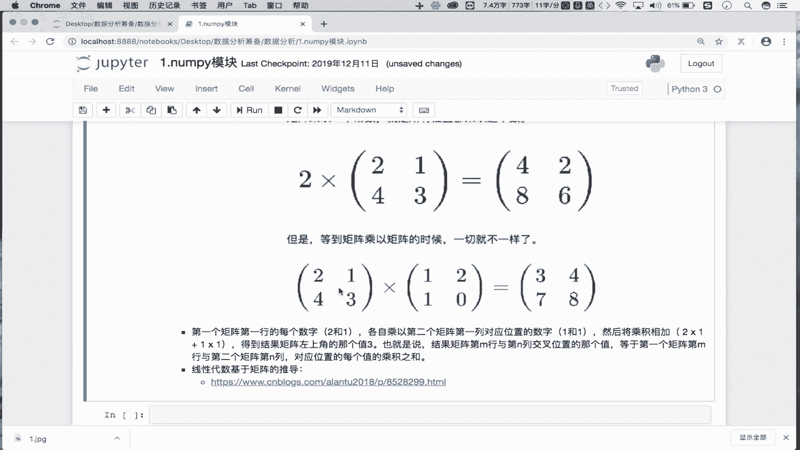
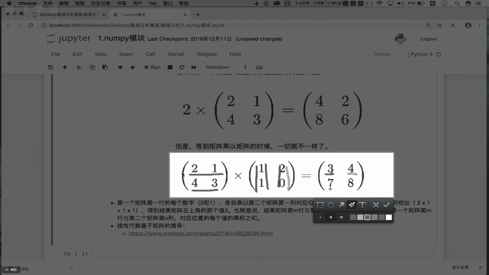
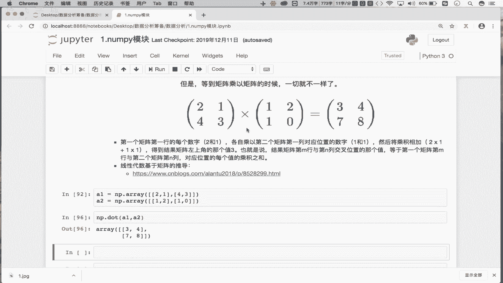
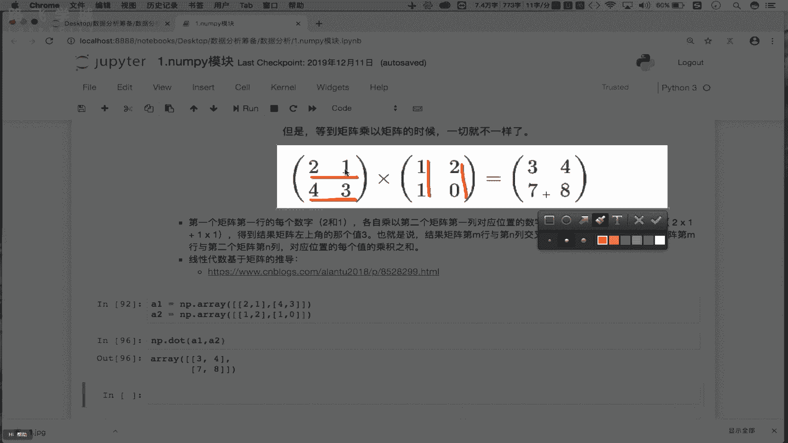
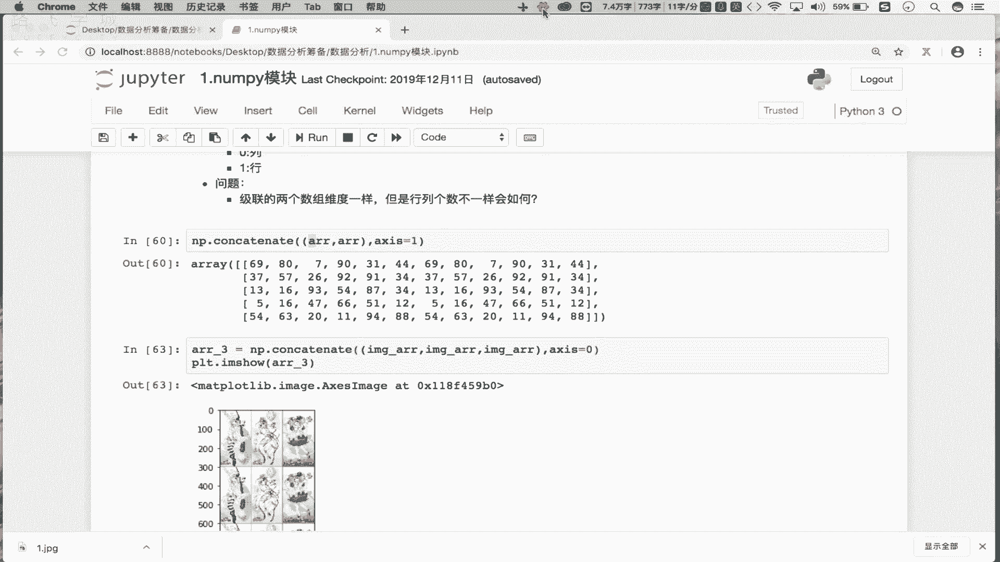

# Python金融量化：P7：06 统计&聚合&矩阵操作 📊

在本节课中，我们将要学习NumPy模块中关于数组形状变换、拼接、聚合统计以及矩阵运算的核心操作。这些是进行高效数据分析和后续机器学习建模的基础。

## 数组形状变换 🔄

上一节我们介绍了数组的索引与切片，本节中我们来看看如何改变数组的形状。数组的`shape`属性描述了其维度结构，例如一个五行六列的二维数组。`reshape`方法可以改变数组的形状，但新形状必须能容纳原数组的所有元素。

**公式/代码描述**：
```python
import numpy as np
arr = np.arange(30).reshape(5, 6)  # 创建一个5行6列的二维数组
print(arr.shape)  # 输出: (5, 6)

# 将二维数组变形为一维数组
arr_1d = arr.reshape(30)
print(arr_1d.shape)  # 输出: (30,)

# 将一维数组变形为多维数组
arr_new = arr_1d.reshape(2, 15)  # 变形为2行15列
print(arr_new.shape)  # 输出: (2, 15)
```
变形操作要求新形状的元素总数必须与原数组一致。在基础的NumPy数据分析中，变形操作使用频率不高，但了解其存在是必要的。

## 数组拼接操作 🔗

接下来，我们学习如何将多个数组拼接在一起。拼接操作分为横向拼接（按行）和纵向拼接（按列）。

**公式/代码描述**：
```python
# 使用 np.concatenate 进行拼接
arr_combined = np.concatenate((arr, arr), axis=0)  # 纵向拼接（按列）
print(arr_combined.shape)

arr_combined_h = np.concatenate((arr, arr), axis=1)  # 横向拼接（按行）
print(arr_combined_h.shape)
```
参数`axis`决定了拼接的方向：
*   `axis=0`：纵向拼接（沿行方向，即上下堆叠）。
*   `axis=1`：横向拼接（沿列方向，即左右并排）。

**注意**：拼接操作要求参与拼接的数组维度相同。如果维度相同但具体行列数不匹配（例如一个5行3列的数组与一个5行4列的数组），拼接可能会失败，具体结果需要自行尝试。

拼接的一个典型应用是图像处理，例如将多张图片组合成宫格图。

以下是拼接操作的核心要点：
*   只能在同一维度的数组之间进行。
*   方向由`axis`参数控制。
*   常用于数据或图像的组合。

## 聚合与统计函数 📈

了解如何组合数据后，我们来看看如何从数据中提取摘要信息。NumPy提供了丰富的聚合与统计函数。

**公式/代码描述**：
```python
# 创建示例数组
arr = np.array([[1, 2, 3], [4, 5, 6], [7, 8, 9]])

# 聚合操作
total_sum = arr.sum()          # 所有元素之和
col_sum = arr.sum(axis=0)      # 每列之和
row_max = arr.max(axis=1)      # 每行最大值
overall_mean = arr.mean()      # 所有元素的平均值

print(f"总和: {total_sum}")
print(f"列和: {col_sum}")
print(f"行最大值: {row_max}")
print(f"平均值: {overall_mean}")
```
通过指定`axis`参数，可以计算特定维度上的统计值。

## 常用数学与统计函数 🧮

除了基础的聚合，NumPy还包含标准的数学函数和更专业的统计函数。

**公式/代码描述**：
```python
# 数学函数
angles = np.array([0, np.pi/2, np.pi])
sin_values = np.sin(angles)   # 计算正弦值
rounded = np.around(3.14159, decimals=2)  # 四舍五入到小数点后两位

# 统计函数
data = np.array([1, 2, 3, 4, 5, 100])
data_range = np.ptp(data)     # 极差 (最大值-最小值)
data_std = np.std(data)       # 标准差
data_var = np.var(data)       # 方差

print(f"正弦值: {sin_values}")
print(f"四舍五入: {rounded}")
print(f"极差: {data_range}")
print(f"标准差: {data_std}")
print(f"方差: {data_var}")
```
**标准差**衡量数据点相对于平均值的分散程度。**方差**是标准差的平方，两者都是衡量数据波动性的关键指标。



## 矩阵运算 ⚙️

最后，我们进入线性代数的核心——矩阵运算。在NumPy中，二维数组可以视为矩阵。



**公式/代码描述**：
```python
# 创建矩阵
A = np.array([[2, 1], [4, 3]])
B = np.array([[1, 2], [1, 0]])

# 矩阵转置
A_transpose = A.T
print("A的转置:\n", A_transpose)

# 矩阵乘法 (使用 np.dot 或 @ 运算符)
# 结果矩阵C的元素 C[i,j] = sum(A[i,:] * B[:,j])
C = np.dot(A, B)
# 等价于 C = A @ B
print("矩阵乘法结果 A x B:\n", C)
```
矩阵乘法规则：结果矩阵第`i`行第`j`列的元素，等于第一个矩阵第`i`行与第二个矩阵第`j`列对应元素的乘积之和。这是机器学习中许多算法的基础。



---



本节课中我们一起学习了NumPy的核心数据处理功能：
1.  **形状变换**：使用`reshape`改变数组维度。
2.  **数组拼接**：使用`np.concatenate`沿指定轴合并数组。
3.  **聚合统计**：使用`sum`, `mean`, `max`, `min`等函数汇总数据，并可沿特定轴计算。
4.  **数学与统计函数**：应用`sin`, `around`, `std`（标准差）, `var`（方差）等进行计算。
5.  **矩阵运算**：掌握矩阵转置（`.T`）和矩阵乘法（`np.dot`或`@`），理解其计算规则。



掌握这些操作，将为后续的金融数据分析和量化策略实现打下坚实的数据处理基础。