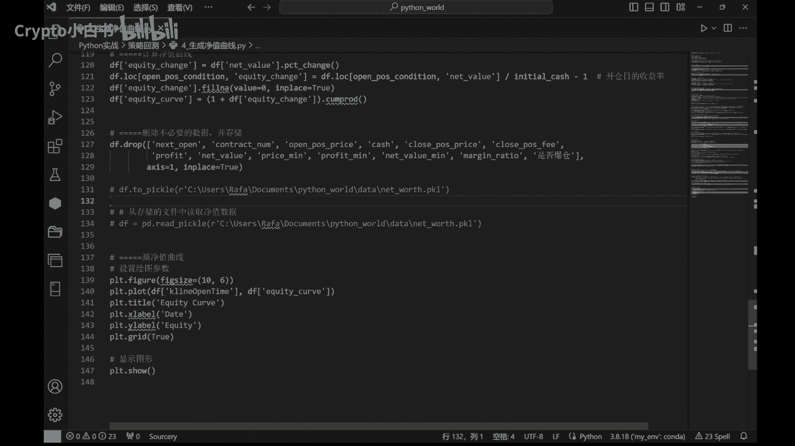
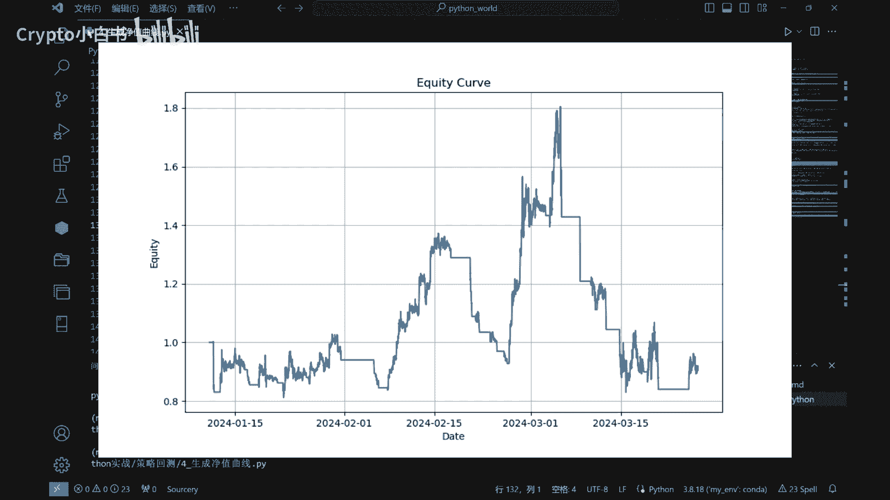
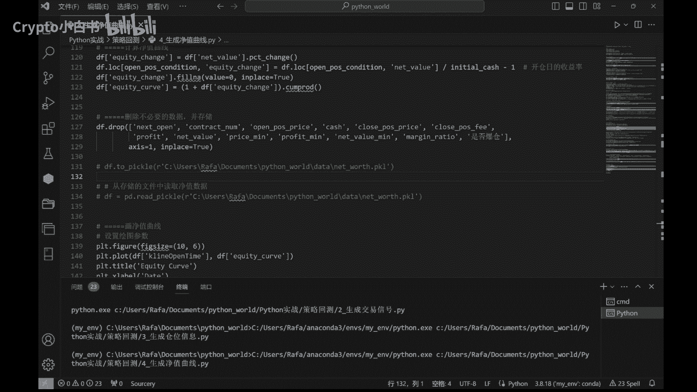

# 加密小白书：6-1：生成并绘制资金曲线 📈

在本节课中，我们将学习如何将策略的实际持仓数据转化为净值曲线，并通过图表直观地展示策略的运行结果。这对于评估策略的盈利能力和风险至关重要。

## 导入必要的库

首先，我们需要导入一些Python库来处理数据和绘制图表。

```python
import pandas as pd
import numpy as np
import datetime
import matplotlib.pyplot as plt
```

其中，`pandas` 用于数据处理，`numpy` 用于数值计算，`matplotlib.pyplot` 则是我们用来绘制资金曲线的主要工具。

## 读取与处理数据

上一节我们介绍了如何生成持仓数据，本节中我们来看看如何利用这些数据。我们从上一节课生成的 `position` 文件开始。

```python
df = pd.read_csv(‘position.csv’)
```

读取数据后，我们需要对其进行处理，以筛选出有参考价值的部分。以下是处理步骤：

我们选择币种上线十天以后的日期进行分析。对于上线不足十天的币种，其价格波动可能包含大量噪音（例如新币上线初期的暴涨暴跌），因此参考意义有限。

```python
# 假设数据中包含‘listing_date’列
df[‘date’] = pd.to_datetime(df[‘date’])
df = df[df[‘date’] > df[‘listing_date’] + datetime.timedelta(days=10)]
```

接下来，我们需要从持仓记录中找出所有开仓和平仓的时点。

```python
open_positions = df[df[‘action’] == ‘open’]
close_positions = df[df[‘action’] == ‘close’]
```

## 计算净值曲线

在开始计算前，我们需要设定一些基本的交易参数。以下是需要定义的参数及其说明：

*   **初始资金 (`initial_capital`)**：我们默认设置为10000元。
*   **合约价值 (`face_value`)**：例如，BTC合约通常为0.01。不同币种需相应调整。
*   **手续费率 (`fee_rate`)**：默认设置为0.0005（即万分之五）。实际交易中需根据市场调整。
*   **滑点 (`slippage`)**：指实际成交价与预期价格之间的偏差。这是一个重要概念，模拟了市场冲击成本。
*   **杠杆比率 (`leverage`)**：默认设置为3倍。用户可根据自身风险承受能力调整。

定义参数后，我们按交易分组，并模拟每次开仓、持仓、平仓的过程，动态计算账户净值。

```python
# 参数设置示例
initial_capital = 10000
face_value = 0.01
fee_rate = 0.0005
slippage = 0.001
leverage = 3

# 初始化净值列表
equity_curve = [initial_capital]
# ... (此处省略具体的循环计算代码，涉及开仓价值、手续费、盈亏、保证金及爆仓检查等计算)
# 最终将计算出的净值序列存入DataFrame
df[‘equity_curve’] = equity_curve
```

在计算过程中，我们还会检查爆仓情况。当保证金率低于平台要求的最低水平时，将触发爆仓，导致本金全部损失。

## 绘制资金曲线

所有计算完成后，我们使用 `matplotlib` 库将净值曲线可视化。



```python
plt.figure(figsize=(12, 6))
plt.plot(df[‘date’], df[‘equity_curve’])
plt.title(‘Strategy Equity Curve’)
plt.xlabel(‘Date’)
plt.ylabel(‘Net Value’)
plt.grid(True)
plt.show()
```

运行代码后，我们将得到策略的资金曲线图。


## 结果分析

现在，让我们来分析一下这张资金曲线图。

策略从2024年1月10日开始运行，初始净值为1.0。到2024年3月27日策略截止时，账户净值约为0.916，意味着总亏损约8.4%。

然而，在策略运行过程中，净值最高点曾达到约1.08，即获得了约8%的收益。这表明，如果配合及时的止盈操作，该布林带策略有可能获得可观收益（例如30%甚至更高）。但若任由策略运行而不进行干预，最终可能会承受一定程度的回撤和亏损。




## 总结



本节课中我们一起学习了如何将策略持仓数据转化为净值曲线的完整流程。我们首先导入并处理数据，然后设定关键交易参数来模拟计算每次交易的盈亏和动态净值，最后通过图表将资金曲线可视化。这个过程是策略回测和评估中不可或缺的一环，能帮助我们直观地理解策略的收益特征和风险波动。

