# 量化投资入门：1：用Python量化所有技术指标 📈

在本节课中，我们将学习如何从零开始，使用Python计算和测试股票技术指标。你将获得一套完整的工具包，包含历史数据、指标公式和现成的代码，即使没有编程基础，也能轻松上手。

## 数据准备 📊

要判断一个技术指标是否有效，必须在所有股票的历史数据上进行测试。我们提供的礼包中包含了一份全面的A股数据。

以下是数据包的核心内容：

*   **覆盖范围**：包含所有A股（5000多只）从上市至今的每日交易数据，也包括已退市的股票。
*   **数据完整性**：使用完整的历史数据是验证指标有效性的基础。
*   **复权价格**：数据已准备好股票的复权价（前复权或后复权均可）。所有技术指标的计算都必须基于复权价，否则结果会有误。

这份数据本身具有很高的价值。数据及其他资料构成的大礼包可以直接获取。

## 技术指标库 📋

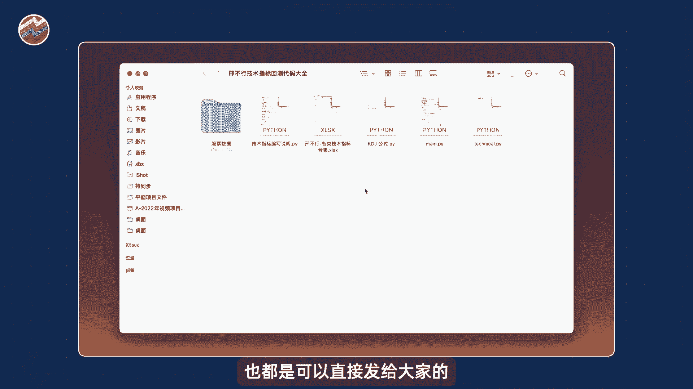

我们提供了一个Excel文件，其中系统性地整理了技术指标。

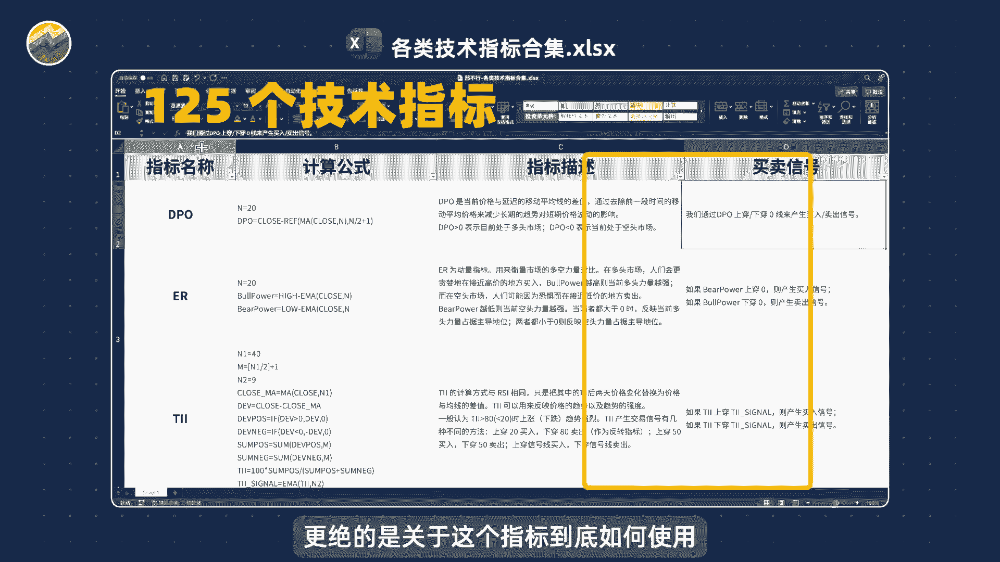

以下是该文件包含的信息：

*   **指标数量**：总共记载了125个技术指标。
*   **详细信息**：包含每个指标的名称、详细的计算公式以及中文描述。
*   **使用指南**：更重要的是，文件整理了每个指标的具体使用方法，以及如何根据它产生买卖信号。

这个资料库非常全面，是进行研究的基础。

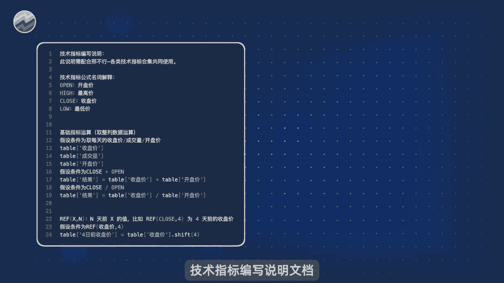

## Python代码实现 💻

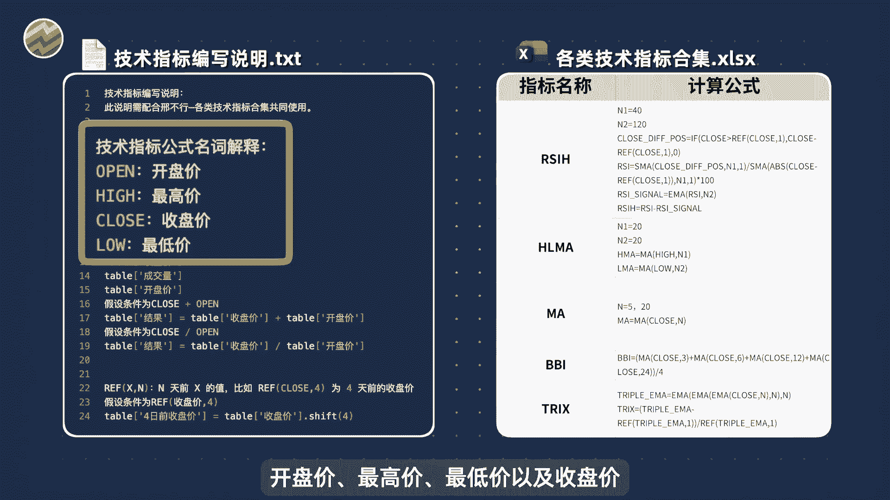

接下来，我们将使用Python代码来计算技术指标并验证其效果。代码设计为“傻瓜式”教程，无需担心编程基础。

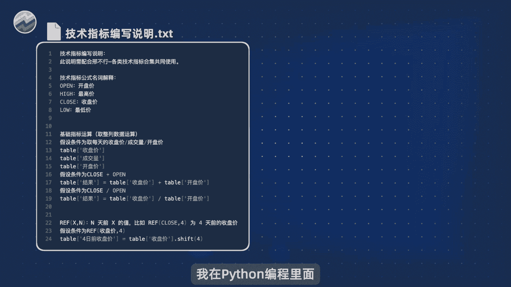

首先，需要使用Python编程工具（如Spider）打开代码文件。关于Python和编程工具的安装，可以参考我们提供的详细教程。

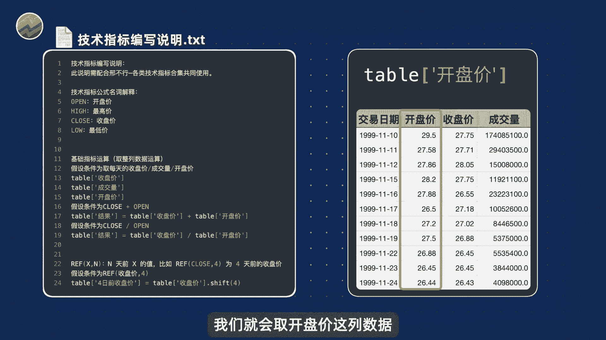

### 理解指标计算公式

我们首先打开《技术指标编写说明》文档。这份文档解释了如何将指标计算公式转化为Python代码。

文档说明了常见符号的含义和对应的Python实现方法：

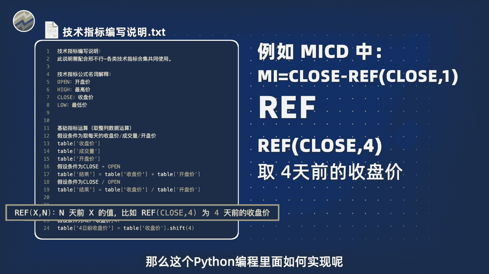

*   **价格序列**：`open`, `high`, `low`, `close` 分别代表开盘价、最高价、最低价、收盘价。
*   **数据选取**：在Python中，使用 `table[‘收盘价’]` 可以获取表格中名为“收盘价”的这一列数据。替换引号内的名称即可获取其他列（如成交量、开盘价）。
*   **列间运算**：计算两列数据的和或差非常直接。例如，计算每日收盘价与开盘价之和的代码是 `table[‘收盘价’] + table[‘开盘价’]`。相除则为 `table[‘收盘价’] / table[‘开盘价’]`。
*   **引用前期数据**：公式中常见的 `REF(close, 4)` 表示取4天前的收盘价。在Python中，这通过 `.shift(4)` 方法实现，代码为 `table[‘收盘价’].shift(4)`。修改括号内的数字即可引用不同天数的前期数据。

理解这份说明后，未来计算任何指标基本只需进行复制和粘贴操作，非常方便。

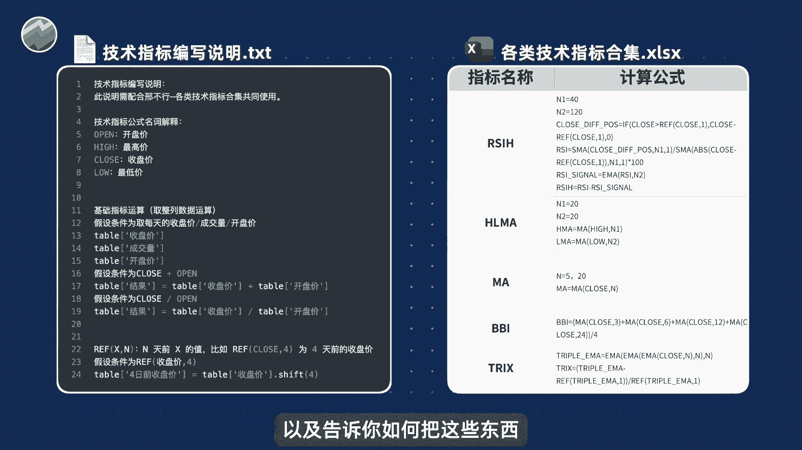

### 实战案例：KDJ指标

下面以KDJ指标为例，演示如何使用编写说明文档。

1.  **解析公式**：查看KDJ的计算公式，第一行出现了 `MIN(LOW, N)`，表示计算过去N天最低价的最小值。
2.  **查找代码**：在说明文档中找到 `MIN` 对应的说明和Python代码示例。
3.  **复制修改**：将文档中的示例代码复制过来，并根据KDJ公式的具体参数（如N值）进行修改。
4.  **重复过程**：对公式中出现的 `MAX(HIGH, N)`（求N日内最高价的最大值）等其他计算部分，重复上述查找、复制、修改的步骤。
5.  **生成买卖信号**：KDJ指标的常见买卖信号是K线上穿D线为买入，K线下穿D线为卖出。对应的Python判断代码也已提供，未来用于其他指标的金叉死叉判断时，只需替换其中的变量名即可。

通过以上步骤，我们就用Python代码完整实现了KDJ指标的计算和买卖信号生成。

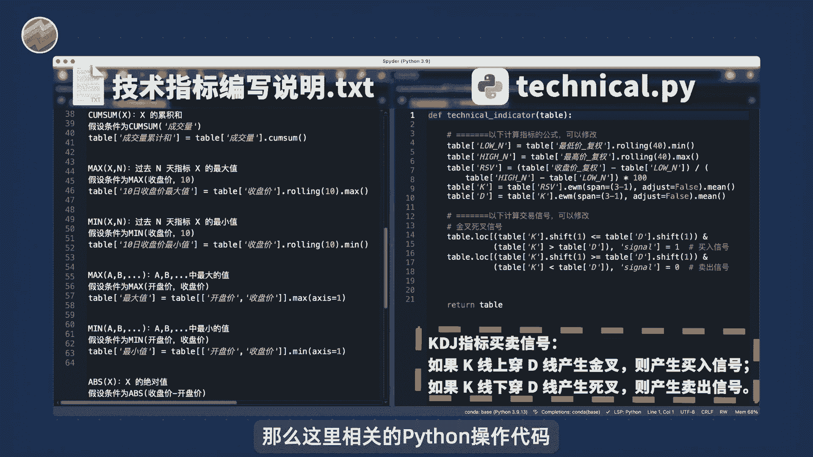

### 运行与查看结果

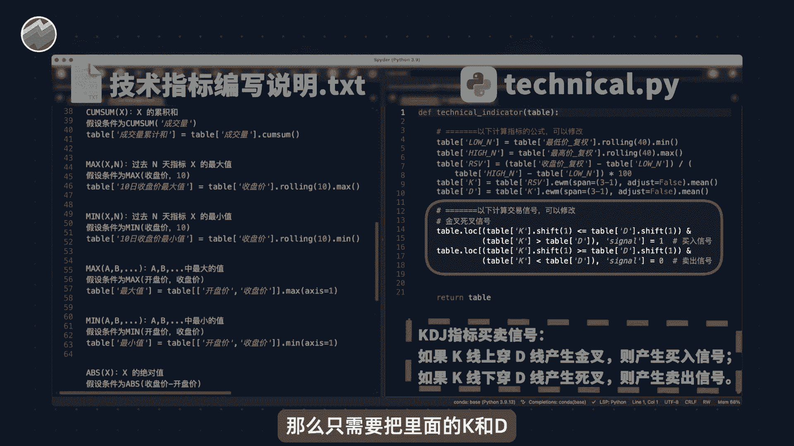

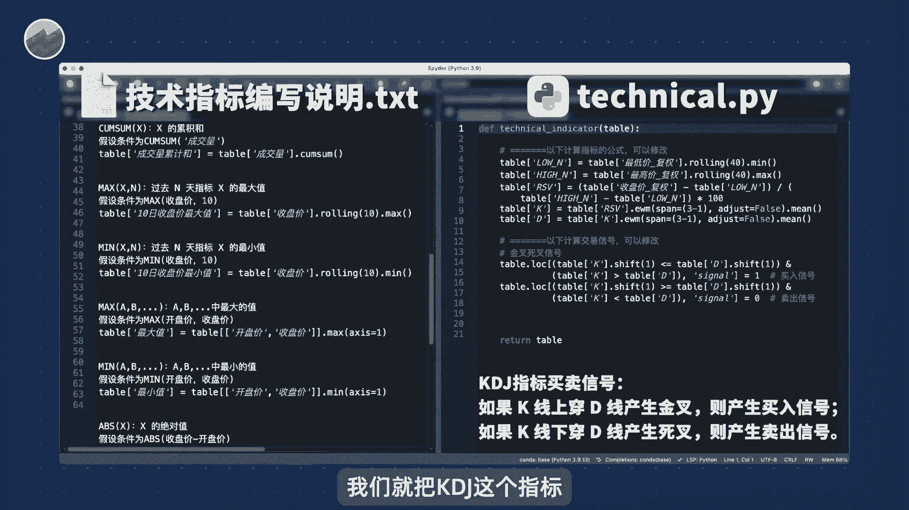

接下来，打开名为 `main.py` 的程序文件。你无需理解该文件的所有内容，直接运行即可。

程序会自动遍历所有股票数据，计算你编写好的指标，整个过程不会耗费太长时间。运行结束后，计算结果会展示出来，供你查看和分析，非常便捷。

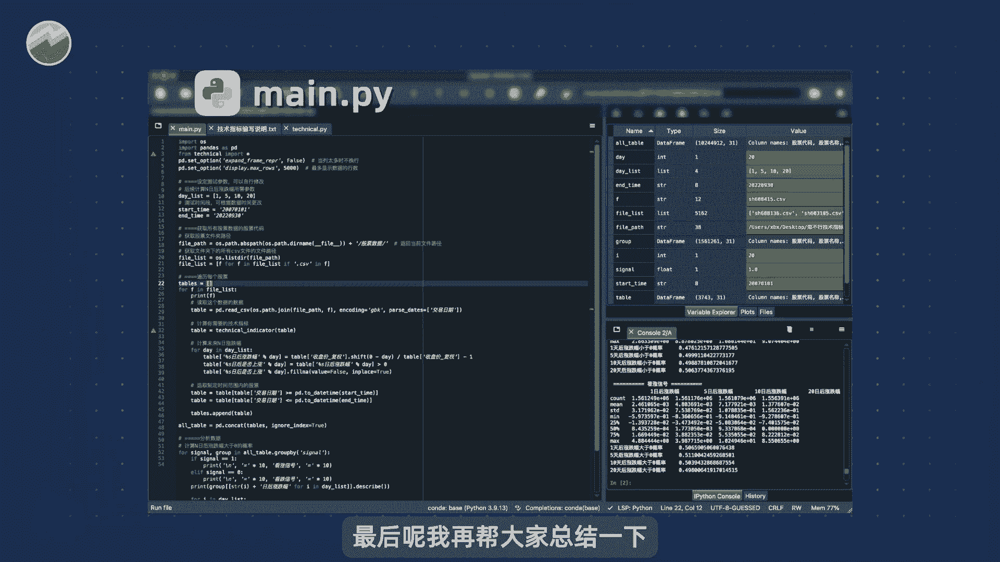

## 总结与操作流程 📝

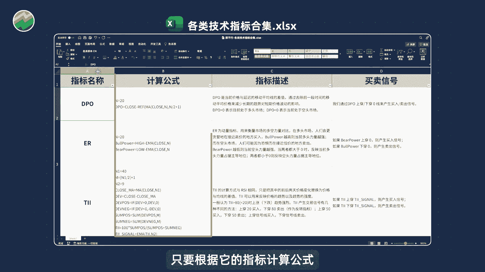

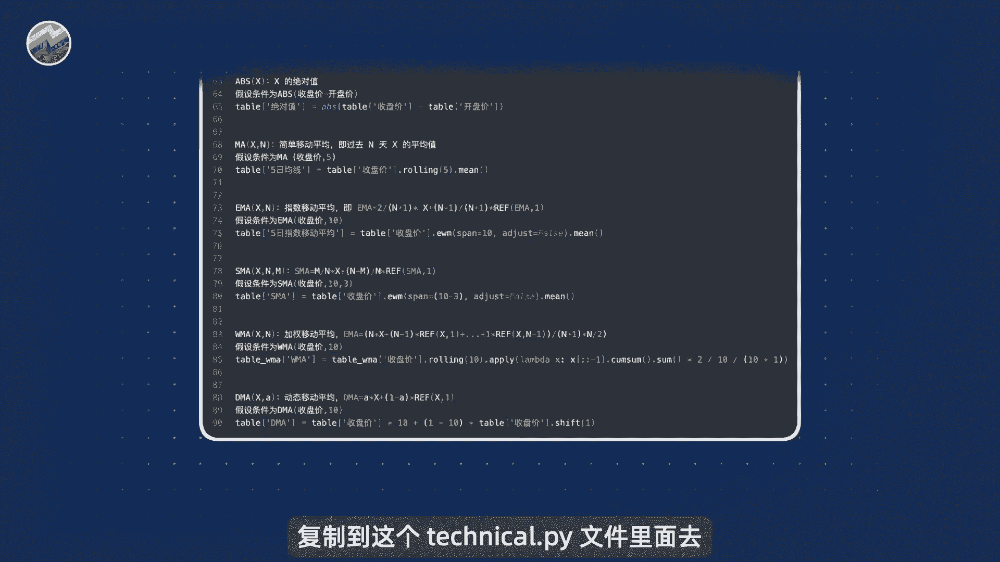

本节课我们一起学习了如何使用Python工具包来量化和测试技术指标。

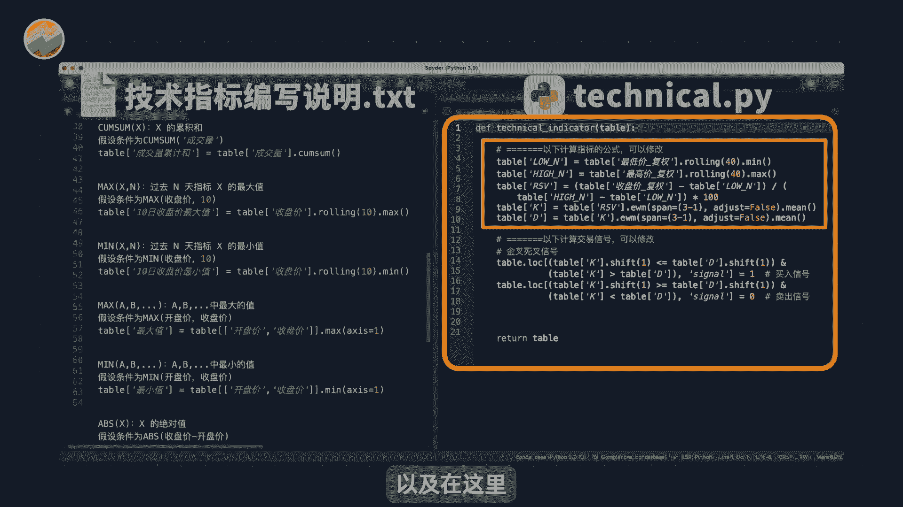

最后，总结一下完整的操作流程：

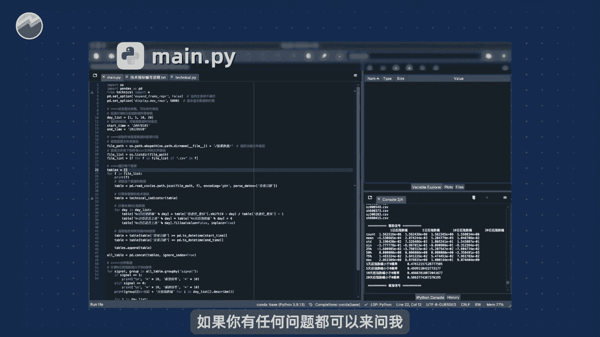

1.  **选择指标**：从技术指标合集中选择你想计算的指标。
2.  **编写代码**：根据该指标的计算公式，在《技术指标编写说明》文档中查找对应的Python代码片段。
3.  **粘贴代码**：将找到的代码复制到 `technical.py` 文件中的指定位置。一处用于放置计算指标值的代码，另一处用于放置生成买卖信号的代码。
4.  **保存运行**：保存修改后的 `technical.py` 文件，然后运行 `main.py` 程序，即可得到完整的回测结果。

强烈建议你亲自尝试这个过程。如果在任何步骤遇到问题，可以随时提问。成功编写出自己第一个指标的同学，欢迎分享你的成果。