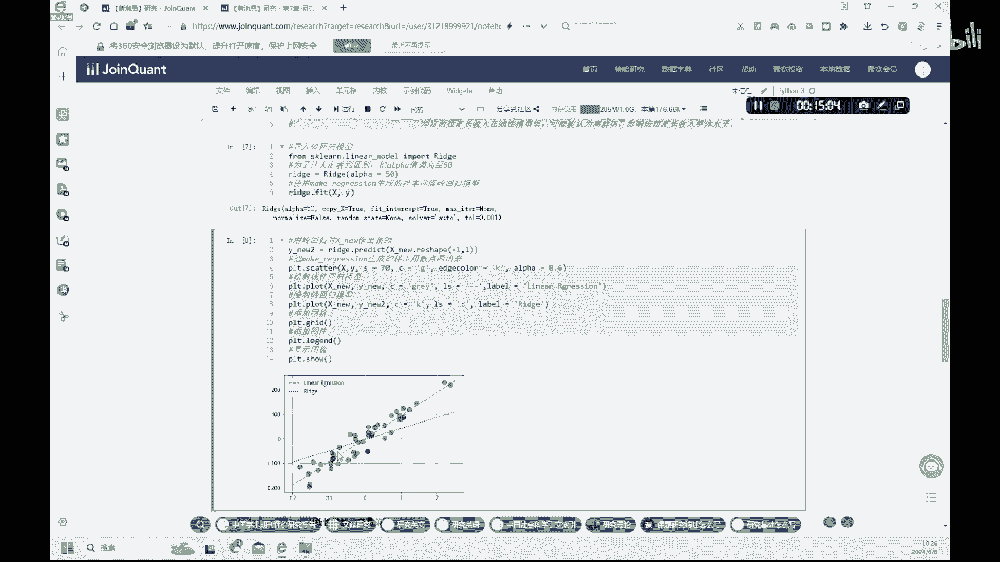

# 金融科技：7.1：机器学习线性模型入门 🧮


在本节课中，我们将学习机器学习中的基础线性模型。我们将回顾线性回归的基本概念，并使用Python的Scikit-learn库来实现它。课程将涵盖从数据生成、模型拟合到结果可视化的完整流程，并介绍正则化技术（如岭回归）以应对过拟合问题。

---

## 数据准备与可视化 📊

上一节我们介绍了课程目标，本节中我们来看看如何准备和查看我们的数据。我们将使用`make_regression`函数生成模拟数据，并用散点图进行可视化。

首先，我们需要导入必要的库。

```python
# 导入必要的库
from sklearn.linear_model import LinearRegression
from sklearn.model_selection import train_test_split
from sklearn.datasets import make_regression
import pandas as pd
import matplotlib.pyplot as plt
import seaborn as sns
```

接着，我们生成一个包含50个样本的简单线性数据集。设置`random_state`可以确保每次生成的随机数相同，便于结果复现。

```python
# 生成模拟数据
X, y = make_regression(n_samples=50, n_features=1, noise=40, random_state=88)
```

数据生成后，我们可以通过散点图来观察特征值`X`与目标值`y`之间的关系。

```python
# 绘制散点图
plt.figure(figsize=(8, 6))
plt.scatter(X, y, s=70, color='green', edgecolor='black')
plt.xlabel('特征值 X')
plt.ylabel('目标值 y')
plt.title('模拟数据散点图')
plt.grid(True)
plt.show()
```

我们可以查看数据集中第一个样本的具体数值。

```python
# 查看第一个样本
print(f"第一个样本的特征值 X[0]: {X[0][0]}")
print(f"第一个样本的目标值 y[0]: {y[0]}")
```

---

## 构建简单线性回归模型 🔧

在准备好数据后，本节我们将构建一个简单的线性回归模型。我们将手动创建一组新的数据，并演示模型的创建、拟合与预测过程。

首先，我们创建一组新的、关系更明确的数据。

```python
import numpy as np
# 创建新的模拟数据
np.random.seed(42)
X_new = np.linspace(0, 10, 50).reshape(-1, 1)  # 特征X
noise = np.random.uniform(-2, 2, 50)            # 噪声
y_new = 5 * X_new.flatten() + 6 + noise         # 目标y
```

接下来，我们创建线性回归模型实例，并用数据对其进行拟合。

```python
# 创建模型并拟合
model = LinearRegression()
model.fit(X_new, y_new)
```

模型拟合后，我们可以用它来预测目标值。预测值 `y_pred` 构成了数据的最佳拟合线。

```python
# 进行预测
y_pred = model.predict(X_new)
```

我们可以查看模型的斜率（系数）和截距，它们定义了线性方程 **y = aX + b**。

```python
# 查看模型参数
slope = model.coef_[0]
intercept = model.intercept_
print(f"模型斜率（系数）为: {slope:.4f}")
print(f"模型截距为: {intercept:.4f}")
print(f"线性方程为: y = {slope:.4f} * X + {intercept:.4f}")
```

最后，我们将原始数据点和回归线绘制在同一张图上进行对比。

```python
# 可视化回归结果
plt.figure(figsize=(8, 6))
plt.scatter(X_new, y_new, color='blue', label='原始数据')
plt.plot(X_new, y_pred, color='red', linewidth=2, label='回归线')
plt.xlabel('特征值 X')
plt.ylabel('目标值 y')
plt.title('简单线性回归')
plt.legend()
plt.grid(True)
plt.show()
```

我们还可以使用训练好的模型对新的特征值进行预测。

```python
# 预测新数据
new_X = np.array([[3]])
predicted_y = model.predict(new_X)
print(f"当特征值 X = 3 时，预测的目标值 y 为: {predicted_y[0]:.4f}")
```

---

## 正则化线性模型：岭回归 🛡️

简单线性模型在处理样本少、噪声大的数据时容易过拟合。本节我们将介绍一种正则化线性模型——岭回归（Ridge Regression），它通过约束模型系数的大小来防止过拟合。

岭回归的优化目标是在普通最小二乘法的基础上，增加一个L2正则化项，其损失函数为：
**Loss = Σ(y_i - ŷ_i)² + α * Σ(w_j)²**
其中，`α`是控制正则化强度的超参数。

以下是使用岭回归的步骤。

首先，从`sklearn`导入岭回归模型。

```python
from sklearn.linear_model import Ridge
```

我们使用课程最初生成的`X`和`y`数据来训练岭回归模型，并与普通线性回归的结果进行对比。

```python
# 创建并训练岭回归模型
ridge_model = Ridge(alpha=10.0)  # 设置正则化强度alpha
ridge_model.fit(X, y)
y_pred_ridge = ridge_model.predict(X)

# 使用相同数据训练普通线性回归模型进行对比
linear_model = LinearRegression()
linear_model.fit(X, y)
y_pred_linear = linear_model.predict(X)
```

我们将两种模型的回归线绘制在一起，直观比较其差异。

```python
# 可视化对比
plt.figure(figsize=(8, 6))
plt.scatter(X, y, color='green', alpha=0.6, label='原始数据')
plt.plot(X, y_pred_linear, 'b--', linewidth=2, label='普通线性回归')
plt.plot(X, y_pred_ridge, 'r:', linewidth=3, label='岭回归 (alpha=10)')
plt.xlabel('特征值 X')
plt.ylabel('目标值 y')
plt.title('普通线性回归 vs 岭回归')
plt.legend()
plt.grid(True)
plt.show()
```

通过对比可以发现，岭回归拟合出的直线斜率通常更平缓。这是因为正则化项惩罚了过大的系数，降低了数据中噪声（或离群值）对模型的影响，从而增强了模型的泛化能力，有助于避免过拟合。

---

## 总结 📝

本节课中我们一起学习了机器学习中的基础线性模型。
1.  我们首先回顾了线性回归的概念，并使用Python生成了模拟数据并进行可视化。
2.  接着，我们动手构建了一个简单的线性回归模型，完成了从数据拟合、参数解读到结果预测和可视化的全过程。
3.  最后，我们探讨了简单线性模型的局限性，并引入了岭回归这一正则化技术。通过对比实验，我们观察到岭回归通过约束系数大小，能够有效抑制过拟合，使模型在面对有噪声或存在离群值的数据时更加稳健。



理解线性模型是深入机器学习领域的重要基石，而正则化则是提升模型泛化性能的关键技术之一。