# Python文件操作：8.1：文件的建立、写入与读取 📄

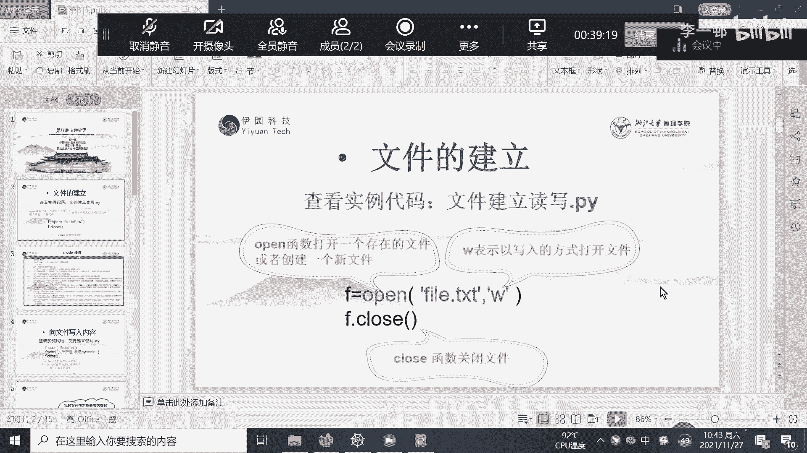

在本节课中，我们将学习Python中文件操作的基础知识，包括如何建立新文件、向文件中写入内容以及从文件中读取内容。这是处理数据持久化存储的重要技能。

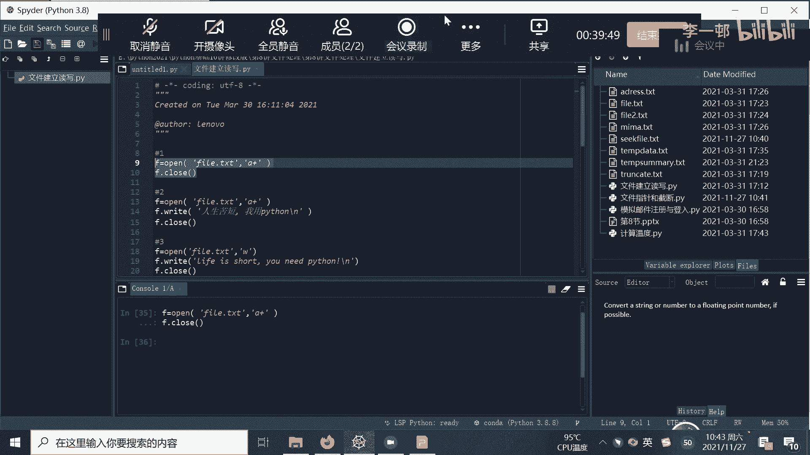

## 建立文本文件

首先，我们来看如何建立一个文本文件。在Python中，我们使用内置的 `open()` 函数来创建或打开文件。

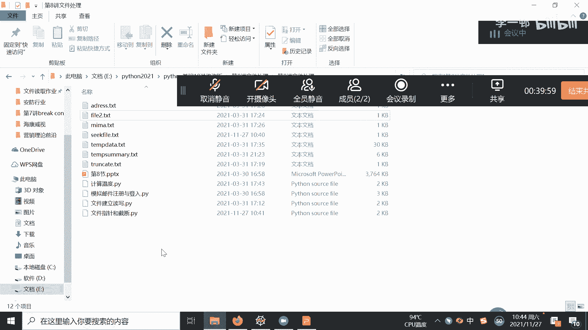

以下是建立文件的基本步骤：

1.  使用 `open()` 函数，指定文件名和模式。
2.  对于新建文件，常用的模式是 `‘a+’`（追加读写）或 `‘w’`（写入，会覆盖）。
3.  操作完成后，务必使用 `.close()` 方法关闭文件。

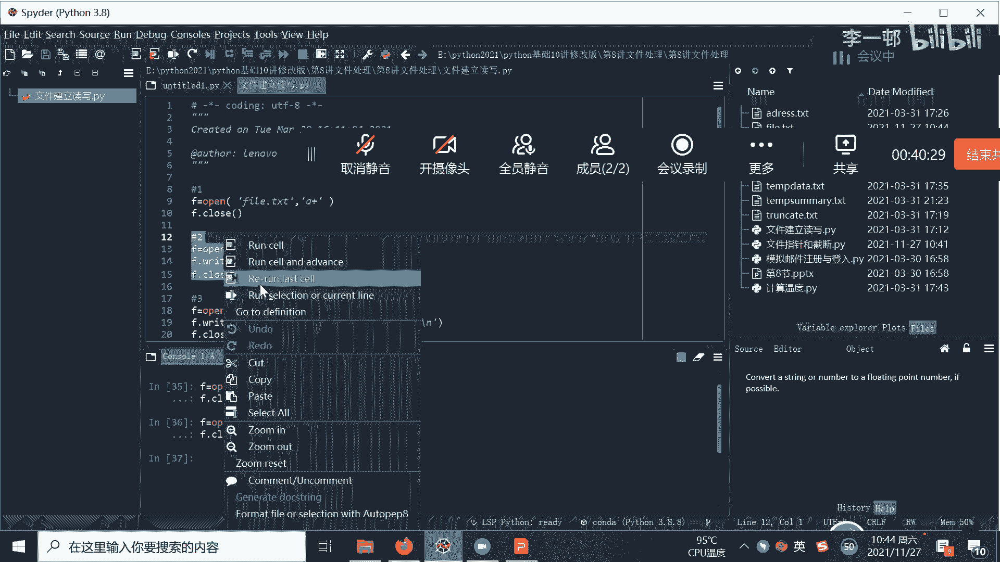

例如，要建立一个名为 `file.txt` 的文件，我们可以这样写：
```python
f = open(‘file.txt’, ‘a+’)
f.close()
```
执行这段代码后，会在当前程序运行的目录下创建一个名为 `file.txt` 的空文件。

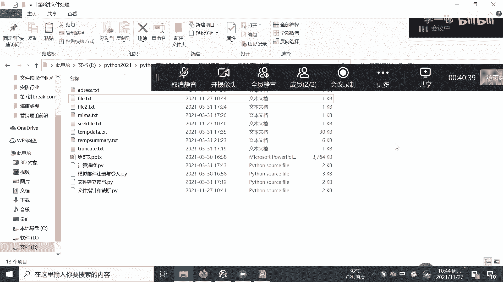

## 向文件写入内容

上一节我们介绍了如何建立文件，本节中我们来看看如何向文件中写入内容。写入操作同样在 `open()` 函数打开文件后进行。

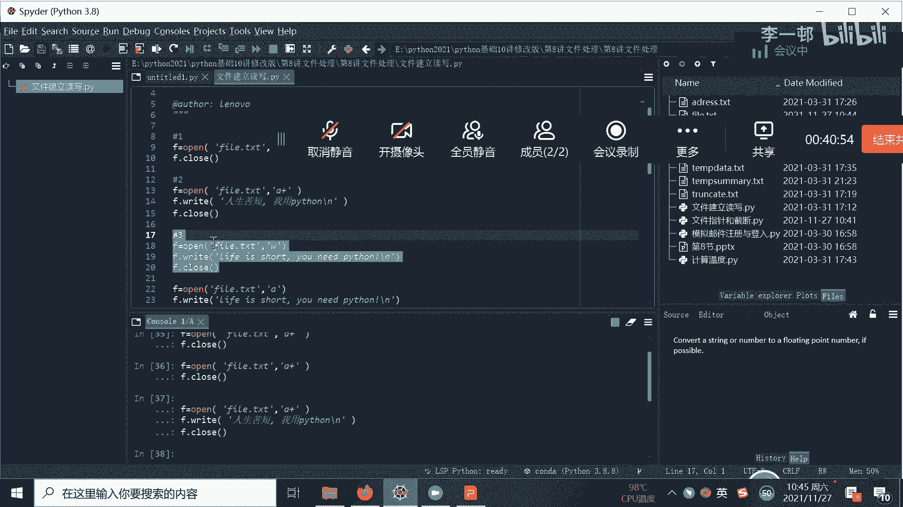

写入内容使用 `.write()` 方法。需要注意的是，使用不同的模式打开文件，写入行为会有所不同。

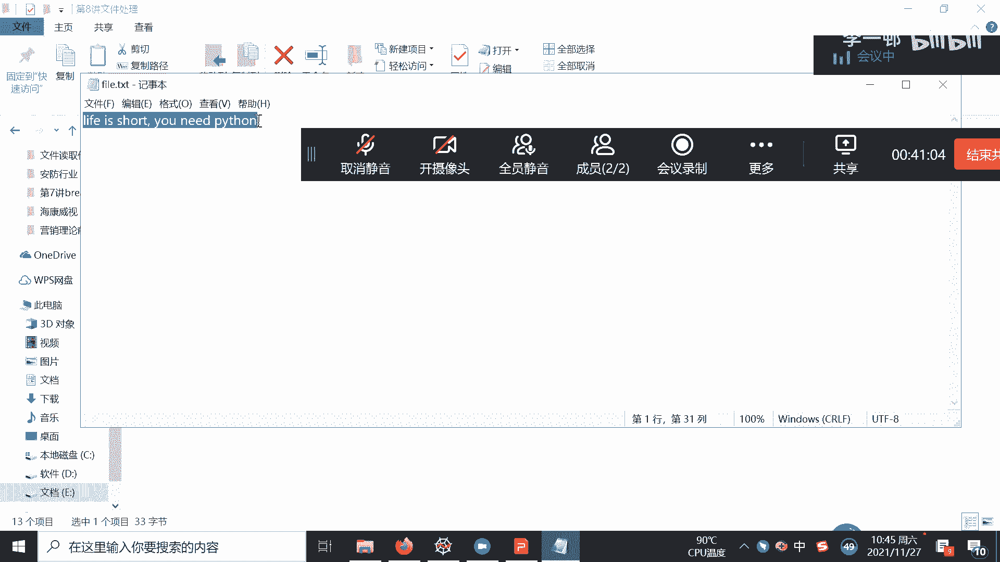

以下是两种常用写入模式的区别：

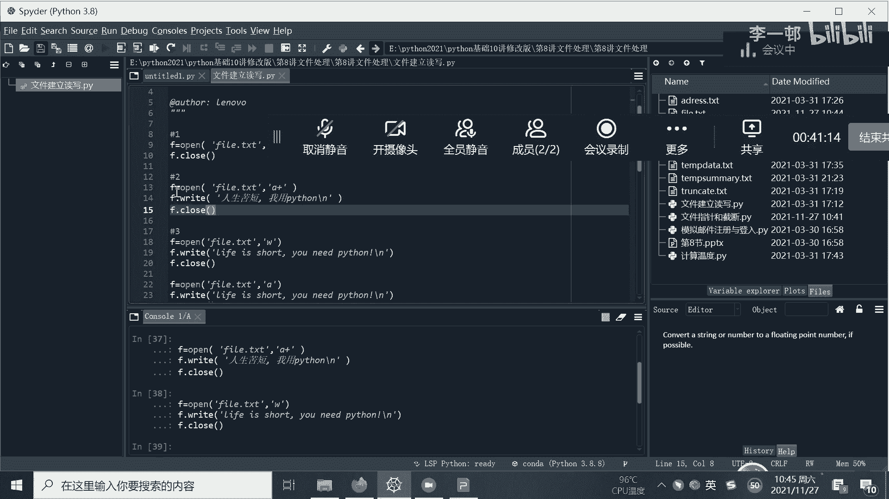

*   **模式 `‘w’`**：写入模式。如果文件已存在，会**清空原有内容**，从头开始写入。
    ```python
    f = open(‘file.txt’, ‘w’)
    f.write(‘人生苦短，我用Python。’)
    f.close()
    ```
*   **模式 `‘a’` 或 `‘a+’`**：追加模式。新内容会**添加在文件原有内容的末尾**，不会删除旧数据。
    ```python
    f = open(‘file.txt’, ‘a+’)
    f.write(‘这是新追加的一行。’)
    f.close()
    ```

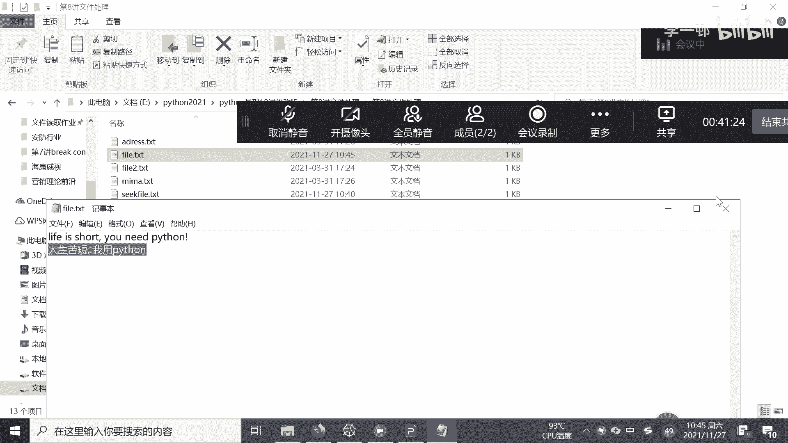

## 从文件读取内容

学会了写入，接下来我们学习如何从文件中读取已保存的内容。读取操作用于获取文件中的数据。

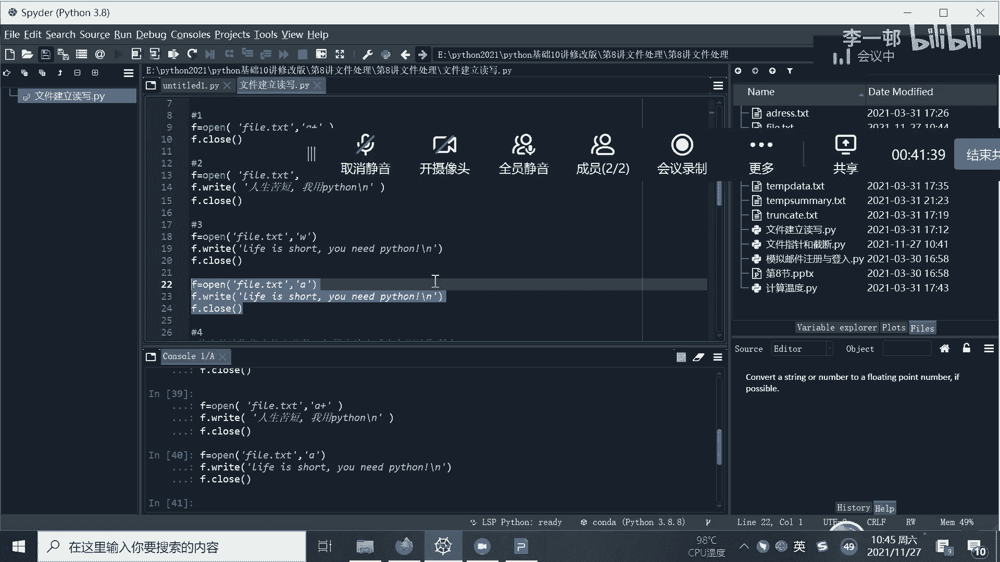

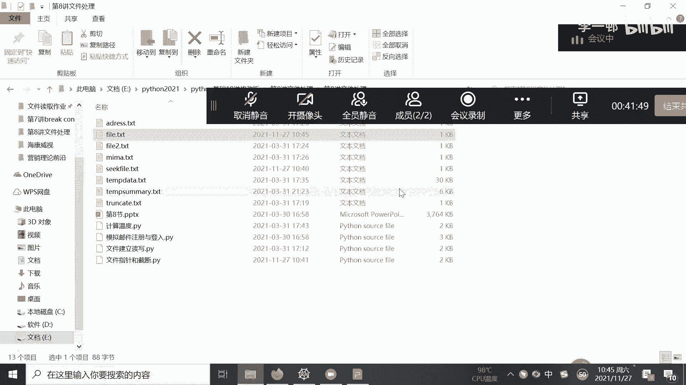

读取内容使用 `.read()` 方法。该方法可以指定读取的字节数。

以下是 `.read()` 方法的两种用法：

*   **读取指定字节数**：在 `.read()` 括号内传入一个数字参数，例如 `.read(10)` 表示读取文件的前10个字节。
    ```python
    f = open(‘file.txt’, ‘r’)
    content = f.read(10) # 读取前10个字符
    print(content)
    f.close()
    ```
*   **读取全部内容**：如果不传入任何参数，直接使用 `.read()`，则会一次性读取文件的全部内容。
    ```python
    f = open(‘file.txt’, ‘r’)
    content = f.read() # 读取全部内容
    print(content)
    f.close()
    ```

---

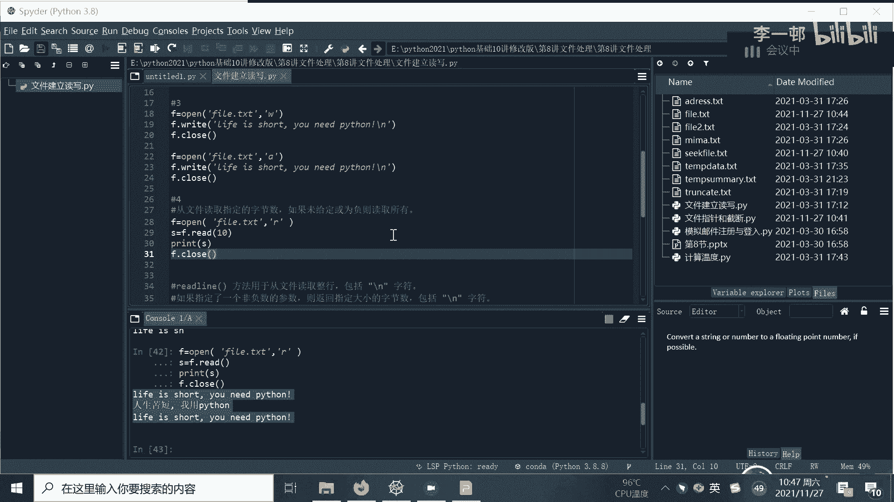

本节课中我们一起学习了Python文件操作的基础。我们掌握了使用 `open()` 函数建立文件，使用 `.write()` 方法配合 `‘w’` 或 `‘a’` 模式写入内容，以及使用 `.read()` 方法读取文件全部或部分内容。记住，文件操作完成后，使用 `.close()` 关闭文件是一个好习惯。