# Python数据分析实战：P27：08：京牌摇号小程序代码实现 🚗

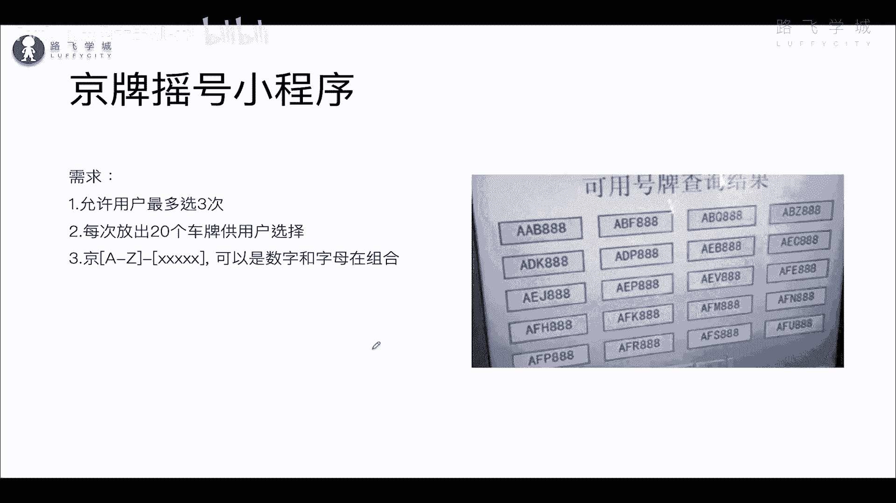

在本节课中，我们将学习如何综合运用循环、条件判断和随机数生成等知识，实现一个模拟“京牌摇号”的小程序。我们将从零开始，一步步构建这个程序。

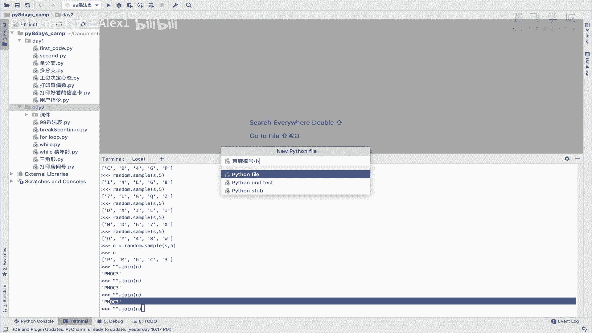

## 概述

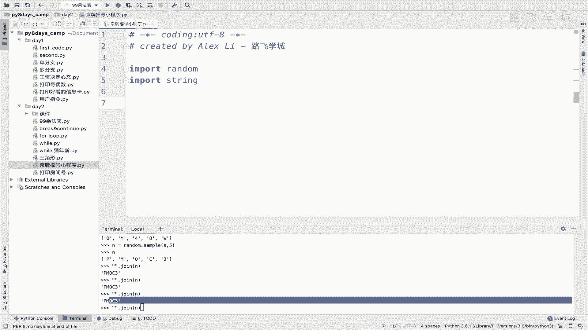

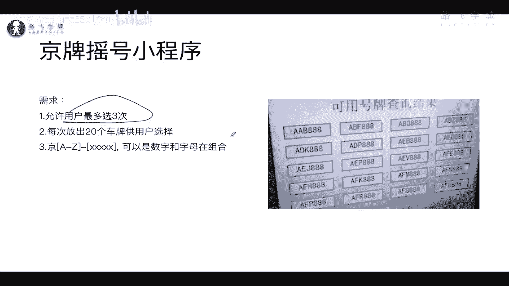

我们将创建一个程序，模拟为用户随机生成20组车牌号码，并允许用户从中选择自己喜欢的号码。用户最多有三次选择机会。程序的核心在于生成符合规则的随机字符串，并处理用户的输入与判断。

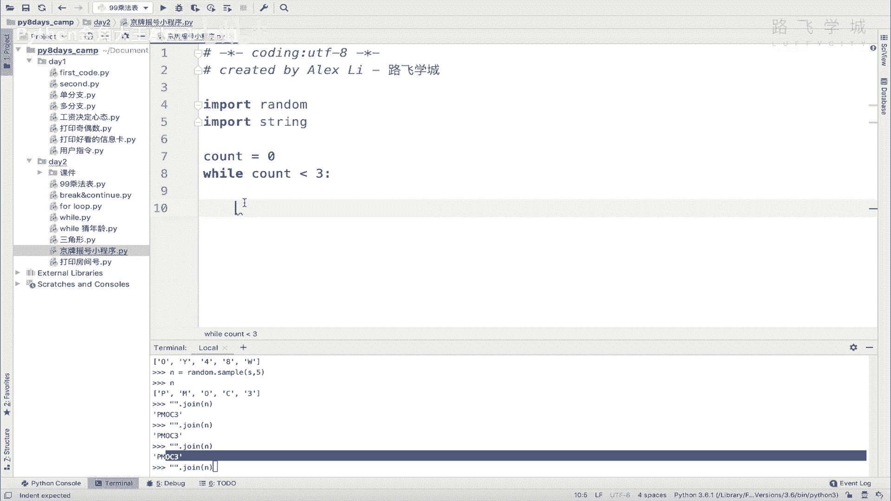

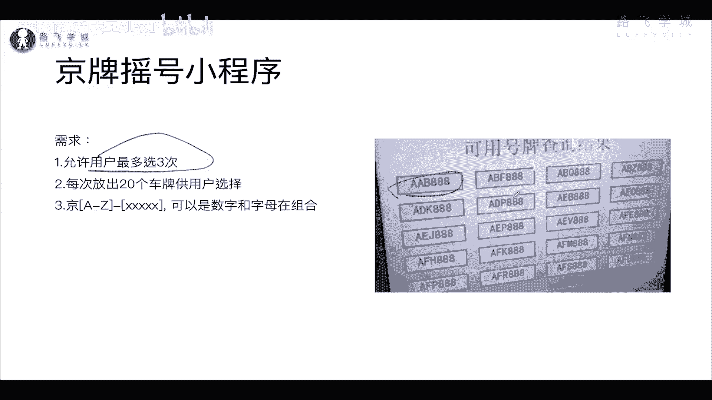

## 代码实现步骤

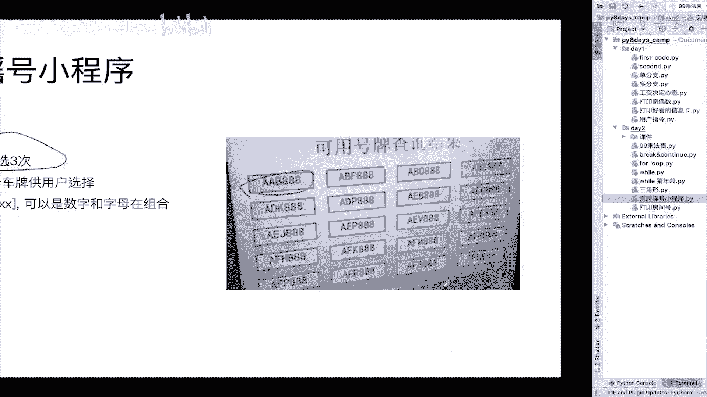

上一节我们介绍了随机生成字符串和数字组合的方法，本节中我们来看看如何将这些知识整合到一个完整的程序中。

首先，我们需要导入必要的模块。

```python
import random
import string
```

接下来，我们开始构建程序的主逻辑。程序需要允许用户最多尝试三次，因此我们需要一个循环来控制尝试次数。

```python
count = 0
while count < 3:
    # 此处将生成号码并处理用户选择
    count += 1
```

在每一次尝试中，我们需要为用户生成20组备选的车牌号码。车牌号码的规则是：第一个字符为大写英文字母，后面五个字符是数字或大写字母的组合。

以下是生成一组车牌号码并添加到列表的代码：

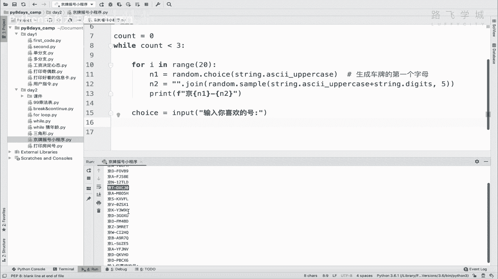

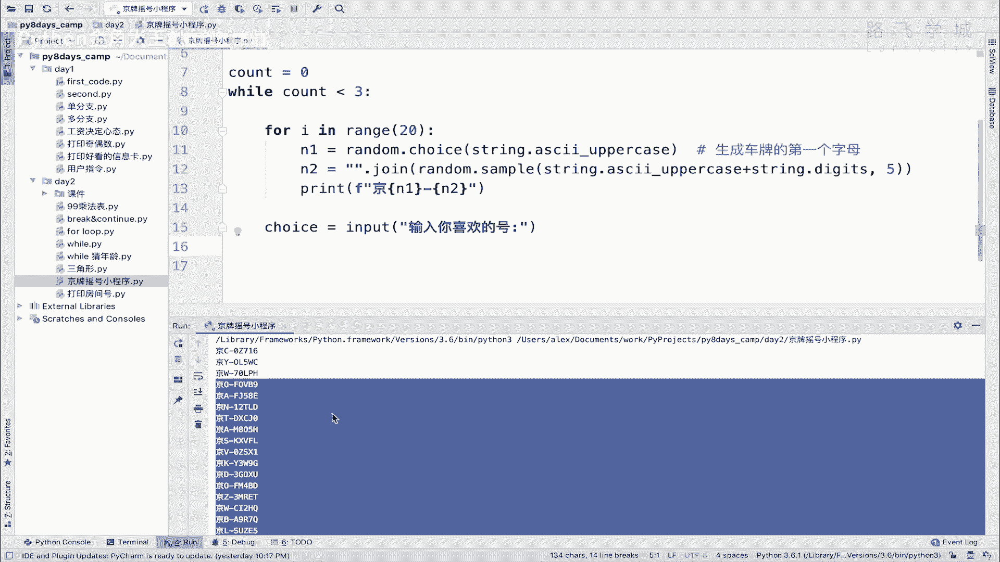

```python
    car_numbers = []  # 用于存储生成的号码
    for i in range(20):
        # 生成第一个大写字母
        first_char = random.choice(string.ascii_uppercase)
        # 生成后五个字符（数字或大写字母）
        rest_chars = random.sample(string.ascii_uppercase + string.digits, 5)
        # 将列表拼接成字符串
        rest_str = ''.join(rest_chars)
        # 组合成完整车牌号，例如“京A123BC”
        full_number = f"京{first_char}{rest_str}"
        # 将号码添加到列表
        car_numbers.append(full_number)
        # 打印带编号的选项
        print(f"{i+1}: {full_number}")
```

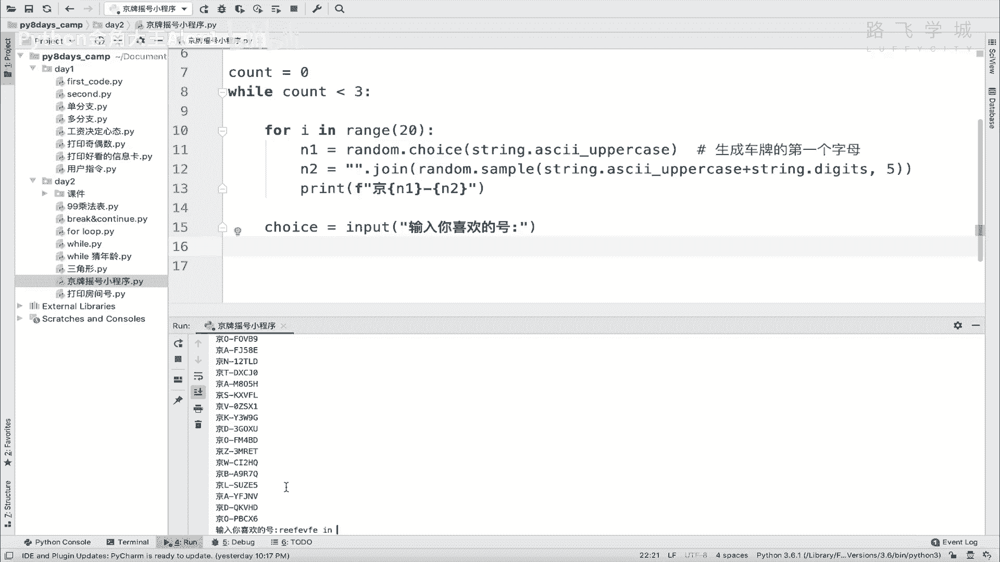

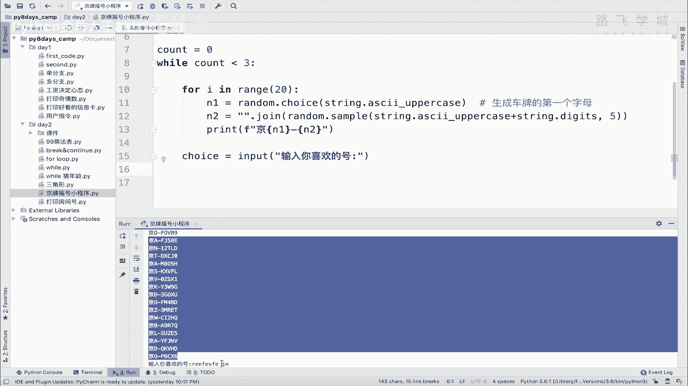

生成了号码列表后，我们需要让用户输入他心仪的号码，并判断其选择是否有效。

以下是处理用户输入和判断的逻辑：

```python
    # 获取用户输入，并使用strip()方法去除可能误输入的首尾空格或换行符
    user_choice = input("请输入您喜欢的车牌号码：").strip()
    
    # 判断用户输入是否在生成的号码列表中
    if user_choice in car_numbers:
        print(f"恭喜您！成功选中新车牌号：{user_choice}")
        print("祝您好运！")
        break  # 选择成功，退出循环
    else:
        print("您选择的车牌号不合法，请重新选择。")
```

如果用户三次选择均未成功，循环结束后，程序可以给出相应提示。

```python
if count == 3:
    print("很遗憾，您已用完三次机会。")
```

## 完整代码示例

将以上所有部分组合起来，就得到了我们完整的摇号小程序。

```python
import random
import string

count = 0
while count < 3:
    print(f"\n--- 第 {count+1} 次摇号，以下是20组号码 ---")
    car_numbers = []
    
    for i in range(20):
        first_char = random.choice(string.ascii_uppercase)
        rest_chars = random.sample(string.ascii_uppercase + string.digits, 5)
        rest_str = ''.join(rest_chars)
        full_number = f"京{first_char}{rest_str}"
        car_numbers.append(full_number)
        print(f"{i+1}: {full_number}")
    
    user_choice = input("\n请输入您喜欢的车牌号码：").strip()
    
    if user_choice in car_numbers:
        print(f"\n恭喜您！成功选中新车牌号：{user_choice}")
        print("祝您好运！")
        break
    else:
        print("您选择的车牌号不合法，请重新选择。")
    
    count += 1

if count == 3:
    print("\n很遗憾，您已用完三次机会。")
```

## 总结

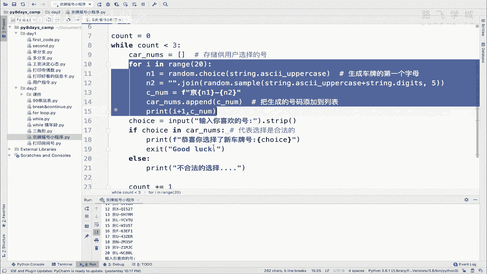

本节课中我们一起学习了如何构建一个完整的“京牌摇号”模拟程序。我们综合运用了 `while` 循环控制尝试次数、`for` 循环生成多组数据、`random` 和 `string` 模块生成随机字符串、`if-else` 进行条件判断，以及 `strip()` 方法处理用户输入。这个练习很好地串联了之前学过的多个核心概念，是迈向项目实战的重要一步。理解思路后，请尝试独立默写一遍代码，以巩固所学知识。