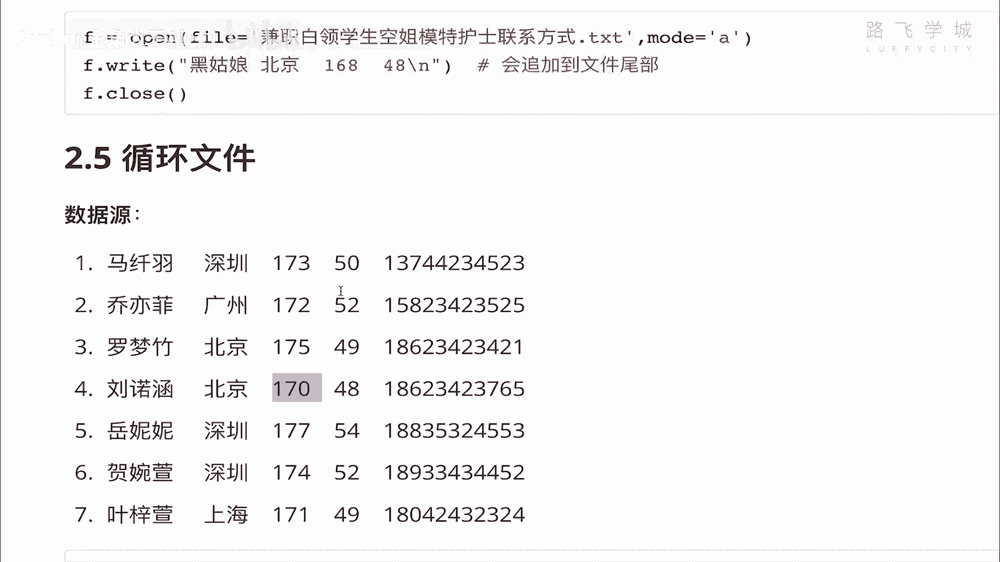
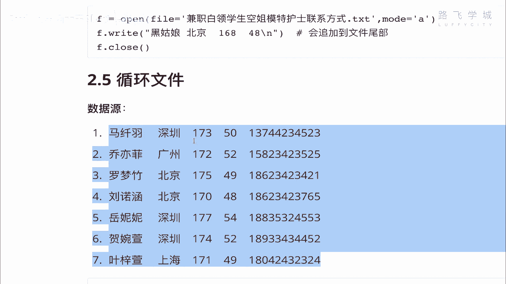
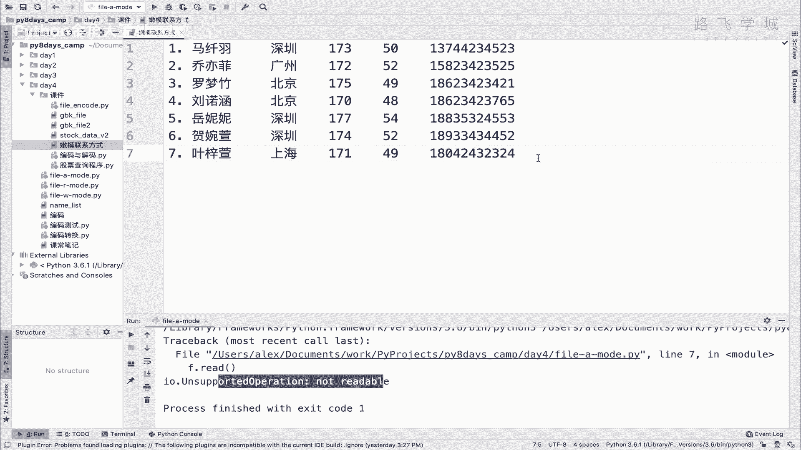
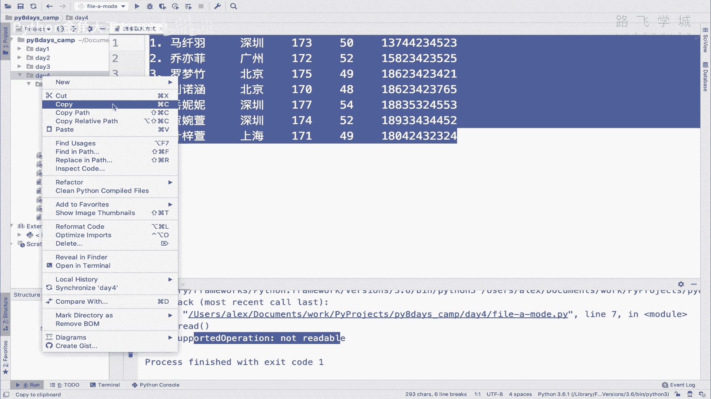
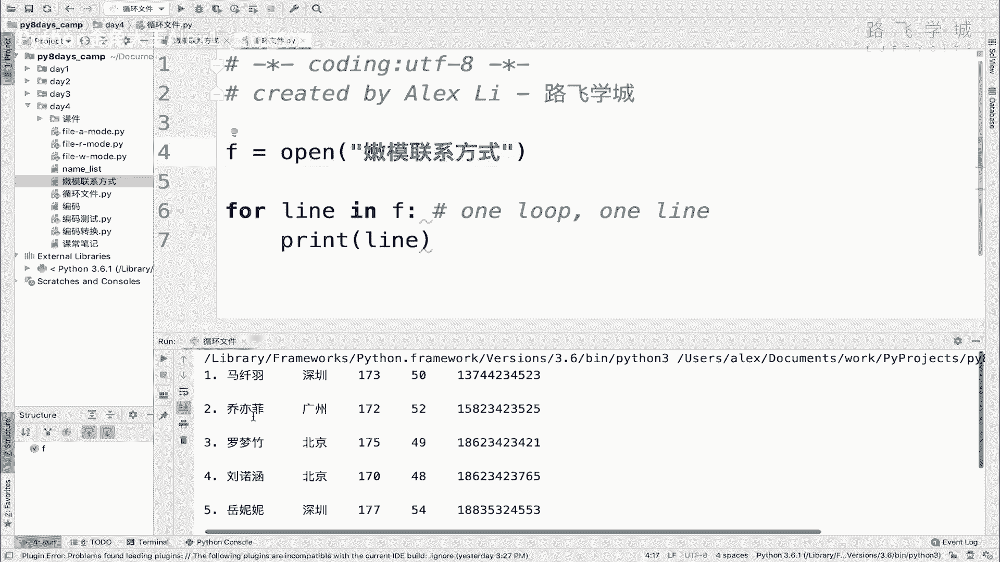
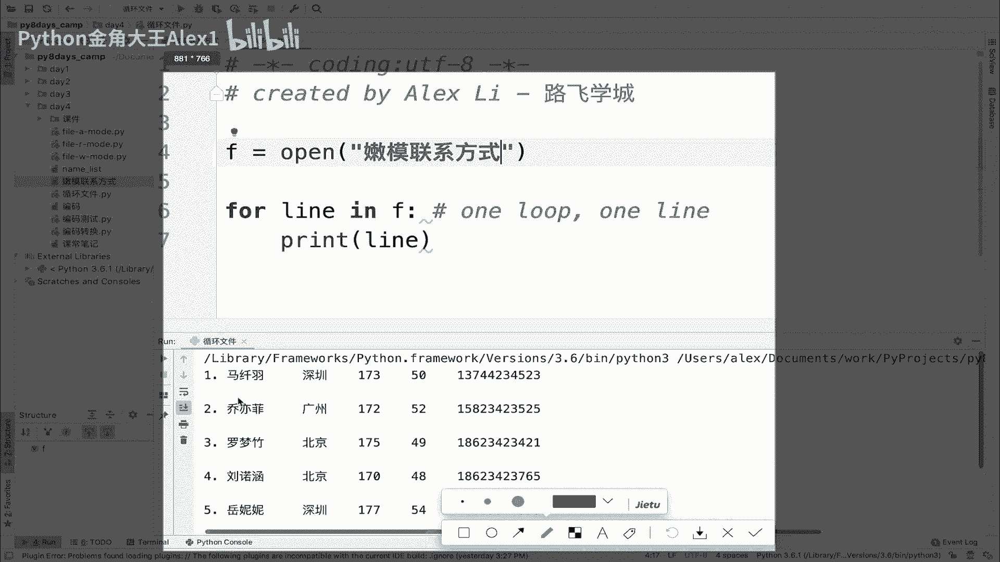
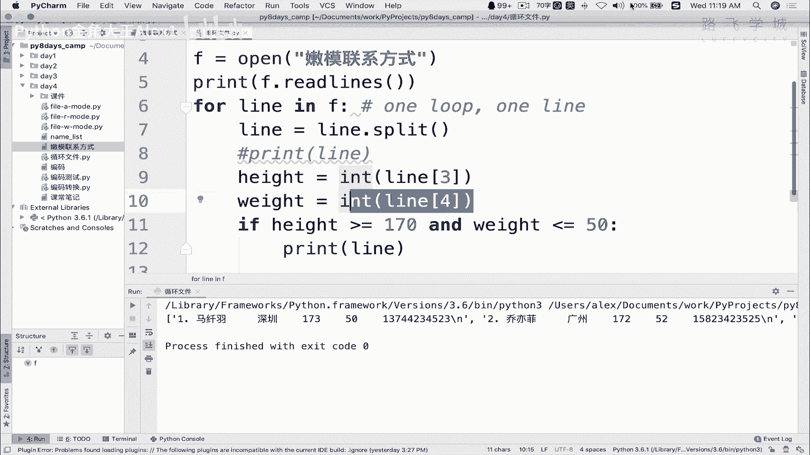

# Python文件操作教程：06：遍历文件

## 概述
在本节课中，我们将要学习如何使用Python循环遍历文件内容，并对文件中的数据进行筛选和处理。我们将通过一个具体的例子——从“嫩模联系方式”文件中筛选出符合特定身高和体重条件的数据，来掌握文件遍历的核心操作。





---

## 文件遍历基础





上一节我们介绍了文件的创建、只读和追加模式。本节中我们来看看如何读取并循环处理一个已存在的文件。

循环读取文件内容的方法与循环列表类似。核心步骤是：首先使用 `open()` 函数以读取模式打开文件，然后使用 `for` 循环逐行读取。

```python
f = open('嫩模联系方式.txt', 'r')
for line in f:
    print(line)
f.close()
```

执行上述代码后，你可能会发现打印出的内容之间存在多余的空行。这是因为文件中的每一行末尾本身包含一个换行符 `\n`，而 `print()` 函数默认也会在输出末尾添加换行符。





以下是解决空行问题的两种方法：

1.  使用 `print()` 函数的 `end` 参数覆盖默认的换行。
    ```python
    print(line, end='')
    ```
2.  使用字符串的 `.strip()` 方法移除每行首尾的空白字符（包括换行符）。
    ```python
    print(line.strip())
    ```

---

## 处理文件内容并进行筛选

仅仅打印文件内容还不够。我们的目标是筛选出文件中身高高于170厘米且体重低于50公斤的记录。

由于从文件中读取的每一行 (`line`) 是一个字符串，我们需要将其拆分成独立的字段（如姓名、身高、体重），然后才能进行数值比较。

以下是处理流程：

1.  **拆分字符串**：使用字符串的 `.split()` 方法，默认按空格将一行文本分割成列表。
2.  **提取并转换数据**：从列表中按索引取出代表身高和体重的字符串，并使用 `int()` 或 `float()` 函数将其转换为数值类型。
3.  **应用条件判断**：使用 `if` 语句对转换后的数值进行条件筛选。

```python
f = open('嫩模联系方式.txt', 'r')
for line in f:
    data_list = line.split()  # 将一行按空格分割成列表
    if len(data_list) >= 5:   # 确保该行有足够的数据列
        name = data_list[0]
        height = int(data_list[3])   # 假设身高在第4列（索引3）
        weight = int(data_list[4])   # 假设体重在第5列（索引4）
        if height > 170 and weight < 50:
            print(line.strip())
f.close()
```

**代码解释**：
*   `line.split()`: 将字符串如 `"Alice 25 北京 172 48"` 转换为列表 `['Alice', '25', '北京', '172', '48']`。
*   `int(data_list[3])`: 将字符串 `'172'` 转换为整数 `172`，以便进行数值比较 `> 170`。
*   条件 `if len(data_list) >= 5:` 是为了避免处理文件末尾可能存在的空行导致索引错误。

---

## 常见问题与注意事项

在实践过程中，可能会遇到一个典型的错误：`IndexError: list index out of range`。

**问题原因**：
这个错误通常发生在尝试访问列表不存在的索引时。在文件遍历中，最常见的原因是文件末尾存在**空行或不可见的空白行**。当循环读取到这些行时，`.split()` 方法返回的列表可能是空的或元素很少，此时访问 `data_list[3]` 就会引发索引错误。

**解决方案**：
在分割字符串并访问特定索引前，先检查列表的长度，确保数据有效。
正如上面代码所示，使用 `if len(data_list) >= 5:` 进行判断是一种稳妥的做法。这能确保程序只处理数据完整的行，优雅地跳过空行或格式不规范的行。

---



## 总结
本节课中我们一起学习了Python文件操作中的遍历技巧。我们掌握了如何使用 `for line in file` 循环读取文件每一行，学会了通过 `.split()` 方法解析字符串数据，并实现了将字符串转换为数值后进行条件筛选的完整流程。最后，我们还探讨了处理过程中可能遇到的索引错误及其解决方法。通过本课的学习，你已经能够读取文件内容并对其中的数据进行复杂的查询和过滤操作。