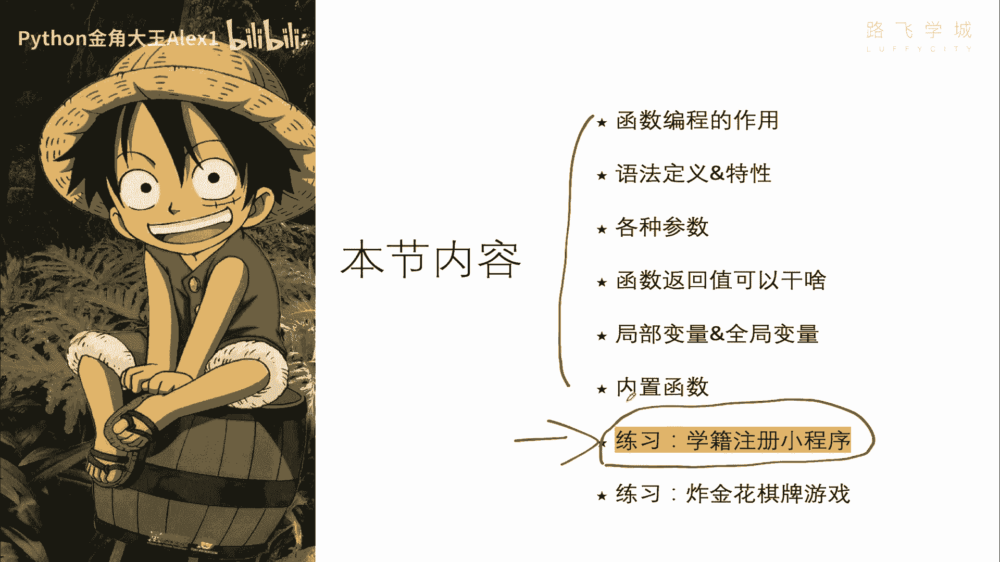
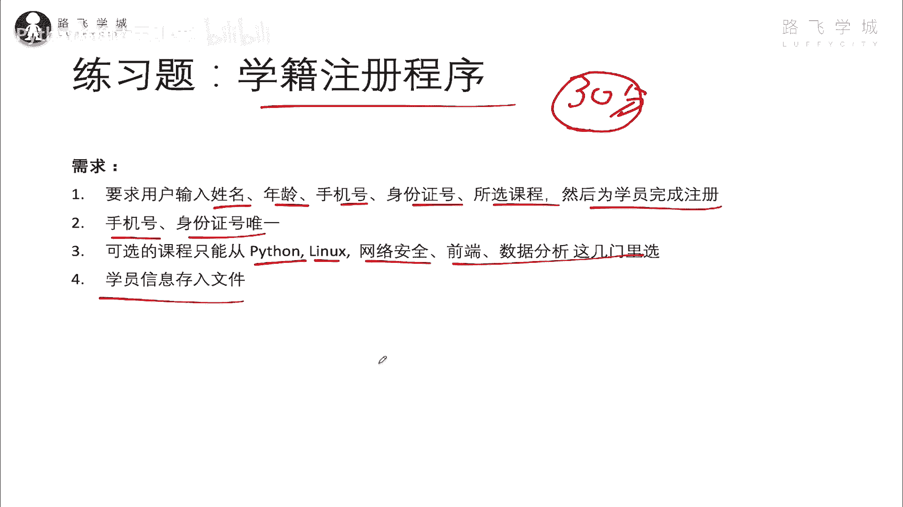
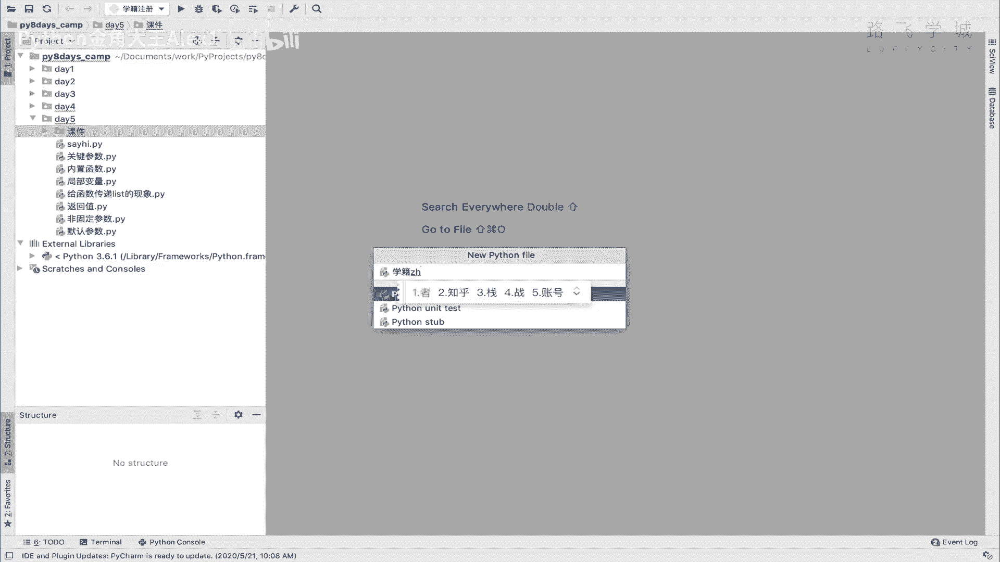
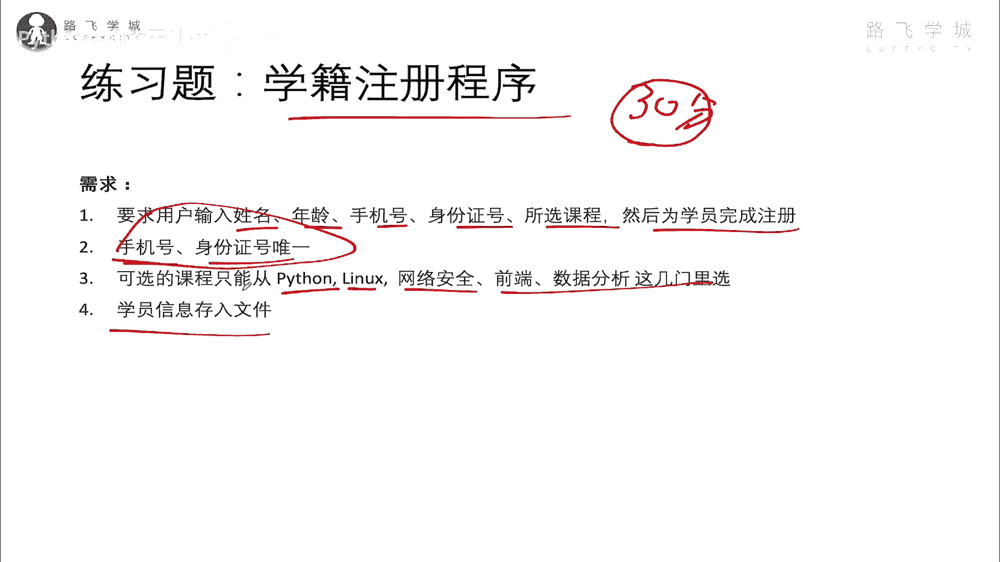
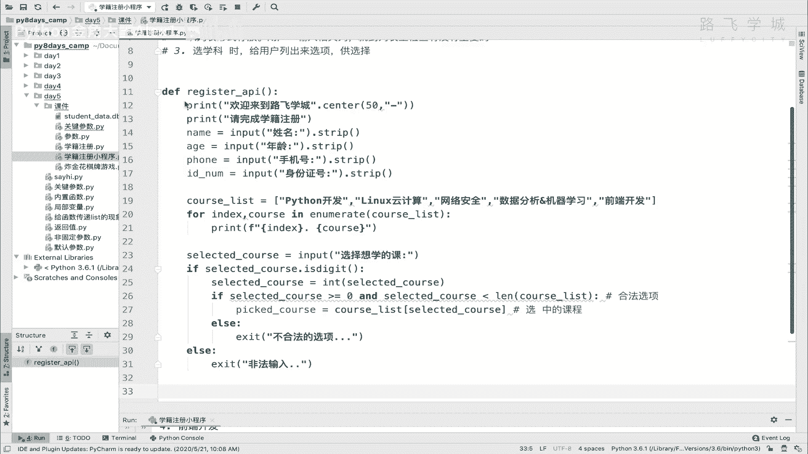
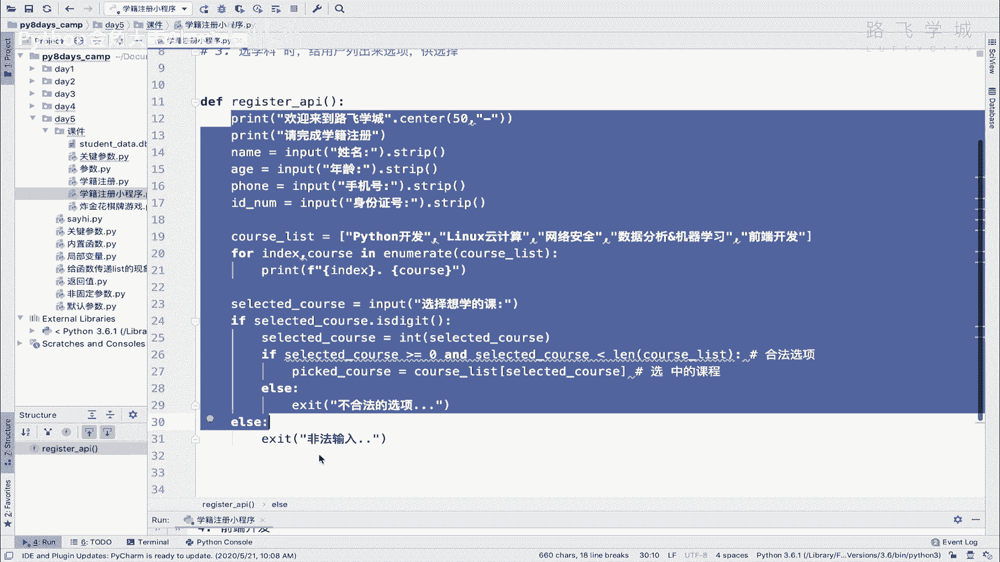
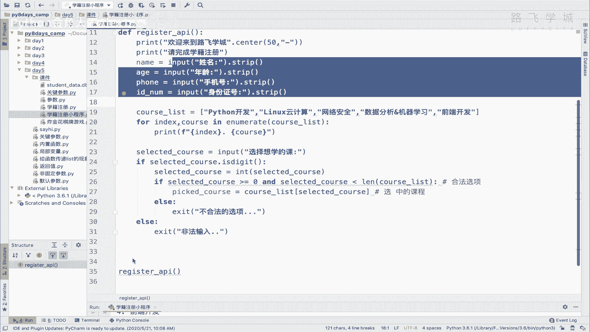
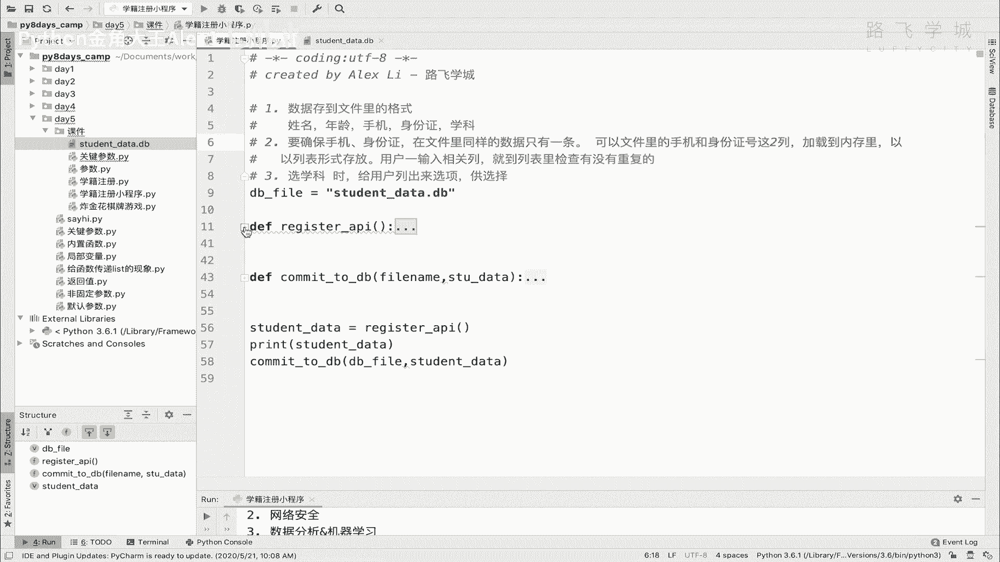

# Python函数实战：学籍注册小程序 🎓

## 课程名称：Python函数实战：章节编号：1：章节名称：学籍注册小程序代码实现



在本节课中，我们将学习如何运用已掌握的Python函数知识，来构建一个完整的“学籍注册”小程序。我们将从需求分析开始，逐步实现用户信息录入、数据唯一性校验、课程选择限制以及数据持久化存储等功能。

---

### 需求分析与思路梳理

上一节我们介绍了函数的基本语法，本节中我们来看看如何将这些知识应用于实际项目。





程序的核心需求如下：
1.  收集用户输入的姓名、年龄、手机号、身份证号和所选课程。
2.  确保手机号和身份证号在系统中是唯一的。
3.  用户只能从预设的课程列表中选择课程。
4.  将学员信息存入文件进行持久化保存。

为了实现这些需求，我们需要解决几个关键问题。

**首先，确定数据存储格式。**
我们可以将每位学员的信息存储为文件中的一行，各项数据之间用逗号分隔。例如：`姓名,年龄,手机号,身份证号,所选课程`。

**其次，实现手机号和身份证号的唯一性校验。**
我们需要在用户输入时，检查其手机号和身份证号是否已在系统中存在。一个高效的思路是：程序启动时，先将文件中已有的手机号和身份证号数据加载到内存（例如两个列表）中。当用户输入新信息时，直接与内存中的列表进行比对，从而避免每次校验都需读取整个文件。

**最后，限制课程选择范围。**
在用户选择课程时，我们应提供一个明确的课程列表供其选择，并验证其输入是否在列表范围内。

---



### 核心功能实现

接下来，我们将按照上述思路，分步骤实现各个功能模块。

#### 1. 定义全局变量与注册接口函数

我们首先定义存储课程列表和数据库文件路径的全局变量，并创建一个负责与用户交互、收集信息的函数。

```python
# 预设的课程列表
COURSE_LIST = ['Python开发', 'Linux云计算', '网络安全', '数据分析', '机器学习', '前端开发']

# 学员数据库文件
DB_FILE = 'student_data.db'

def register_interface():
    """
    学员注册交互接口。
    收集用户输入的姓名、年龄、手机号、身份证号，并让其选择课程。
    返回一个包含所有信息的字典。
    """
    print('欢迎来到路飞学城'.center(50, '*'))
    print('请完成学籍注册：')

    # 收集基本信息
    name = input('姓名：').strip()
    age = input('年龄：').strip()
    phone = input('手机号：').strip()
    id_number = input('身份证号：').strip()

    # 处理课程选择
    print('请选择想学习的课程：')
    for index, course in enumerate(COURSE_LIST):
        print(f'  {index}: {course}')

    selected_course = input('输入课程编号：').strip()

    # 验证输入是否为数字且在有效范围内
    if not selected_course.isdigit():
        print('非法输入：请输入数字编号。')
        return None

    course_index = int(selected_course)
    if course_index < 0 or course_index >= len(COURSE_LIST):
        print('不合法的选项：编号超出范围。')
        return None

    # 获取选中的课程名
    picked_course = COURSE_LIST[course_index]

    # 将数据组装成字典
    student_data = {
        'name': name,
        'age': age,
        'phone': phone,
        'id_number': id_number,
        'course': picked_course
    }
    return student_data
```

#### 2. 实现数据存储函数

我们创建一个独立的函数，负责将收集到的学员数据追加写入到数据库文件中。

```python
def commit_to_db(db_filename, student_data):
    """
    将单个学员数据存入文件。
    :param db_filename: 数据库文件名
    :param student_data: 学员数据字典
    """
    if student_data is None:
        return

    # 将字典数据拼接成一行字符串
    row = f"{student_data['name']},{student_data['age']},{student_data['phone']},{student_data['id_number']},{student_data['course']}\n"

    # 以追加模式写入文件
    with open(db_filename, 'a', encoding='utf-8') as f:
        f.write(row)
    print('学员信息已成功存入数据库。')
```

#### 3. 主程序流程

现在，我们将注册接口和数据存储函数组合起来，形成完整的程序流程。

```python
# 主程序执行流程
if __name__ == '__main__':
    # 步骤1: 调用注册接口，获取学员数据
    stu_data = register_interface()

    # 步骤2: 如果数据有效，则存入数据库
    if stu_data:
        commit_to_db(DB_FILE, stu_data)
```







---

### 功能优化：实现唯一性校验

上一节我们完成了基础的数据收集和存储，本节中我们来看看如何增强程序的健壮性，实现手机号和身份证号的唯一性校验。

我们需要新增一个功能：在程序开始时加载已有数据的手机号和身份证号，并在注册时进行检查。

以下是实现此功能的关键步骤：

1.  **加载历史数据**：编写一个函数，从数据库文件中读取所有记录，并提取出手机号和身份证号，分别存入两个集合（`set`）中。集合的特性可以确保其中元素不重复，并且能进行高效的成员检查。
2.  **在注册时校验**：修改 `register_interface` 函数，接收这两个集合作为参数。当用户输入手机号和身份证号后，立即检查其是否已存在于对应的集合中。如果存在，则提示用户重新输入。
3.  **更新内存数据**：当新学员成功注册后，需要将其手机号和身份证号分别添加到对应的内存集合中，以保持数据同步。

以下是核心的校验逻辑代码示例：

```python
def load_existing_ids(db_filename):
    """
    从数据库文件加载已存在的手机号和身份证号。
    :param db_filename: 数据库文件名
    :return: (phone_set, id_number_set) 包含手机号和身份证号的集合
    """
    phone_set = set()
    id_number_set = set()
    try:
        with open(db_filename, 'r', encoding='utf-8') as f:
            for line in f:
                parts = line.strip().split(',')
                if len(parts) >= 4:  # 确保行格式正确
                    phone_set.add(parts[2])  # 手机号在第3列
                    id_number_set.add(parts[3]) # 身份证号在第4列
    except FileNotFoundError:
        # 如果文件不存在，则返回空集合
        pass
    return phone_set, id_number_set

def register_interface_with_check(existing_phones, existing_ids):
    """
    带唯一性校验的注册接口。
    """
    # ... (前面的输入代码不变) ...
    phone = input('手机号：').strip()
    while phone in existing_phones:
        print('该手机号已注册，请更换。')
        phone = input('手机号：').strip()

    id_number = input('身份证号：').strip()
    while id_number in existing_ids:
        print('该身份证号已注册，请更换。')
        id_number = input('身份证号：').strip()
    # ... (后续代码不变) ...
    # 返回数据前，更新传入的集合（注意：这里需要处理集合的可变性问题，通常返回新数据即可）
    return student_data

# 主程序更新
if __name__ == '__main__':
    # 加载已有ID
    existing_phones, existing_ids = load_existing_ids(DB_FILE)
    # 注册新学员（需传入已有ID集合进行校验）
    stu_data = register_interface_with_check(existing_phones, existing_ids)
    if stu_data:
        commit_to_db(DB_FILE, stu_data)
        # 成功注册后，更新内存中的集合（可选，如果程序持续运行）
        existing_phones.add(stu_data['phone'])
        existing_ids.add(stu_data['id_number'])
```

---

### 总结

本节课中我们一起学习了如何将Python函数应用于实际项目开发。我们构建了一个学籍注册小程序，并实现了以下核心功能：

*   **模块化设计**：通过 `register_interface` 和 `commit_to_db` 等函数，将用户交互、数据处理、文件存储等逻辑分离，使代码结构清晰、易于维护。
*   **数据验证**：对用户输入的课程编号进行了有效性检查，确保输入在合法范围内。
*   **数据持久化**：使用文件操作将学员信息以特定格式（CSV）保存到本地，实现了数据的持久化存储。
*   **业务逻辑增强**：通过引入唯一性校验的思路，展示了如何处理更复杂的业务规则（如防止重复注册），并指出了使用集合（`set`）进行高效查找的实现方法。



通过这个练习，希望你能够理解如何将零散的语法知识组织起来，形成解决实际问题的完整程序思路。记住，编程不仅仅是记住语法，更重要的是学会分析问题、设计解决方案并将其转化为代码。