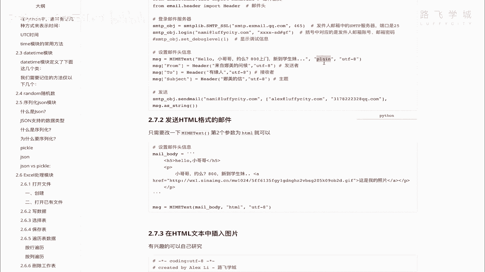
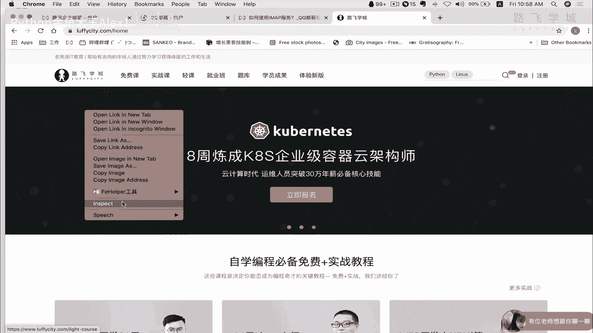
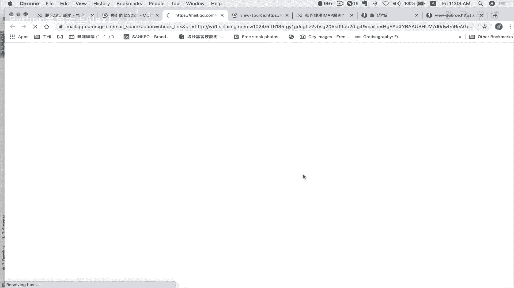
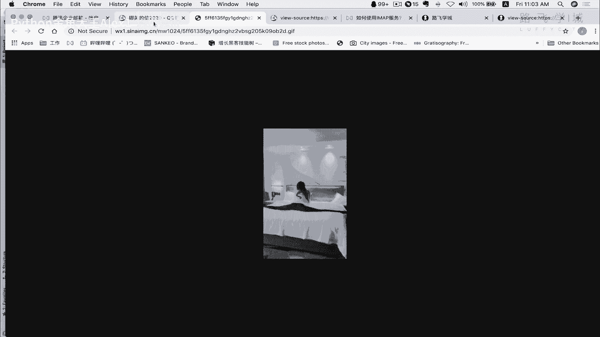
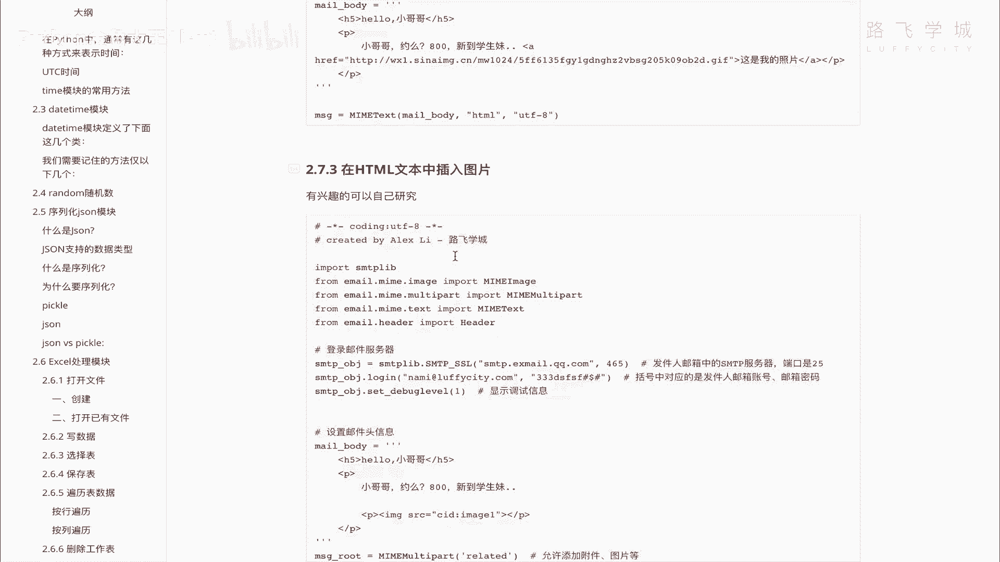

# Python邮件自动化：P80：13 发送HTML格式的邮件 📧

在本节课中，我们将学习如何使用Python发送HTML格式的邮件，并了解如何在邮件中嵌入图片。这将使你的邮件内容更加丰富和美观。

上一节我们介绍了如何发送纯文本邮件，本节中我们来看看如何发送格式更丰富的HTML邮件。



## 概述：从纯文本到HTML



之前我们发送的是纯文本邮件，参数为 `plain`。要发送HTML格式的邮件，方法非常简单，只需将邮件内容类型从 `plain` 改为 `html` 即可。邮件正文的内容可以直接使用HTML代码来编写。

## 核心步骤：修改邮件内容类型

以下是发送HTML邮件的核心代码修改部分：

```python
# 将原先的纯文本类型 'plain' 改为 'html'
msg.attach(MIMEText(html_body, 'html'))
```

只需将 `MIMEText` 函数的第二个参数从 `'plain'` 改为 `'html'`，邮件客户端就会将正文内容解析为HTML格式。

## HTML邮件内容示例

以下是邮件正文中可以使用的HTML代码示例：

```html
<h5>Hello，小哥哥</h5>
<p>注意了，HTML格式通过标签来定义样式。</p>
<p>这是一个<a href="https://example.com">超链接</a>示例。</p>
```

*   **`<h5>`标签**：定义标题，数字代表标题级别，类似于Word中的标题样式。
*   **`<p>`标签**：定义段落。
*   **`<a>`标签**：定义超链接。`href`属性指定链接地址，标签内的文字是显示内容。

HTML代码的结构特点是：由尖括号`<>`包裹的标签组成，通常有开始标签（如`<p>`）和对应的结束标签（如`</p>`），标签之间的内容会应用该标签定义的样式。

## 在邮件中嵌入图片

除了文字和链接，还可以在HTML邮件中直接嵌入图片。

以下是实现此功能的关键思路：



1.  需要使用 `MIMEImage` 类来读取并附加图片文件。
2.  在HTML正文中，通过 `` 标签引用图片，并使用 `cid:` 格式指向附加的图片。



由于代码稍长，这里不展开详细演示，但原理是清晰的：将图片作为邮件的一个部分（附件）附加，然后在HTML中引用它。

## 注意事项

*   某些邮件服务商或客户端可能会将包含HTML或链接的邮件标记为**垃圾邮件**。发送后请检查垃圾邮件箱。
*   编写HTML时需确保标签正确闭合，否则可能导致显示错乱。



本节课中我们一起学习了如何利用Python发送HTML格式的邮件。关键操作是将 `MIMEText` 的内容类型参数改为 `'html'`，并在邮件正文中直接编写HTML代码。我们还简要了解了在邮件中嵌入图片的原理。通过这种方式，你可以创建出样式丰富、包含链接甚至图片的专业邮件。