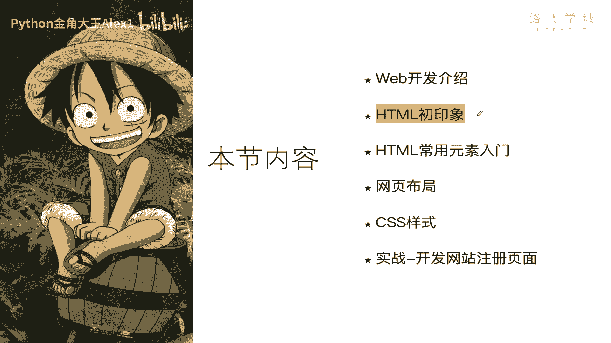
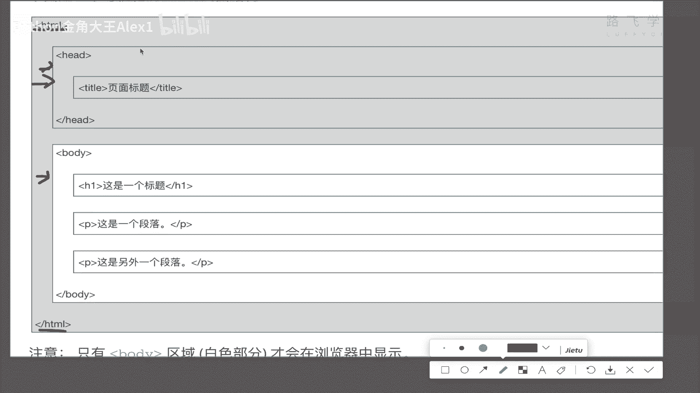
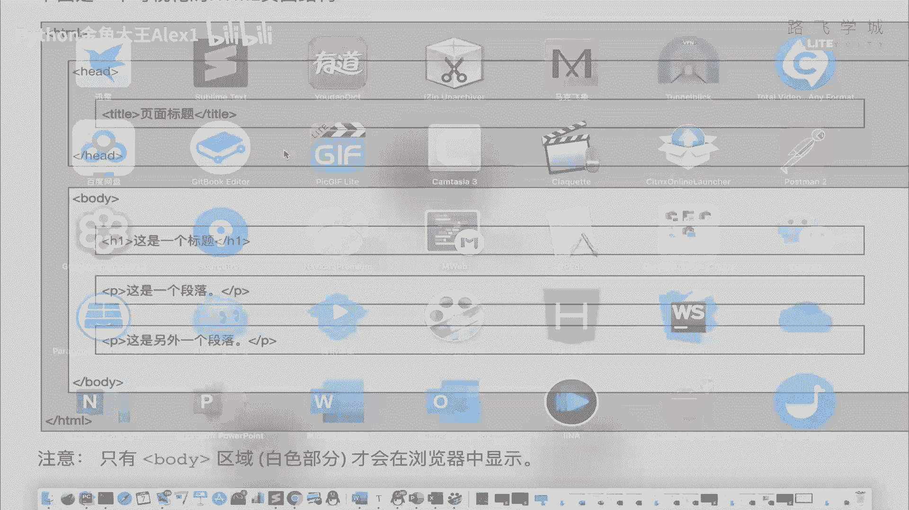
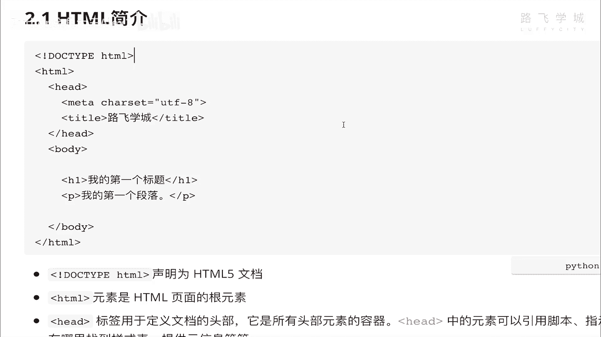
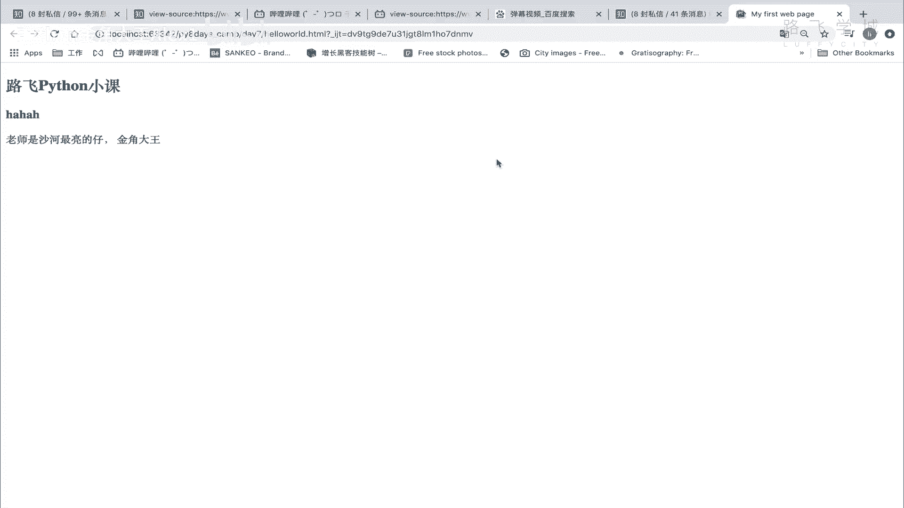
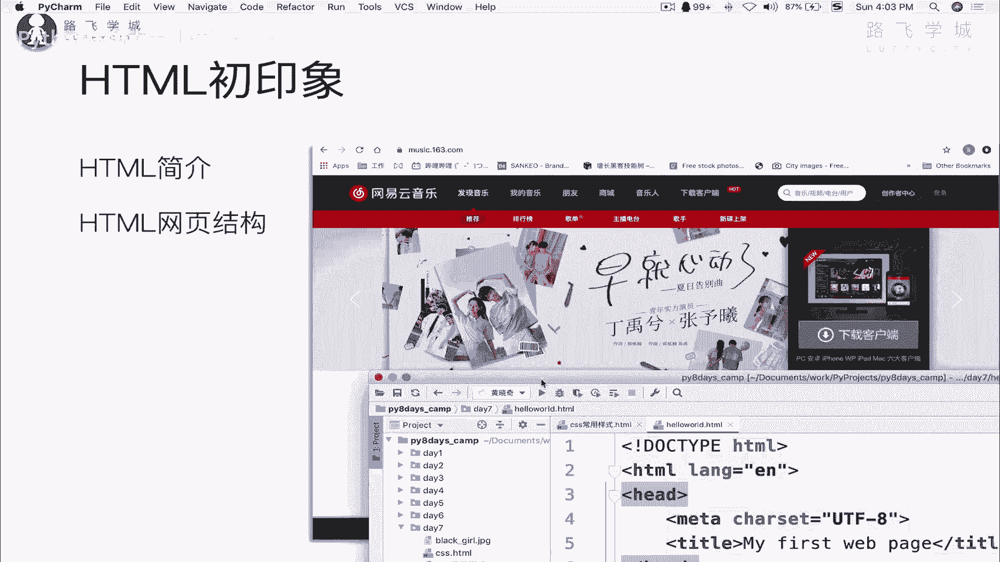
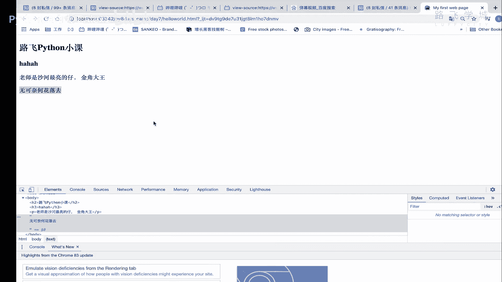

# Python数据分析与可视化：P84：02 HTML网页结构初印象




## 概述
在本节课中，我们将要学习网页开发的基础——HTML。我们将了解HTML是什么，它不是什么，并亲手创建一个简单的HTML页面，理解其基本结构。

## 什么是HTML？
HTML是用来描述网页的一种语言。但它不是一种编程语言，而是一种**标记语言**。

上一节我们介绍了课程背景，本节中我们来看看HTML的核心概念。编程语言（如Python）包含数据结构、流程控制、函数等逻辑结构。而HTML没有这些，它不能定义数据类型，也没有`for`循环或`if`判断。它只是一种用于标记文本的工具，例如，告诉浏览器某段文本是标题、段落还是加粗内容。

HTML通过使用**标记标签**来描述网页。这些标签通常成对出现，包裹着文本内容。例如，`<h1>这是一个标题</h1>` 就是一个标签，它标记了其中的文本“这是一个标题”为一级标题。





一个HTML文档也被称为一个**Web页面**。

## HTML文档的基本结构
一个标准的HTML文档具有固定的结构。理解这个结构是编写网页的第一步。

以下是HTML文档的基本骨架：
```html
<!DOCTYPE html>
<html>
    <head>
        <!-- 头部信息，如标题、字符编码等 -->
    </head>
    <body>
        <!-- 页面主体内容，所有可见内容都放在这里 -->
    </body>
</html>
```

### 结构详解
现在，我们来详细看看这个结构的每个部分。

*   **`<!DOCTYPE html>`**：这是HTML5的文档类型声明，告诉浏览器使用HTML5标准来解析页面。
*   **`<html>`**：这是整个HTML文档的根元素，所有其他元素都包含在其中。
*   **`<head>`**：文档的头部，包含了页面的**元信息**。这部分内容不会直接显示在网页主体中。
*   **`<body>`**：文档的主体，包含了所有会在浏览器中显示的内容，如文本、图片、链接等。

### `<head>` 部分的作用
`<head>` 部分虽然不直接显示内容，但它对网页至关重要。它定义了页面的标题（显示在浏览器标签页上）、字符编码（如UTF-8），以及一些给搜索引擎看的关键词（用于SEO优化）。

例如，定义页面标题和字符编码：
```html
<head>
    <meta charset="UTF-8">
    <title>我的第一个网页</title>
</head>
```

## 动手创建第一个HTML页面
理解了基本结构后，让我们动手创建一个简单的HTML页面。

1.  在PyCharm中新建一个文件，选择文件类型为 **HTML File**，命名为 `hello_world.html`。
2.  编辑器会自动生成基础代码结构。
3.  我们在`<body>`标签内添加内容。




以下是完整的代码示例：
```html
<!DOCTYPE html>
<html lang="en">
<head>
    <meta charset="UTF-8">
    <title>我的第一个网页</title>
</head>
<body>
    <h2>路飞Python小课</h2>
    <p>老师是沙河最靓的仔——金角大王</p>
</body>
</html>
```

创建完成后，在PyCharm中右键点击文件，选择在浏览器中打开（如Google Chrome），即可看到你创建的第一个网页。





**重要提示**：所有希望在页面上显示的内容，都必须放在 `<body>` 标签内。如果直接将文本写在`<body>`外，虽然某些浏览器可能会显示，但这不符合HTML规范，也不是正确的做法。正确的做法是使用标签（如 `<p>`）来包裹内容。



## 总结
本节课中我们一起学习了HTML的基础知识。我们明确了HTML是一种**标记语言**而非编程语言，它通过**标签**来定义网页内容的结构和含义。我们掌握了一个标准HTML文档的基本结构，包括 `<!DOCTYPE html>` 声明、`<html>`根元素、包含元信息的`<head>`以及包含所有可见内容的`<body>`。最后，我们亲手创建并运行了第一个HTML页面，为后续的网页数据抓取与分析打下了基础。