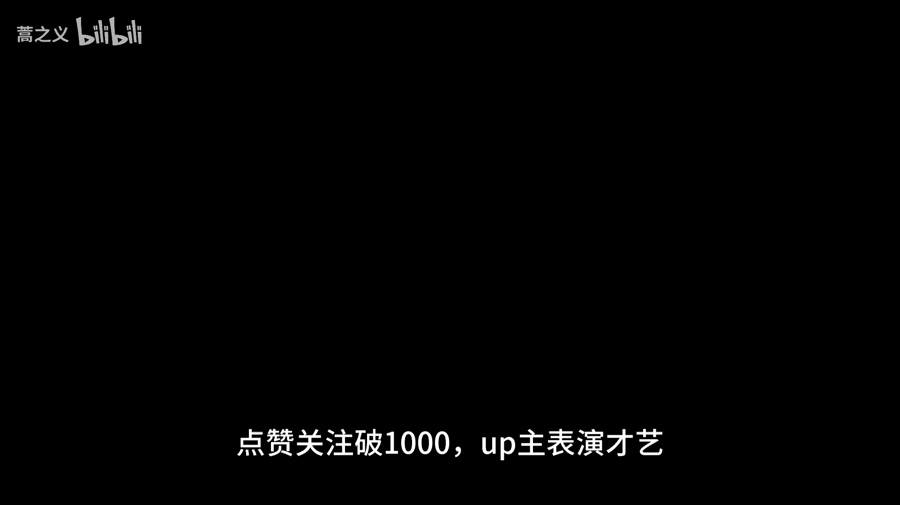
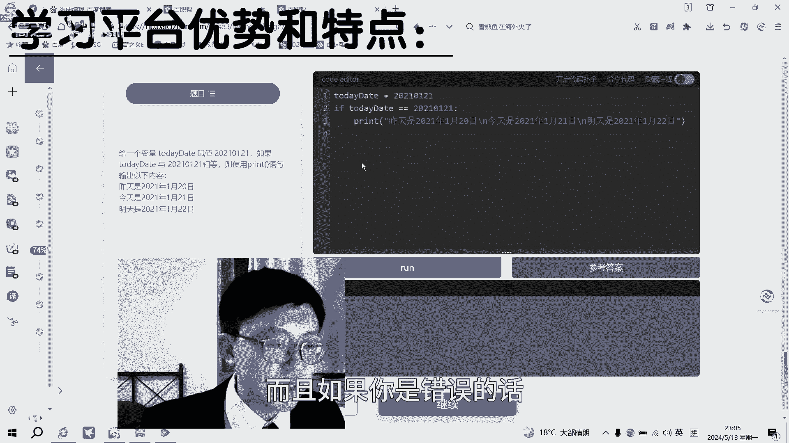
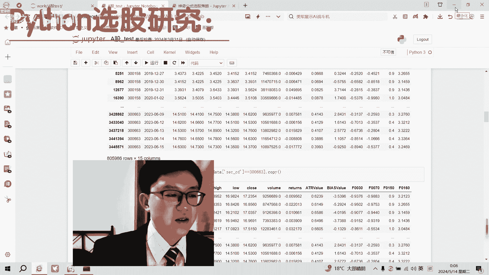
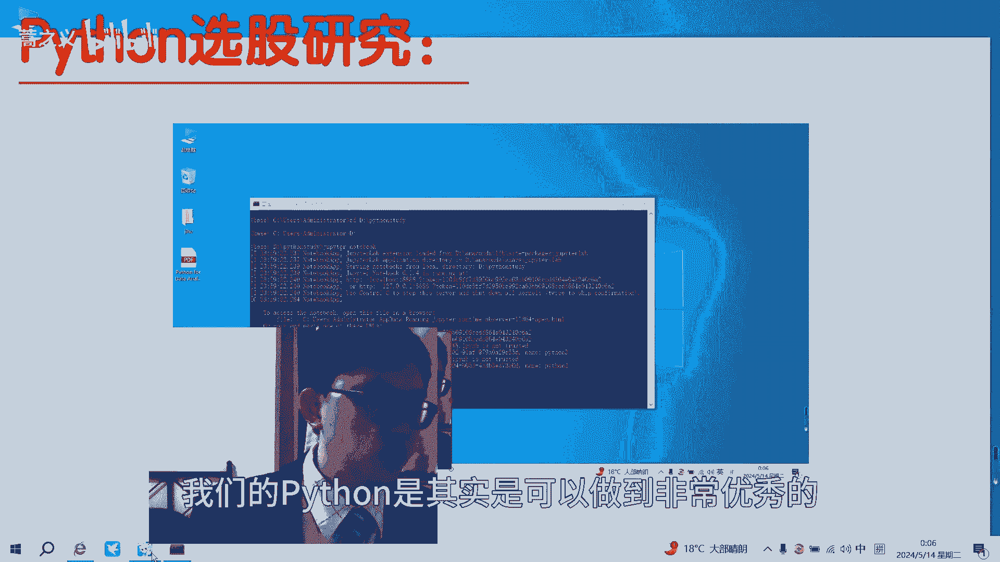

# Python量化金融入门：P1：从零基础到量化研究员 🚀



在本节课中，我们将跟随一位从传统金融转型为量化研究员的经历，了解如何通过自学编程进入量化金融领域。课程将涵盖学习路径、核心工具介绍，并通过一个简单的Python选股策略案例，展示编程在金融分析中的应用。

***

## 从传统金融到量化研究

我硕士阶段学习的是偏传统的金融。我能够找到量化研究员岗位，最重要的原因是在研究生期间自学了大量编程课程，并在机器学习、深度学习以及统计数据分析方面下了很多功夫。

当年自学Python和编程时，由于无人指导，走了很多弯路。我曾使用一本纯英文的教材学习用Python进行数据分析，但这本教材对初学者并不友好，学习过程非常痛苦。

***

## 高效的学习工具与路径

现在的情况则好得多。无论是初学者，还是希望从初级进阶到高级的同学，都有了优秀的学习资源。例如，“夜曲编程”课程就非常适合本科生、研究生或职场人士入门编程。



以下是该课程的主要特点：

*   **知识体系全面**：课程从最简单的数据和运算开始，逐步涵盖条件判断、数据结构、循环语句、函数和类，直到编程实践，构成了一套完整的学习体系。
*   **交互式学习环境**：课程内置了Python代码运行界面，可以实时操作。左侧是题目，中间是代码编译界面，右侧是输出结果和参考答案。
*   **智能提示与总结**：如果代码出错，系统会给出错误提示。每章学完后，会提供思维导图帮助总结和回顾知识点，节省了自行归纳的时间。

***

## Python量化实践：简易选股策略

上一节我们介绍了高效的学习路径，本节中我们来看看如何用Python实现一个基础的量化选股策略，即“神奇公式”选股法。

神奇公式由美国的乔尔·格林布拉特提出，在其20多年的实践中，获得了年化约40%的回报率。在这个案例演示中，我将过程简化，主要针对两个指标：**市盈率**和**资本回报率**。

策略的核心步骤如下：
1.  对这两个指标分别进行排序。
2.  将排序序号相加，得到综合排名。
3.  通常，我们会剔除排名后10%的股票，以排除垃圾股或泡沫股的影响。
4.  最后，选取综合排名前30的股票作为投资组合。

以下是该策略的核心代码演示：

```python
# 1. 导入必要的库并进行基础设置
import pandas as pd
import matplotlib.pyplot as plt
# 设置显示格式，例如显示30行、设置小数位、支持中文显示等
pd.set_option('display.max_rows', 30)
# ... 其他设置

# 2. 导入股票数据（示例，数据需预先准备好）
df = pd.read_csv('stock_data.csv')
# 数据包含3513条记录，23列，如日期、股票代码、名称、市盈率(PE)、资本回报率(ROC)等。

# 3. 数据筛选：确保用于排序的指标为正数（例如，前一年、前两年的数据为正）
df_filtered = df[(df['PE'] > 0) & (df['ROC'] > 0)]

# 4. 对市盈率(PE)进行升序排序（越低越好），使用平均排名法处理相同值
df_filtered['rank_PE'] = df_filtered['PE'].rank(method='average')

# 5. 对资本回报率(ROC)进行降序排序（越高越好）
df_filtered['rank_ROC'] = df_filtered['ROC'].rank(ascending=False, method='average')

# 6. 计算综合排名
df_filtered['composite_rank'] = df_filtered['rank_PE'] + df_filtered['rank_ROC']

# 7. 按综合排名升序排列，并选取前30名
top_30_stocks = df_filtered.sort_values(by='composite_rank').head(30)

# 8. 输出选中的股票代码（示例为Wind代码）
selected_codes = top_30_stocks['wind_code'].tolist()
print(selected_codes)
```

这只是一个非常基础且简化的演示策略，实际应用中需要更复杂的处理和风控。通过回测可以验证，即使这样的简单策略，其历史收益率也可能显著跑赢市场基准（如上证指数）。

更复杂的模型，例如使用隐马尔可夫模型对股票每日涨跌信号进行预测，需要更深入的知识，未来有机会再探讨。

***



## 总结



本节课中我们一起学习了从传统金融转型量化研究的路径。关键在于自学编程与数据分析技能。我们介绍了一个结构化的学习平台，并通过一个具体的Python案例——“神奇公式”选股策略，演示了如何将编程知识应用于金融分析。量化研究是一个将金融理论、数学统计和计算机编程相结合的领域，掌握Python是踏入这个领域的重要第一步。