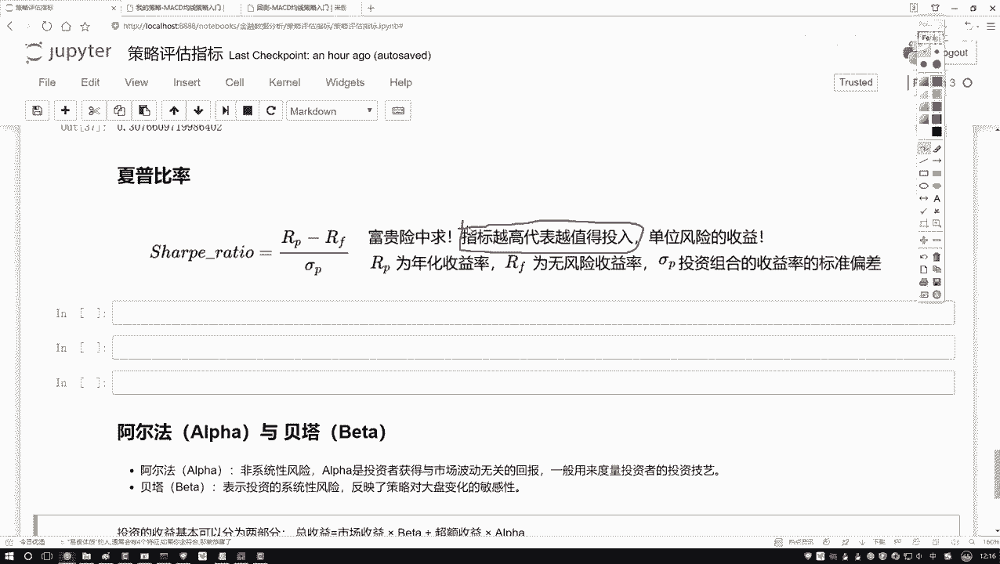
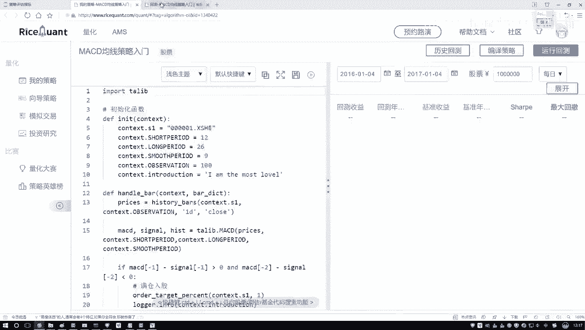
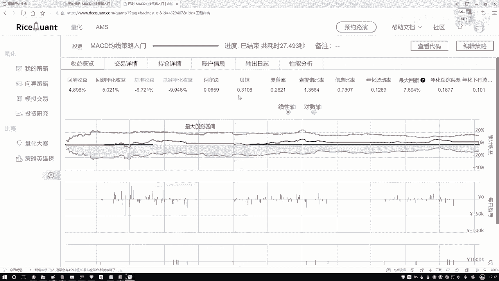
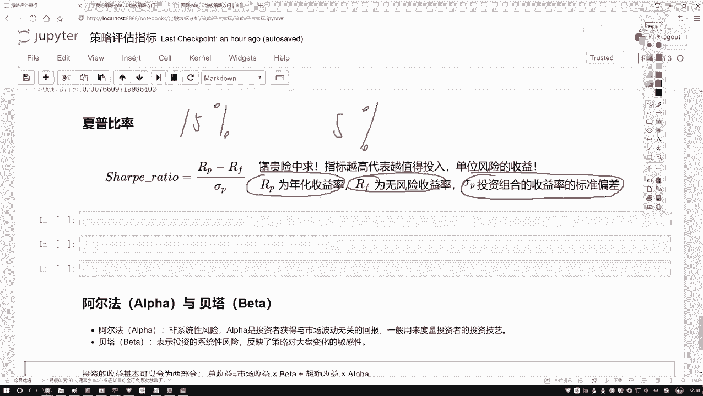
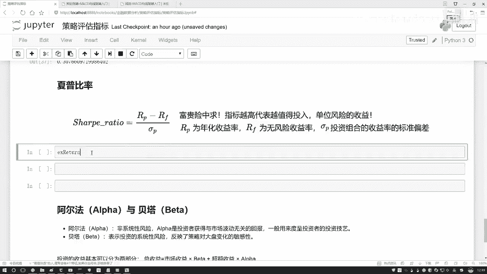
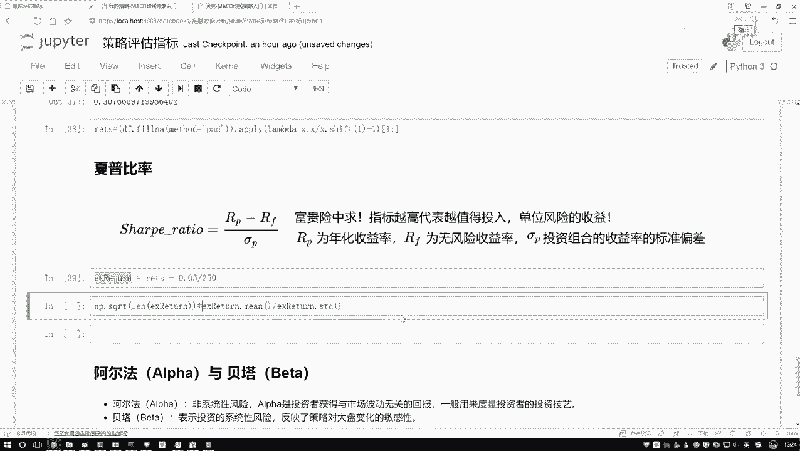
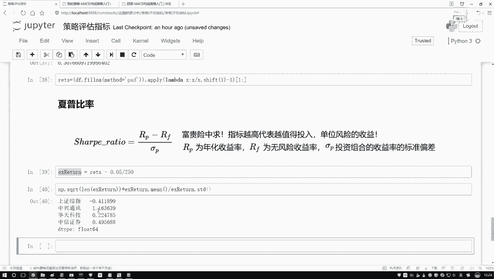
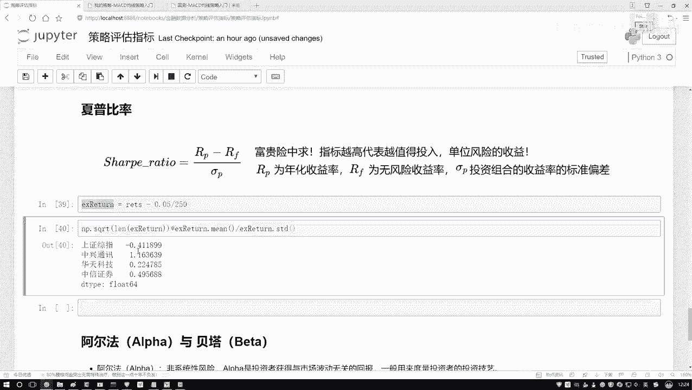
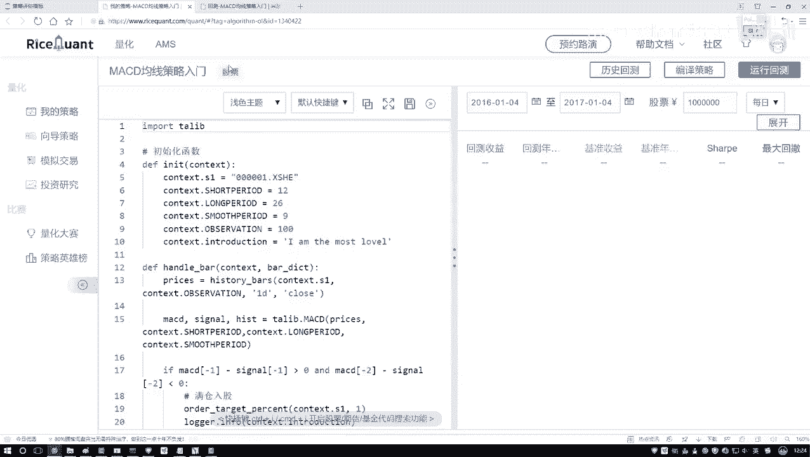
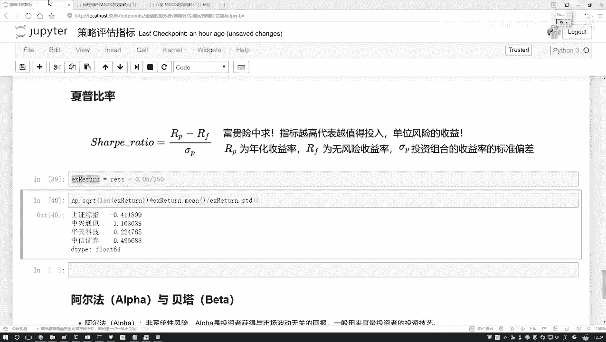

# Python金融量化分析：P19：夏普比率的作用 📈

在本节课中，我们将要学习一个在金融投资中至关重要的风险调整后收益指标——夏普比率。我们将理解它的核心概念、计算公式，并通过Python代码演示如何计算和比较不同股票的夏普比率，从而为投资决策提供量化依据。

## 夏普比率的定义与意义

上一节我们介绍了投资回报率，本节中我们来看看如何衡量风险与收益的关系。夏普比率描述的是，在承担单位风险的情况下，所能获得的超额收益是多少。

为了便于理解，可以举一个生活中的例子。例如，一份在叙利亚的雇佣兵工作，日薪高达数万。其高薪的原因在于工作风险极大。夏普比率就是用来量化这种“风险与回报是否值得”的指标。



**核心公式**：
`夏普比率 = (投资组合收益率 - 无风险收益率) / 投资组合收益率的标准差`



指标越高，意味着在承担单位风险时，获得的超额收益也越高。在选股时，如果仅从夏普比率这一指标出发，我们倾向于选择夏普比率更高的股票，因为它代表了更高的风险调整后收益。



## 夏普比率的计算原理

理解了夏普比率的意义后，我们来具体看看它的计算逻辑。计算过程涉及两个核心部分：超额收益和风险度量。

首先，我们需要计算超额收益。这指的是投资组合的收益率超过“无风险收益率”的部分。无风险收益率通常可以用国债收益率或银行固定存款利率来近似。例如，一个保本理财产品的年化收益率为5%，而一个有一定风险的投资组合年化收益率为15%，那么它们的差值10%就是超额收益。

其次，我们需要度量风险。在夏普比率中，风险用投资组合收益率的标准差来表示。标准差衡量了收益率的波动性，波动越大，风险越高。

因此，夏普比率就是将超额收益除以其波动风险（标准差），最终得出“每承担一单位风险，能获得多少超额回报”的数值。

## 使用Python计算夏普比率

理论部分已经介绍完毕，现在让我们动手，用Python代码实际计算几只股票的夏普比率。我们将遵循以下步骤：

1.  获取股票的历史收益率数据。
2.  处理数据中的缺失值。
3.  设定无风险收益率（本例假设为年化5%）。
4.  应用夏普比率公式进行计算。



以下是计算夏普比率的关键代码步骤：

```python
import numpy as np
import pandas as pd



# 假设 `returns` 是一个Pandas Series，包含了投资组合的日收益率序列
# 步骤1: 计算日超额收益率（假设年化无风险收益率为5%）
risk_free_rate = 0.05
excess_daily_returns = returns - risk_free_rate / 250  # 将年化利率转为日利率

# 步骤2: 计算夏普比率（年化）
sharpe_ratio = np.sqrt(250) * (excess_daily_returns.mean() / excess_daily_returns.std())

print(f"夏普比率（年化）为: {sharpe_ratio}")
```

**代码解释**：
*   `excess_daily_returns.mean()` 计算了日超额收益率的平均值。
*   `excess_daily_returns.std()` 计算了日超额收益率的标准差，代表日风险。
*   `np.sqrt(250)` 用于将日夏普比率年化（假设一年有250个交易日）。
*   最终得到的 `sharpe_ratio` 就是一个年化的夏普比率值。

## 结果分析与应用



运行上述计算后，我们可以得到一系列股票的夏普比率。例如，可能得到如下结果（数值为示例）：
*   股票A夏普比率：1.2
*   股票B夏普比率：0.8
*   股票C夏普比率：-0.3



结果分析遵循一个简单原则：**夏普比率越高越好**。正夏普比率表示承担风险获得了正回报，数值越大效率越高。负夏普比率则表示承担风险反而带来了损失，通常不予考虑。



在本示例中，股票A的夏普比率最高，意味着在承担相同风险的情况下，投资股票A能获得最高的超额收益。因此，仅从夏普比率的角度看，股票A是最优选择。



## 总结



本节课中我们一起学习了夏普比率。我们首先了解了它作为“风险调整后收益”指标的核心意义——衡量单位风险所带来的超额回报。接着，我们拆解了其计算公式，明确了无风险收益率和标准差在其中的作用。最后，我们通过Python代码实战，完整演示了从数据处理到结果计算与分析的全过程。掌握夏普比率，能帮助我们在量化投资中更科学地评估和比较不同资产或策略的优劣。