# Python金融量化分析：2：fbprophet股价预测任务概述 📈


在本节课中，我们将学习股价分析与预测的基本概念，并重点介绍一个由Facebook开源的时间序列预测工具——fbprophet。我们将了解时间序列的构成要素、fbprophet框架的核心优势及其基本使用方法。

## 什么是股价分析与预测？🤔

股价分析与预测，本质上是处理一个随时间变化的价格序列。这个序列包含日期和对应的价格数据。因此，股价预测是一个典型的时间序列预测任务。

上一节我们介绍了时间序列预测的概念，本节中我们来看看一个更便捷的工具。

## 为什么选择fbprophet？✨

在时间序列预测领域，虽然存在如ARIMA等经典模型，但其使用和调参相对复杂。fbprophet是一个由Facebook开源的工具，其最大亮点在于**使用极其方便**。用户只需调整少量参数，即可快速构建预测模型。

该框架具备以下主要特征：
*   **灵活的预测频率**：支持按小时、天、周、月等进行预测。
*   **考虑多种成分**：能自动处理趋势、周期性（如年、季节）、节假日效应。
*   **鲁棒性处理**：能够自动处理异常值和缺失值。
*   **趋势转折点检测**：模型可以识别历史数据中的趋势突变点（changepoints），这有助于更好地拟合训练数据。但需注意，过多的转折点可能导致对测试数据的**过拟合**。


fbprophet的算法核心结合了**自回归**、**移动平均**和**整合**模型的思想，与ARIMA模型类似，但其封装更完善，接口更友好。


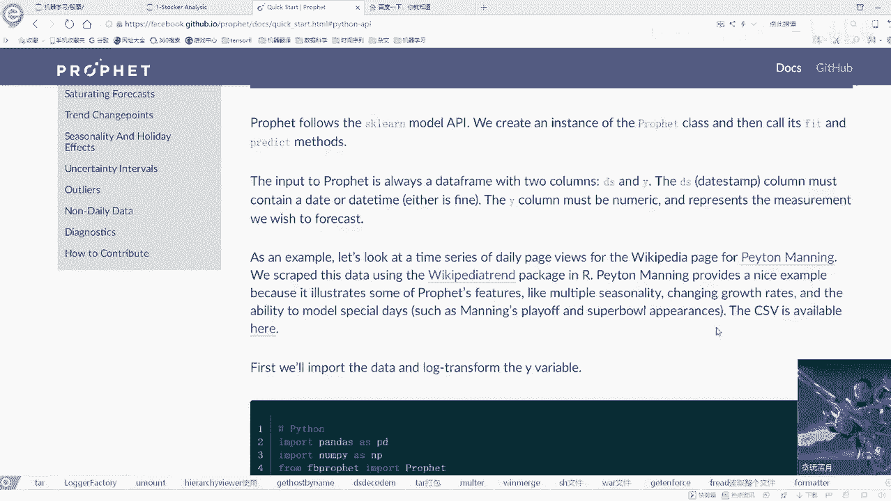

## 如何开始使用fbprophet？🚀


fbprophet提供了Python和R两种接口。对于Python用户，可以访问其官方文档获取详细教程。

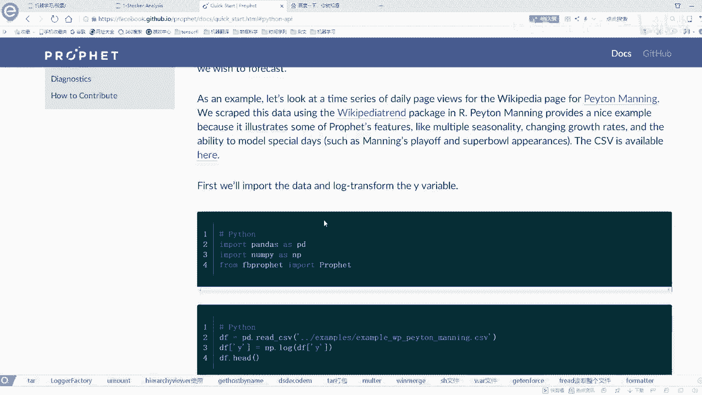

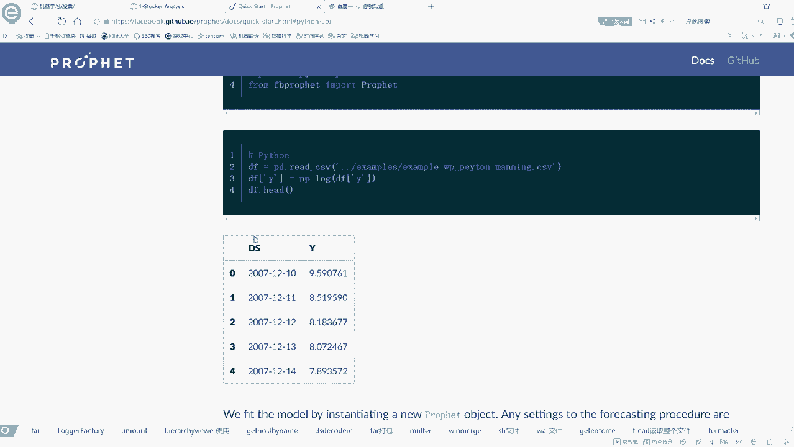

以下是使用fbprophet进行预测的一个基本流程：


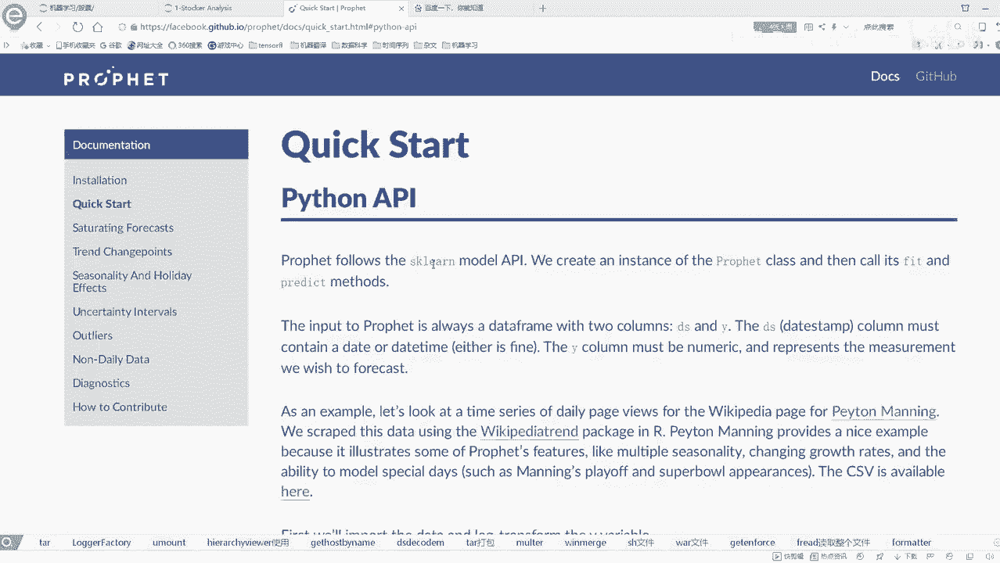

1.  **准备数据**：数据需要包含两列：`ds`（日期时间列）和`y`（要预测的指标列）。这是模型要求的**标准输入格式**。
    ```python
    # 示例数据结构
    df = pd.DataFrame({
        'ds': pd.date_range(start='2023-01-01', periods=100, freq='D'),
        'y': np.random.randn(100).cumsum()
    })
    ```


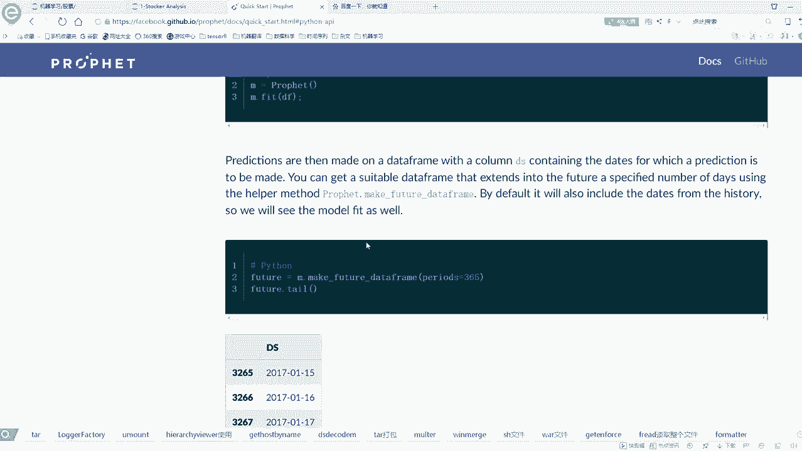

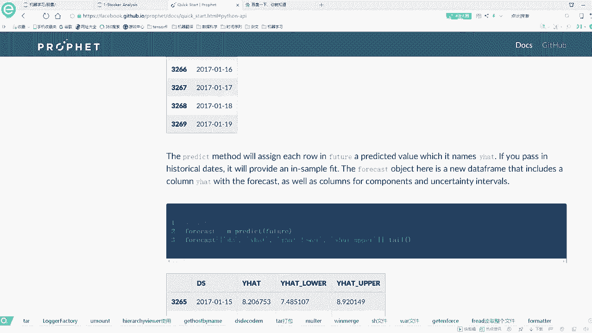

2.  **构建与训练模型**：其API设计与scikit-learn相似，通过实例化`Prophet`类并调用`fit`方法进行训练。
    ```python
    from prophet import Prophet
    model = Prophet()  # 可以在此处添加各种参数
    model.fit(df)
    ```

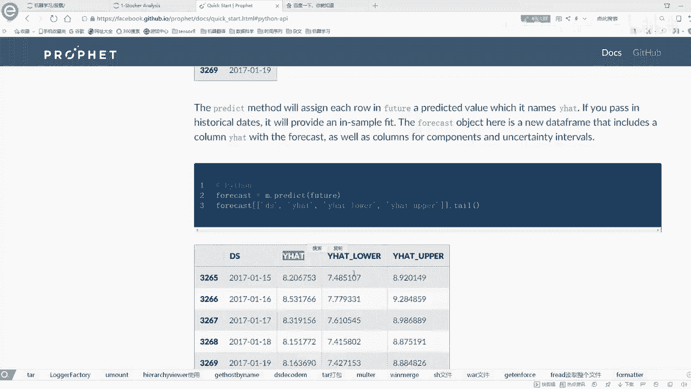

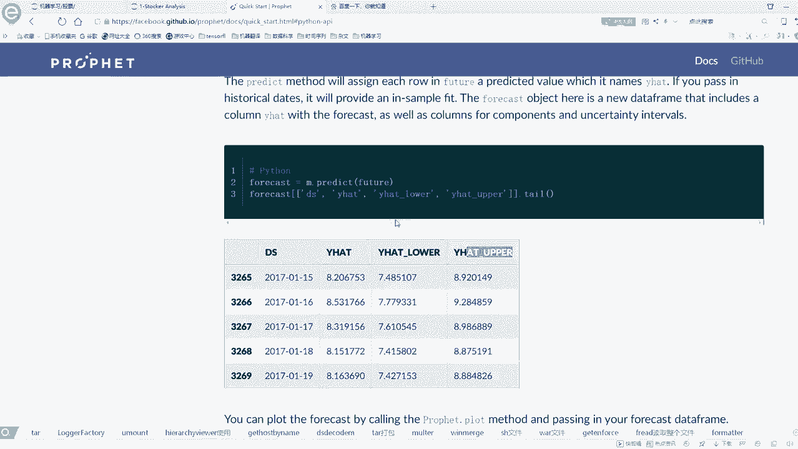

3.  **生成未来时间框并预测**：使用`make_future_dataframe`函数创建待预测的未来时间段，然后进行预测。
    ```python
    future = model.make_future_dataframe(periods=30)  # 预测未来30天
    forecast = model.predict(future)
    ```

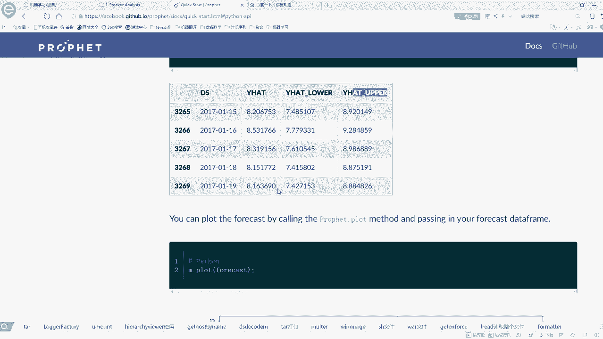

4.  **查看结果**：预测结果`forecast`是一个DataFrame，其中包含预测值`yhat`以及预测区间的上下限`yhat_lower`和`yhat_upper`。


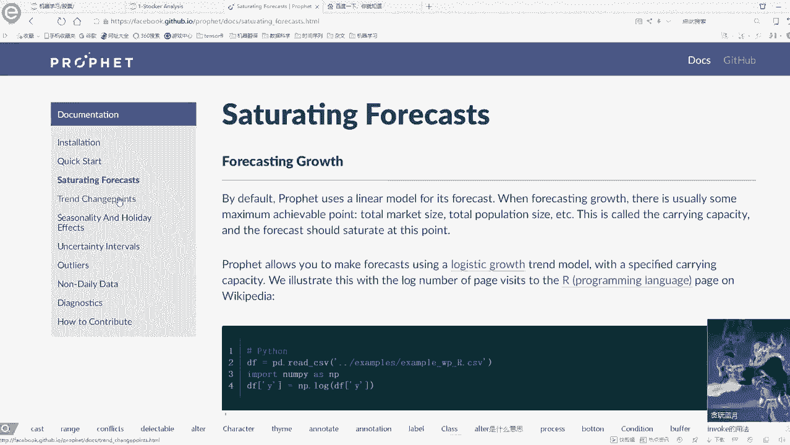

5.  **可视化**：fbprophet内置了便捷的可视化功能，可以轻松绘制预测趋势、成分分解等图表。
    ```python
    fig1 = model.plot(forecast)
    fig2 = model.plot_components(forecast)
    ```

## 实战任务与环境准备 💻

本节课的实战任务是进行股价分析与预测。我们需要获取股票数据并使用fbprophet进行建模。

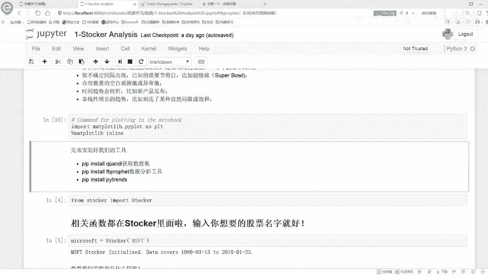


在运行代码前，需要安装必要的工具包并确保网络连接正常。

以下是需要安装的核心库：
*   **数据获取工具**：用于获取股票历史数据。
*   **fbprophet**：时间序列预测框架。
*   **matplotlib**：用于结果可视化。

安装命令通常为：
```bash
pip install [package_name]
```
如果通过`pip`安装失败，可以尝试在Python的第三方包网站（如PyPI）搜索对应库的`.whl`文件进行安装，或下载源码后使用`python setup.py install`命令安装。

## 代码结构与演示流程 📝

课程提供的代码已将核心功能封装成类，主要包括数据获取、模型构建、训练预测和可视化等部分。

演示将分为两步：
1.  在Jupyter Notebook中展示完整的端到端运行流程和结果。
2.  在集成开发环境（如PyCharm/VSCode）中，通过调试模式深入代码内部，逐步解析每个函数的具体实现和工作原理。


本节课中我们一起学习了时间序列预测的基本概念，认识了fbprophet这一强大而便捷的预测工具，并了解了其核心优势、基本使用流程以及实战前的环境准备工作。接下来，我们将进入具体的代码实践环节。