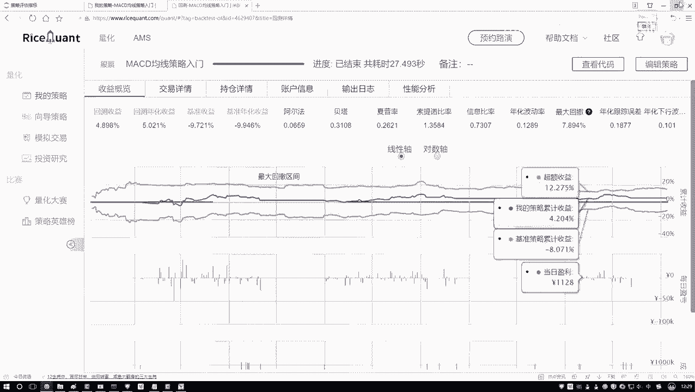
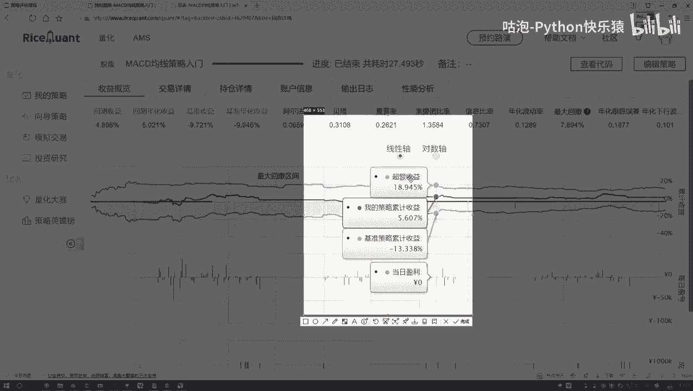
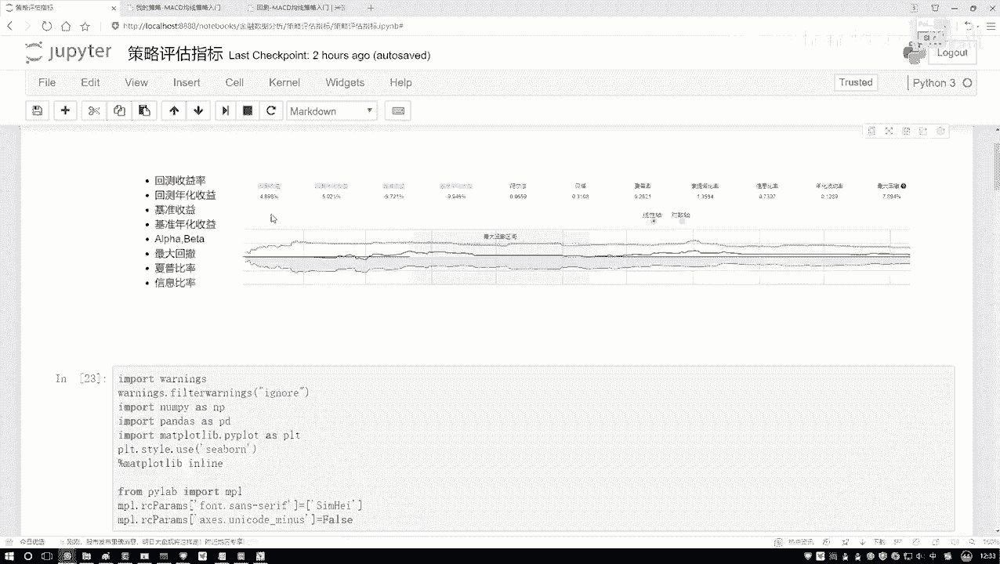

# Python金融量化分析：P20：阿尔法与贝塔概述 📊

在本节课中，我们将要学习投资策略评估中的两个核心概念：阿尔法（α）和贝塔（β）。理解这两个指标，能帮助我们区分投资收益的来源，并明确量化策略的优化方向。

## 收益的两种来源

上一节我们介绍了策略回测与评估的基本框架，本节中我们来看看如何更细致地分析收益的构成。

投资所获得的收益，通常可以分解为两个部分：
*   一部分与整体市场环境相关。当市场整体向好时，大部分投资都能获得收益。
*   另一部分则与市场波动无关，主要来源于投资者独特的策略、敏锐的观察或精准的操作。

阿尔法和贝塔就是分别用来衡量这两部分收益的指标。

## 阿尔法（α）与贝塔（β）的定义

以下是这两个核心指标的具体含义：

*   **贝塔（β）**：衡量策略收益与市场收益的关联程度，即策略对大盘波动的敏感性。它代表了**系统性风险**带来的收益。一个贝塔值为1的策略，其波动与市场同步；大于1则波动更剧烈；小于1则波动更平缓。
*   **阿尔法（α）**：衡量策略超越市场基准的超额收益。它代表了与市场波动无关的、由策略本身带来的**非系统性风险**收益。阿尔法是量化策略追求的核心目标。

简单来说：
*   **市场收益** 与 **贝塔** 挂钩。
*   **超额收益** 与 **阿尔法** 挂钩。

## 通过实例理解收益分解

为了更好地理解，我们来看一个策略回测结果的示意图。

在图中，我们可以识别出三条关键的曲线：
1.  **基准收益**：代表市场大环境（如沪深300指数）的整体走势。这部分收益是“随波逐流”获得的。
2.  **策略收益**：代表我们运用特定策略（如选股、择时）所获得的总收益。
3.  **超额收益**：即 **策略收益** 减去 **基准收益** 的部分。这部分收益完全归功于我们策略的有效性。

因此，总收益可以表述为：
**总收益 = 市场收益（贝塔收益） + 超额收益（阿尔法收益）**

## 阿尔法与贝塔的计算逻辑

那么，阿尔法和贝塔具体如何计算呢？在金融模型中，它们常常通过一个线性回归方程来求解：

`策略收益率 = α + β * 市场收益率 + ε`

其中：
*   `α` 就是阿尔法值，代表回归线的截距。
*   `β` 就是贝塔值，代表回归线的斜率。
*   `ε` 是误差项。

通过历史数据拟合这个方程，即可解出α和β的估计值。这是一种常见的计算方法，在后续的因子分析中我们会深入探讨。

## 量化策略的关注重点

理解收益来源后，我们的目标就非常清晰了。市场整体走势（贝塔部分）是个人投资者难以控制和预测的。因此，量化策略的核心关注点在于如何获取稳定且可持续的**阿尔法收益**，即超越市场的超额收益。

我们的所有努力——数据挖掘、因子研究、模型优化——最终都是为了提升策略的阿尔法。

## 其他常见评估指标简介

除了阿尔法和贝塔，策略评估中还有其他重要指标。以下是几个关键指标的简要说明，初学者了解其含义即可，无需死记公式，实践中通常有现成的工具包进行计算。

*   **最大回撤**：衡量策略在历史上从任一峰值点到后续最低点的最大亏损幅度，是评估策略风险控制能力的关键指标。
*   **夏普比率**：衡量每承受一单位总风险，能产生多少超额回报。比率越高，说明风险调整后的收益越好。
*   **基准收益**：如前所述，即参照市场指数（如沪深300）的收益，作为衡量策略表现的基准线。

## 总结

本节课中我们一起学习了投资策略评估的核心概念——阿尔法（α）与贝塔（β）。我们明确了总收益可分解为跟随市场波动的贝塔收益和由策略独创性带来的阿尔法收益。作为量化交易者，我们的核心目标是持续挖掘并提升策略的阿尔法。同时，我们也简要了解了最大回撤、夏普比率等其他评估指标，为后续全面的策略分析打下了基础。