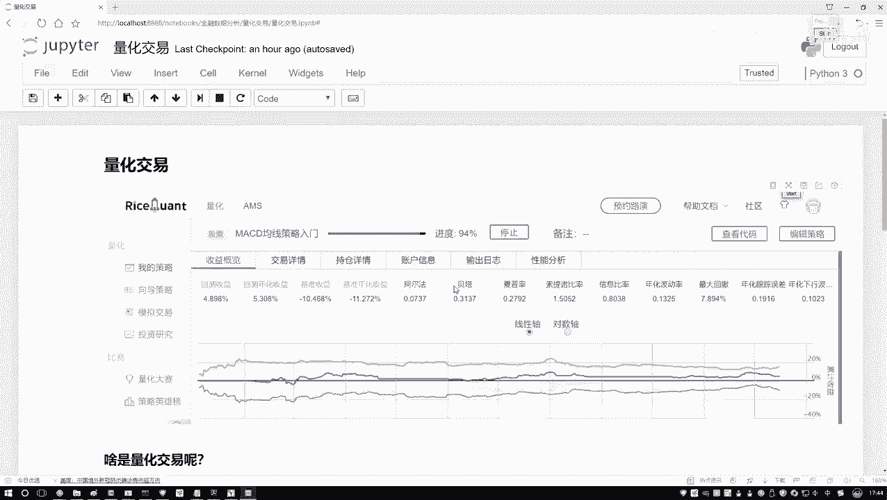
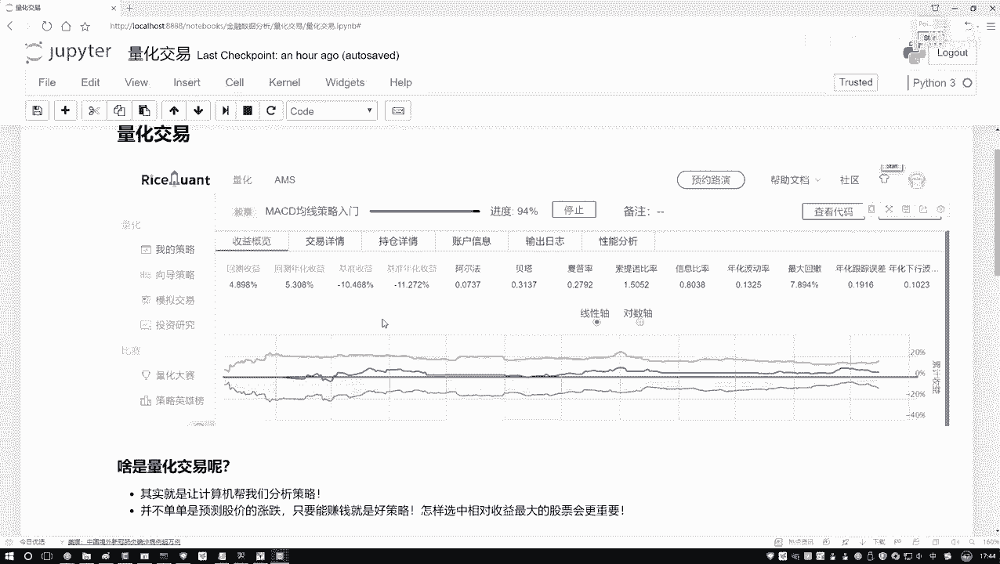
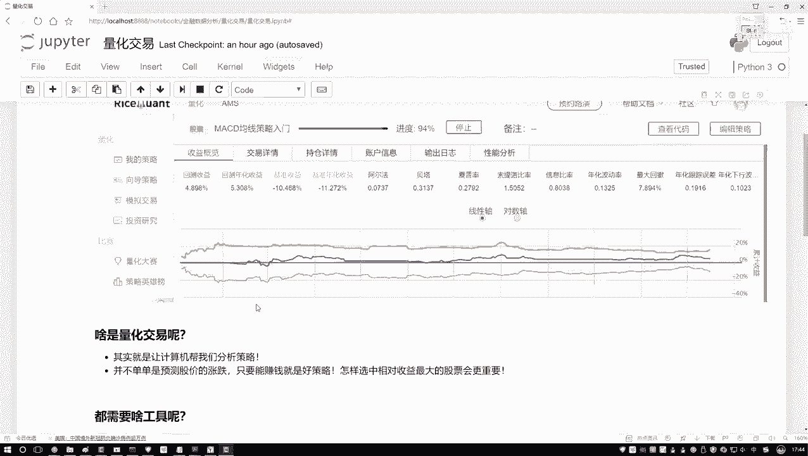
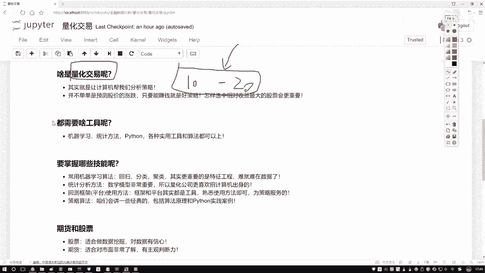
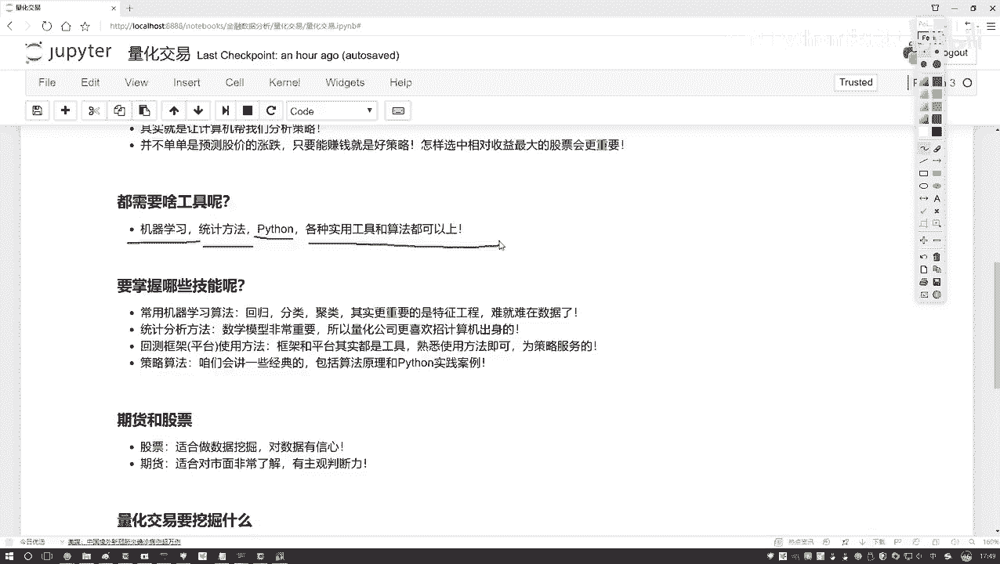

# Python金融量化分析：P21：量化交易概述 📈

在本节课中，我们将要学习量化交易的核心概念、它与传统交易的区别，以及入门量化交易所需要掌握的核心技能。

## 什么是量化交易？🤔

上一节我们介绍了课程背景，本节中我们来看看量化交易的本质。

传统交易，例如炒股，通常由交易者本人完成。交易者需要长时间守在电脑前，紧盯市场变化和各种指标。然而，这种方式存在明显局限：
1.  **主观性**：人类的判断容易受到情绪和主观偏见影响，导致决策不准确。
2.  **能力有限**：个人精力、时间和计算能力有限，难以同时分析大量股票或跨越长时间段（如十年）的历史数据。

那么，量化交易是什么意思呢？它依然以**赚钱**为最终目标，但将制定具体交易策略的任务交给了计算机。其核心思想是：基于历史数据，通过计算机程序来设计和验证交易策略，以追求收益最大化。

具体来说，量化交易的过程是：获取股票等金融产品的历史数据（这些数据是固定不变的），然后设计各种交易方法或策略，并将这些策略应用到历史数据中进行模拟测试。这个过程常被称为**回测**。回测的目的是分析历史数据中的价值信息，评估策略在过去的表现（例如是否能赚钱、收益如何），从而筛选或优化出更有效的策略。

**量化交易**可以定义为：让计算机针对历史金融数据，执行数据挖掘任务，以发现能够带来盈利的交易策略。

## 量化交易的核心技能 🛠️

理解了量化交易的目标后，本节我们来看看实现它需要哪些核心技能。量化交易是一个交叉学科领域，需要综合运用多种知识。

以下是入门量化交易需要关注的核心技能与工具：

*   **编程能力（Python）**：这是实践的基础。我们需要通过编程来处理数据、实现策略和进行回测。Python因其丰富的库和易用性，成为量化领域的主流语言。
*   **统计方法**：用于从数据中提取信息、计算各种指标（如均值、标准差）并进行数据分析。理解数据的基本统计特性至关重要。
*   **机器学习算法**：用于基于历史数据预测未来价格走势、识别模式或优化策略。这是实现“智能”交易的关键。

关于金融专业知识，在入门阶段，我们只需要了解基本概念即可，例如能理解常见的金融术语和市场规则。学习的重点应放在**如何处理、操纵数据并从数据中挖掘价值**上。本质上，量化交易可以看作是数据挖掘在金融领域的一个热门应用。

## 总结 📝

本节课中我们一起学习了量化交易的核心内容。我们了解到，量化交易是利用计算机程序，基于历史数据来系统化地设计、测试和执行交易策略，以克服人类交易者的主观性和能力局限，并追求稳定收益。实现量化交易的关键在于掌握**编程（特别是Python）、统计学和机器学习**等数据挖掘相关技能，而金融专业知识在初期仅需基本了解。从下节课开始，我们将逐步学习如何运用这些技能来构建自己的量化交易策略。