# Python金融量化分析：P22：量化交易所需技能分析 📊

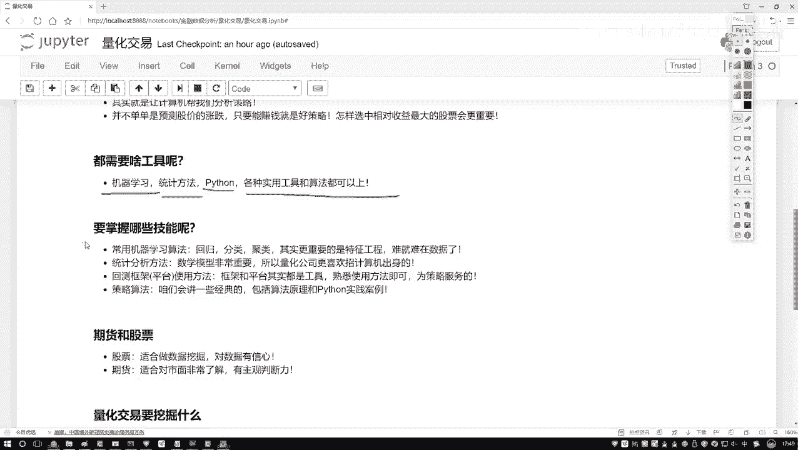

在本节课中，我们将要学习量化交易领域所需的核心技能。我们将从数据、数学、工具和策略等多个维度进行分析，帮助你理解如何将Python编程与金融分析相结合，为后续的实战操作打下基础。

## 概述

量化交易是一个综合性的领域，它结合了数据科学、数学建模和金融知识。要在这个领域取得成功，需要掌握一系列特定的技能。本节将详细拆解这些技能，并解释它们在量化交易流程中的作用。

## 核心技能详解

上一节我们介绍了量化交易的基本概念，本节中我们来看看具体需要掌握哪些技能。

### 1. 机器学习与特征工程

在量化交易中，机器学习算法是核心工具之一。常规的回归、分类、聚类算法是基础。然而，比算法更重要的是**特征工程**。

特征工程是指如何处理数据，以及如何从海量数据中提取最有价值的信息。在量化交易中，我们面对的数据非常庞大和复杂。例如，分析股票时，数据不仅包括收盘价、开盘价，还包括公司财务数据、各种指标数据、市场数据、财务报表数据以及股市走势数据等。

这些多层面的数据都可能对最终结果产生影响。如何设计算法，并将这些算法有效地融入数据中，就是特征工程要解决的问题。选择最有价值的数据是机器学习中最具挑战性的一环，其难度往往超过算法本身。

**核心公式/概念**：
*   **特征工程**：`有价值的信息 = 特征工程(原始数据)`
*   数据决定了模型性能的上限，而算法只是用来逼近这个上限的工具。

### 2. 统计学与数学知识

量化交易对数学和统计学知识有较高要求。无论是算法还是交易策略，本质上都是将数学公式应用到数据中。

以下是需要重点掌握的数学知识点：
*   **统计学**：假设检验、回归分析、时间序列分析等。
*   **概率论**：随机变量、概率分布、期望与方差。
*   **线性代数**：矩阵运算、特征值与特征向量。
*   **微积分**：导数和积分在优化算法中的应用。

数学是量化交易的基石，深入理解这些概念对于构建有效的模型至关重要。

### 3. 平台与框架的使用

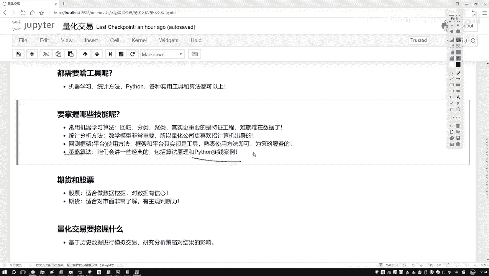

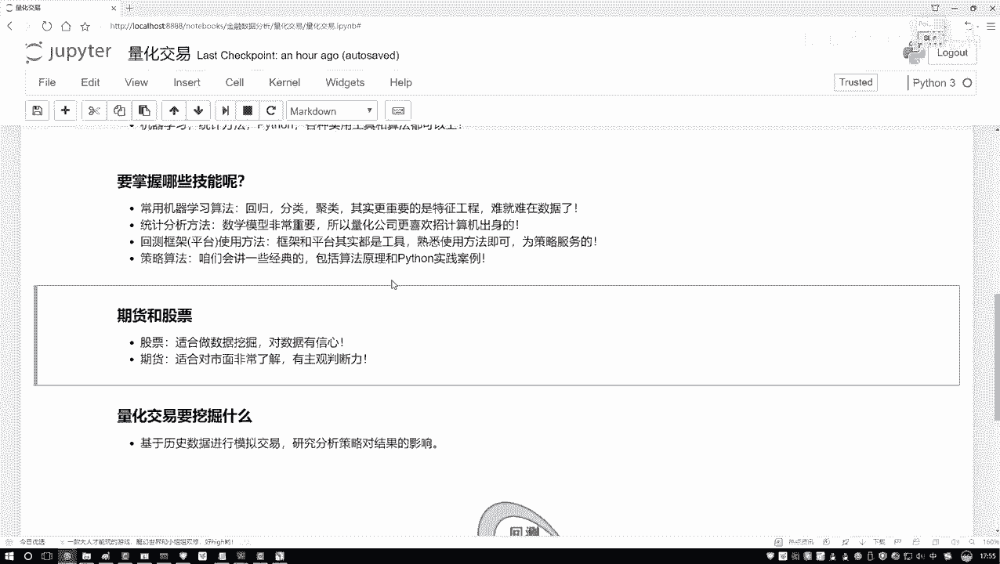

工欲善其事，必先利其器。在量化交易中，我们需要借助专门的平台或框架来编写策略、进行回测和可视化分析。

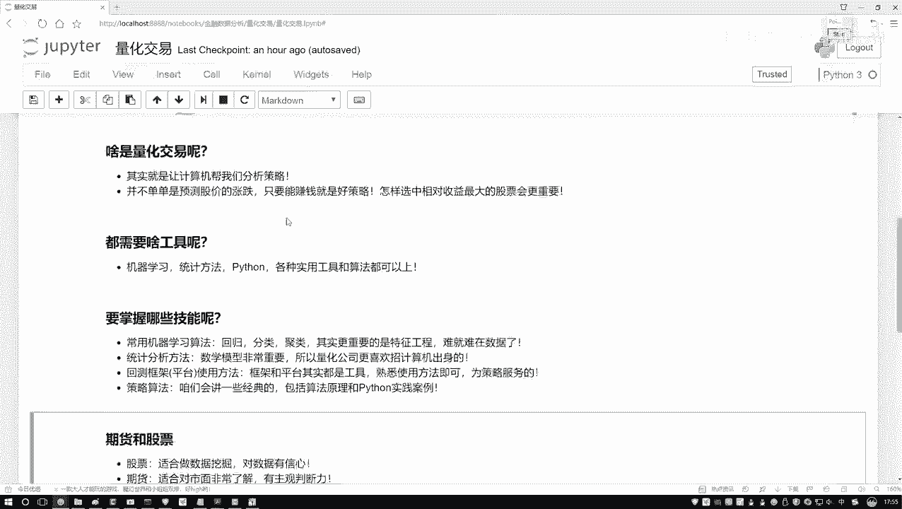

本课程将选择一个方便易用的平台进行教学。该平台应具备以下特点：
*   **API简单**：便于快速上手和编写Python代码。
*   **可视化清晰**：能直观展示策略在历史数据上的运行结果。
*   **功能完整**：支持策略回测，能够模拟在特定时间段（如10年到20年）内，策略每日的执行情况、收益曲线和最终结果。

平台和框架是工具，关键在于熟练使用，而非死记硬背。

### 4. 策略与算法

量化交易的核心是策略算法。虽然前沿研究层出不穷，但本课程将聚焦于最常用和最经典的算法。

课程将涵盖以下内容：
*   **机器学习算法**：如何应用于量化交易场景。
*   **经典交易策略**：如均值回归、动量策略等。
*   **实现方法**：详细讲解算法原理，并重点演示如何在Python中实现和应用。

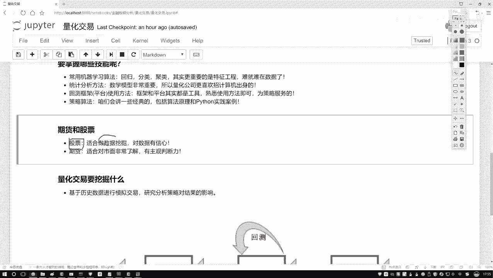

请注意，本课程名为“Python金融量化分析”，因此重点在于**如何使用Python将想法实现出来**，并落在具体的案例分析与实践上，而非教授如何炒股。

## 实践重点：股票 vs. 期货

有同学会问，在量化交易中，股票和期货哪个是重点？本课程将更侧重于股票相关的量化分析。

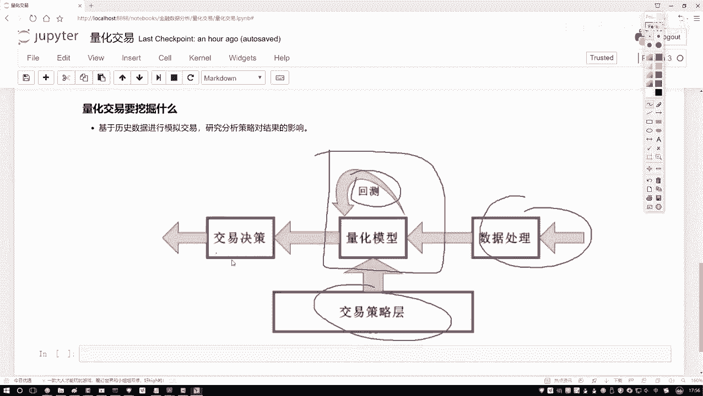

**选择股票作为重点的原因如下：**
*   **数据丰富**：股票数据包含公司财务、市场行情等多种结构化指标，非常适合进行数据挖掘。
*   **相对客观**：股票分析可以更多地依赖数据和模型。

**期货不作为重点的原因：**
*   **市场依赖性强**：期货价格与现货市场、宏观经济、政策等关联极为密切，主观判断和经验占比更大。
*   **专业门槛**：期货领域的顶尖从业者往往是对该行业有极深理解的专家，而不仅仅是IT或数学背景。

因此，课程中关于期货仅会举例说明，核心案例将围绕股票展开，这更符合数据挖掘的特点和Python实战的定位。

## 量化交易的本质：数据挖掘

既然提到了数据挖掘，我们需要明确它在量化交易中的角色。简单来说，数据挖掘的流程如下：

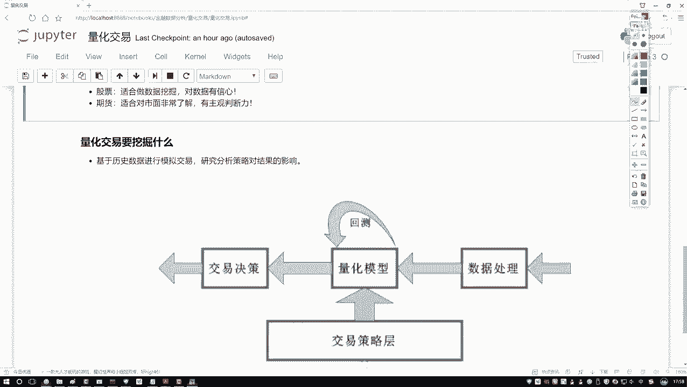

1.  **数据处理**：对获取的原始金融数据进行清洗、整合和特征提取。
2.  **策略设计**：基于处理后的数据，设计交易逻辑和算法。
3.  **回测验证**：在历史数据上测试策略的表现，评估其有效性。
4.  **指导决策**：将经过验证的策略用于实际交易，为投资决策提供依据。

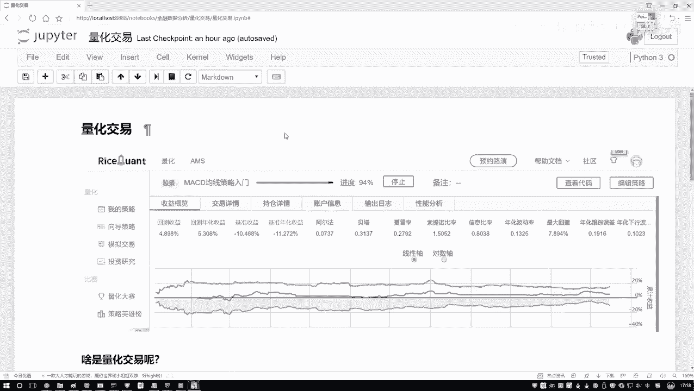

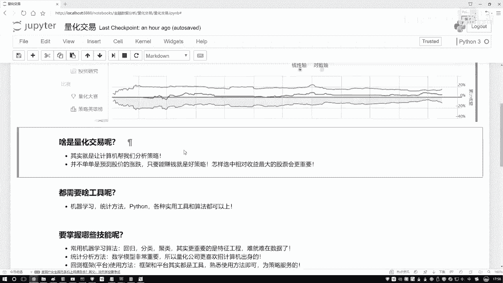

这个过程完全可以被称为**将数据挖掘算法应用于金融数据**，其产物就是量化交易策略。量化交易的目的不仅仅是预测股价涨跌，更是为了在控制风险的前提下，实现收益最大化。例如，如何从300只股票中选出最佳组合，就是一个典型的数据挖掘问题。

## 总结与建议

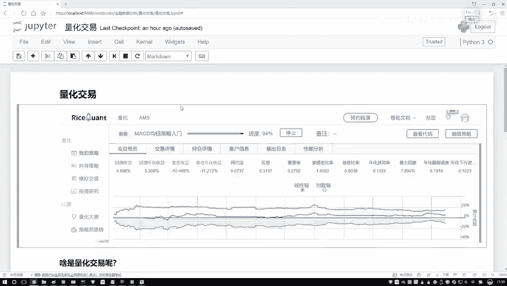

本节课中我们一起学习了量化交易所需的核心技能。我们来总结一下要点：

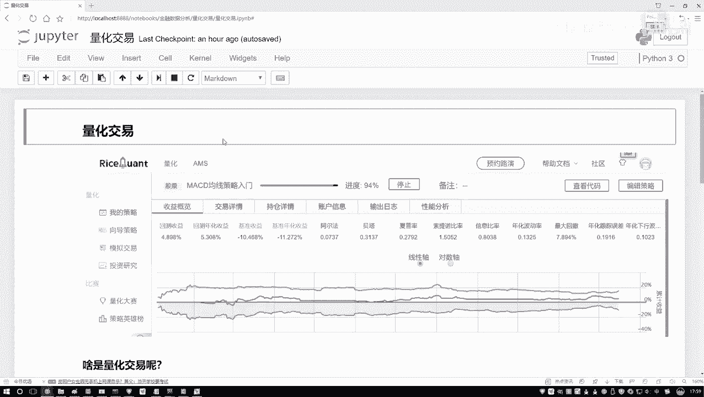

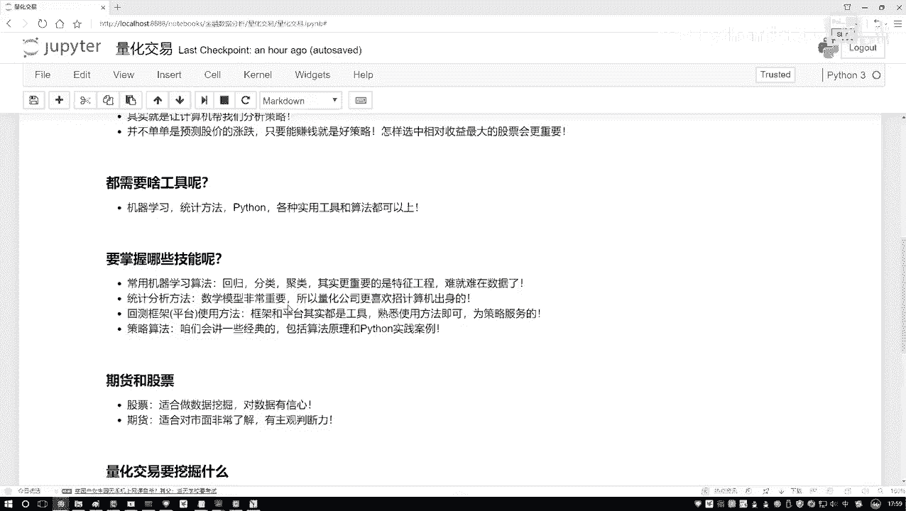

*   **技能矩阵**：需要掌握机器学习（尤其是特征工程）、扎实的数学/统计学基础、熟练使用量化平台/框架，并理解经典交易策略。
*   **实践导向**：本课程以**Python实现**和**股票市场案例**为重点，强调动手实践。
*   **理解本质**：量化交易是数据挖掘在金融领域的应用，目标是构建系统性的交易策略以实现收益。

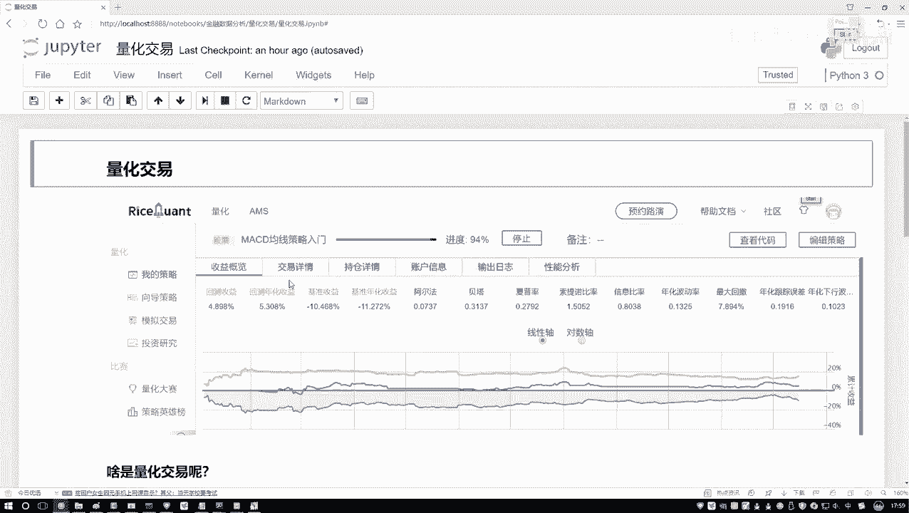

对于初学者，你无需深究量化交易冗长的历史或复杂理论。只需要理解其基本概念、数据挖掘的流程、所需的工具以及我们后续要学习的内容即可。接下来的课程，我们将一步步进入实战环节。