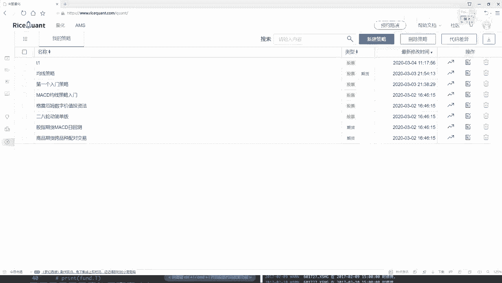
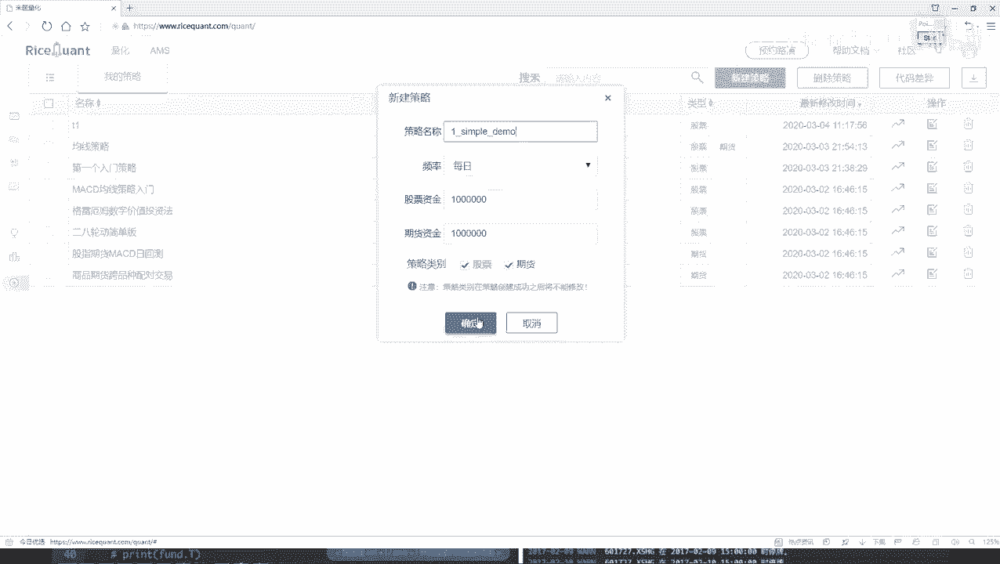
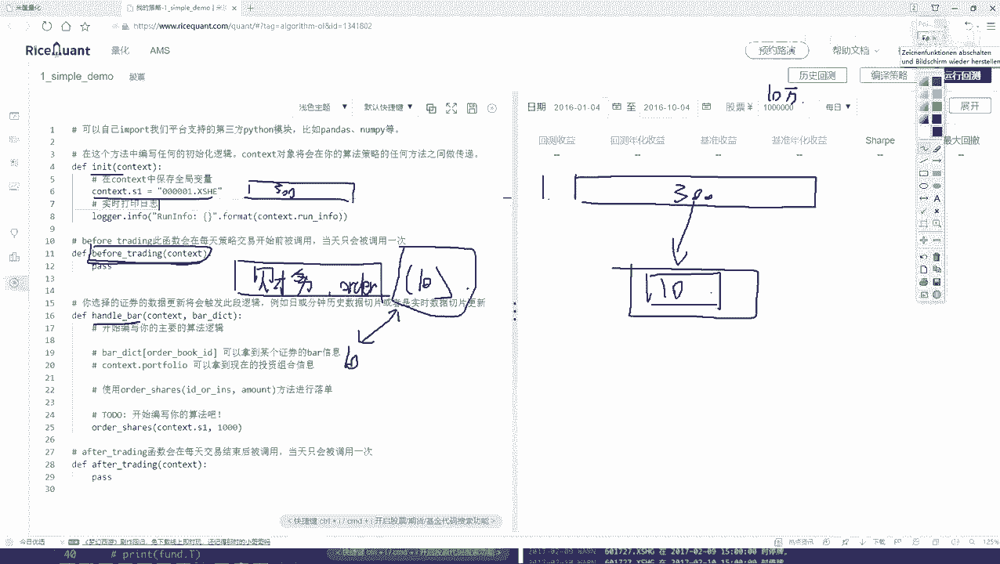
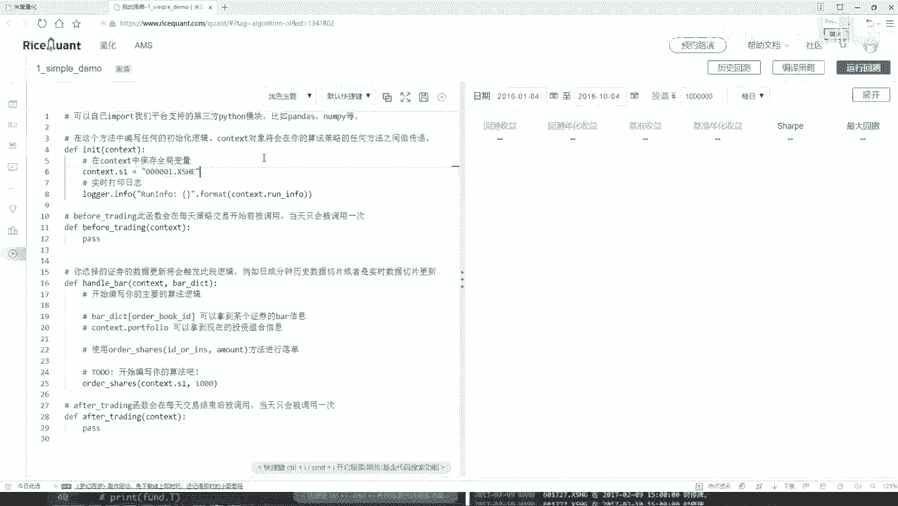

# Python金融量化分析：P24：策略任务分析 🎯



在本节课中，我们将学习如何在一个交易平台上构建一个简单的量化交易策略。我们将通过一个具体任务来熟悉平台的核心API，并理解策略开发的基本流程。



## 策略目标概述

我们的目标是设计一个简单的选股策略。具体来说，我们希望从沪深300指数的成分股中，始终持有表现最好的10只股票。这个“最好”的标准，我们暂时定义为公司的盈利能力（例如净利润）。策略会定期（如每天）重新评估所有股票，确保持仓始终是当前盈利能力排名前十的股票。

## 策略实现框架

上一节我们介绍了策略的基本目标，本节中我们来看看如何在代码层面实现它。一个典型的策略脚本包含几个核心函数模块。

以下是策略代码的主要结构模块：

1.  **初始化函数 (`initialize`)**: 在策略启动时运行一次，用于设置策略参数、股票池等。
2.  **盘前处理函数 (`before_trading`)**: 在每个交易日开始前运行，用于数据准备和计算，不涉及实际交易。
3.  **盘中处理函数 (`handle_bar`)**: 在每个交易时间点（如每分钟或每天）运行，是执行交易逻辑的核心位置。

## 各模块任务分解

### 初始化模块：设定基础

在初始化函数中，我们需要完成策略的准备工作。

以下是`initialize`函数中需要完成的任务：

*   设定初始资金，例如10万元。
*   获取并设定我们的股票池，即沪深300指数的所有成分股。

```python
def initialize(context):
    # 设置初始资金为100，000元
    context.cash = 100000
    # 获取沪深300指数成分股作为股票池
    context.stock_pool = get_index_stocks('000300.XSHG')
```

### 盘前处理模块：数据准备与选股

在`before_trading`函数中，我们将进行每日的数据查询和处理工作，为交易决策做准备。

以下是`before_trading`函数中需要完成的任务：

*   查询股票池中所有股票的最新财务数据（如净利润）。
*   根据选定的指标（净利润）对所有股票进行排序。
*   选出排名前十的股票代码，并保存下来，供交易函数使用。

```python
def before_trading(context):
    # 获取股票池中所有股票的净利润数据
    fundamentals = get_fundamentals(query(valuation.code, income.net_profit), context.stock_pool)
    # 按净利润降序排序
    sorted_stocks = fundamentals.sort_values(by='net_profit', ascending=False)
    # 选取前10只股票的代码，保存到context中
    context.top_10_stocks = sorted_stocks['code'].iloc[:10].tolist()
```

### 盘中交易模块：执行调仓逻辑

在`handle_bar`函数中，我们将根据盘前计算的结果，执行实际的买卖操作。

以下是`handle_bar`函数中需要完成的交易逻辑：

*   获取当前账户的所有持仓。
*   将当前持仓与盘前计算出的“最优前十股票”列表进行比较。
*   卖出当前持有但不在新“前十”列表中的股票。
*   用剩余资金买入在新“前十”列表中但当前未持有的股票，力求持仓与目标列表一致。

```python
def handle_bar(context, bar_dict):
    current_holdings = list(context.portfolio.positions.keys())
    target_stocks = context.top_10_stocks

    # 卖出逻辑：持有但不在目标列表中的股票
    for stock in current_holdings:
        if stock not in target_stocks:
            order_target_value(stock, 0) # 卖出该股票全部持仓

    # 买入逻辑：在目标列表中但未持有的股票
    # 计算可用于购买新股票的资金（平均分配）
    available_cash_per_stock = context.portfolio.cash / len(target_stocks)
    for stock in target_stocks:
        if stock not in current_holdings:
            order_value(stock, available_cash_per_stock) # 买入大致等额的股票
```

## 总结





本节课中我们一起学习了如何构建一个完整的简单量化交易策略。我们首先明确了从沪深300中动态持有前十名股票的策略目标，然后将其分解到`initialize`、`before_trading`和`handle_bar`三个核心函数中实现：初始化设定股票池和资金，盘前进行数据获取和选股计算，盘中执行具体的调仓交易逻辑。这个过程清晰地展示了策略从想法到代码实现的基本路径。