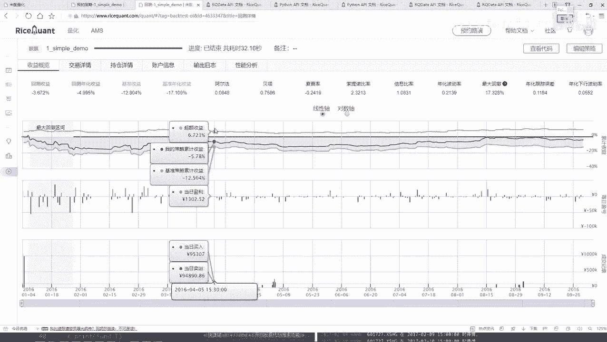
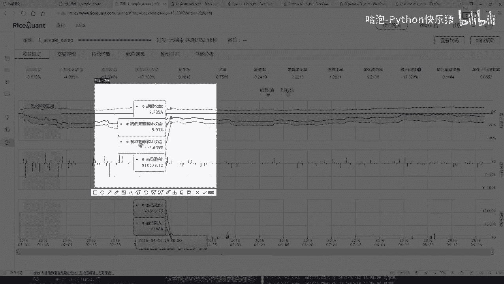
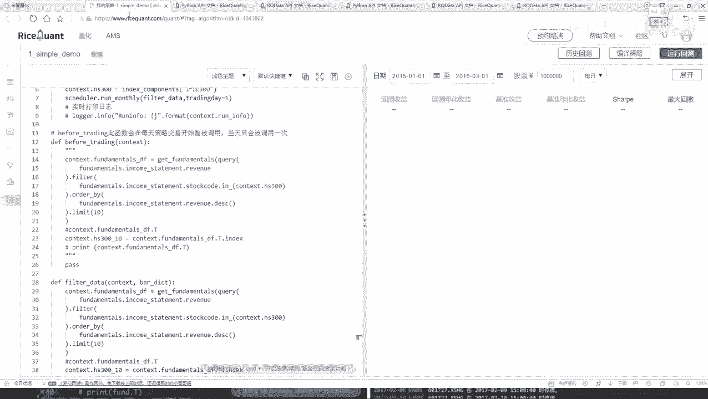

# Python金融量化分析：P27：定时器功能与作用 ⏰

## 概述
在本节课中，我们将学习如何在量化交易策略中使用定时器功能。定时器允许我们自定义策略中某些操作的执行频率，例如从每日调整为每月执行一次选股逻辑，从而优化策略的运行效率与逻辑。

上一节我们介绍了策略回测的基本流程和结果分析，本节中我们来看看如何通过定时器来调整策略中核心函数的执行周期。

---

## 交易详情回顾
交易详情基于之前设定的回测时间段（2016年1月4日至2016年10月4日）生成。策略中的`before_trading`函数和选股逻辑在回测期间**每一天**都会执行。

因此，回测结果会详细列出每一天产生的交易。例如，在1月4日，策略会平均买入选出的十只股票。初始资金为10万元，平均分配意味着每只股票买入约1万元。代码如下所示，它确保了在持仓为空的第一天执行买入操作：
```python
# 示例：平均买入逻辑
if context.portfolio.positions == 0:
    # 执行平均买入
    pass
```
交易详情中会列出每笔交易的股票名称（如中国石化）、成交量、成交价以及交易费用（如印花税、佣金等）。

从第二天开始，策略会根据新的市场数据和持仓情况，同时进行买入和卖出操作，以动态调整投资组合。

以下是交易详情中包含的主要信息列表：
*   **交易记录**：每日的买卖操作、股票代码、成交量与成交价。
*   **费用明细**：每笔交易产生的印花税、佣金等成本。
*   **持仓变化**：展示每日持仓股票的数量与市值变动。

用户可以将详细的交易结果展开查看、筛选特定指标，或下载数据进行独立分析。这模拟了真实的交易环境，便于策略复盘。

---



## 持仓与账户分析
持仓页面展示了每日持有股票的价格、当前市值及盈亏情况。第一天买入后盈亏为零，从第二天起开始显示盈亏变动。

在示例回测中，策略初期经历了连续的亏损。这与之前看到的“最大回撤”区间相对应，是策略需要度过的一段困难时期。账户信息则记录了每日总市值的变化，直观展示了初始10万元资金的盈亏曲线。



性能概览中的“策略收益”曲线图，直观对比了策略收益与基准收益（如沪深300指数）。**超额收益**的计算公式为：
**超额收益 = 策略收益 - 基准收益**
它衡量了策略相对于市场基准的盈利能力。

---

## 引入定时器功能
在当前的策略中，选股逻辑（“洗牌”）每日执行。但在实际交易中，频繁调仓可能并非必要，且会增加交易成本。我们可能希望每十天、每月才重新选股一次。

这时，可以使用平台提供的**定时器（Scheduler）**功能。定时器允许我们按照自定义的时间间隔（如每周、每月）来执行特定函数，从而控制策略中核心操作的执行频率。

---

## 定时器API与使用
定时器API通常在策略的初始化函数（`init`）中调用。它支持每日（`run_daily`）、每周（`run_weekly`）或每月（`run_monthly`）运行。

以下是每月运行定时器的基本用法。我们计划在每月的第一个交易日执行选股函数：
```python
# 在 init 函数中设置每月定时器
def init(context):
    # 安排每月第一个交易日执行 filter_data 函数
    scheduler.run_monthly(filter_data, monthday=1)
```
参数说明：
*   `filter_data`：用户自定义的、需要定期执行的函数名。
*   `monthday=1`：指定在每月的第几个交易日执行，此处设为第一个交易日。

---

## 策略代码改造
为了使用定时器，我们需要对策略代码进行改造：

1.  **创建自定义函数**：将原来在`before_trading`中的选股逻辑移到一个独立的函数中，例如`filter_data`。
2.  **注释原逻辑**：注释掉`before_trading`中原有的选股代码。
3.  **设置定时器**：在`init`函数中，使用`scheduler.run_monthly()`来调度`filter_data`函数。

改造后，选股逻辑将由原来的每日执行变为每月第一个交易日执行，其他交易逻辑保持不变。

---

## 不同参数下的回测对比
修改策略后，我们使用相同时间段（2016.1.4 - 2016.10.4）进行回测。结果显示，策略收益发生了变化（可能变差），这说明**调整策略的执行频率会显著影响最终回报**。

为了进一步验证，我们可以尝试不同的回测时间段。例如，将时间段改为2018年至2020年，结果可能截然不同。这强调了在量化策略开发中，参数敏感性和周期选择的重要性。

核心要点在于，通过定时器我们可以灵活控制策略节奏，但**最佳参数需要通过反复回测和验证来确定**。平台工具和API文档是学习和实验的基础。

---

## 总结
本节课中我们一起学习了量化策略中定时器功能的作用与使用方法。我们了解到：
1.  定时器可以自定义策略中函数的执行频率（如每日、每周、每月）。
2.  通过将选股逻辑移至自定义函数并用定时器调度，我们改造了策略，使其从每日调仓变为每月调仓。
3.  改变执行频率或回测时间段会直接影响策略的最终收益，这体现了量化策略开发中参数优化和回测验证的重要性。
4.  掌握平台API文档的使用是快速学习和构建有效策略的关键。



最终，量化策略的开发是一个结合逻辑设计、编程实现与大量历史数据验证的迭代过程。