# Python金融量化分析：P28：百分位去极值方法

在本节课中，我们将要学习如何对金融量化分析中的因子数据进行预处理。预处理是数据建模前至关重要的一步，它能有效提升模型的稳定性和准确性。我们将按照“三步走”策略，依次讲解去极值、标准化和中性化这三个核心操作。

## 因子数据简介

上一节我们介绍了课程的整体框架，本节中我们来看看什么是因子数据。

因子可以理解为影响最终投资决策的标准或指标。例如，在选股时，市净率较低可能意味着更大的上涨空间；营收增长率较高可能代表公司更具成长性。这些对最终收益有影响的指标，就是我们要讨论的因子。

拿到因子数据后，我们通常不能直接用于建模，而需要进行预处理。这类似于一个数据挖掘问题：我们拥有多个输入因子（X1, X2, X3...），目标是分析它们对最终收益（Y）的影响，并从中筛选出有效的因子。本节课将重点讲解数据预处理的方法。

## 预处理“三步走”策略

以下是数据预处理的三个核心步骤：

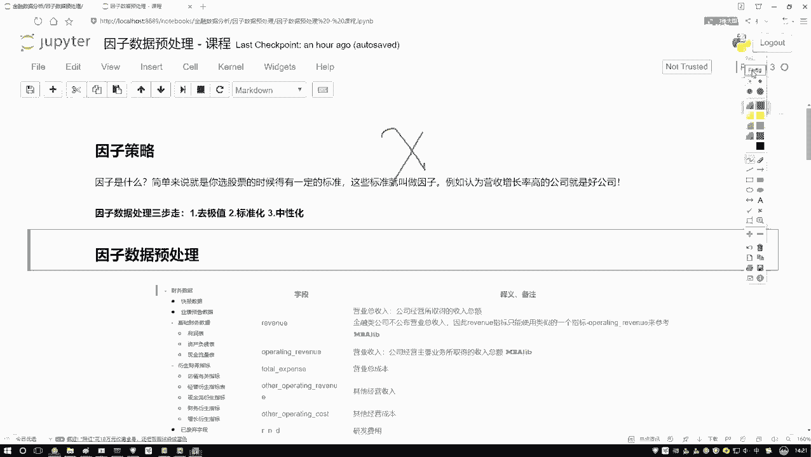

1.  **去极值**：处理数据中的离群点或异常值。
2.  **标准化**：将不同量纲和范围的因子数据转换到统一的尺度上。
3.  **中性化**：在金融量化中，消除因子数据中某些系统性偏差（如市值、行业的影响）的过程。

前两步（去极值和标准化）是数据挖掘中的常见操作。第三步（中性化）在一般的机器学习任务中较少使用，但在因子策略分析中至关重要。接下来，我们将按照这个顺序，详细讲解每一步的具体做法。

## 第一步：去极值处理

去极值的目标不是简单地删除异常数据点，而是将其“拉回”到合理的边界内。例如，设定一个界限为5，如果一个数值是10，超过了上界，我们将其修正为5。这样既保留了数据，又减少了极端值的影响。

去极值有多种方法，我们先介绍第一种：**分位数去极值法**。

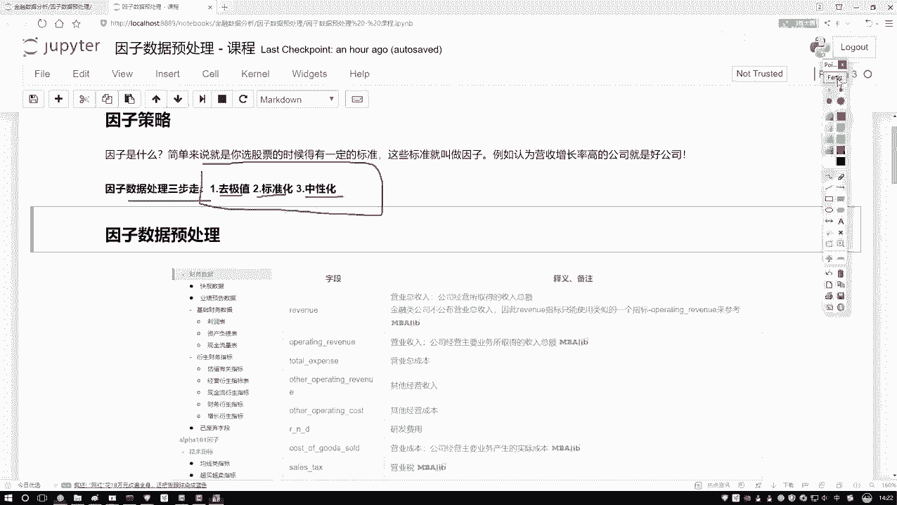

### 分位数去极值法

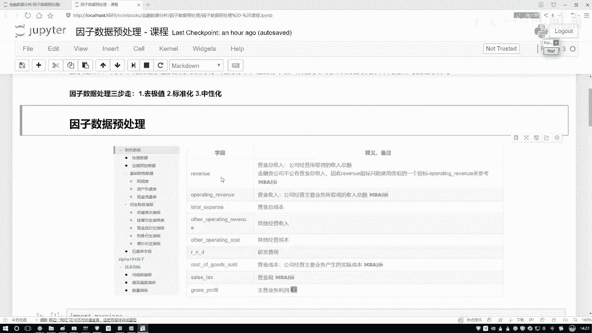

分位数是描述数据分布位置的点。最常用的是四分位数：
*   **Q1（第一四分位数）**：所有数据按从小到大排列后，处于25%位置的值。
*   **Q2（第二四分位数）**：即中位数，处于50%位置的值。
*   **Q3（第三四分位数）**：处于75%位置的值。

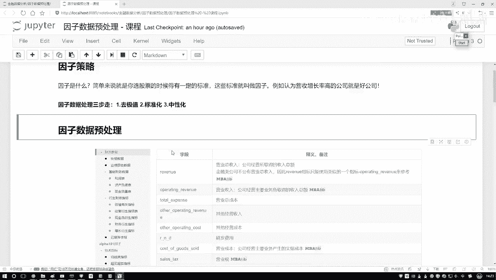

与均值相比，中位数对极端值不敏感，更能代表数据的“一般”水平。分位数去极值法就是利用Q1和Q3来界定数据的正常范围。

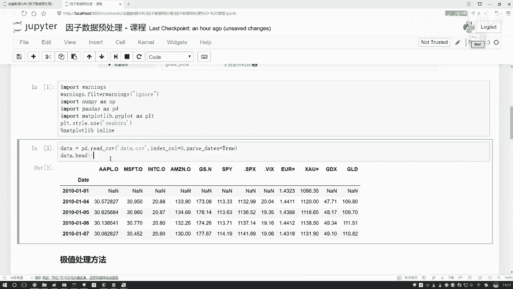

其核心思想是计算一个称为“四分位距”的范围，并以此设定上下限。任何超出此界限的数值都会被替换为边界值。

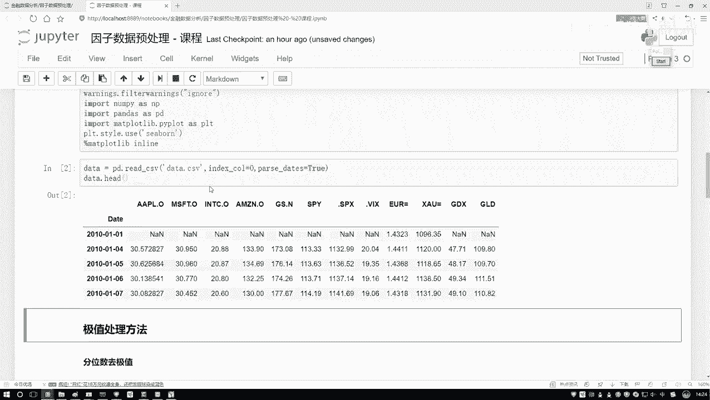

**核心公式**：
```
IQR = Q3 - Q1
上界 = Q3 + k * IQR
下界 = Q1 - k * IQR
```
其中，`k`是一个常数，通常取1.5。对于更严格的处理，可以取3。

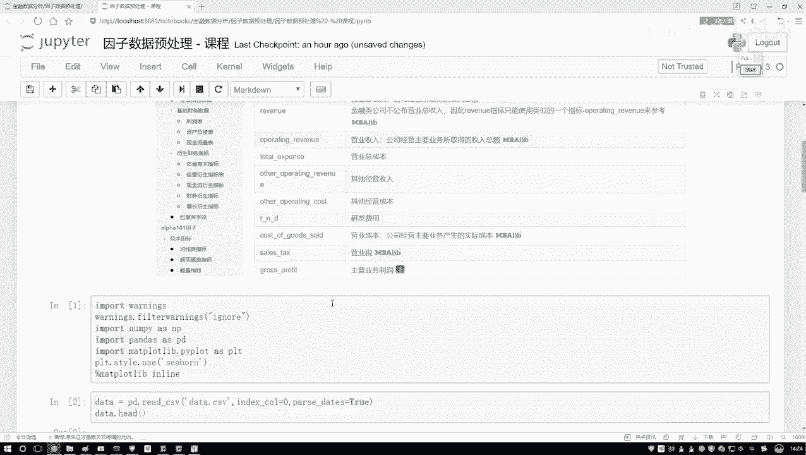

**代码描述**：
假设我们有一个因子数据序列 `factor_data`，使用Pandas进行分位数去极值处理：
```python
import pandas as pd
import numpy as np

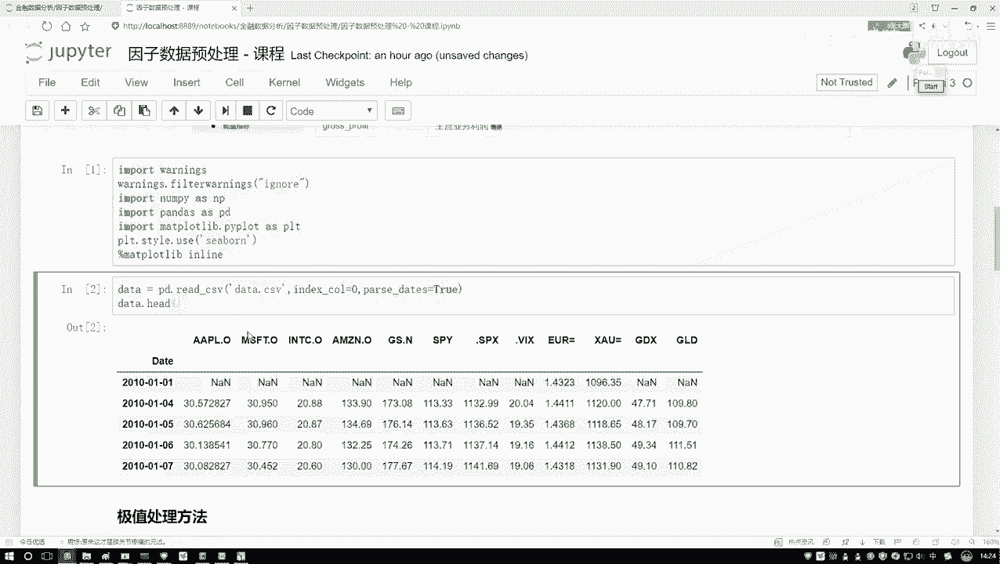

def winsorize_by_quantile(factor_data, k=1.5):
    """
    使用分位数法对因子数据进行去极值处理。
    """
    q1 = factor_data.quantile(0.25)
    q3 = factor_data.quantile(0.75)
    iqr = q3 - q1
    
    upper_bound = q3 + k * iqr
    lower_bound = q1 - k * iqr
    
    # 将超过边界的值替换为边界值
    factor_data_winsorized = factor_data.clip(lower_bound, upper_bound)
    return factor_data_winsorized

# 示例：对苹果股价数据（作为示例因子）进行去极值
# 假设 df[‘close’] 是收盘价序列
df[‘close_winsorized’] = winsorize_by_quantile(df[‘close’], k=1.5)
```

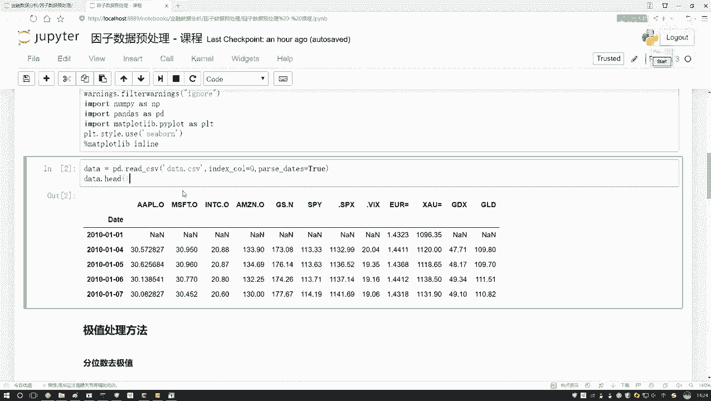

## 第二步：标准化处理

在去除了极值之后，我们需要处理不同因子之间量纲差异的问题。例如，市值可能是以“亿元”为单位，而交易量可能是“万股”。直接比较这些数值没有意义。标准化的目的就是将所有因子数据转换到相同的尺度上，通常是均值为0，标准差为1的标准正态分布尺度。

**核心公式（Z-Score标准化）**：
```
标准化值 = (原始值 - 均值) / 标准差
```

**代码描述**：
继续使用Pandas对去极值后的数据进行标准化：
```python
def standardize_data(data):
    """
    对数据进行Z-Score标准化。
    """
    mean = data.mean()
    std = data.std()
    data_standardized = (data - mean) / std
    return data_standardized

# 示例：对去极值后的收盘价进行标准化
df[‘close_standardized’] = standardize_data(df[‘close_winsorized’])
```

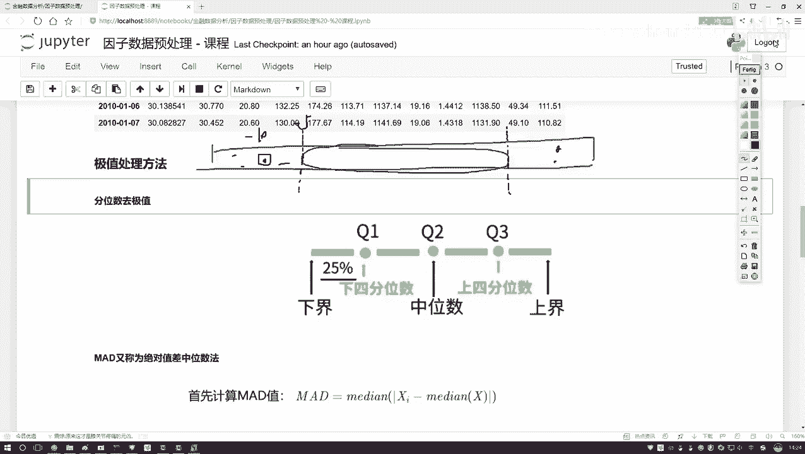

## 第三步：中性化处理

中性化是金融因子处理中特有的一步。它的目的是消除因子本身可能受到的其他常见因素的影响，从而暴露其独立的预测能力。最常见的做法是消除**市值**和**行业**的影响。

例如，一个“估值低”的因子，可能仅仅是因为这些公司都是市值很大的蓝筹股（通常估值较低）。如果不做中性化，我们选出的股票可能会集中在某个特定市值区间或行业，这并非因子本身的选股能力。中性化后，我们得到的是“在相同市值和行业背景下，估值仍然较低”的股票，这样的信号更为纯粹。

其基本思想是通过线性回归，将待处理因子对市值、行业哑变量等中性化变量进行回归，然后取回归的残差作为中性化后的新因子值。残差代表了原因子中无法被市值和行业解释的部分，即“纯净”的因子暴露。

**代码描述思路**：
```python
import statsmodels.api as sm

def neutralize_factor(factor_data, market_cap_data, industry_dummies):
    """
    对因子进行市值和行业中性化。
    factor_data: 待中性化的因子序列
    market_cap_data: 市值序列
    industry_dummies: 行业哑变量DataFrame
    """
    # 将市值和行业哑变量作为自变量X
    X = pd.concat([market_cap_data, industry_dummies], axis=1)
    X = sm.add_constant(X) # 添加常数项
    
    # 因变量y是待中性化的因子
    y = factor_data
    
    # 进行线性回归
    model = sm.OLS(y, X).fit()
    
    # 残差即为中性化后的因子
    neutralized_factor = model.resid
    return neutralized_factor
```
*注意：在实际平台（如米矿）中，通常有内置函数可以方便地完成行业和市值中性化。*

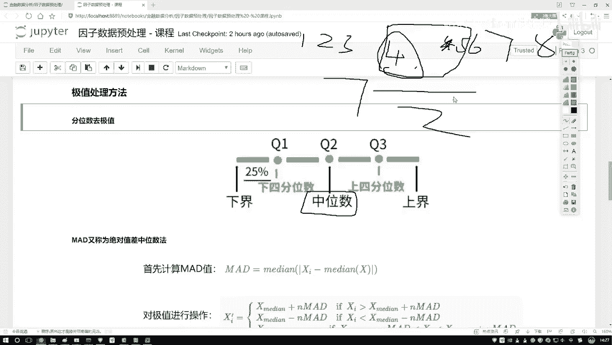

## 总结

本节课中我们一起学习了金融因子数据预处理的完整流程。我们首先了解了因子数据的含义，然后按照“去极值 -> 标准化 -> 中性化”的三步走策略，详细讲解了每一步的目的和操作方法：
1.  **去极值**：使用分位数法（如IQR方法）将异常值拉回合理边界，保护模型不受极端值干扰。
2.  **标准化**：使用Z-Score方法统一不同因子的量纲，使它们具有可比性。
3.  **中性化**：通过回归方法消除因子中市值和行业的系统性影响，提取因子的“纯净”信号。

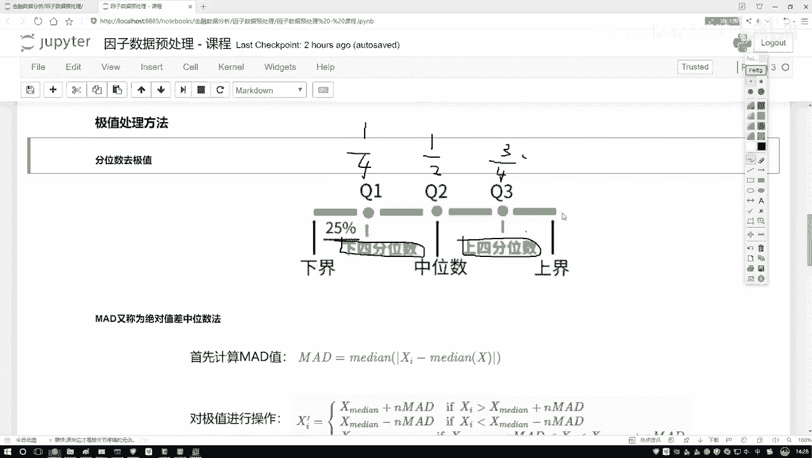

经过这三步处理后的因子数据，才能更可靠地用于后续的多因子模型构建、合成与选股策略中。在接下来的实战中，我们将把这些方法应用到具体的因子策略编写中。