# Python金融量化分析：P3：时间序列分析 📈

在本节课中，我们将学习如何使用Python进行时间序列分析，并以微软股票数据为例，演示如何读取数据、可视化数据以及进行初步分析。我们将使用`yfinance`库获取股票数据，并使用`matplotlib`进行绘图。

## 数据读取与初步观察

首先，我们需要读取股票数据。这里我们选择微软的股票进行分析。

```python
import yfinance as yf
import pandas as pd
import matplotlib.pyplot as plt

# 读取微软股票数据
msft = yf.Ticker("MSFT")
hist = msft.history(period="max")
```

执行上述代码后，我们获得了微软股票的历史数据。数据包含多个指标，如开盘价、收盘价、最高价、最低价和交易量等。我们主要关注的是收盘价，即`Close`列。

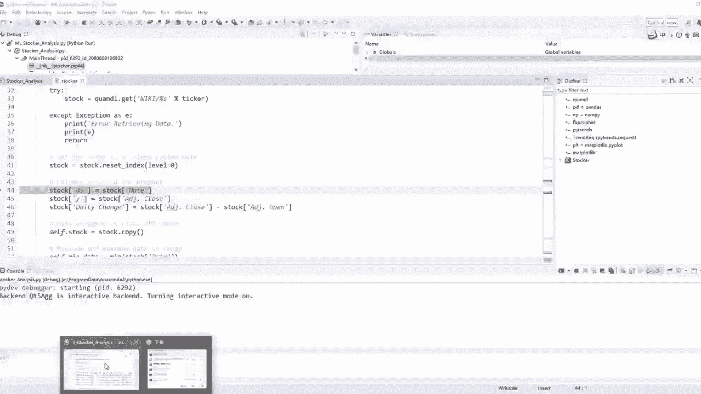

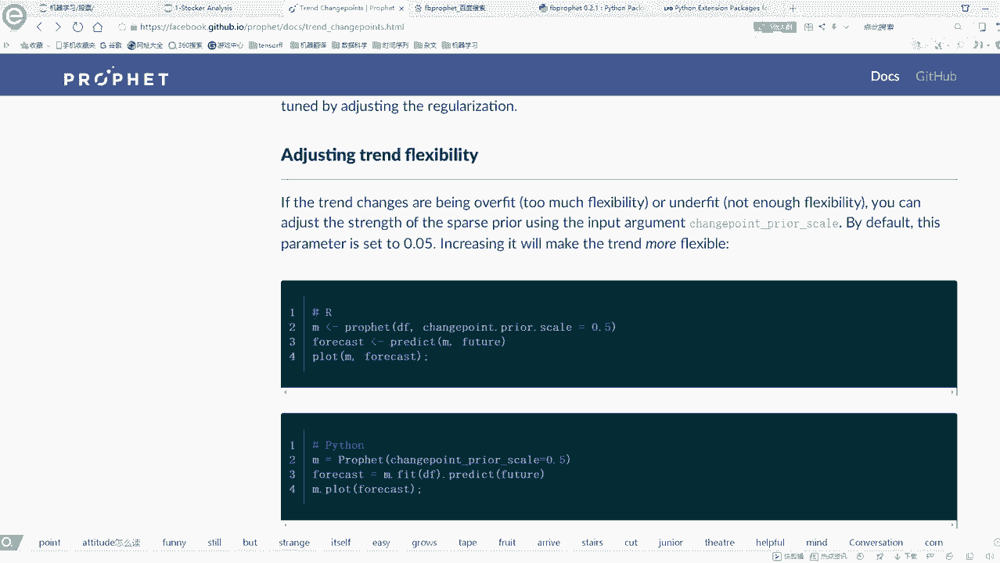

以下是数据的基本信息：

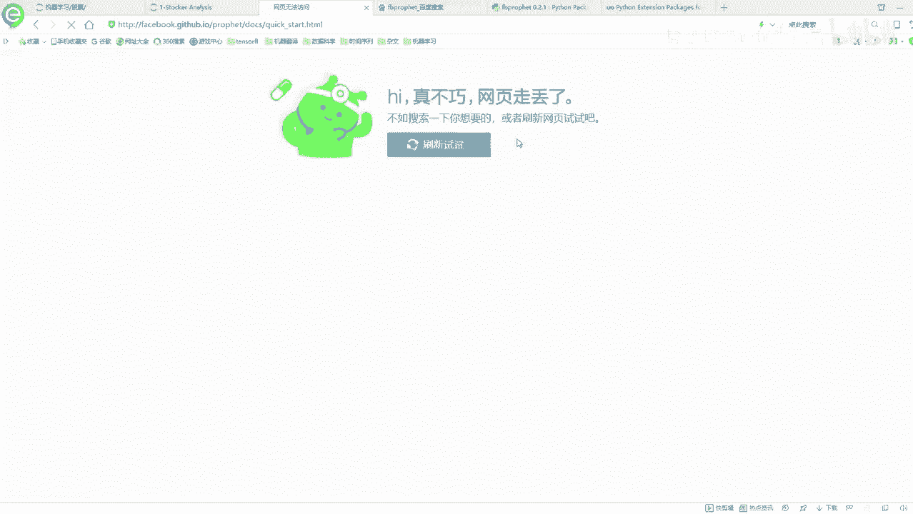

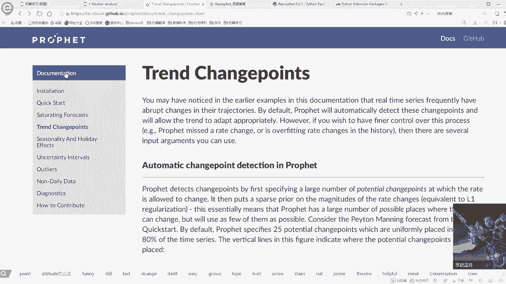

```python
print(hist.head())
print(hist.tail())
```

通过打印数据的头部和尾部，我们可以了解数据的起始日期、结束日期以及各列的名称。数据的时间范围从1986年3月13日到当前日期。

## 数据可视化

在获得数据后，我们通常首先进行可视化，以观察数据的整体趋势和特征。

### 绘制股票价格趋势图

我们可以绘制微软股票从1986年至今的收盘价趋势图。

```python
# 绘制收盘价趋势图
plt.figure(figsize=(14, 7))
plt.plot(hist.index, hist['Close'], label='Close Price', color='red', linewidth=2)
plt.xlabel('Date')
plt.ylabel('Price (USD)')
plt.title('Microsoft Stock Price Over Time')
plt.legend()
plt.grid(True)
plt.show()
```

通过这张图，我们可以看到微软股票价格的整体上升趋势，中间虽有波动，但长期来看是增长的。

### 绘制多指标对比图

除了收盘价，我们还可以同时绘制其他指标，如每日价格变动和交易量。

```python
# 计算每日价格变动
hist['Daily Change'] = hist['Close'] - hist['Open']

# 绘制多指标对比图
fig, ax1 = plt.subplots(figsize=(14, 7))

color = 'tab:red'
ax1.set_xlabel('Date')
ax1.set_ylabel('Daily Change', color=color)
ax1.plot(hist.index, hist['Daily Change'], color=color, linewidth=2)
ax1.tick_params(axis='y', labelcolor=color)

ax2 = ax1.twinx()
color = 'tab:blue'
ax2.set_ylabel('Volume', color=color)
ax2.plot(hist.index, hist['Volume'], color=color, linewidth=2, alpha=0.5)
ax2.tick_params(axis='y', labelcolor=color)

plt.title('Microsoft Stock: Daily Change vs Volume')
plt.show()
```

这张图展示了每日价格变动与交易量的关系。蓝色曲线代表交易量，红色曲线代表每日价格变动。通过对比，我们可以发现某些日期交易量激增，可能与重大事件相关。

## 模拟股票投资回报

为了更直观地理解股票投资，我们可以模拟在不同时间点买入和卖出股票的回报情况。

### 计算投资回报

假设我们在特定日期买入一定数量的股票，并在另一日期卖出，我们可以计算投资的盈利或亏损。

```python
def calculate_return(start_date, end_date, shares=100):
    # 获取指定日期范围内的数据
    mask = (hist.index >= start_date) & (hist.index <= end_date)
    period_data = hist.loc[mask]
    
    if period_data.empty:
        return None
    
    start_price = period_data.iloc[0]['Close']
    end_price = period_data.iloc[-1]['Close']
    
    profit = (end_price - start_price) * shares
    return profit

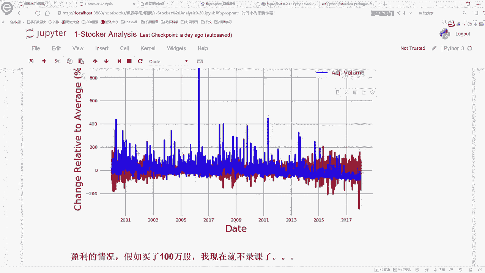

# 示例：计算从1986年到2018年的投资回报
profit = calculate_return('1986-03-13', '2018-01-24', shares=100)
print(f"Profit from 1986 to 2018: ${profit:.2f}")
```

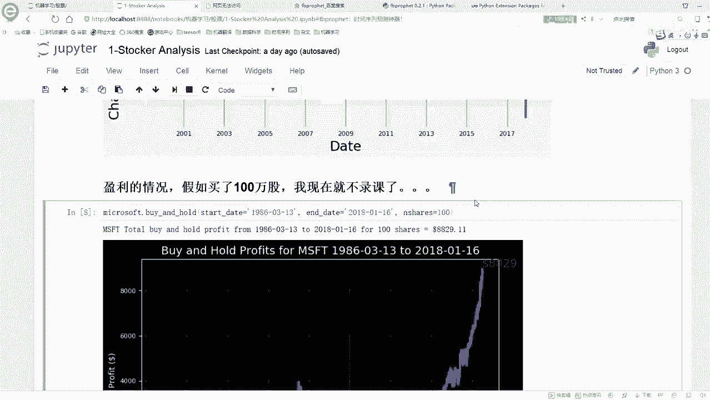

通过这个函数，我们可以计算任意时间段内的投资回报。例如，从1986年到2018年，买入100股微软股票，可以获得可观的盈利。

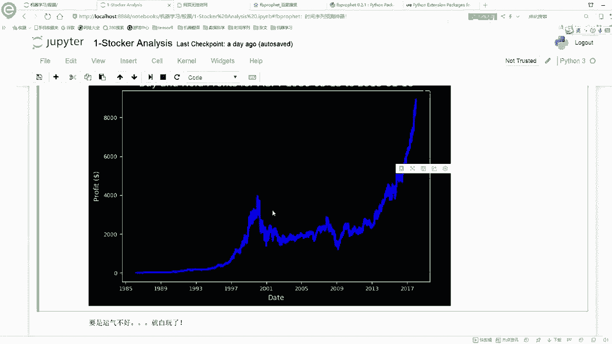

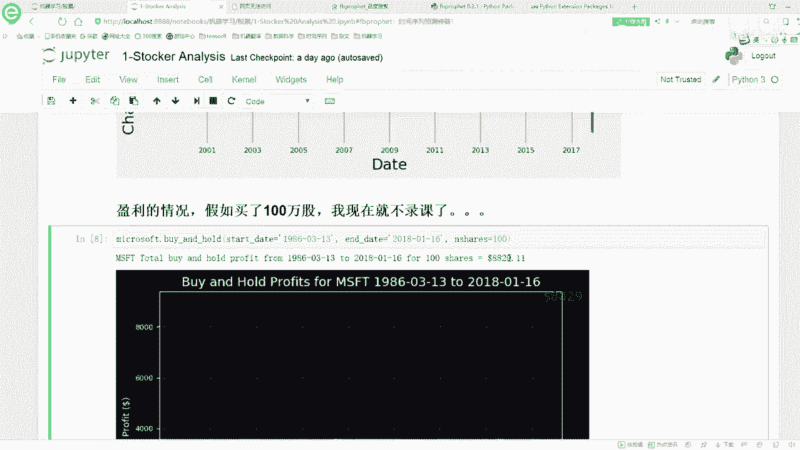

### 可视化投资回报

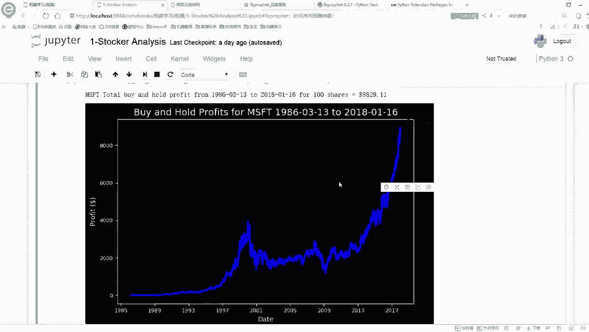

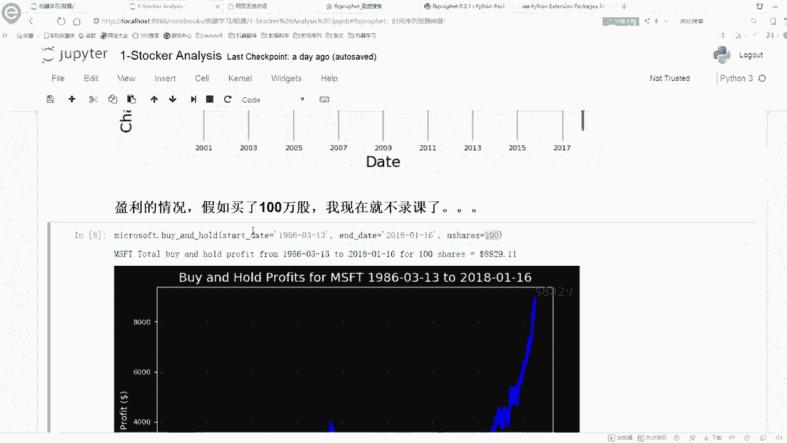

我们还可以将投资回报可视化，以便更直观地理解盈利情况。

```python
def plot_investment(start_date, end_date, shares=100):
    mask = (hist.index >= start_date) & (hist.index <= end_date)
    period_data = hist.loc[mask]
    
    if period_data.empty:
        print("No data available for the specified dates.")
        return
    
    start_price = period_data.iloc[0]['Close']
    end_price = period_data.iloc[-1]['Close']
    
    # 计算每日盈利
    period_data['Profit'] = (period_data['Close'] - start_price) * shares
    
    plt.figure(figsize=(14, 7))
    plt.plot(period_data.index, period_data['Profit'], label='Profit Over Time', color='green', linewidth=2)
    plt.axhline(y=0, color='black', linestyle='--', linewidth=1)
    plt.xlabel('Date')
    plt.ylabel('Profit (USD)')
    plt.title(f'Investment Profit from {start_date} to {end_date} (Shares: {shares})')
    plt.legend()
    plt.grid(True)
    plt.show()

# 示例：绘制从1986年到2018年的投资盈利图
plot_investment('1986-03-13', '2018-01-24', shares=100)
```

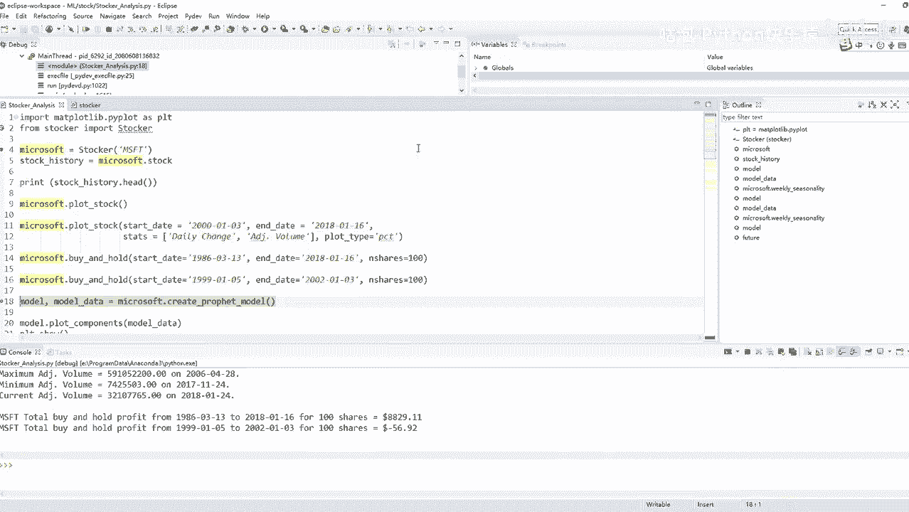

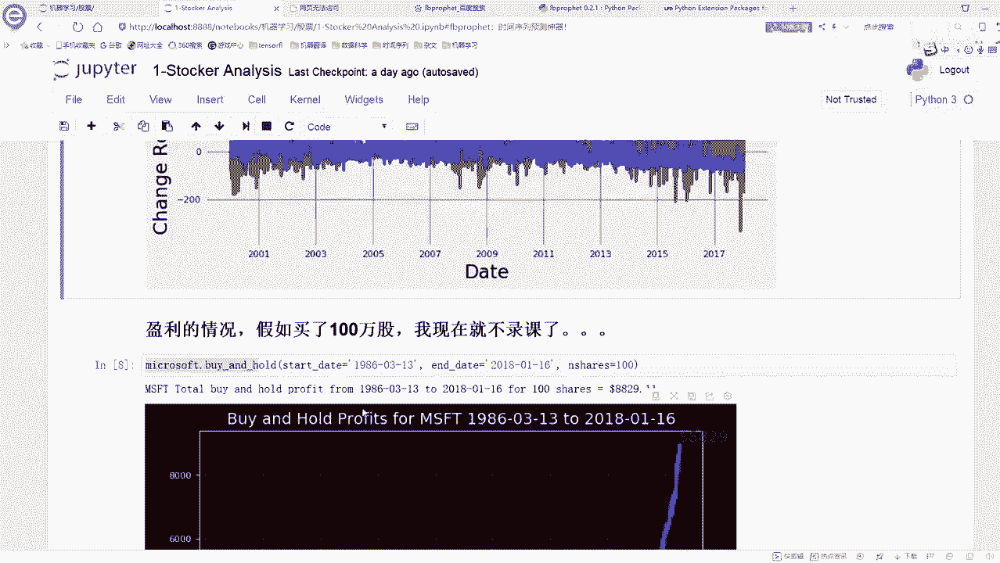

通过这张图，我们可以看到投资盈利随时间的变化。如果盈利曲线在0以上，表示盈利；如果在0以下，表示亏损。

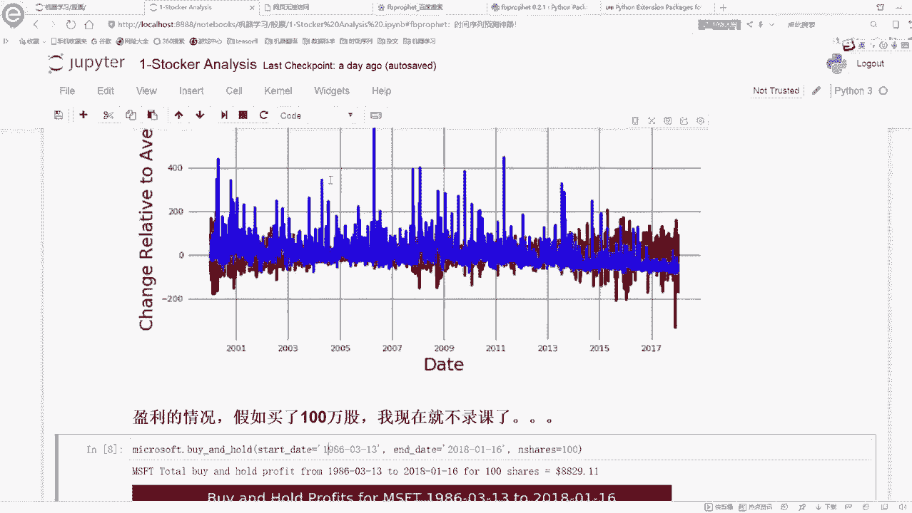

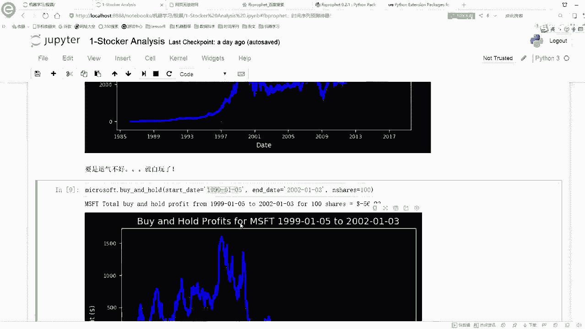

## 总结

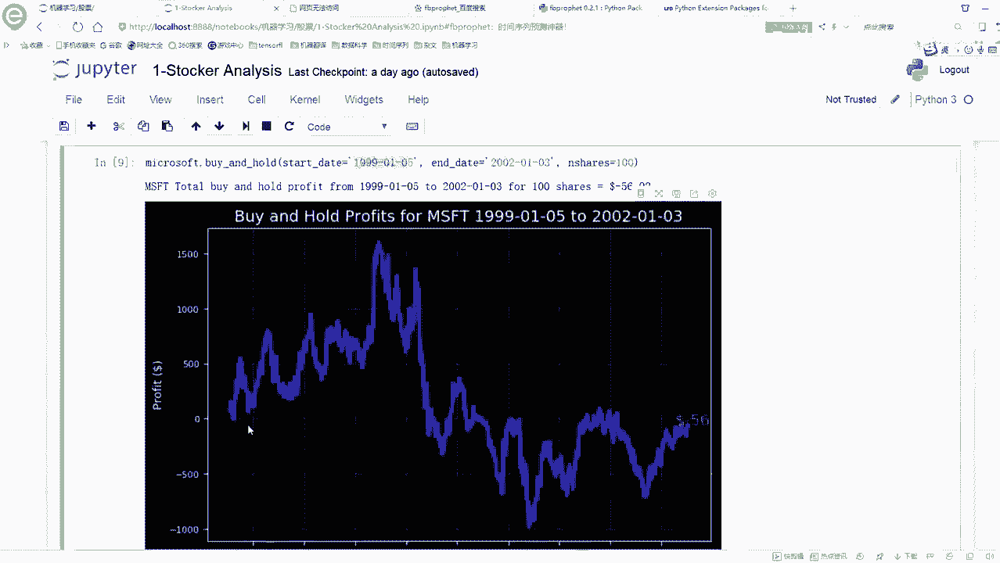

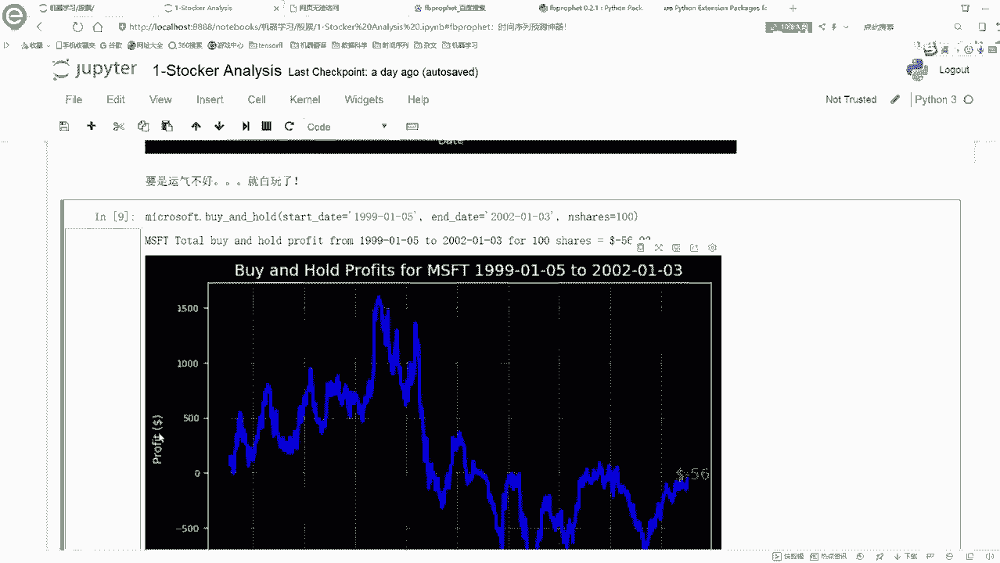

本节课中，我们一起学习了时间序列分析的基本步骤，包括数据读取、数据可视化和模拟投资回报。我们使用微软股票数据作为案例，演示了如何绘制股票价格趋势图、多指标对比图以及投资盈利图。这些技能不仅适用于股票分析，还可以应用于其他时间序列数据的处理。

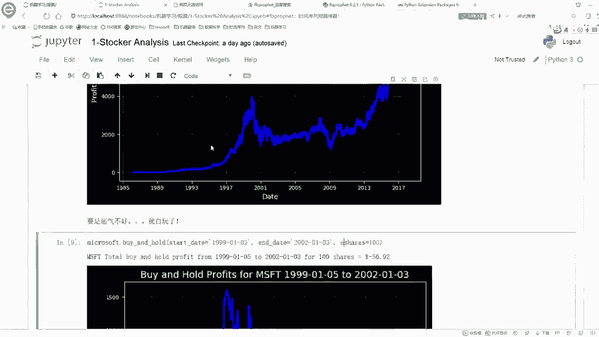

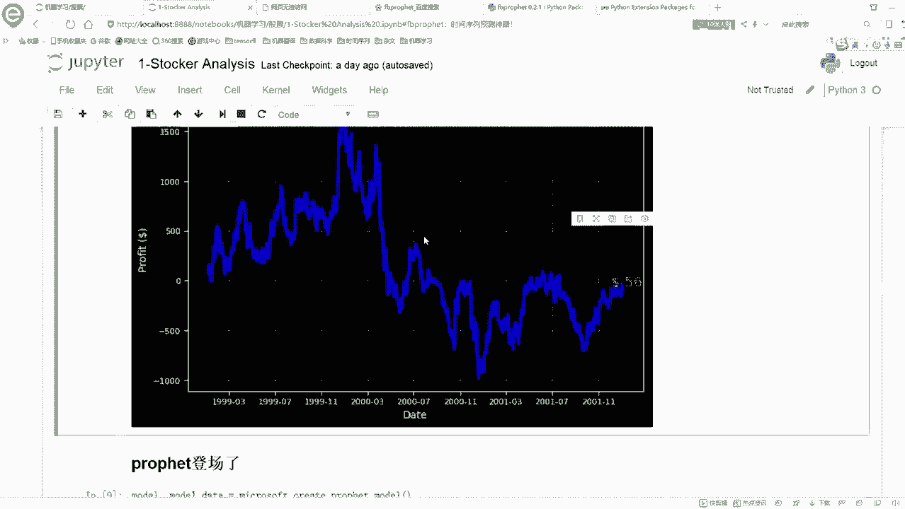

通过本节课的学习，你应该能够：
1. 使用`yfinance`库获取股票数据。
2. 使用`matplotlib`绘制时间序列图。
3. 计算和可视化投资回报。

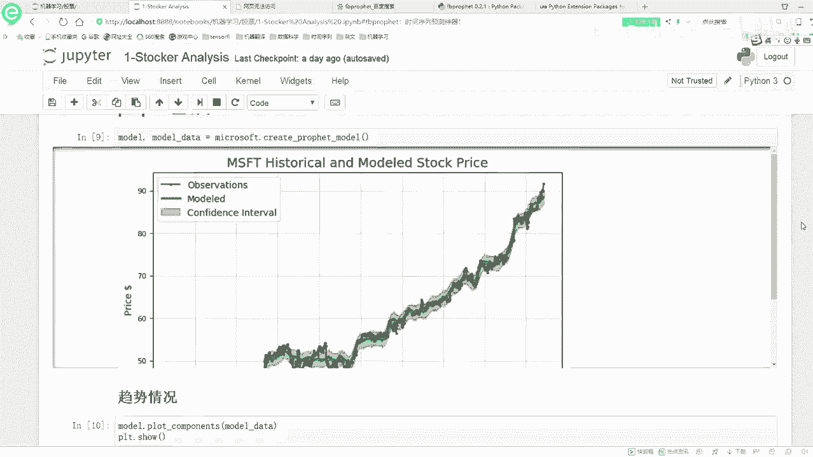

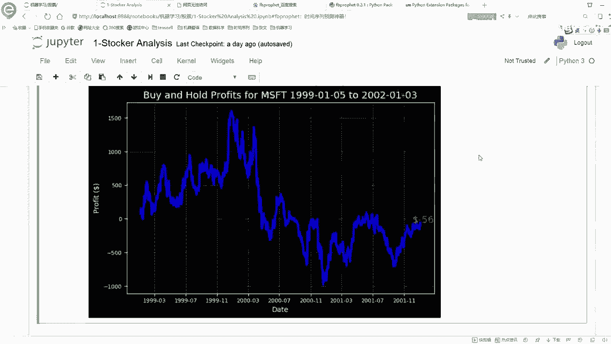

在接下来的课程中，我们将进一步学习时间序列预测的方法，例如使用Facebook Prophet进行股票价格预测。