# Python金融量化分析：P32：标准化处理方法 📊

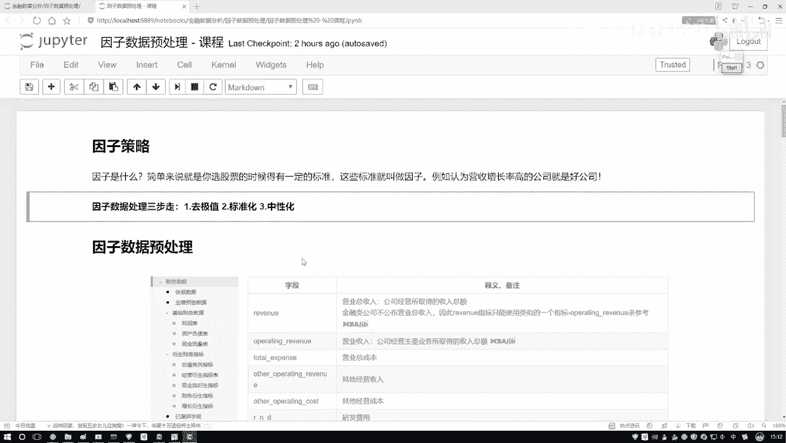

在本节课中，我们将要学习数据预处理中一个至关重要的步骤——标准化。标准化是数据挖掘和机器学习中常用的技术，旨在消除不同数据特征因量纲和取值范围不同而带来的影响，使数据更易于分析和建模。

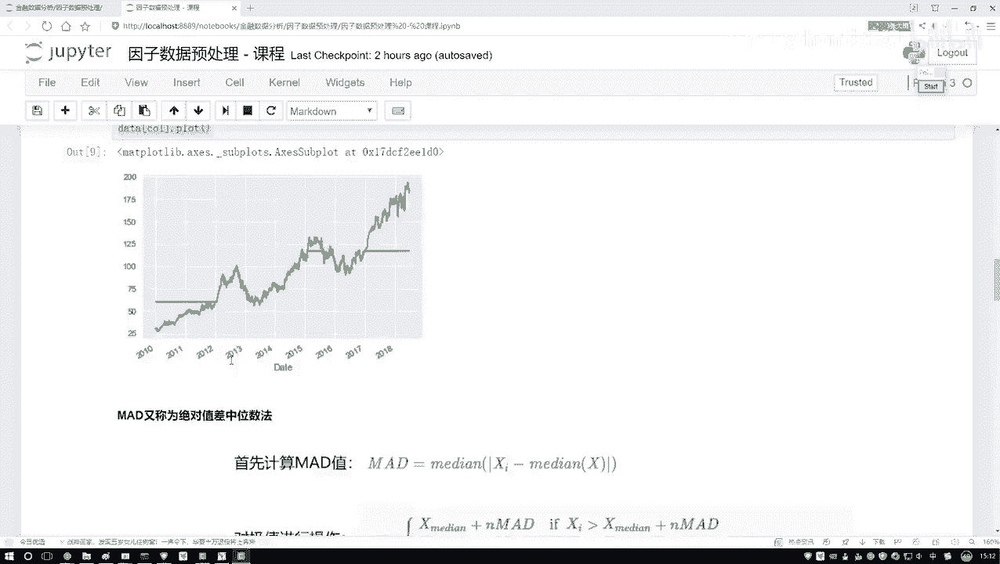

## 概述

标准化操作的核心目标，是让不同指标的数据处于同一量级，以便公平地进行比较和分析。其原理和方法都非常简单直接。

## 标准化的目的与原理

上一节我们介绍了数据预处理的重要性，本节中我们来看看标准化的具体目的。

假设我们有一组数据，包含两个特征维度X1和X2。观察下图可以发现，X1和X2的取值范围明显不同。X1的取值范围较大，而X2的取值范围相对较小。


这种取值范围（量纲）的差异，会导致在后续分析（如计算距离、构建模型）时，数值大的特征会主导结果，从而产生偏差。标准化的出发点，正是为了使得各个指标或因子在各个维度上的取值范围尽可能相同，让我们能用“同样的眼光”去观察它们，避免数值层面的差异对结果造成不当影响。

## 标准化的数学公式

标准化的具体做法遵循一个明确的数学公式。以下是标准化的核心公式：

**`标准化值 = (原始值 - 均值) / 标准差`**

用数学符号表示为：
**`z = (x - μ) / σ`**

这个公式可以分解为两个步骤来理解。

## 公式分解：去均值

第一步是“去均值”，即用原始数据减去其平均值（μ）。

**`x' = x - μ`**

这个操作的目的是让数据在各个维度上以零为中心对称。如下图所示，原始数据（左图）的分布中心并非原点，而去均值后（右图），数据分布的中心被平移到了零点。


然而，仅仅去均值并不能解决取值范围不同的问题。从图中可以看出，两个坐标轴（即两个特征）的取值范围依然差异很大。

## 公式分解：除标准差

第二步是“除标准差”，即将去均值后的数据除以该维度数据的标准差（σ）。

**`z = x' / σ`**

为什么要除以标准差呢？标准差衡量了一组数据的离散程度。取值范围大的数据，其标准差通常也大；取值范围小的数据，其标准差通常也小。

通过除以各自的标准差，我们实现了以下效果：
*   对于取值范围大的特征（标准差大），除以一个大数，使其缩放幅度变小。
*   对于取值范围小的特征（标准差小），除以一个小数，使其缩放幅度相对变大。

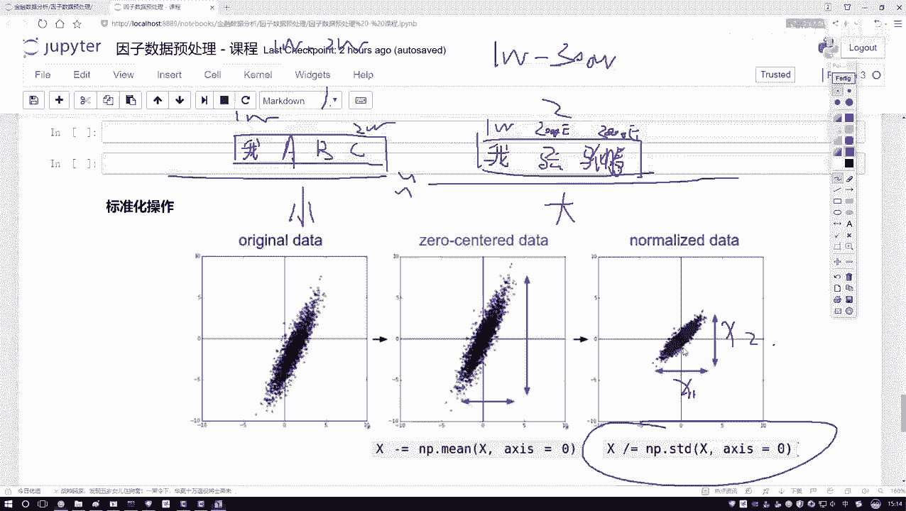

最终，所有特征的数据都被“压缩”或“拉伸”到一个近似的、较小的数值区间内（通常围绕0分布），如下图所示：

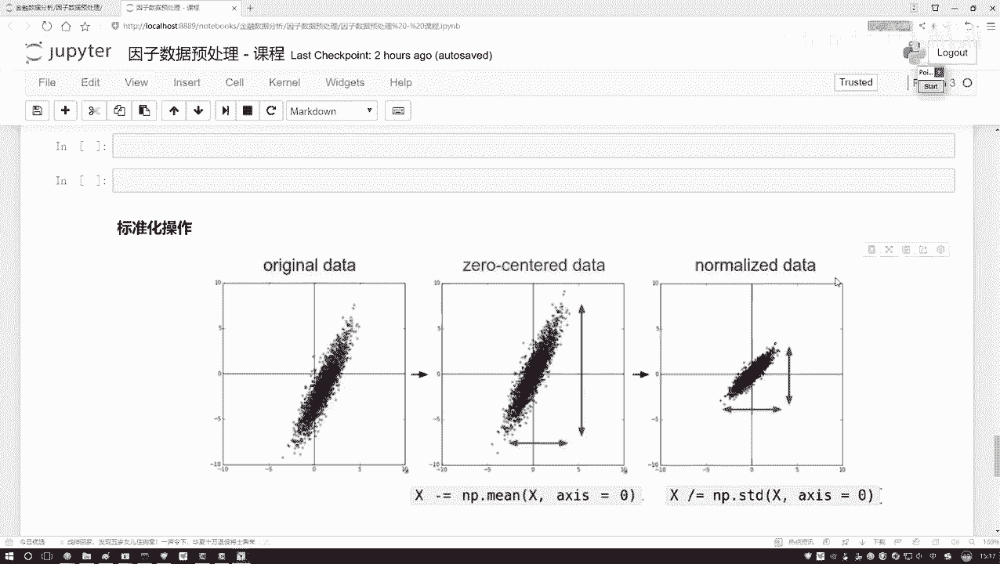


## 标准化的代码实现

理解了原理后，我们可以动手实现标准化函数。以下是使用Python和Pandas实现标准化的步骤：

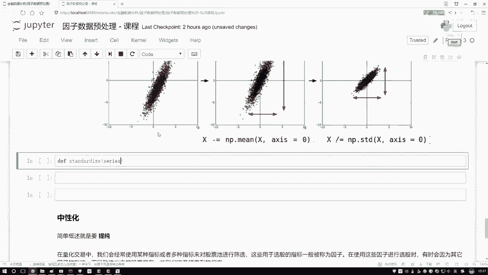

首先，我们需要计算数据的均值和标准差。

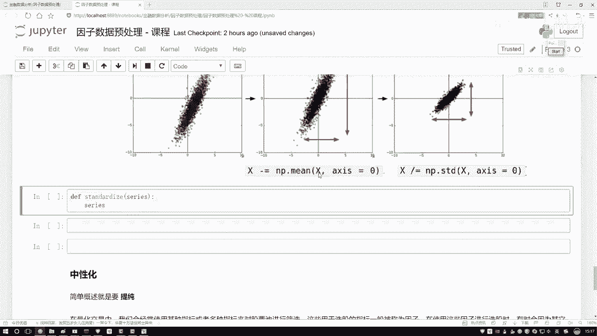

```python
import pandas as pd

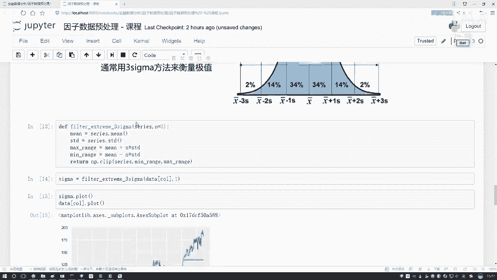

def standardize(series):
    """
    对Pandas Series进行标准化处理。
    参数:
        series: 待标准化的数据序列。
    返回:
        标准化后的数据序列。
    """
    # 计算均值和标准差
    mean = series.mean()  # 均值 μ
    std = series.std()    # 标准差 σ

    # 应用标准化公式: (x - μ) / σ
    standardized_series = (series - mean) / std
    return standardized_series
```

代码非常简单：先计算序列的均值和标准差，然后对序列中的每个值应用标准化公式。

## 使用现成工具库

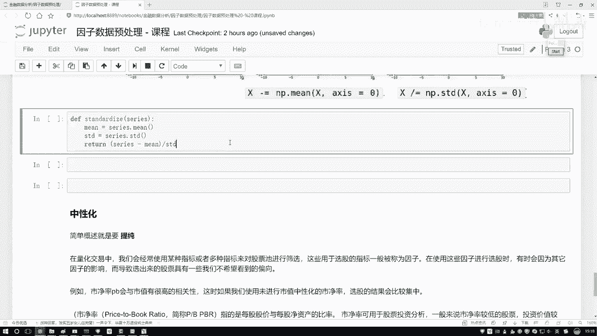

在实际项目中，我们通常使用成熟的机器学习库来完成标准化，这样更加高效便捷。例如，Scikit-learn库提供了强大的数据预处理模块。

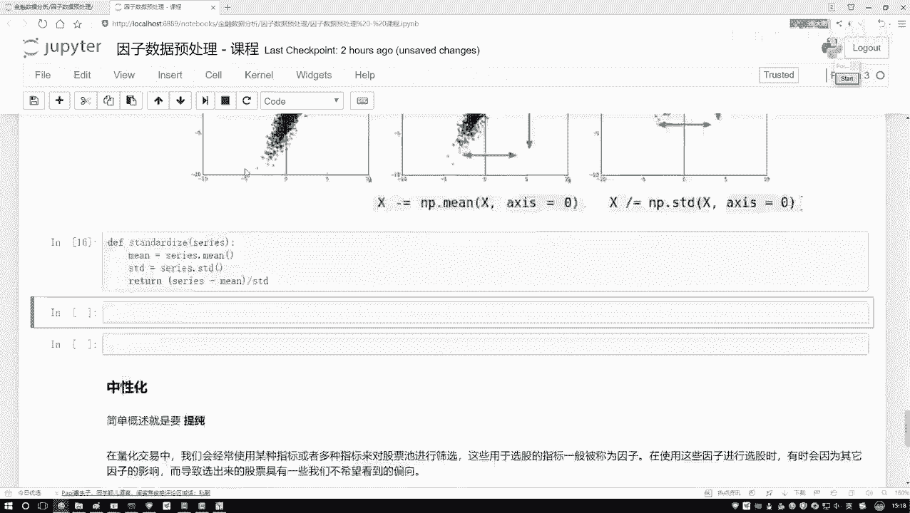

如果你想使用Scikit-learn，只需一行代码即可完成标准化：

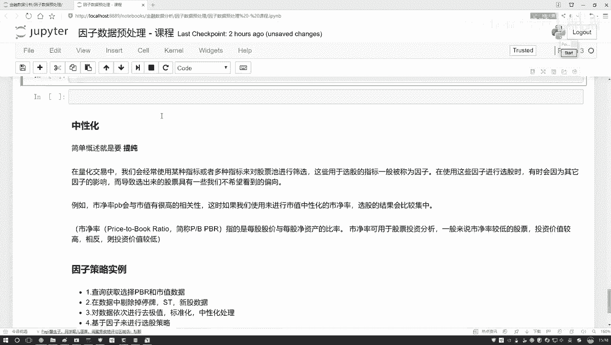

```python
from sklearn.preprocessing import StandardScaler

scaler = StandardScaler()
standardized_data = scaler.fit_transform(your_data)
```

你可以在Scikit-learn官网的API文档中搜索`StandardScaler`来了解更多细节。

## 效果演示

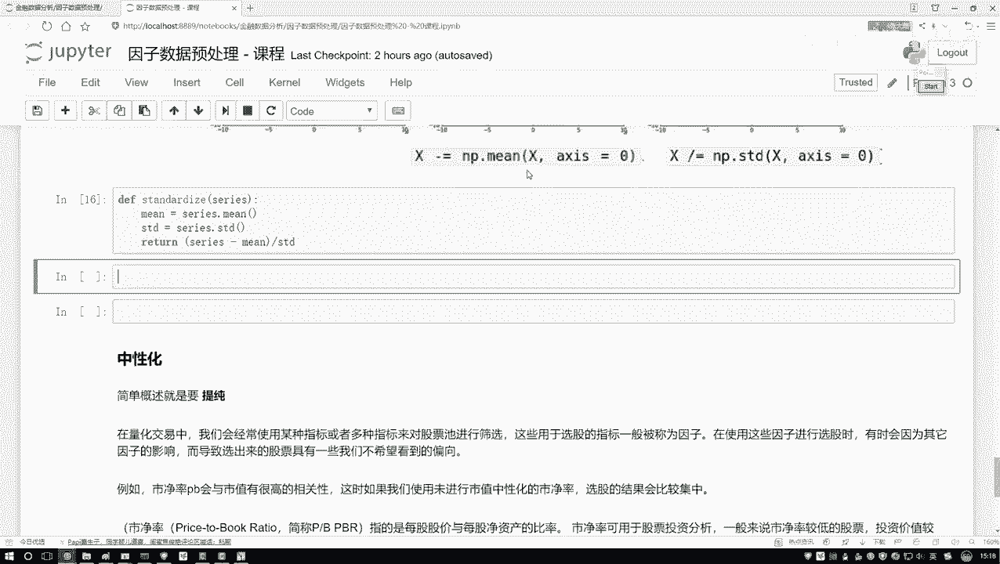

让我们通过一个例子来直观感受标准化的效果。假设我们有以下原始数据：

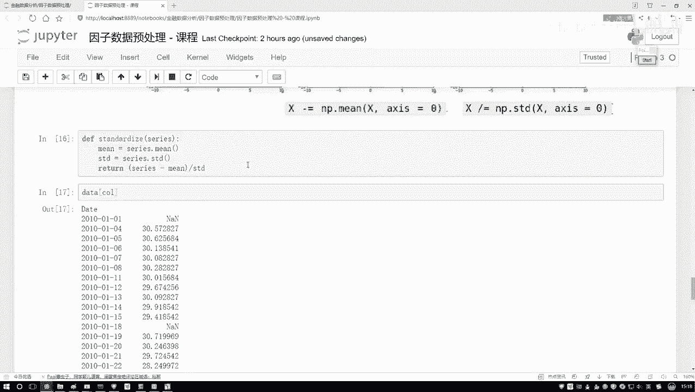


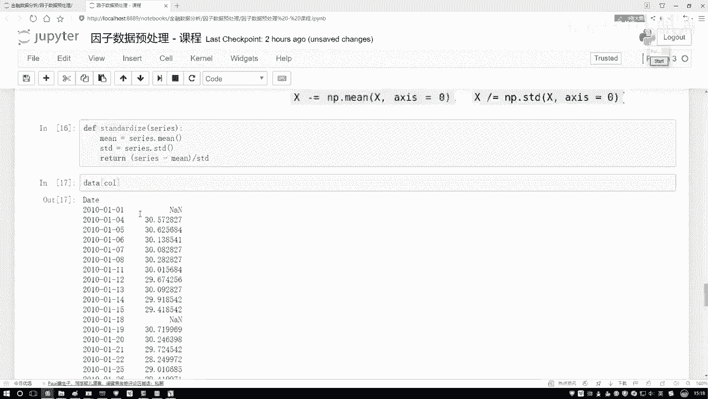

可以看到，数据中有30多、20多、100多的值，取值范围差异很大。

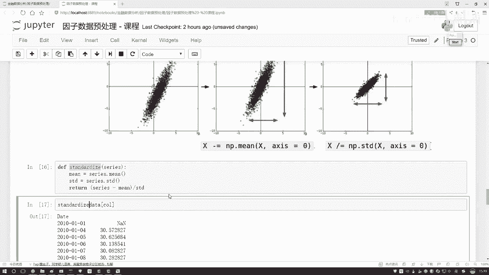

现在，我们应用自定义的`standardize`函数进行处理：

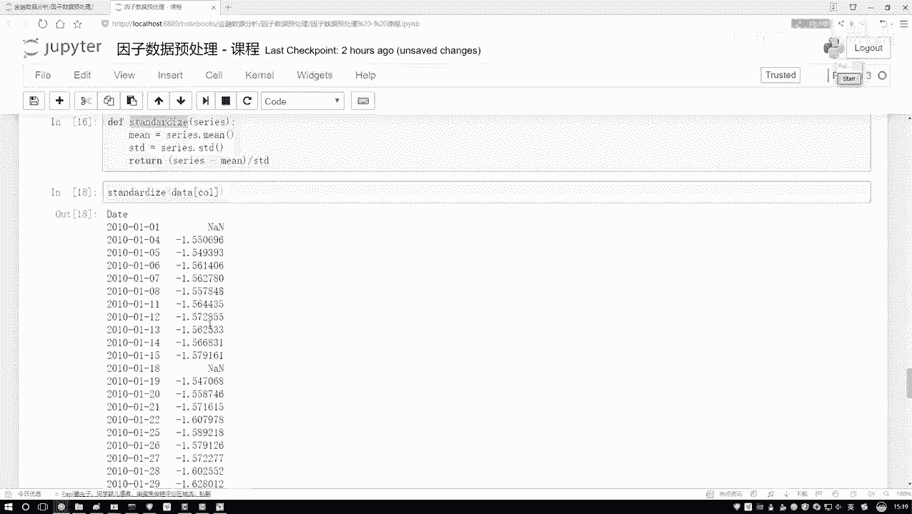

```python
# 假设data是包含原始数据的Pandas Series或DataFrame的某一列
standardized_result = standardize(data)
print(standardized_result)
```

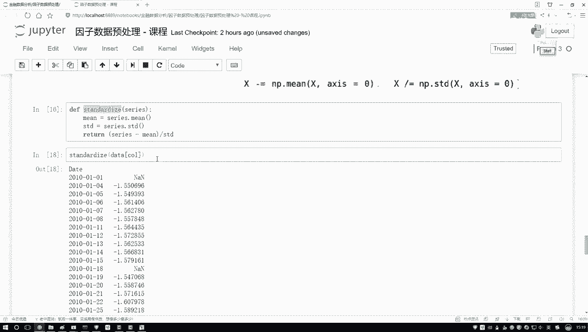

处理后的结果如下图所示：

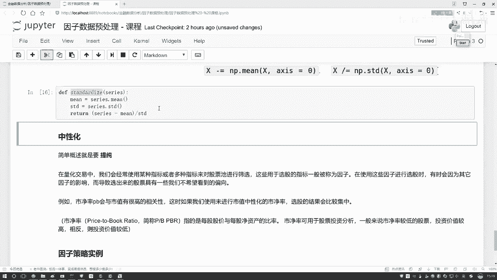


观察可知，所有数值都被转换到了一个相对较小且集中的区间内（通常大部分值在[-3, 3]之间），不同特征之间不再存在量级差异。

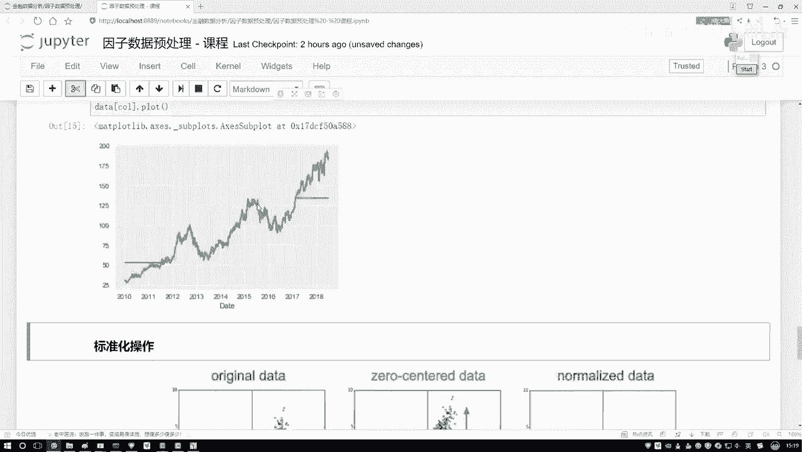

## 总结

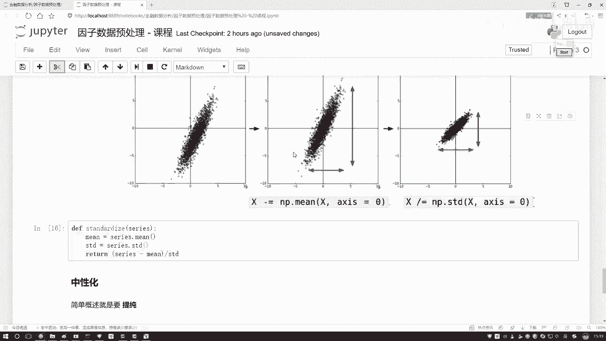

本节课中我们一起学习了数据标准化处理。
*   **目的**：消除不同特征因量纲和取值范围不同造成的分析偏差。
*   **原理**：通过**去均值**使数据以零为中心对称，再通过**除标准差**将所有特征的取值范围调整到近似相同的尺度。
*   **公式**：核心公式为 **`z = (x - μ) / σ`**。
*   **实现**：可以手动根据公式计算，也可以直接调用如Scikit-learn的`StandardScaler`等专业工具。
标准化是数据预处理中的一项基础且关键的操作，在大多数数据挖掘和机器学习流程中，它都是不可或缺的第一步。