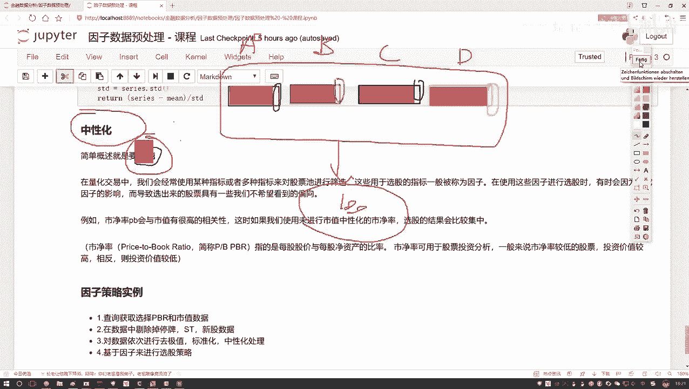
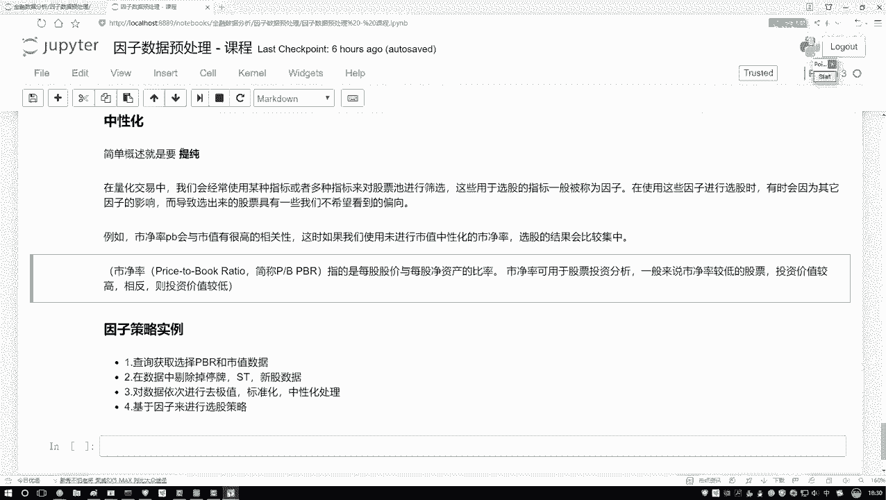

# Python金融量化分析：P33：中性化处理方法通俗解释

在本节课中，我们将要学习量化分析中的一个重要概念——**中性化**。我们将通过一个简单的例子理解它的目的和意义，并了解其基本计算方法。

## 概述：什么是中性化？

上一节我们介绍了因子分析的基础，本节中我们来看看如何让因子分析的结果更“纯粹”。中性化的核心目的是**提纯**。

为了理解“提纯”，我们先看一个例子。假设我们设计了一个选股策略，使用了A、B、C、D四个不同的因子。理论上，这四个因子应该从不同角度帮助我们筛选股票。

但实际操作中，你可能会发现一个现象：无论你如何调整这四个因子的权重或组合，最终选出的股票池总是高度相似，总是那几只股票。这是为什么呢？

原因可能在于，这四个看似不同的因子，其内部绝大部分的“成分”是相同的。例如：
*   因子A（如市净率）的数值，绝大部分受**市值**大小的影响。
*   因子B、C、D的数值，也绝大部分与**市值**高度相关。

这样一来，无论你使用哪个因子，最终起决定性作用的几乎都是“市值”这个共同因素。其他因子自身独特的、有价值的信息就被掩盖了。这就好比从四个同学中选代表，我们希望看到他们各自的**个性**，而不是他们共有的常识（比如都会吃饭）。

**中性化**要做的，就是从每个因子中，剔除掉这些共有的、普遍的影响（如市值的影响），从而提取出该因子**独特的、有价值的部分**。这个过程就是“提纯”。

## 中性化在量化交易中的应用

在量化交易中，我们经常使用多个指标（因子）对股票池进行筛选，以决定买入或卖出哪些股票。

然而，在使用因子选股的过程中，有时会因为某些共同因素的强烈影响（例如，几乎所有因子都与市值高度相关），导致选出的股票具有我们不希望看到的**倾向性**。例如，选股结果总是集中在某几个大盘股或小盘股上，无法体现策略的多样性和因子本身的特性。

以**市净率（P/B Ratio）** 为例，其计算公式为：
**市净率 = 每股股价 / 每股净资产**
其中，每股净资产 = （公司总资产 - 公司总负债）/ 总股本。

在投资中，通常认为市净率较低的股票可能更具投资价值（“便宜”或安全边际更高）。但市净率本身很容易受到公司市值规模的影响。如果不进行中性化处理，直接用市净率选股，结果可能会严重偏向某一特定市值区间的股票，无法纯粹地反映“估值便宜”这个特性。

## 中性化的计算方法



理解了中性化的目的后，我们来看看其核心的计算思路。由于在本地Notebook中通常无法直接获取实时、完整的股票因子数据（如市值、市净率），我们将在量化平台中进行代码演示。这里先介绍原理。

中性化处理通常通过回归分析来实现。基本步骤如下：

1.  **确定目标因子与风格因子**：首先，明确你要提纯的**目标因子**（如市净率），以及你认为需要剔除其影响的**共同因素**，即**风格因子**（最典型的就是市值）。
2.  **建立回归方程**：将目标因子作为因变量（Y），将风格因子作为自变量（X），建立线性回归模型。公式可以表示为：
    `目标因子 = α + β * 风格因子 + ε`
3.  **提取残差**：进行回归后，得到的残差（ε）就是剔除了风格因子影响后的部分。这个残差序列就是**中性化后的因子值**。它代表了目标因子中不能被风格因子解释的、独特的信息。

以下是该过程的简化代码逻辑描述：
```python
# 伪代码示例
# 假设 df 是包含股票代码、日期、市净率(pb)和市值(mv)的DataFrame
import statsmodels.api as sm

# 对某一时间截面（某一天）的数据进行处理
daily_data = df[df[‘date‘] == ‘2023-01-01‘]

# 准备变量：Y是市净率，X是市值（通常取对数）
Y = daily_data[‘pb‘]
X = sm.add_constant(np.log(daily_data[‘mv‘])) # 添加常数项

# 执行线性回归
model = sm.OLS(Y, X).fit()

# 获取残差，即为中性化后的市净率因子
neutralized_pb = model.resid
```
通过以上步骤，`neutralized_pb`就不再包含市值的影响，更能纯粹地反映股票的估值水平差异。

## 总结

本节课中我们一起学习了**因子中性化**的概念与方法。
*   我们首先通过一个生动的例子，理解了中性化的目的是**提纯**，即从因子中剔除共性影响（如市值），提取其独特信息。
*   接着，我们探讨了中性化在量化选股中的实际意义：避免选股结果因共同因素而产生偏差，使因子能更纯粹地发挥作用。
*   最后，我们介绍了中性化的核心计算方法——**通过线性回归提取残差**，并给出了大致的代码逻辑。



下一节，我们将在量化平台中实际操作，演示如何获取市值、市净率等数据，并完成完整的中性化处理流程。