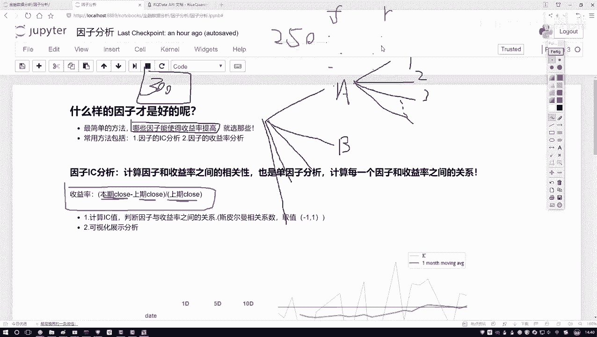
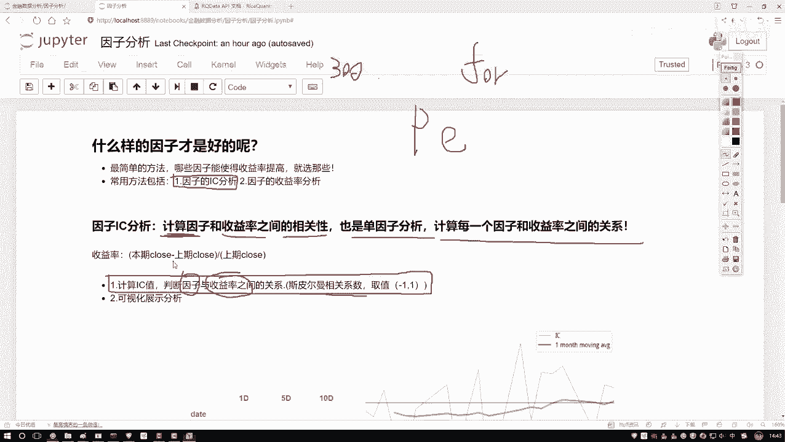
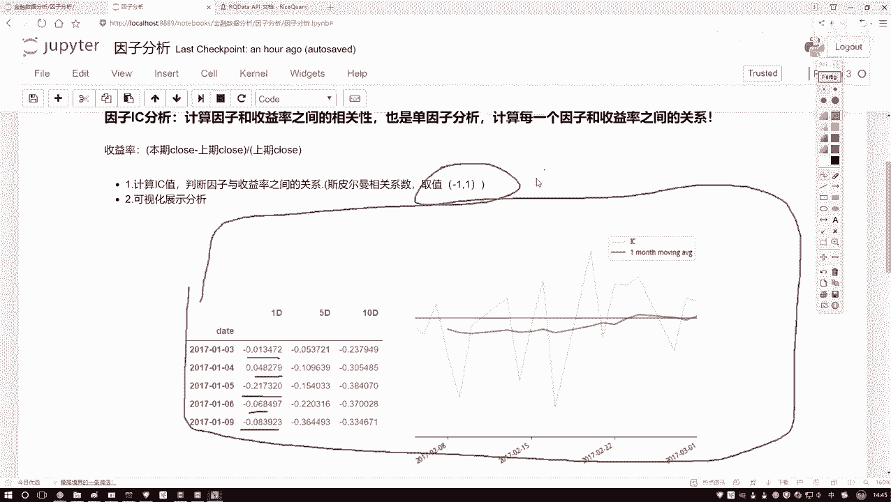

# Python金融量化分析：P40：因子分析概述 📊

在本节课中，我们将要学习因子分析的核心概念。因子分析是量化投资中筛选有效指标的关键步骤，它帮助我们判断哪些因子（如财务指标、技术指标）对股票收益率有显著影响，从而为构建投资策略提供依据。

## 因子分析的目标 🎯

上一节我们介绍了量化分析的基本框架，本节中我们来看看如何从众多候选因子中筛选出有效的部分。假设我们手中有300个不同的因子指标，例如基本面指标A、技术指标B等。这些因子可以进一步细分为多个类别和子类别。

问题在于，当我们进行策略回测或设计时，不可能同时使用所有300个因子。因此，我们需要对这些因子进行排序和评估，判断哪些因子对最终的投资收益有正面贡献，哪些没有贡献甚至可能有负面影响。换句话说，我们需要根据每个因子对收益率的“贡献度”进行打分和排序。

## 评估因子的方法：收益率与相关性 🔍

要判断一个因子是否“好”，最基本的方法是观察它与收益率的关系。首先，我们需要理解收益率的计算。

收益率计算公式如下：
`收益率 = (当日收盘价 - 前一日收盘价) / 前一日收盘价`

这个公式计算的是股票在某个周期（如一天）内的价格变动百分比。我们的目标是实现长期盈利，因此关注的是因子值的变化与收益率变化之间的关系。

我们拥有连续一段时间（例如一年250个交易日）的数据。对于每一天，我们都有一个因子值（记为 **F**）和一个对应的收益率值（记为 **R**）。我们需要分析因子 **F** 的走势与收益率 **R** 的走势之间存在何种关系：是正相关、负相关，还是无关？

## 因子分析的核心：IC值计算 📈

因子分析主要包含两部分工作，第一项是计算因子的**IC值**。

**IC** 是信息系数的缩写，它衡量的是因子与收益率之间的相关性。具体来说，我们通常使用**斯皮尔曼秩相关系数**来计算IC值。

IC值的计算公式（概念）如下：
`IC = spearman_corr(因子值序列， 收益率序列)`

斯皮尔曼相关系数的取值范围在 **-1** 到 **1** 之间：
*   **越接近 1**：表示因子与收益率之间存在强正相关关系。
*   **越接近 -1**：表示存在强负相关关系。
*   **越接近 0**：表示两者之间几乎没有线性相关关系。

这个过程也称为**单因子分析**。因为我们需要在收益率相对固定的前提下，逐一评估每一个因子与它的关系。在代码实现上，这通常通过一个循环来完成，遍历所有因子，分别计算每个因子与收益率序列的斯皮尔曼相关系数，得到各自的IC值。

## IC值的分析与可视化 📉

计算出每个因子的IC值后，我们需要对其进行分析。常见的分析包括观察IC值的时间序列。

以下是IC值分析中常见的可视化图表及其解读：

*   **IC值序列图**：该图展示了IC值随时间（如每日）的变化情况。通过折线图，我们可以直观地看到因子有效性的稳定性和周期性。
*   **IC值移动平均线**：在IC值序列图上，通常会叠加一条移动平均线（例如10日移动平均）。这条均线有助于平滑短期波动，更清晰地展示IC值的长期趋势。

通过分析这些图表，我们可以：
1.  识别出IC值持续较高（接近1或-1）的因子，这些因子与收益率关系密切，值得进一步研究。
2.  过滤掉IC值持续接近0的因子，这些因子对预测收益率的帮助不大。
3.  观察IC值的正负，以判断因子与收益率是正相关还是负相关，这对于理解因子的经济含义和构建多空策略至关重要。

## 总结 ✨

本节课中我们一起学习了因子分析的基础知识。我们首先明确了因子分析的目标是从海量指标中筛选有效因子。接着，我们介绍了通过计算因子与收益率之间的**斯皮尔曼相关系数**来得到**IC值**，以此量化因子的预测能力。最后，我们了解了如何通过分析IC值的时间序列图和移动平均线来评估因子的有效性和稳定性。掌握这些内容是进行量化选股和策略构建的重要第一步。