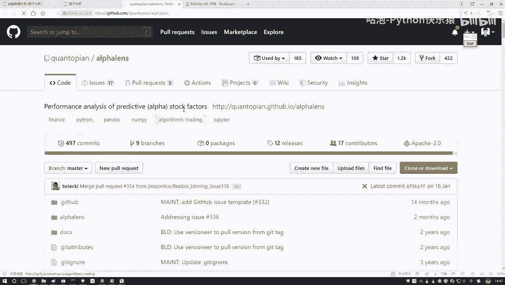
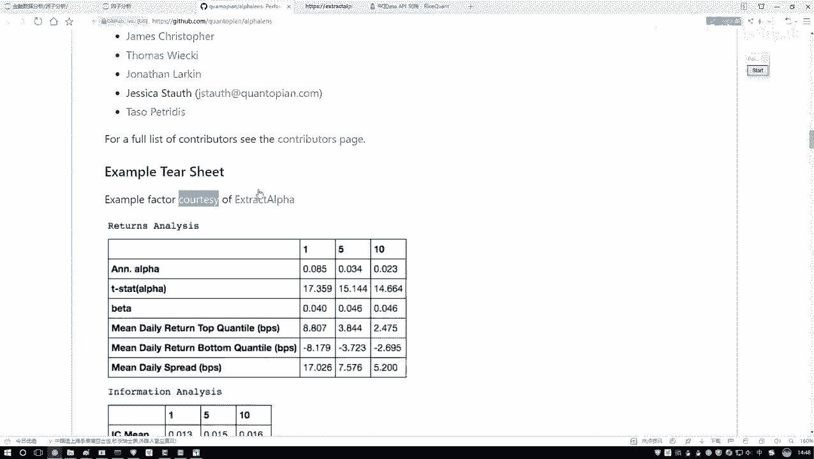
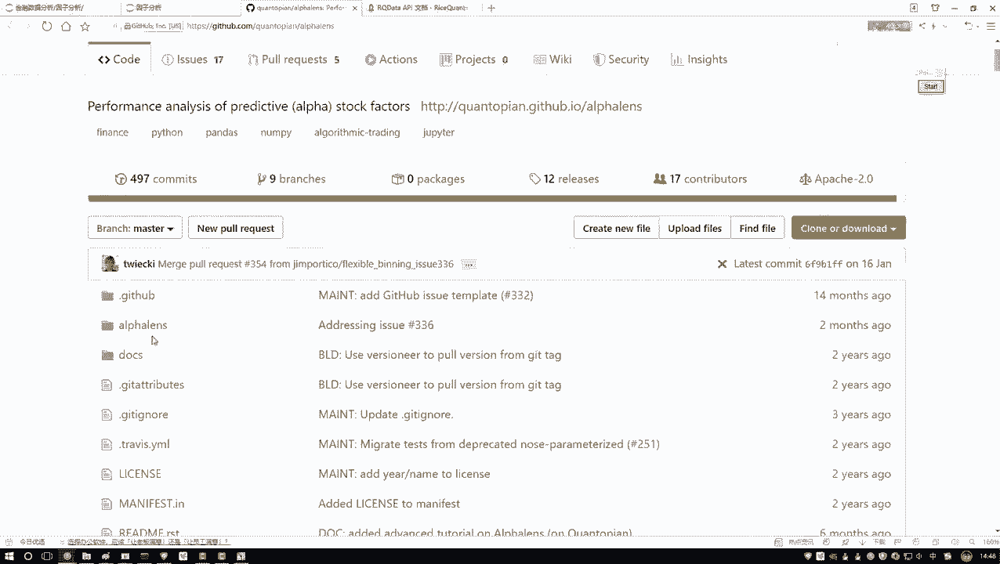
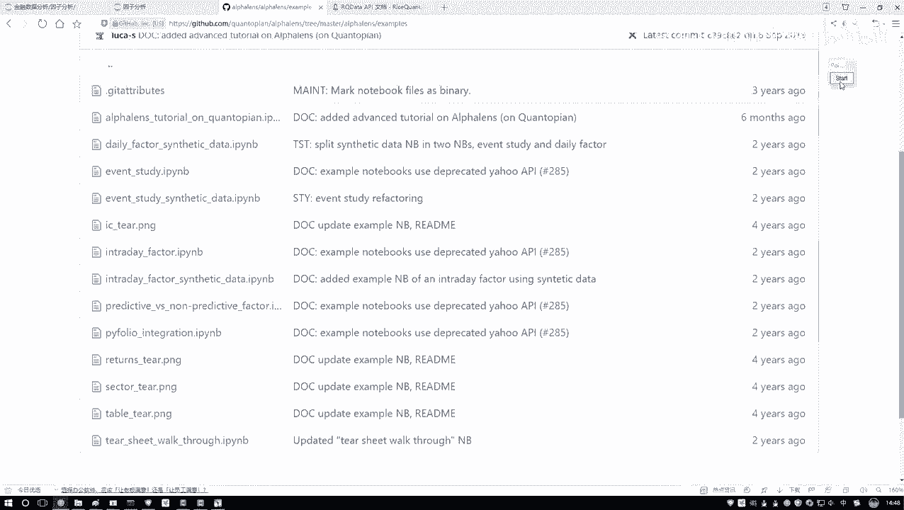
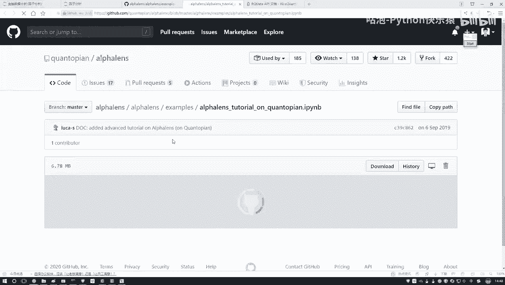
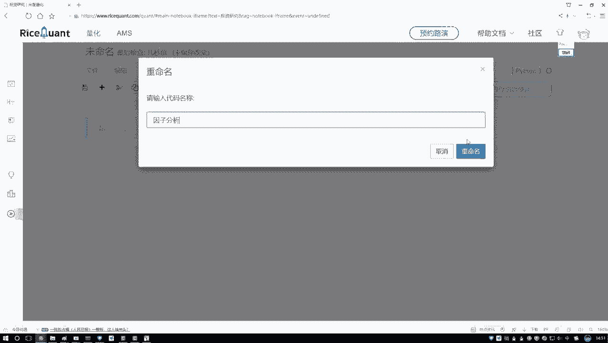

# Python金融量化分析：P41：Alphalens工具包介绍 📊

在本节课中，我们将学习一个名为Alphalens的强大工具包。这个工具包专门用于金融因子分析，它能帮助我们自动完成复杂的计算和图表绘制工作，极大地简化了量化分析流程。

## 工具包简介与获取

上一节我们介绍了因子分析的基本概念，本节中我们来看看如何利用现成的工具来高效完成这些分析。

Alphalens是一个专门用于因子分析的Python工具包。它的核心功能是帮助我们计算因子的评价指标（如IC值、IR值）并生成一系列分析图表，无需我们手动编写复杂的计算和绘图代码。

以下是获取和了解Alphalens的步骤：
*   **安装**：通过pip命令即可安装。在命令行或Anaconda Prompt中执行：`pip install alphalens`。
*   **官方资源**：
    *   **GitHub仓库**：`https://github.com/quantopian/alphalens`。这里可以查看源代码、报告问题以及了解安装详情。
    *   **使用文档**：`https://alphalens.readthedocs.io/en/latest/`。这里提供了详细的API说明和函数用法。
*   **学习示例**：在GitHub仓库的 `examples/` 目录下，官方提供了丰富的示例代码（Jupyter Notebook格式）。这些是学习如何使用Alphalens的最佳材料，本节课的内容也主要参考了这些官方示例。

## 分析环境准备

了解了工具包后，我们需要一个合适的环境来运行分析代码。由于因子分析需要获取大量的金融市场数据，在个人电脑上操作较为麻烦。

因此，我们将使用量化交易平台提供的在线研究环境。这个环境预装了Alphalens等常用库，并且可以直接调用平台的数据接口，非常方便。

以下是进入在线研究环境的步骤：
1.  登录量化交易平台。
2.  在左侧功能栏中找到并点击 **“投资研究”** 模块。
3.  点击 **“新建”** 按钮，创建一个新的Python 3研究文件。
4.  将新建的文件重命名为 **“因子分析”** 或其他易于识别的名称。

这样，我们就得到了一个在平台服务器上运行的Jupyter Notebook环境，接下来可以在这里编写和运行我们的因子分析代码。

## 总结

本节课中我们一起学习了Alphalens工具包及其使用环境。
*   我们认识了**Alphalens**，它是一个能自动化完成因子计算和可视化的强大工具。
*   我们知道了如何通过`pip`安装它，并找到了其**官方文档**和**示例代码**以供深入学习。
*   最后，我们介绍了在**量化平台的在线研究环境**中进行分析的优势，并完成了研究文件的创建。

接下来，我们就可以在这个准备好的环境中，开始利用Alphalens进行实际的因子分析实战了。