# Python金融量化分析：P44：数据格式转换 📊

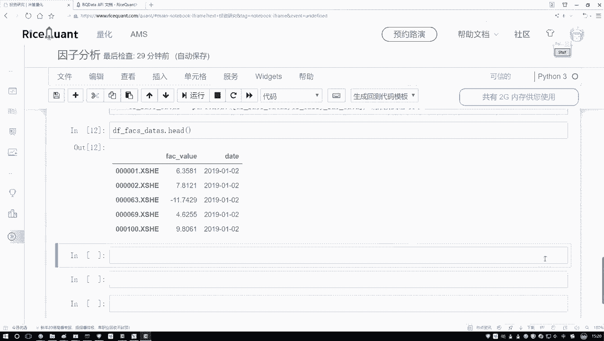

在本节课中，我们将学习如何将数据处理成特定工具包（如Alphalens）所要求的格式。这是进行后续量化分析（如计算IC值）的必要准备步骤。我们将通过重新设置数据索引和进行数据预处理（去除异常值、标准化）来完成这一任务。

---

上一节我们介绍了如何获取和初步处理数据，本节中我们来看看如何转换数据格式以满足特定分析工具的要求。

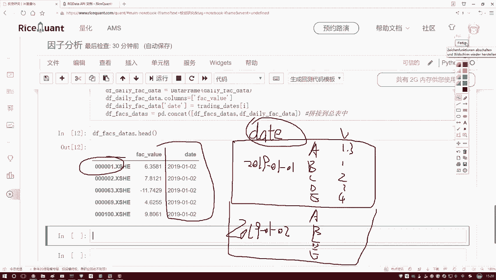

Alphalens工具包要求数据具有特定的格式。它需要一个以日期和股票代码为多级索引的`DataFrame`，其中包含我们关心的指标值。这与我们当前的数据结构不同，因此需要进行转换。

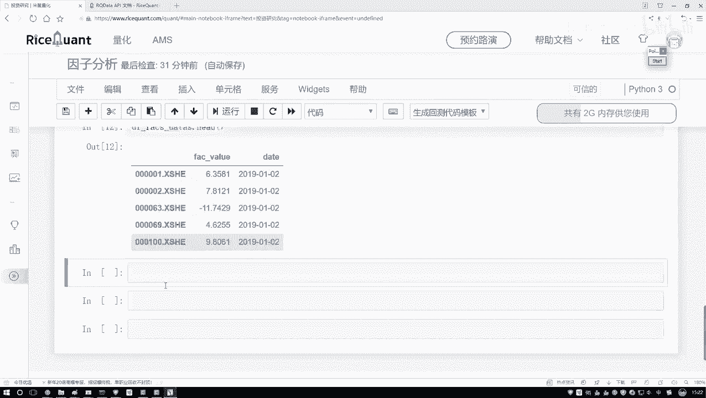

以下是转换数据格式的核心步骤：

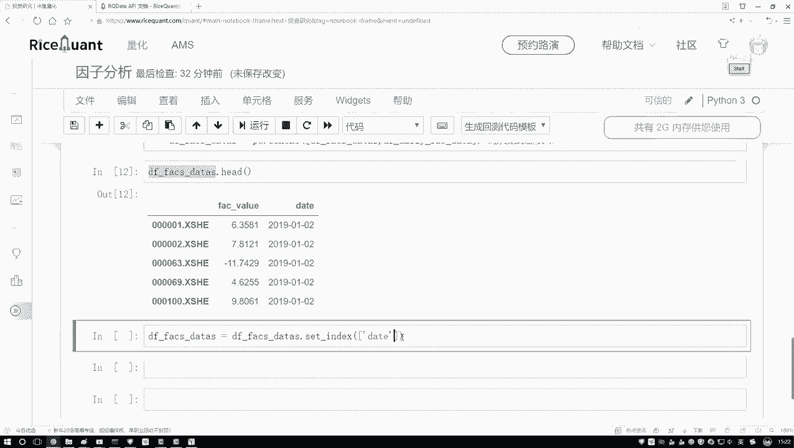

首先，我们需要将`date`和股票的`code`（即指标数据的索引）设置为新的多级索引。这可以通过`pandas`的`set_index`方法实现。

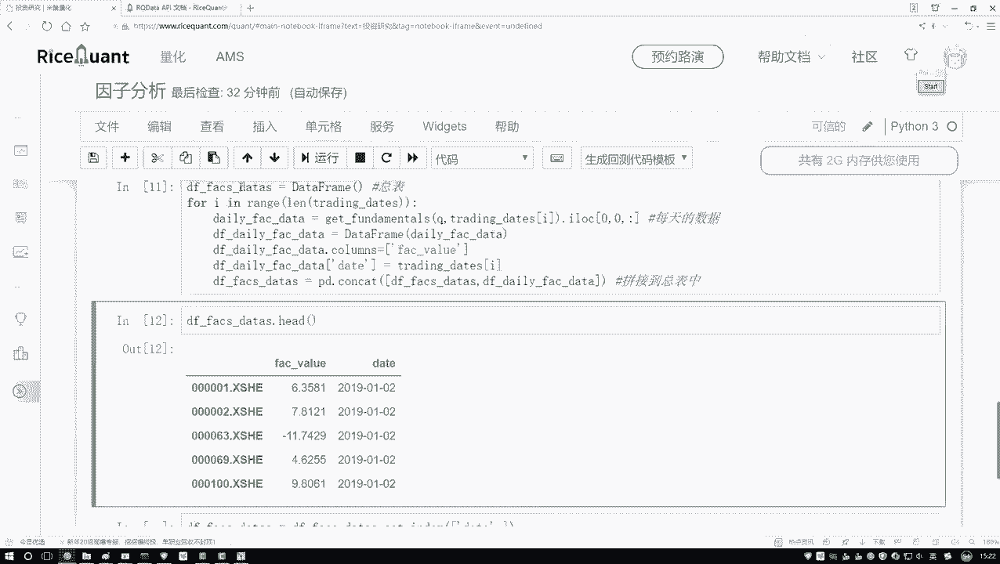

```python
# 假设 df 是原始数据，其中包含‘date’列和指标数据
# 假设 indicator_series 是指标数据，其索引为股票代码
multi_index_df = df.set_index(['date', indicator_series.index])
```

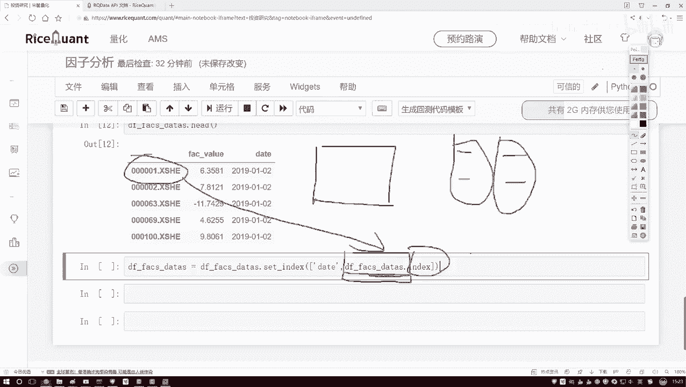

执行上述代码后，数据将变为以日期为第一级、股票代码为第二级的索引结构，对应的值就是我们计算出的指标。这种格式符合Alphalens的输入要求。

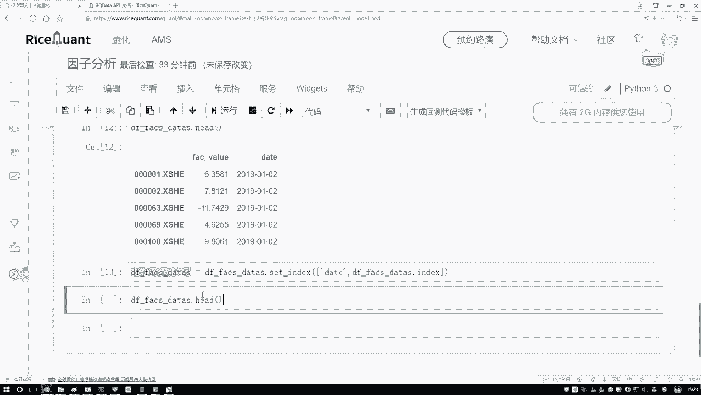

---

完成格式转换后，我们通常还需要对数据进行预处理，以确保分析结果的稳健性。这主要包括去除极端异常值和标准化。

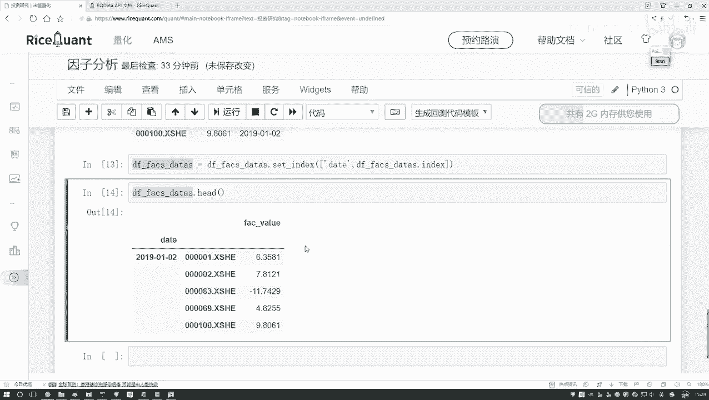

以下是预处理的两个关键操作：

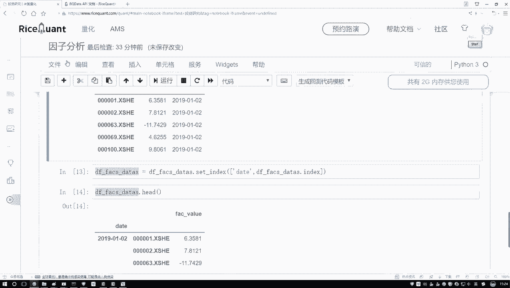

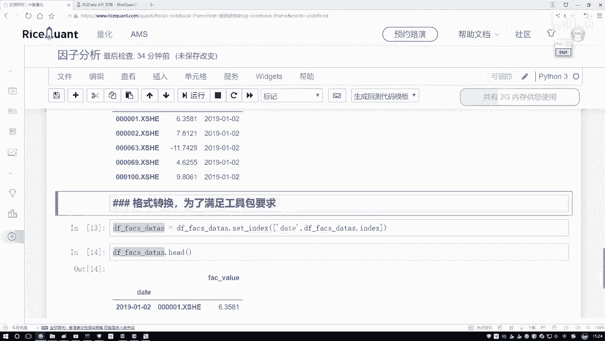

1.  **去除异常值（Winsorization）**：我们将指标值限制在特定的分位数范围内（例如，2.5%和97.5%），超出范围的值将被替换为边界值。这可以防止极端值对后续分析产生过大影响。
    *公式：* `value_clipped = max(min(value, upper_bound), lower_bound)`

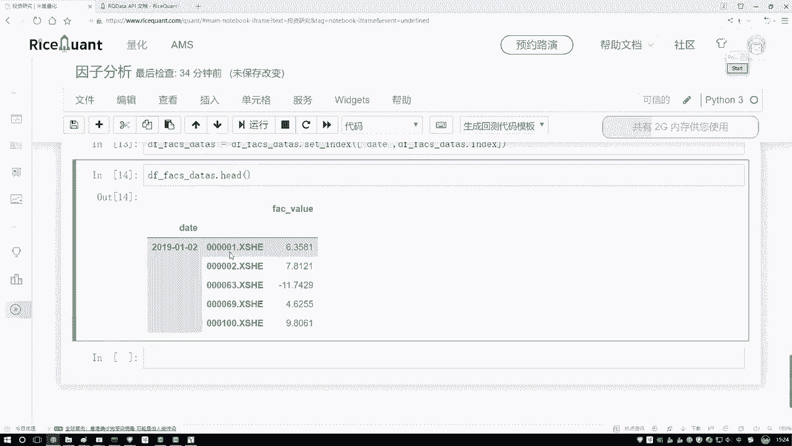

2.  **标准化（Standardization）**：我们对每个交易日的数据分别进行标准化，使其均值为0，标准差为1。这有助于不同股票间的指标具有可比性。
    *公式：* `value_standardized = (value - mean) / std`

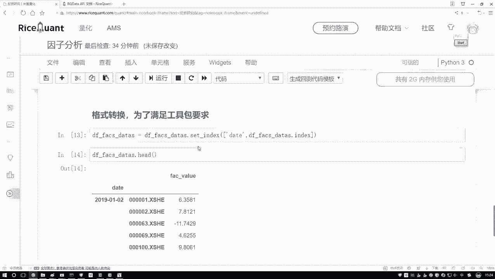

我们可以将这两个步骤封装成一个函数，并对每一天的数据应用此函数。

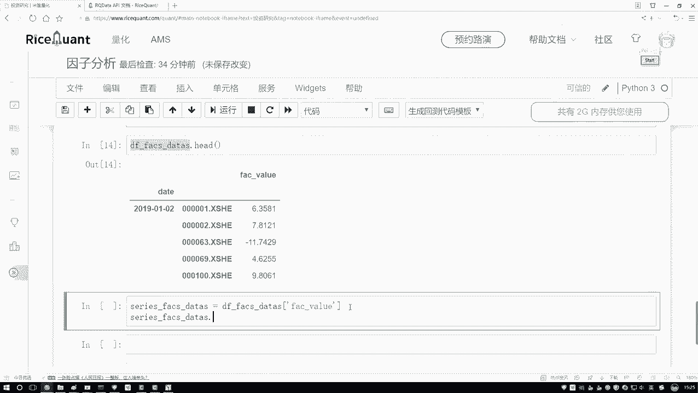

```python
def preprocess_series(series):
    # 去极值
    q_low = series.quantile(0.025)
    q_high = series.quantile(0.975)
    series_clipped = series.clip(lower=q_low, upper=q_high)
    # 标准化
    series_standardized = (series_clipped - series_clipped.mean()) / series_clipped.std()
    return series_standardized

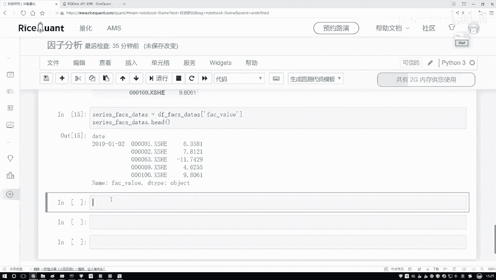

# 按日期分组并应用预处理函数
processed_data = multi_index_df.groupby(level=‘date’).apply(preprocess_series)
```

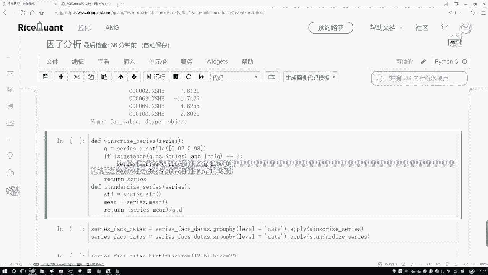

处理完成后，我们可以通过绘制直方图等方式，直观地观察处理后的数据分布是否更加规范。

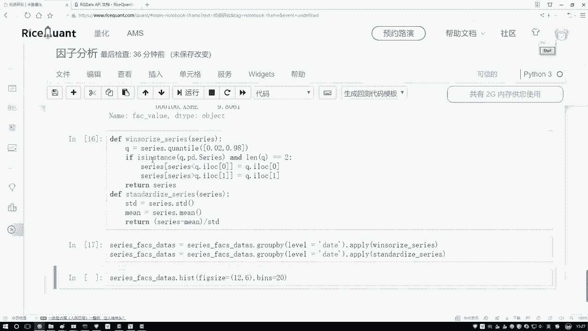

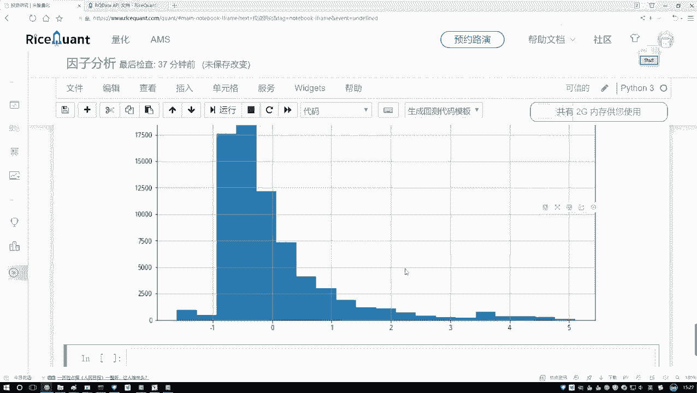

---

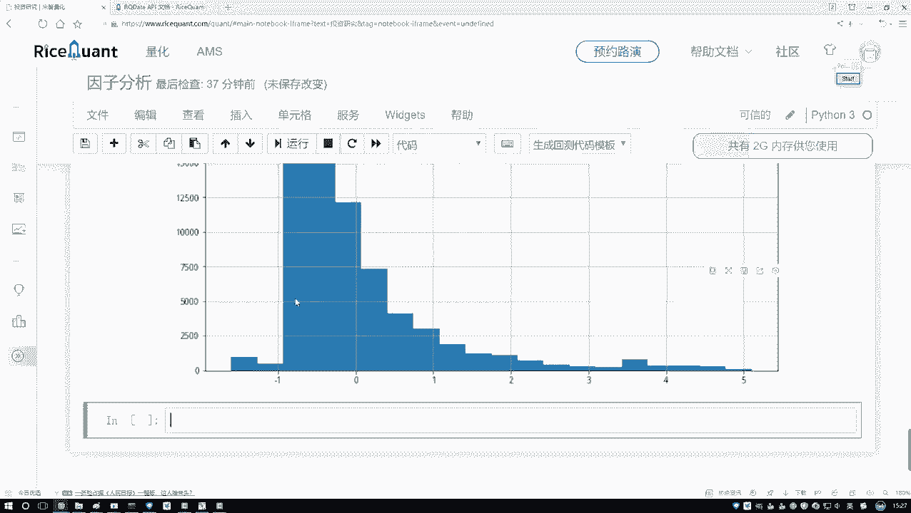

本节课中我们一起学习了为使用Alphalens工具包而进行的数据格式转换与预处理。我们首先将数据重构为以日期和股票代码为索引的多维格式，然后进行了去除异常值和标准化处理，为后续的因子IC值计算等量化分析打下了坚实的基础。