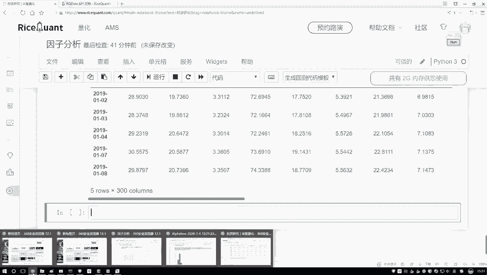
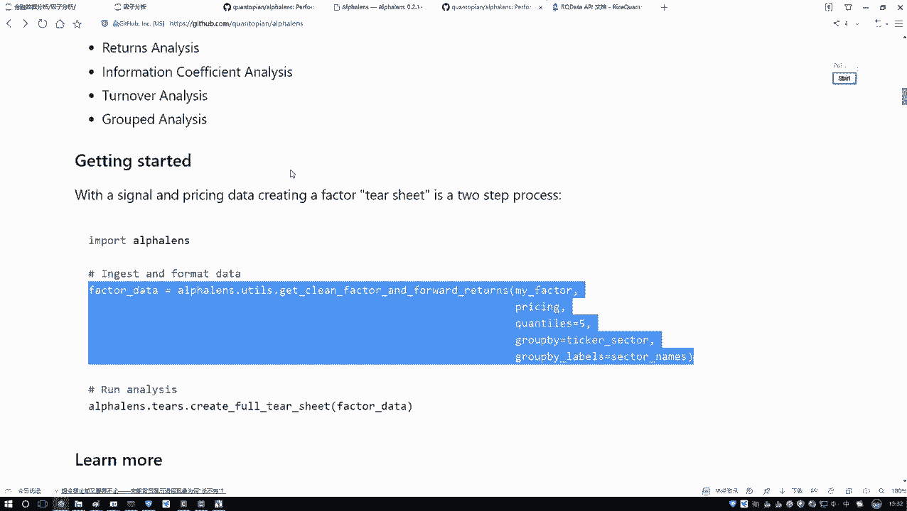
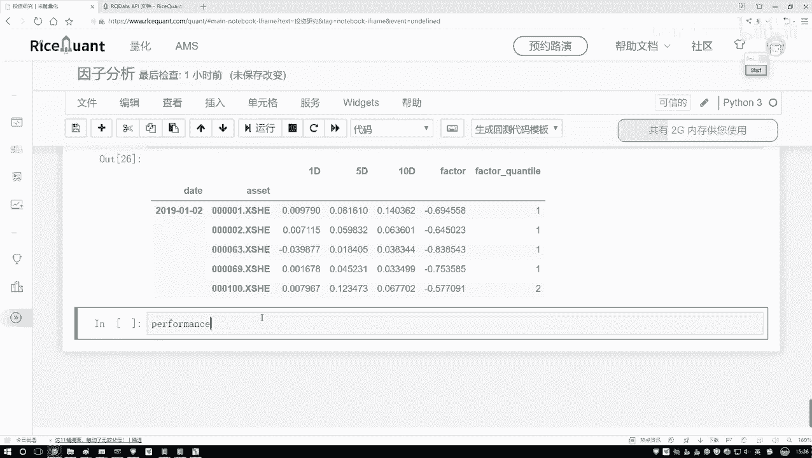
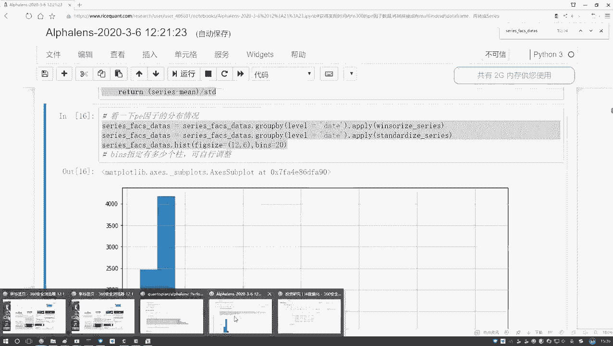
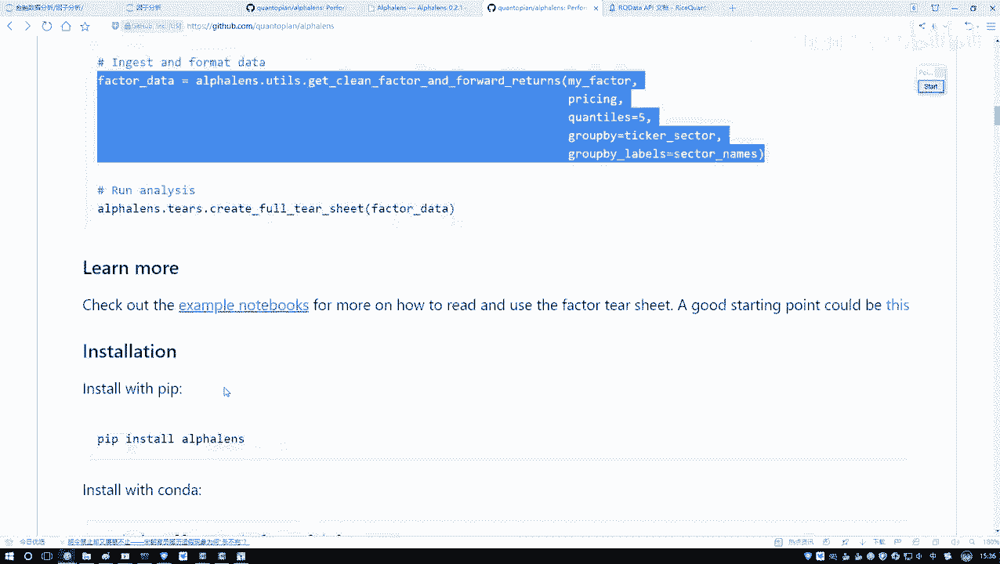
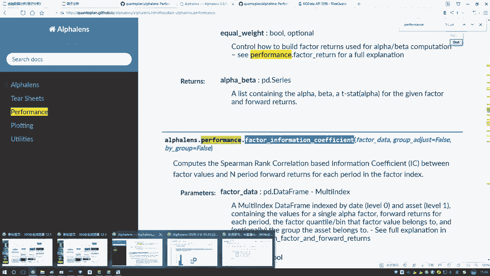
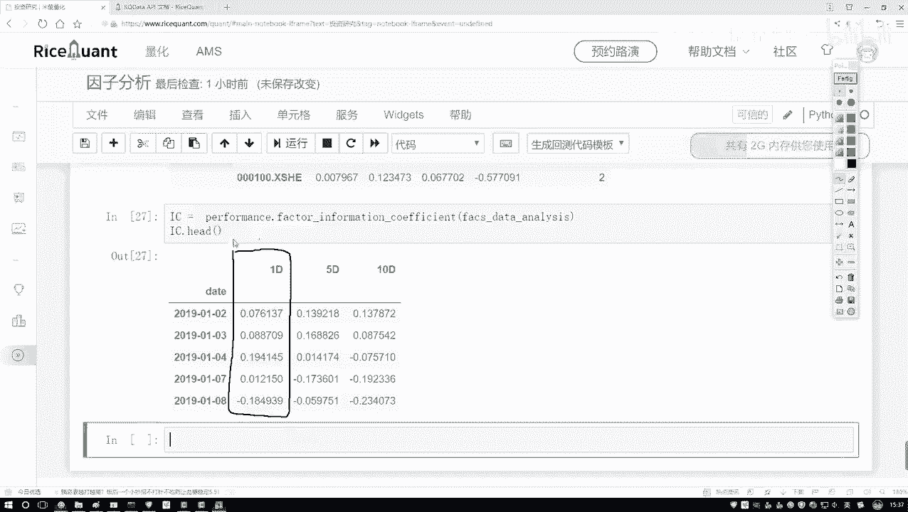

# Python金融量化分析：P45：IC指标值计算 📊

在本节课中，我们将学习如何计算IC指标值。IC值用于衡量因子（如技术指标）与未来收益率之间的相关性，是量化选股中评估因子有效性的核心指标。我们将通过获取股票价格数据、处理因子数据，并最终计算斯皮尔曼秩相关系数来完成IC值的计算。

## 获取收盘价数据

上一节我们介绍了因子的计算，本节中我们来看看如何获取计算IC值所需的实际收益率数据。计算收益率需要股票的每日收盘价。

以下是获取收盘价数据的步骤：

1.  使用 `get_price` 函数获取指定股票池在特定时间段内的价格数据。
2.  从返回的多维数据中提取“收盘价”这一列，将其转换为二维的 `DataFrame`。
3.  为 `DataFrame` 设置合适的索引和列名，以便后续处理。

```python
# 获取股票池的收盘价数据
price = get_price(
    stock_pool,  # 股票池列表
    start_date='2019-01-01',
    end_date='2020-01-01',
    fields=['close']  # 指定获取收盘价
)



# 提取收盘价数据，并整理格式
close_price = price['close']
close_price.index.name = 'date'
close_price.columns.name = 'code'
```

执行上述代码后，我们得到一个以日期为索引、股票代码为列的收盘价 `DataFrame`，数据准备就绪。



## 数据格式转换

有了原始的因子数据和收盘价数据后，我们需要将它们转换为量化分析库要求的统一格式，以便进行相关性计算。

这个过程调用一个专用的格式转换函数。该函数接收处理好的因子数据和价格数据作为输入。

```python
# 导入必要的工具库
from utils import convert_to_analysis_format

# 进行数据格式转换
factor_data = your_factor_data  # 假设这是之前计算好的因子DataFrame
analysis_data = convert_to_analysis_format(factor_data, close_price)
```

转换后的 `analysis_data` 是一个包含多列的结构化数据，其中关键列包括：
*   `date`: 日期
*   `code`: 股票代码
*   `factor`: 因子值
*   `1D`: 未来一期的收益率（即 `(今日收盘价 - 昨日收盘价) / 昨日收盘价`）
*   `factor_quantile`: 因子值分组（默认分为5组，1代表因子值最小的20%，5代表因子值最大的20%）

## 计算IC值

数据转换完成后，我们就可以计算IC指标了。IC值通常使用斯皮尔曼秩相关系数来计算，它衡量的是因子排名与未来收益率排名之间的单调关系。

以下是计算IC值的步骤：



1.  从量化分析库的 `performance` 模块中调用计算因子信息系数（IC）的函数。
2.  将上一步转换好的 `analysis_data` 传入该函数。
3.  函数将返回一个包含每日IC值的序列。





```python
# 从performance模块导入计算IC的函数
from performance import factor_information_coefficient

# 计算IC值
ic_series = factor_information_coefficient(analysis_data)

# 查看前几日的IC值
print(ic_series.head())
```



执行代码后，`ic_series` 就是一个以日期为索引的 `Series`，其值即为每日的IC指标值。正值通常表示因子与未来收益率正相关，负值则表示负相关。



本节课中我们一起学习了IC指标值的完整计算流程：从获取收盘价数据开始，到进行必要的数据格式转换，最后利用专用函数计算斯皮尔曼秩相关系数得到IC值。理解并计算IC值是评估量化因子有效性的基础。