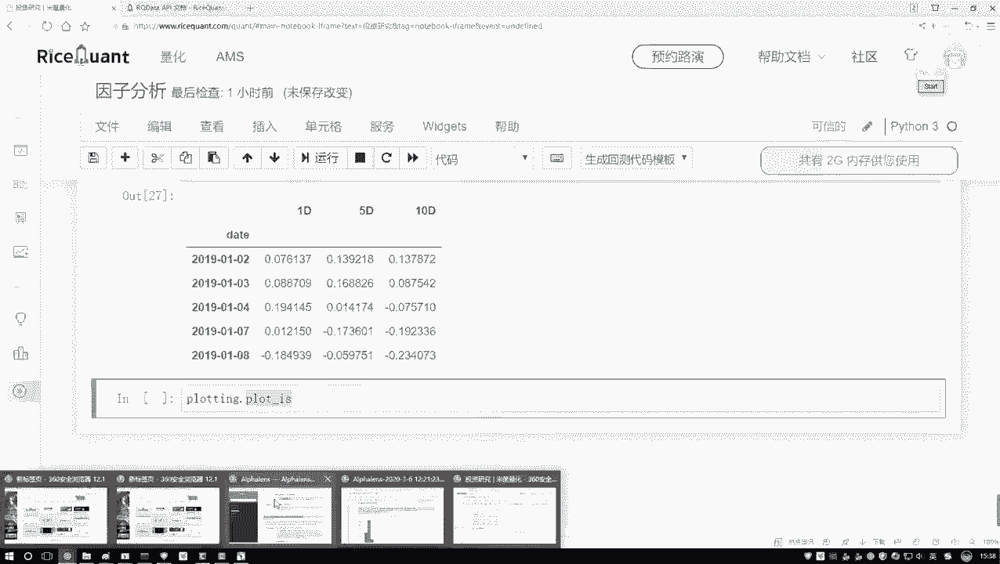
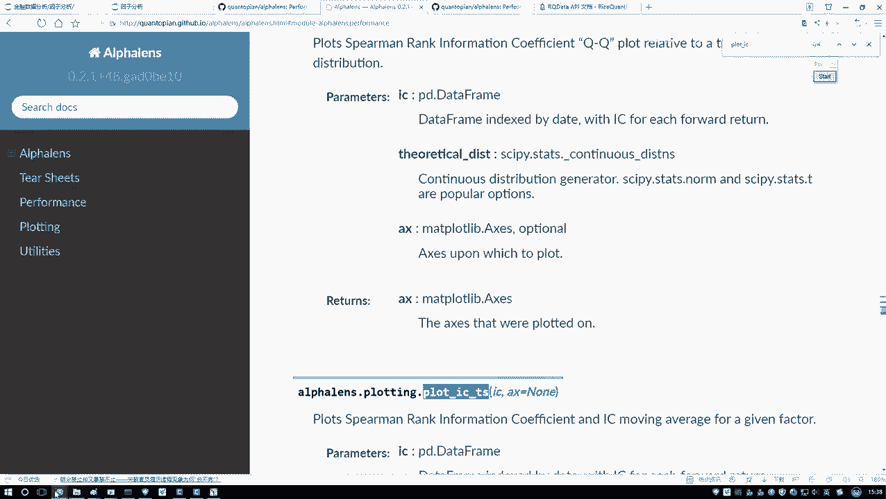
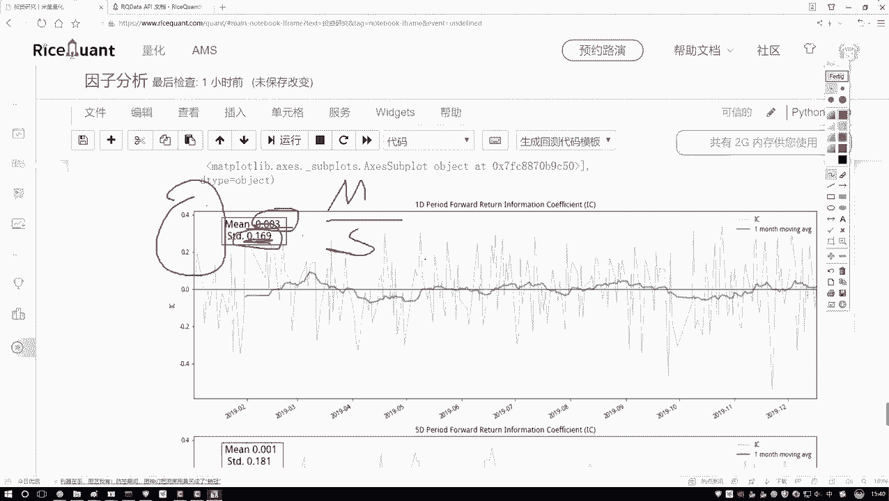
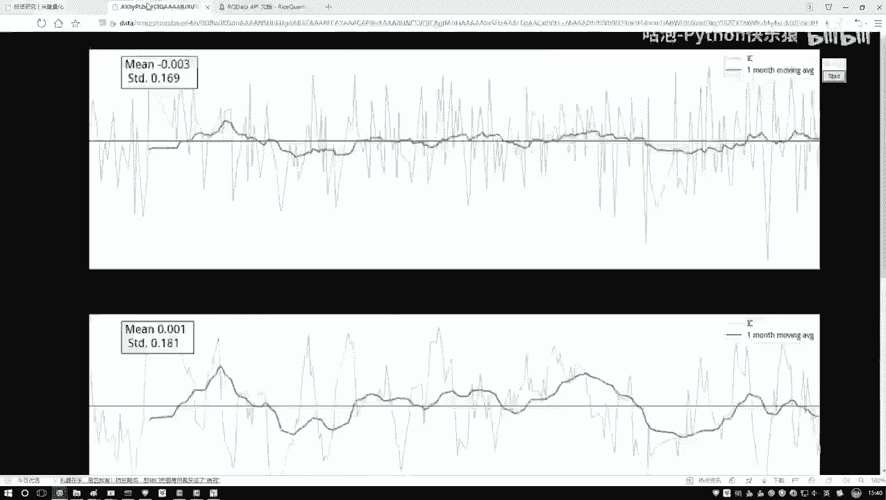
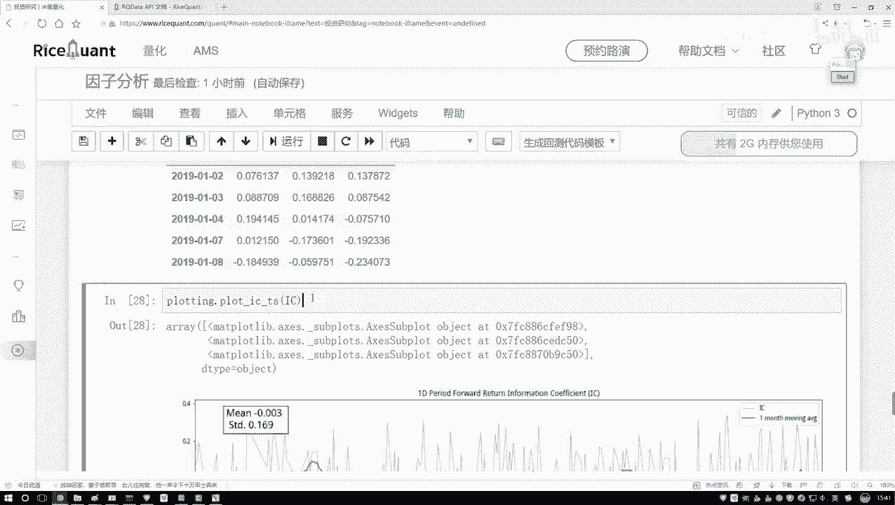
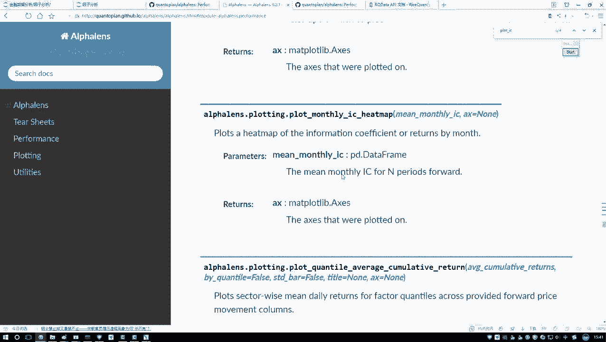
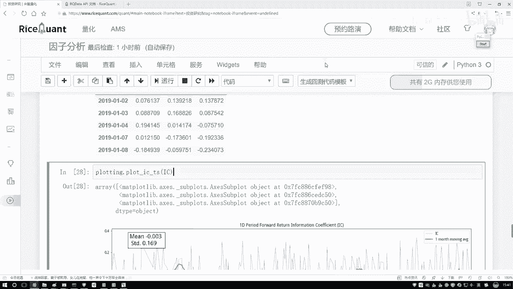

# Python金融量化分析：P46：工具包绘图展示 📊

在本节课中，我们将学习如何使用工具包将计算得到的因子IC值（信息系数）进行可视化展示。通过图表，我们可以更直观地观察因子与收益率相关性的时间序列走势及其稳定性。

上一节我们介绍了如何计算因子的IC值，本节中我们来看看如何将这些数值结果绘制成图表进行分析。

## 绘图工具导入与使用

我们导入一个名为 `proloting` 的工具包来辅助展示。该工具包提供了多种绘图函数。



以下是使用该工具包绘制IC时间序列图的步骤：

1.  调用 `protem.plot` 函数。
2.  使用 `ic_time_series` 方法来绘制IC值的时间序列。
3.  将计算好的IC值序列（例如 `ic_series`）作为参数传入。

```python
# 示例代码：绘制IC时间序列图
protem.plot.ic_time_series(ic_series)
```



执行上述代码后，系统会默认生成一张图表。

## 图表结果解读

生成的图表包含以下关键元素：

*   **蓝色曲线**：代表每日计算的实际IC值，其波动范围通常较大。
*   **绿色曲线**：代表以一个月为窗口计算的IC移动平均值，用于观察长期趋势。
*   **统计信息**：图表中会标注出IC序列的均值（Mean）和标准差（Std），以及由 **均值 / 标准差** 计算得到的信息比率（IR）。

观察图表时，我们应主要关注**绿色移动平均线**。通过其走势，可以判断因子有效性是否具有持续性。理想的因子通常希望其IC均值较大且趋势稳定。从当前示例图来看，绿色曲线较为平稳且均值较小，这可能意味着该因子与收益率的相关性不强，且缺乏明显的趋势性。

## 补充概念：信息比率

信息比率（Information Ratio, IR）的计算公式为：
**IR = Mean(IC) / Std(IC)**

它用于衡量因子IC值的稳定性。**比值越大，说明因子的预测能力越稳定**（因为标准差Std相对较小）。反之，则说明因子的表现波动较大。这是一个辅助评估因子质量的指标。

## 多周期结果展示



工具包不仅能展示单期（例如1期）的IC序列，还能自动计算并展示多期（如5期、10期）的IC结果，方便进行不同时间尺度下的分析。

## 其他可视化功能



除了时间序列图，该工具包的API文档中还提供了多种其他分析图表，例如：

*   **直方图（Histogram）**：查看IC值的分布情况。
*   **QQ图（Q-Q Plot）**：检验IC值是否服从正态分布。
*   **热力图（Heatmap）**：用颜色深浅直观展示不同维度下的数据关系。



这些功能在深入进行因子分析和策略归因时非常有用，本节课不逐一演示，大家可在实际需要时查阅文档使用。



---



本节课中我们一起学习了如何利用绘图工具包对因子IC值进行可视化分析。我们掌握了绘制IC时间序列图的方法，学会了解读图表中的移动平均线及信息比率，并了解了该工具包提供的其他高级分析图表功能。通过图形化展示，我们可以更高效、直观地评估因子的有效性和稳定性。