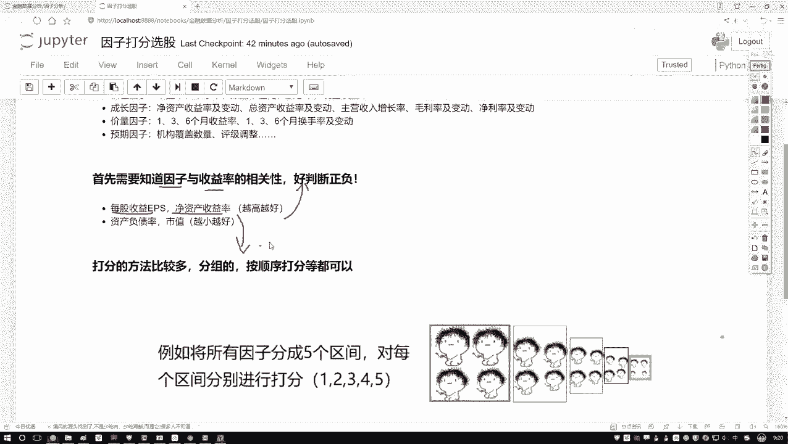
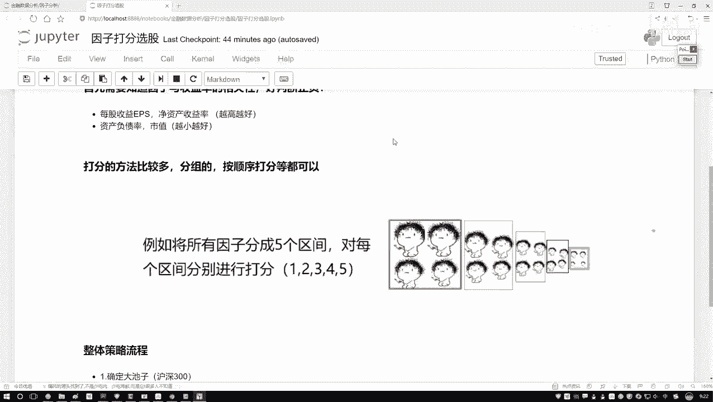
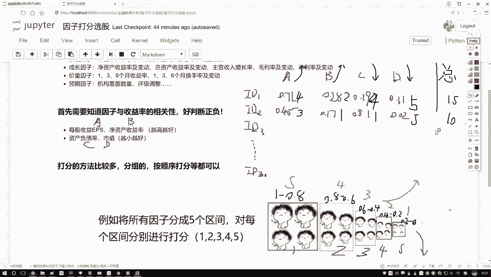
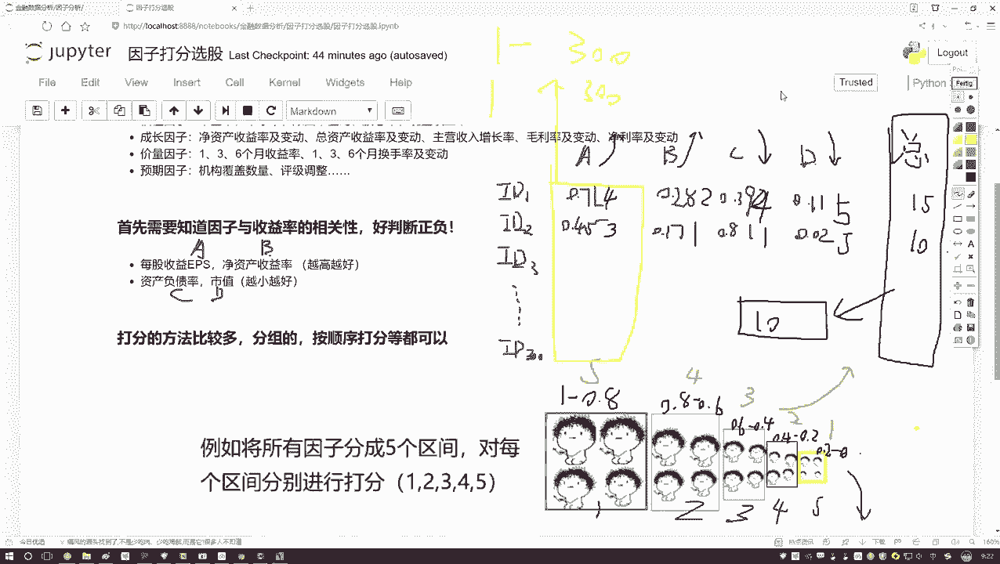
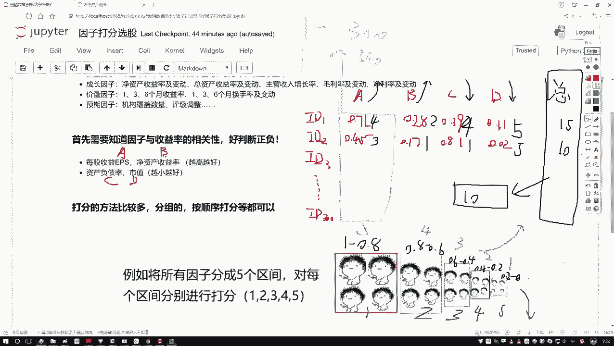
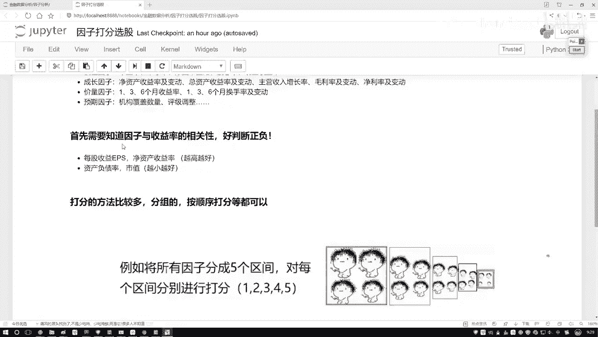
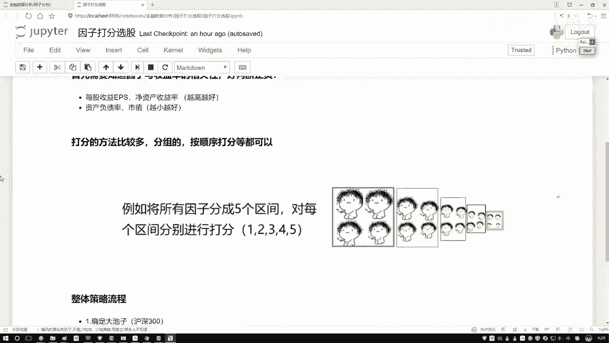
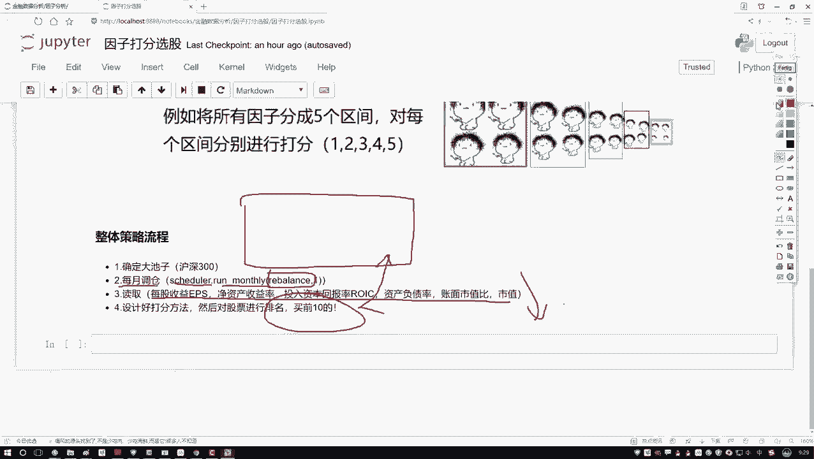
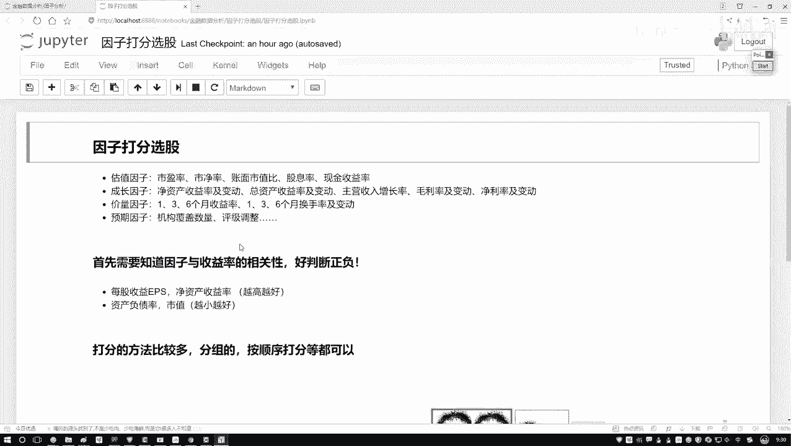

# Python金融量化分析：P49：整体任务流程梳理 📊



在本节课中，我们将学习如何为股票因子进行打分，并梳理一个完整的量化策略流程。我们将通过一个简单的例子，理解如何根据多个指标对股票进行评分和排序，从而选出表现最佳的股票组合。



---

## 数据准备与打分思路

上一节我们介绍了如何获取和预处理因子数据。本节中，我们来看看如何基于这些已知的因子值为股票打分。

假设我们有一个股票池，例如沪深300成分股。对于每只股票，我们计算了四个因子（A, B, C, D）的值。我们知道：
*   因子A和B的值**越大越好**。
*   因子C和D的值**越小越好**。

以下是示例数据：

| 股票ID | 因子A | 因子B | 因子C | 因子D |
| :----- | :---- | :---- | :---- | :---- |
| id1    | 0.71  | 0.28  | 0.39  | 0.11  |
| id2    | 0.45  | 0.17  | 0.81  | 0.02  |

我们的目标是为每只股票的每个因子打分，然后汇总得到总分，最后根据总分进行排名。

---

## 区间打分法详解

接下来，我们详细介绍一种常用的打分方法：区间打分法。其核心思想是根据因子值的大小将其划分到不同的区间，并为每个区间赋予相应的分数。

首先，我们需要确定打分的方向。根据因子的性质，我们有两种打分逻辑：

1.  **对于“越大越好”的因子（如A、B）**：数值落入的区间越大，得分越高。
2.  **对于“越小越好”的因子（如C、D）**：数值落入的区间越小，得分越高。

假设我们将所有因子值归一化到[0, 1]区间，并将其划分为5个等宽区间。以下是打分规则表：

| 数值区间 | “越大越好”因子得分 | “越小越好”因子得分 |
| :------- | :----------------- | :----------------- |
| [0.8, 1.0] | 5                  | 1                  |
| [0.6, 0.8) | 4                  | 2                  |
| [0.4, 0.6) | 3                  | 3                  |
| [0.2, 0.4) | 2                  | 4                  |
| [0.0, 0.2) | 1                  | 5                  |

**公式描述**：
对于“越大越好”的因子，得分可表示为：
`score = 6 - ceil(value / 0.2)`，其中 `ceil` 为向上取整函数。
对于“越小越好”的因子，得分可表示为：
`score = ceil(value / 0.2)`

现在，让我们应用这个规则为示例股票打分。

以下是id1和id2的因子得分计算过程：

*   **股票 id1**:
    *   因子A (0.71): 落入[0.6, 0.8)区间，因“越大越好”，得 **4分**。
    *   因子B (0.28): 落入[0.2, 0.4)区间，因“越大越好”，得 **2分**。
    *   因子C (0.39): 落入[0.2, 0.4)区间，因“越小越好”，得 **4分**。
    *   因子D (0.11): 落入[0.0, 0.2)区间，因“越小越好”，得 **5分**。
    *   **总分** = 4 + 2 + 4 + 5 = **15分**。

*   **股票 id2**:
    *   因子A (0.45): 落入[0.4, 0.6)区间，得 **3分**。
    *   因子B (0.17): 落入[0.0, 0.2)区间，得 **1分**。
    *   因子C (0.81): 落入[0.8, 1.0]区间，因“越小越好”，得 **1分**。
    *   因子D (0.02): 落入[0.0, 0.2)区间，得 **5分**。
    *   **总分** = 3 + 1 + 1 + 5 = **10分**。

---



## 其他打分方法与策略流程

除了区间打分法，还有其他方法。例如，可以直接根据因子值在全体股票中的排名进行打分。如果因子“越大越好”，那么排名第一的股票得分最高（如300分），排名最后的得分最低（如1分）。核心目的是得到一个可比较的**总分**用于排序。

**代码描述**（排名打分法思路）：
```python
# 假设 df 是包含因子值的DataFrame，'factor_A' 是其中一个列
# 对“越大越好”的因子，按降序排名并作为分数
df['score_A'] = df['factor_A'].rank(ascending=False, method='first')
# 对“越小越好”的因子，按升序排名并作为分数
df['score_C'] = df['factor_C'].rank(ascending=True, method='first')
```





无论采用哪种打分方法，最终我们都会得到每只股票的总分。对所有股票按总分**从高到低排序**，选择排名靠前的股票（例如前10名），作为下一次调仓的目标。



---



## 整体策略流程梳理

基于以上打分逻辑，我们可以梳理出一个完整的月度调仓策略流程。以下是该策略的核心步骤：

1.  **确定股票池**：首先，确定选股范围，例如沪深300指数成分股。
2.  **设置调仓周期**：设定策略的运行频率，例如每月调仓一次。这通常通过一个定时器函数（如 `rebalance`）来实现。
3.  **执行调仓逻辑（在`rebalance`函数中）**：
    *   **数据获取与预处理**：读取当前时刻股票池中所有股票的因子数据（A, B, C, D）。
    *   **因子打分**：根据每个因子的性质（越大越好/越小越好），使用选定的方法（如区间打分法）为每只股票的每个因子计算得分。
    *   **计算总分**：将每只股票的所有因子得分相加，得到该股票的综合总分。
    *   **排序与选股**：将所有股票按总分从高到低排序，选取排名前十的股票。
    *   **调仓操作**：将投资组合的权重调整到新选出的十只股票上。

这个流程相对清晰，接下来我们将通过代码实践，用这种打分法测试一组随机选择的因子，观察其是否能带来超越基准的收益。

---



## 总结



本节课中我们一起学习了量化策略中的关键步骤——因子打分。我们掌握了**区间打分法**的原理与应用，理解了如何根据因子性质（正向/负向）赋予不同的分数。同时，我们也梳理了一个完整的、基于月度调仓的量化选股策略流程，从确定股票池、设置周期到实现具体的打分、排序和选股逻辑。这为我们后续的代码实战打下了坚实的理论基础。