# Python金融量化分析：P51：因子打分与排序 📊


在本节课中，我们将学习如何对筛选出的因子进行排序和打分。这是构建多因子模型的关键步骤，我们将分别处理“越高越好”和“越低越好”两类因子，并为它们分配相应的分数。

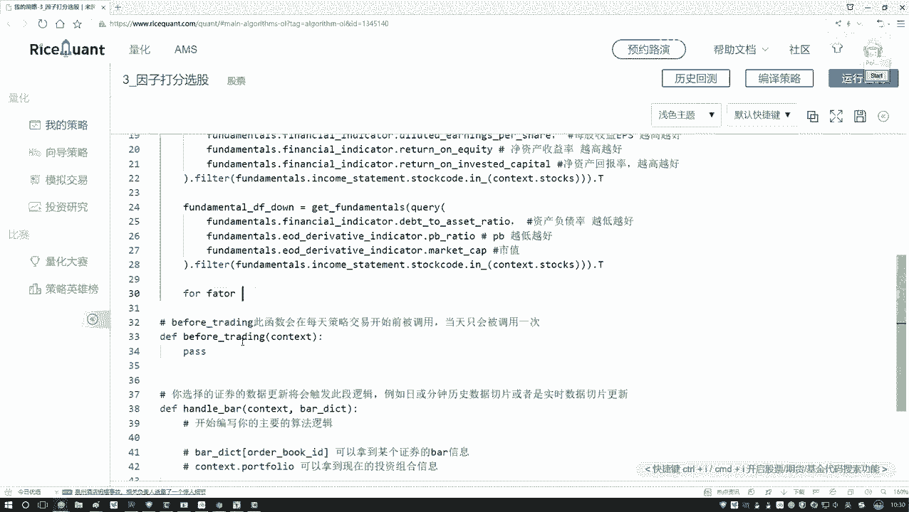

上一节我们介绍了如何筛选和分类因子，本节中我们来看看如何为这些因子进行排序和打分。

## 遍历因子并排序

首先，我们需要遍历之前创建的两个DataFrame（`up` 和 `down`），它们分别包含了“越高越好”和“越低越好”的因子数据。我们的目标是遍历其中的每一个因子列，对其进行排序。

以下是具体操作步骤：

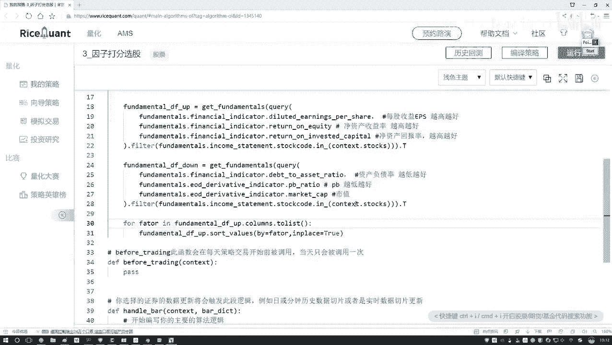

1.  **获取因子名称**：我们需要获取DataFrame的列名，以便遍历每一个因子。
2.  **对因子进行排序**：使用Pandas的 `sort_values` 方法，按照当前因子的值进行排序。我们将使用 `inplace=True` 参数，使排序结果直接作用于原DataFrame，而无需重新赋值。

```python
import pandas as pd
import numpy as np

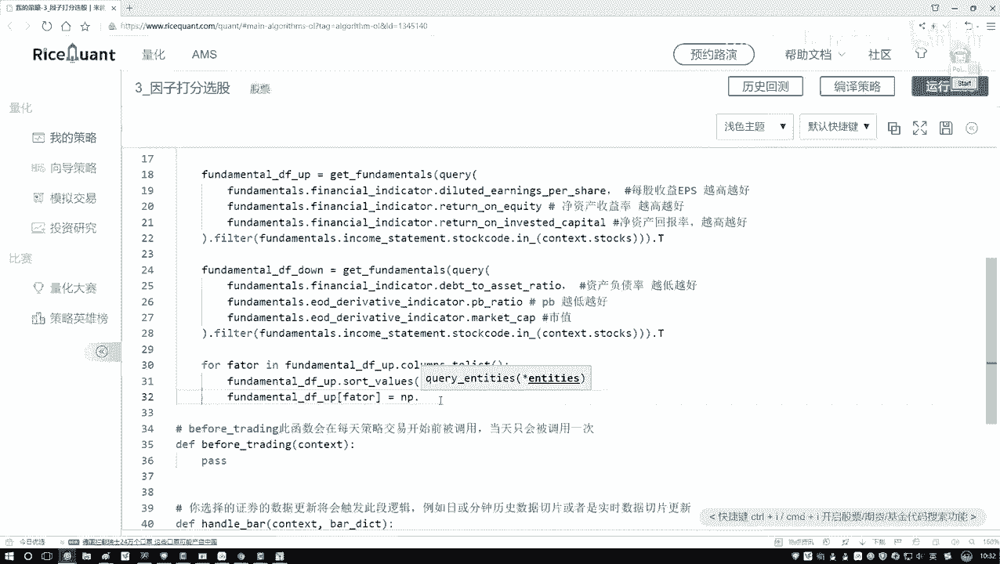


# 假设 up 和 down 是已经定义好的DataFrame
# 遍历“越高越好”的因子
for factor in up.columns:
    # 按照当前因子列的值进行降序排序（值大的在前）
    up.sort_values(by=factor, ascending=False, inplace=True)
```


## 为排序后的因子打分

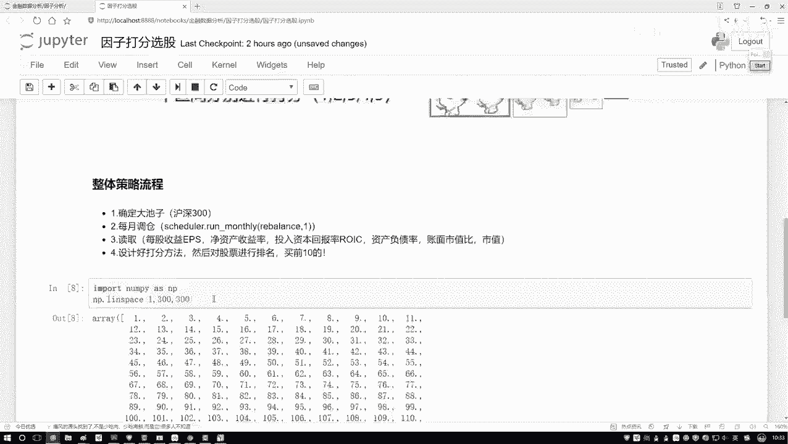

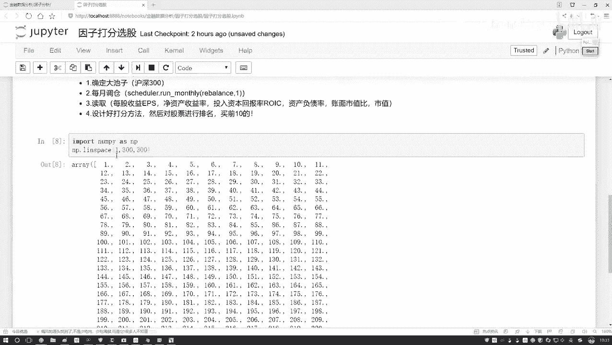

排序完成后，我们需要为每个股票在该因子上的表现打分。为了简单起见，我们采用线性打分法：排名第一的股票获得最高分，排名最后的股票获得最低分。

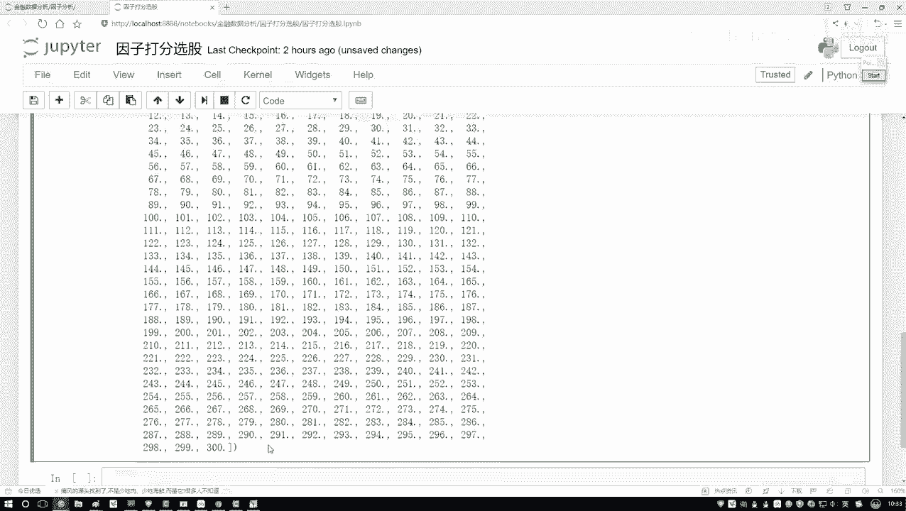

我们将使用NumPy的 `linspace` 函数来生成一个等差分数序列。这个函数非常适用于此类场景。

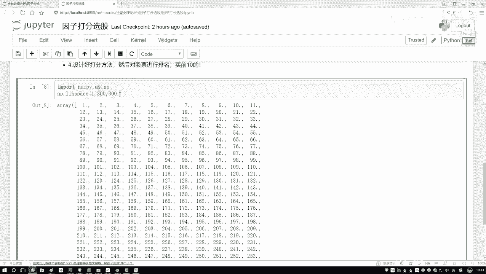

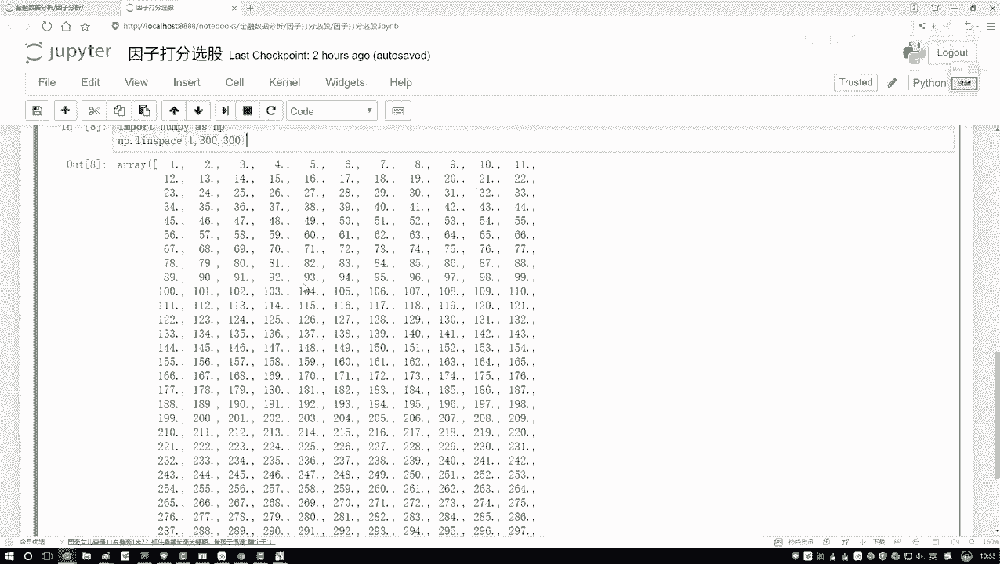

`linspace` 函数的基本用法如下：
```python
np.linspace(start, stop, num)
```
*   `start`：序列的起始值。
*   `stop`：序列的结束值。
*   `num`：要生成的样本数量。

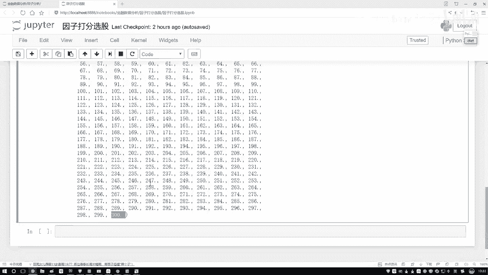

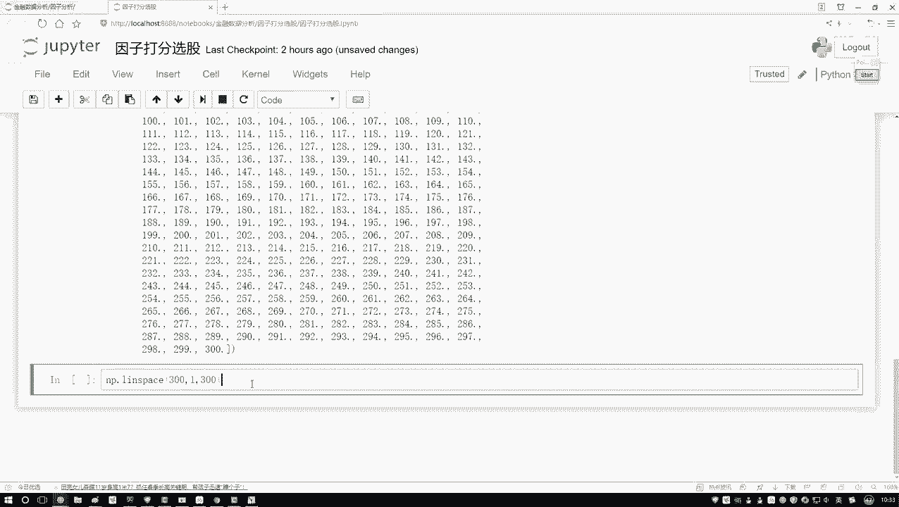

以下是打分逻辑：

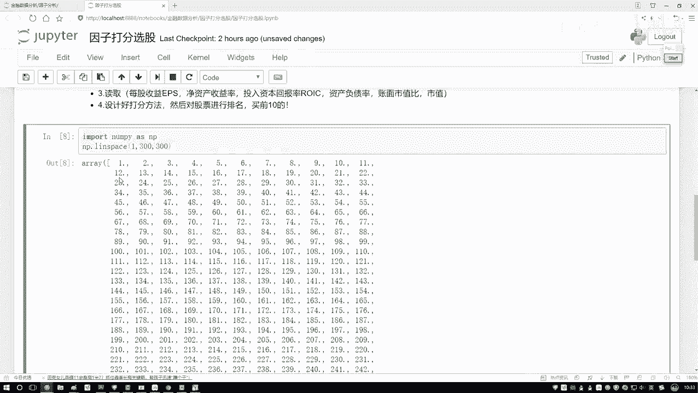

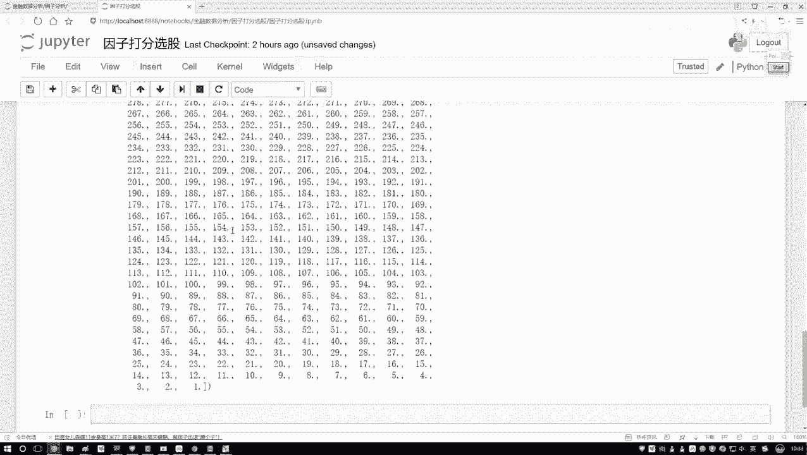

*   **对于“越高越好”的因子**：因子值越大，排名越靠前，应获得越高分数。因此，我们从高分到低分生成序列（例如，300, 299, ..., 1）。
*   **对于“越低越好”的因子**：因子值越小，排名越靠前，应获得越高分数。因此，我们也从高分到低分生成序列，但排序方向与前者相反。


现在，我们将打分步骤整合到循环中：

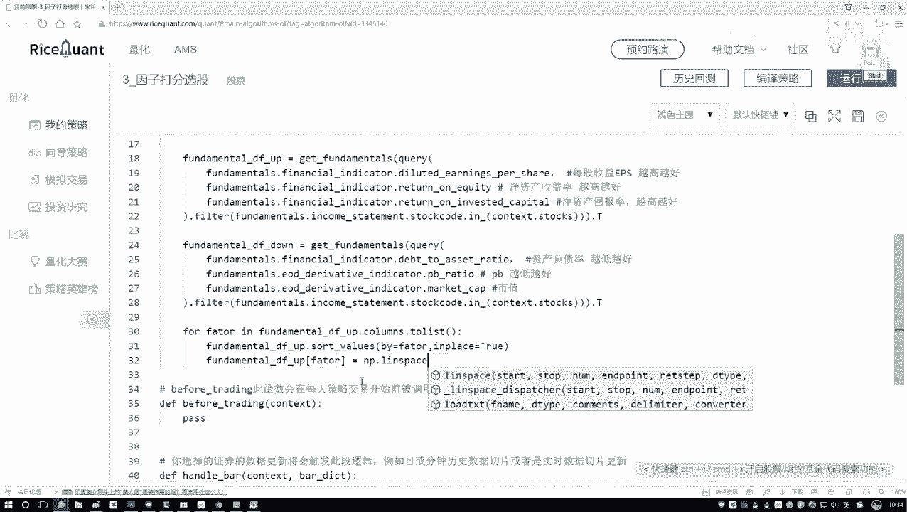

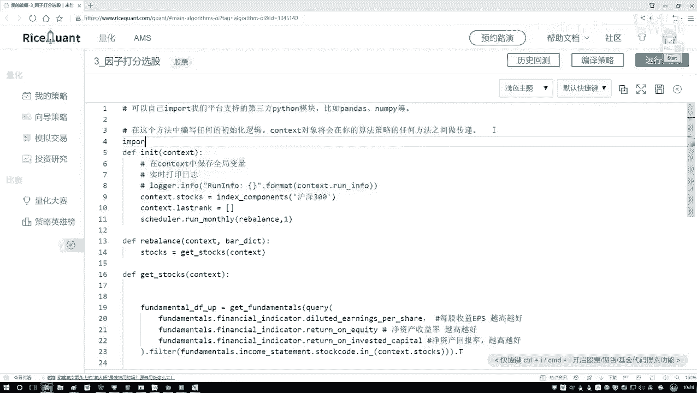

```python
# 股票总数
stock_count = len(up)  # 假设两个DataFrame长度相同，均为300


# 1. 对“越高越好”的因子进行打分
for factor in up.columns:
    up.sort_values(by=factor, ascending=False, inplace=True)
    # 生成从最高分到最低分的序列（例如：300, 299, ... , 1）
    scores = np.linspace(stock_count, 1, stock_count)
    # 将生成的分数赋值给当前因子列
    up[factor] = scores

# 2. 对“越低越好”的因子进行打分
for factor in down.columns:
    down.sort_values(by=factor, ascending=True, inplace=True)  # 升序排序（值小的在前）
    # 同样生成从最高分到最低分的序列（例如：300, 299, ... , 1）
    scores = np.linspace(stock_count, 1, stock_count)
    # 将生成的分数赋值给当前因子列
    down[factor] = scores
```

## 合并数据并计算总分

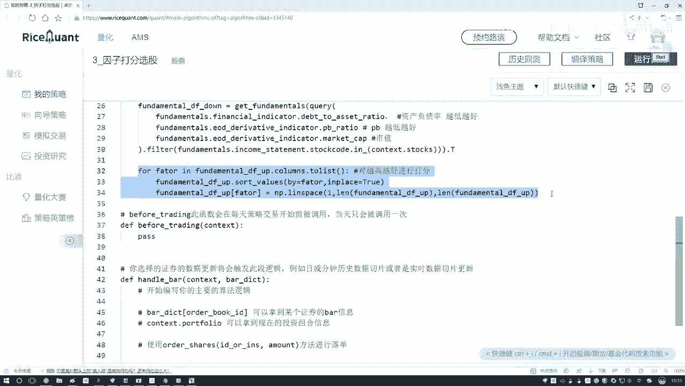

完成所有因子的打分后，我们得到了两个新的DataFrame（`up` 和 `down`），其中每个单元格的值不再是原始因子值，而是该股票在该因子上的得分。

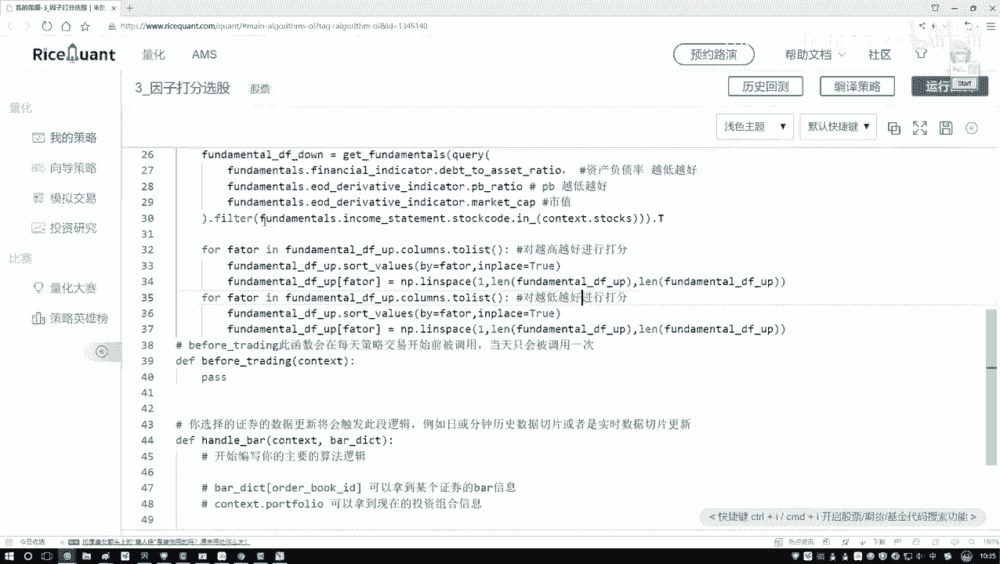

为了计算每个股票的综合得分，我们需要将这两个DataFrame合并。一个简单的方法是使用Pandas的 `add` 方法进行对应位置的加法。

```python
# 将两个得分DataFrame相加，得到每个股票在所有因子上的总得分
total_score_df = up.add(down, fill_value=0)
# 此时 total_score_df 的每一行代表一个股票，每一列代表一个因子得分，我们可以对行求和得到每个股票的总分
total_score_series = total_score_df.sum(axis=1)
# 最后，可以按总分进行排序，找到综合得分最高的股票
final_ranking = total_score_series.sort_values(ascending=False)
print(final_ranking.head())
```

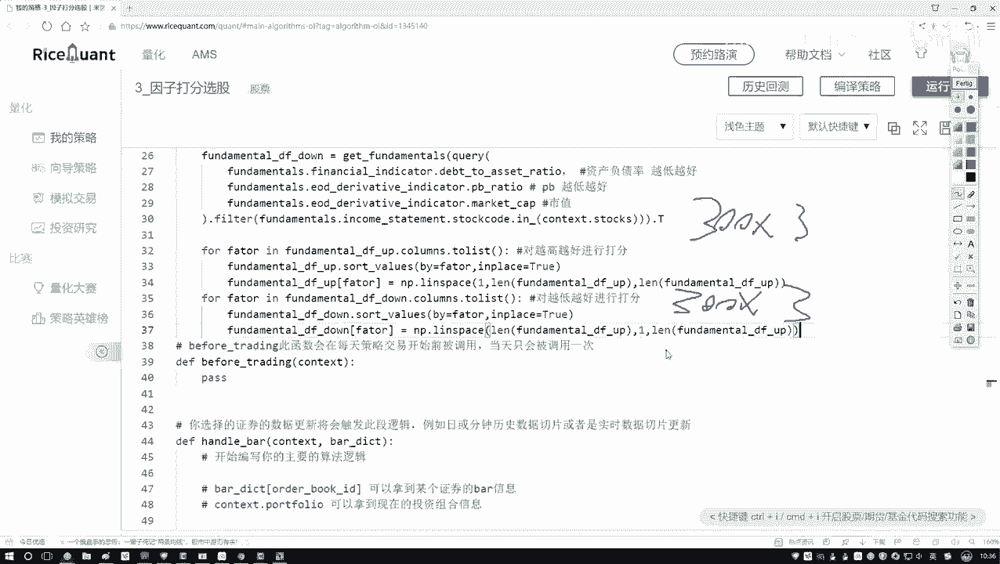

本节课中我们一起学习了因子评价的核心操作：排序与打分。我们掌握了如何遍历因子列、使用 `sort_values` 进行排序、利用 `np.linspace` 生成打分序列，以及最后合并得分并计算总分的方法。这些步骤为后续构建完整的选股策略奠定了坚实基础。