# Python金融量化分析：P58：KMEANS算法概述 🧩

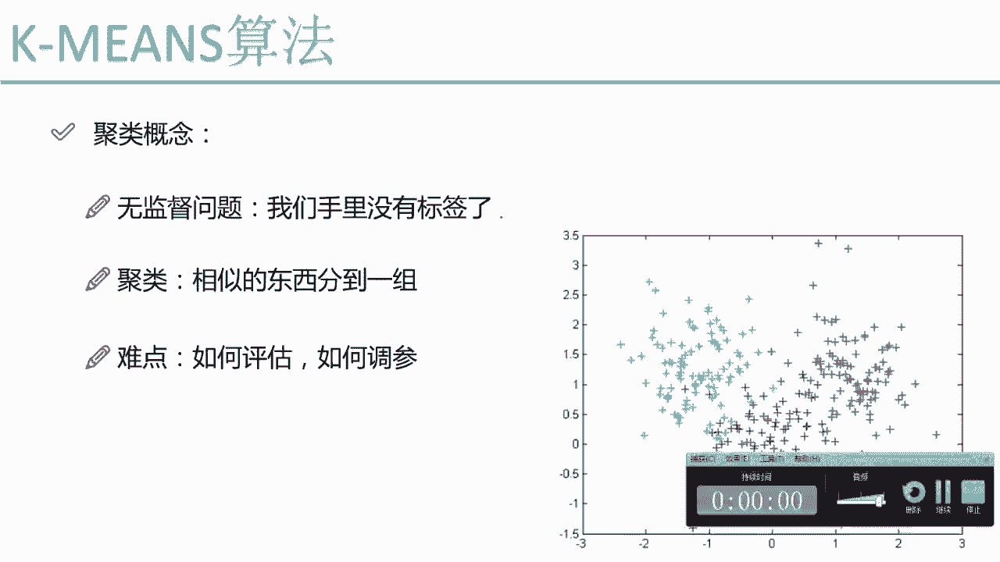

在本节课中，我们将学习机器学习中一个非常重要的分支——聚类。我们将重点介绍一种经典且实用的聚类算法：K-Means算法。

## 聚类是什么？

上一节我们介绍了有监督学习，其特点是数据带有标签。本节中我们来看看无监督学习中的聚类问题。

聚类是一种无监督学习方法。与有监督学习不同，聚类问题中，我们手中的数据没有预先给定的类别标签。聚类的目标是将数据集中相似的数据点自动分组，形成若干个“簇”。

例如，观察右侧的散点图，原始数据并没有颜色标记。聚类算法会根据数据点之间的相似度，自动将数据分为三组，并用不同颜色表示。

## 聚类的挑战

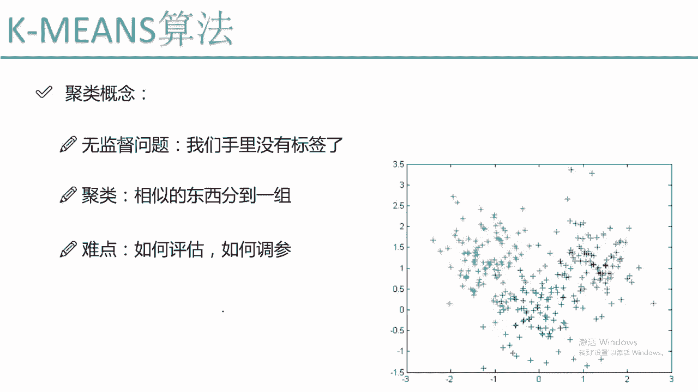

聚类算法原理看似简单，但面临一些独特的挑战，主要源于“无标签”这一特性。

以下是聚类面临的主要难点：

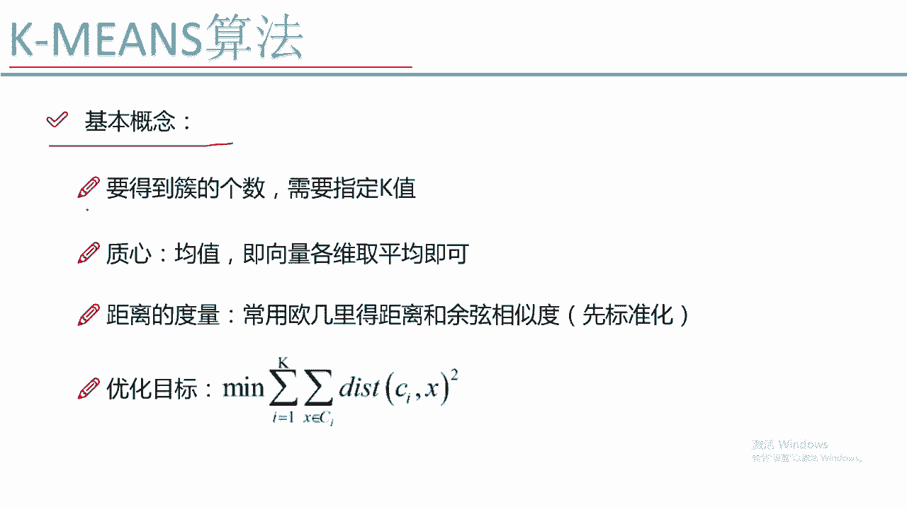

*   **结果评估困难**：在有监督学习中，我们可以通过比较预测标签和真实标签来计算准确率等指标。但在无监督学习中，没有“标准答案”，因此很难客观评价聚类结果的好坏。
*   **参数调节困难**：例如，使用不同参数得到不同的聚类结果时，由于缺乏评估标准，难以判断哪个结果更优。

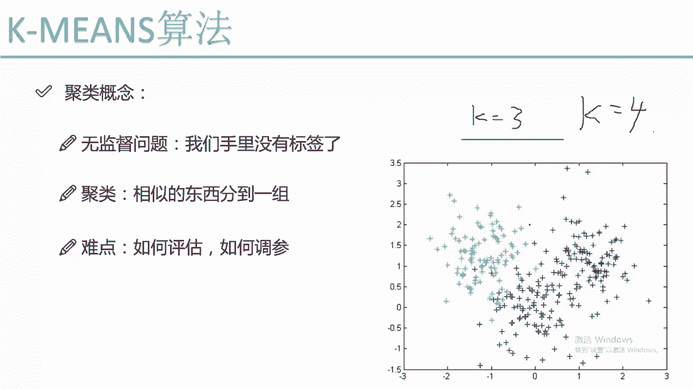

## K-Means算法核心概念

接下来，我们将深入探讨K-Means算法。首先需要理解它的几个核心概念。

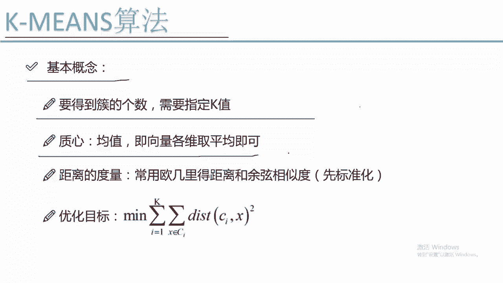

### 1. K值（簇的数量）

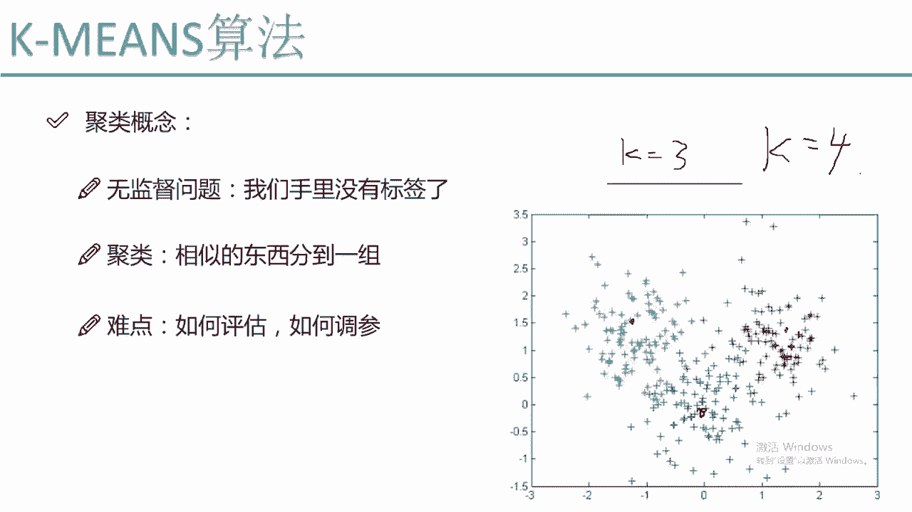

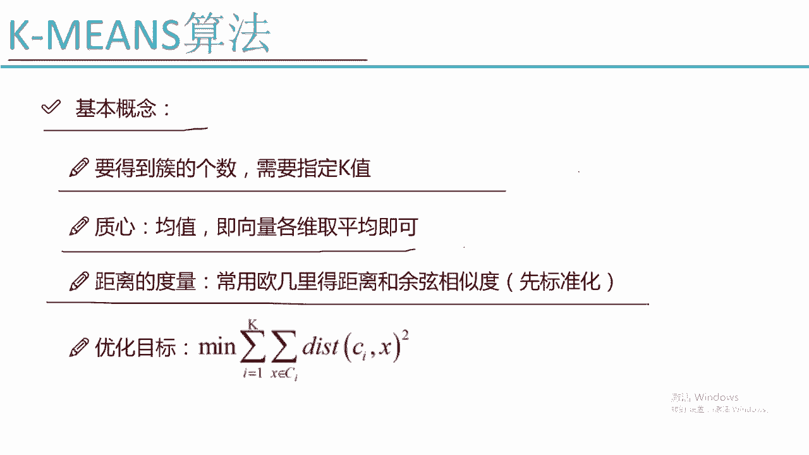

K-Means算法需要我们预先指定一个参数：**K值**。K值代表我们希望将数据聚合成多少个簇。

*   如果设定 **K=3**，算法会将数据分为3个簇。
*   如果设定 **K=4**，则分为4个簇。

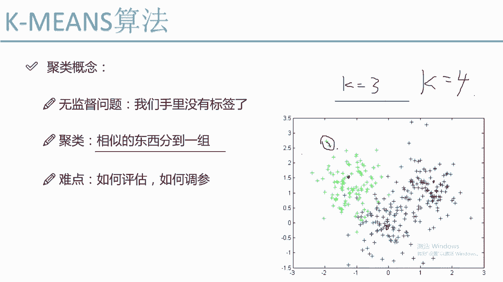

### 2. 质心

每个簇都有一个**质心**。质心代表了该簇所有数据点在各个特征维度上的平均值。

对于一个二维数据点（X, Y），其所在簇的质心计算方式为：该簇所有点的X坐标取平均值，Y坐标取平均值，得到点（X̄, Ȳ）。质心在算法迭代过程中起着关键作用。

### 3. 距离度量

聚类依据“相似性”进行分组，而相似性通常通过计算数据点之间的**距离**来衡量。距离越近，认为越相似。

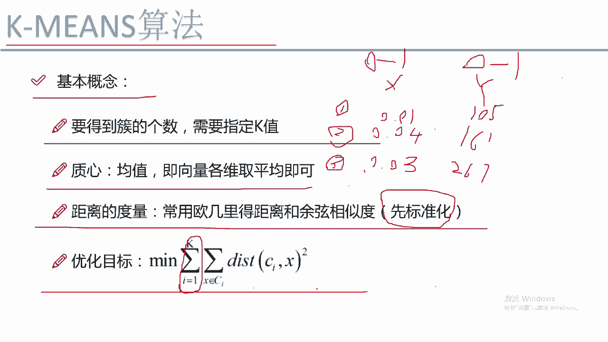

最常用的距离计算方式是**欧氏距离**。对于两个点 (x1, y1) 和 (x2, y2)，其欧氏距离公式为：
`distance = sqrt((x1 - x2)² + (y1 - y2)²)`

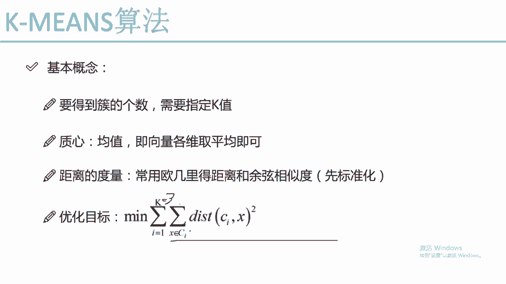

**重要提示**：在使用距离度量前，通常需要对数据进行**标准化**处理。这是因为如果不同特征（如X轴和Y轴）的数值范围差异巨大，数值范围大的特征会主导距离计算，从而影响聚类效果。标准化（如归一化到[0,1]区间）可以确保所有特征具有可比性。

## K-Means算法的优化目标

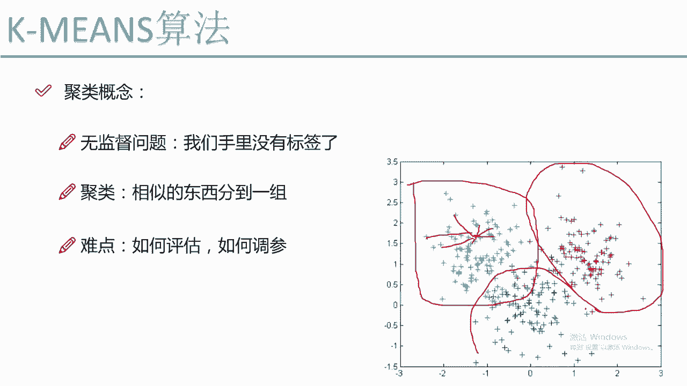

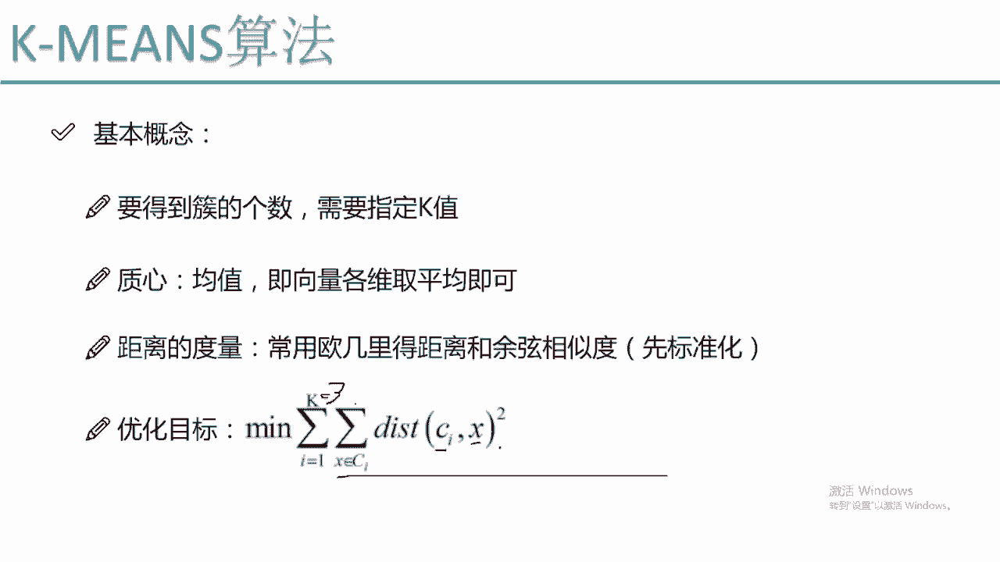

与大多数机器学习算法一样，K-Means通过优化一个目标函数来求解。其目标是：**最小化每个簇中所有样本点到该簇质心的距离之和**。

用公式表示其优化目标为：
`Minimize Σ（i=1 到 K） Σ（x 属于簇Ci） || x - μi ||²`
其中：
*   **K** 是簇的数量。
*   **Ci** 代表第 i 个簇。
*   **x** 是簇 Ci 中的一个样本点。
*   **μi** 是簇 Ci 的质心。
*   **|| x - μi ||²** 是点 x 到质心 μi 的欧氏距离的平方。

**通俗理解**：算法试图让每个簇内部的点都尽可能靠近自己的质心。如果一个点离当前簇的质心很远，但离另一个簇的质心更近，那么在迭代过程中，它就会被重新分配到更近的那个簇中去。

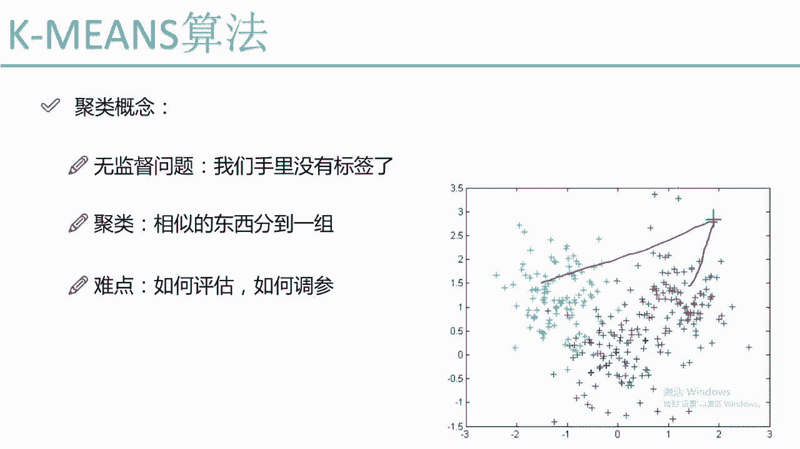

## 总结

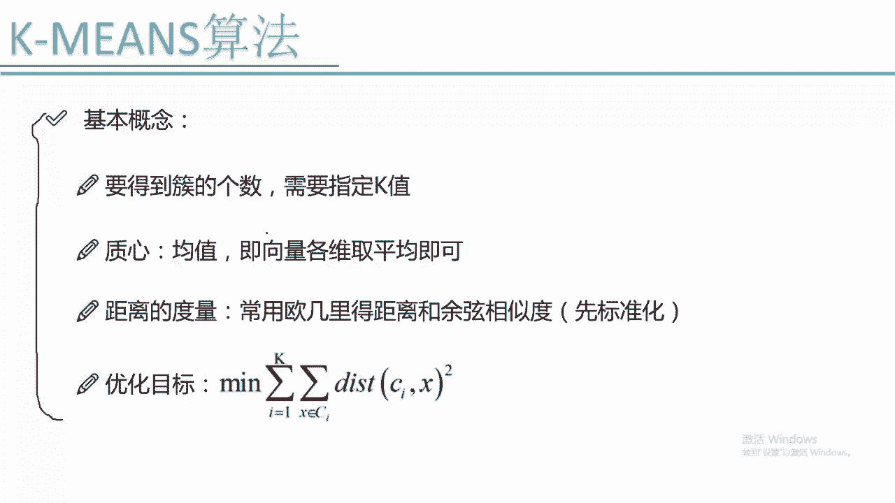

本节课中我们一起学习了K-Means聚类算法的基本概念。我们了解到聚类是一种无监督学习方法，用于将相似数据分组。K-Means算法需要预先指定簇的数量K，并通过迭代优化，使每个样本点离其所属簇的质心尽可能近，其核心步骤包括初始化质心、分配样本点到最近质心、重新计算质心并重复直至收敛。理解这些基础概念是掌握和运用该算法的关键。