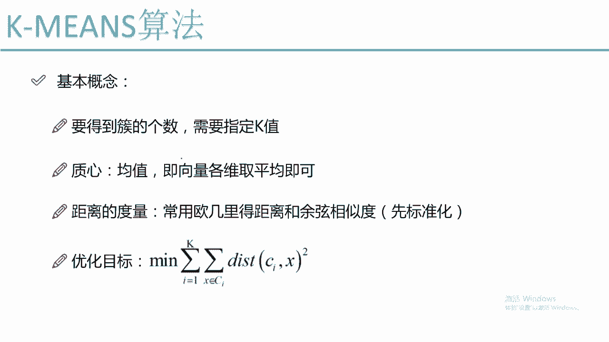
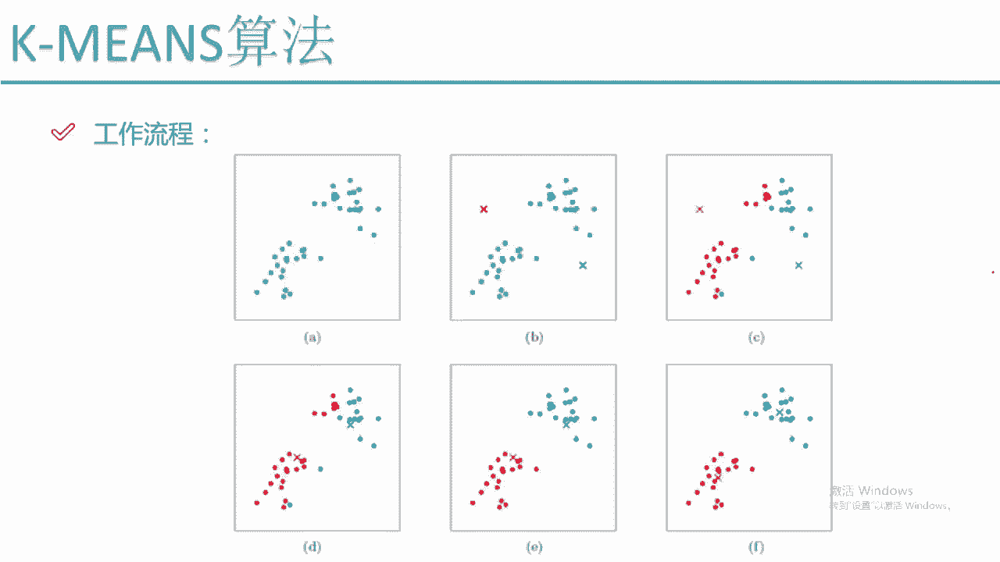
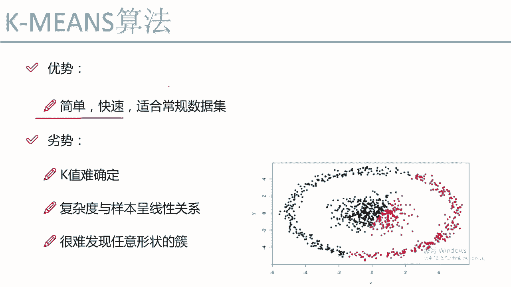
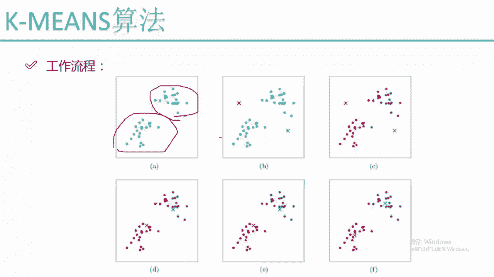
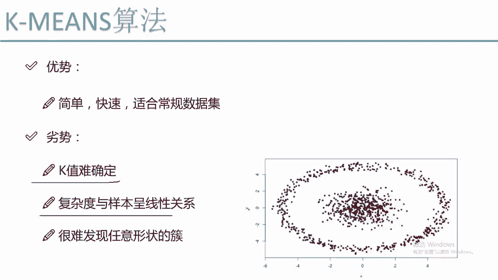
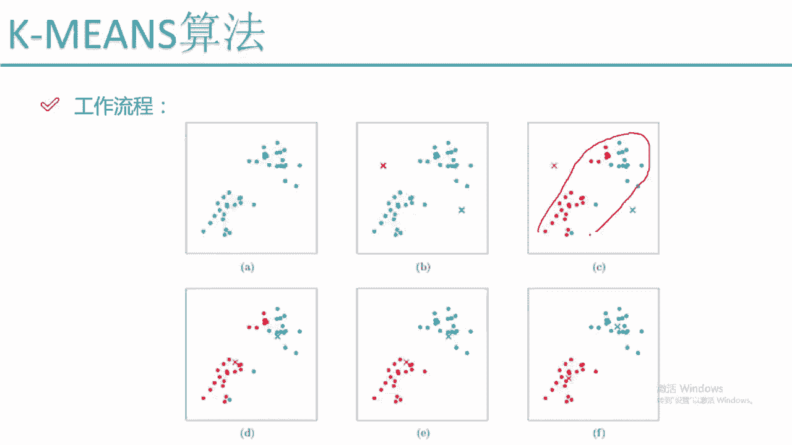
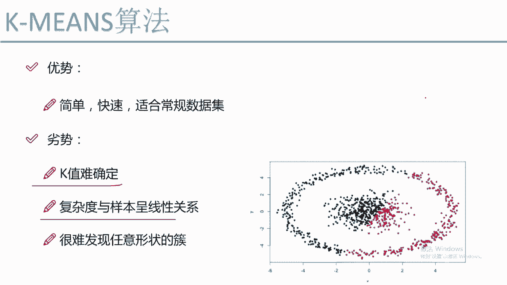
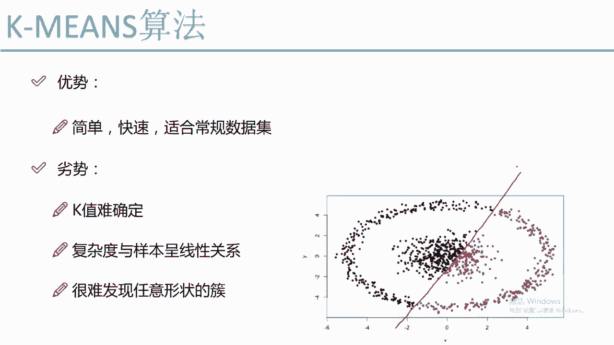
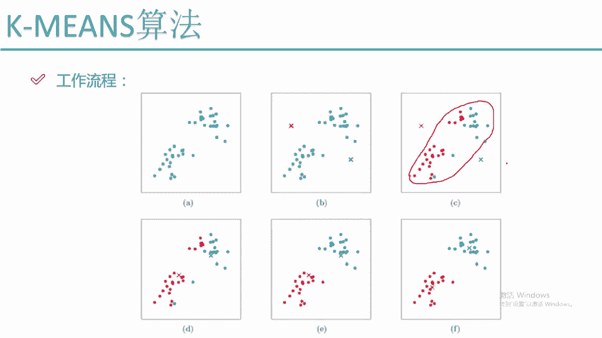
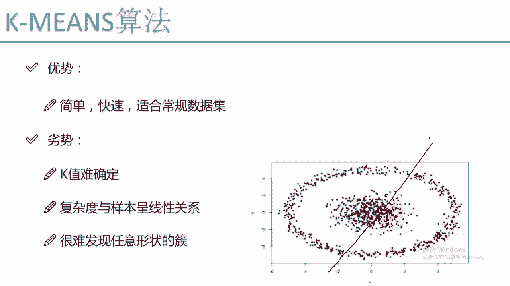

# Python金融量化分析：P59：KMEANS工作流程 📊

在本节课中，我们将学习K-Means聚类算法的工作流程。这是一种无监督学习算法，用于将数据点自动分组到不同的“簇”中。我们将通过图解的方式，一步步理解其核心原理、执行步骤以及优缺点。

## 概述

K-Means算法的目标是将数据集划分为K个簇，使得每个数据点都属于离它最近的簇中心（质心）所在的簇。整个过程通过迭代更新质心和重新分配数据点来完成。

---

## 算法工作流程详解

上一节我们介绍了K-Means的基本概念，本节中我们来看看它的具体工作流程。

### 第一步：初始化质心

由于是无监督问题，我们不知道数据点原本属于哪个簇。算法开始时，需要指定一个参数 **K**，即希望形成的簇的数量。例如，设定 **K=2**。

算法会随机初始化K个点作为初始质心。在下图中，我们随机初始化了一个红色质心和一个蓝色质心。

### 第二步：分配数据点到最近的质心

初始化后，需要计算每个数据点属于哪个簇。判断依据是数据点到各个质心的距离。

对于一个绿色的数据点，我们计算它到红色质心的距离 **D1** 和到蓝色质心的距离 **D2**。如果 **D1 < D2**，则认为该点属于红色簇，因为距离越小，相似度越高。

以下是遍历所有样本点的过程：
*   对于数据集中的每一个点。
*   计算该点到所有K个质心的距离。
*   将该点分配给距离最小的那个质心所在的簇。

经过这一步，所有点都被临时标记为红色或蓝色，形成了初步的簇划分。

### 第三步：重新计算质心

初步划分的簇可能并不准确（例如，肉眼可见应分为左右两堆，但初步结果却是上下划分）。因此，需要更新衡量依据——即质心。

更新方法如下：
*   对于所有被标记为红色的点，计算它们的几何中心（即所有点在每个维度上坐标的平均值），这个新的中心点就是更新后的红色质心。
*   同样，对所有蓝色点计算新的蓝色质心。

更新后，质心的位置发生了移动，变得更靠近各自簇内点的中心位置。

### 第四步：迭代优化

质心更新后，流程回到第二步。我们需要根据新的质心位置，重新计算所有数据点的归属。

*   之前属于红簇的点，现在可能离新的蓝质心更近，因此会被重新分配到蓝簇。
*   反之亦然。

然后，再次进入第三步，根据新的簇分配重新计算质心。

如此循环往复（第二步 -> 第三步 -> 第二步 …），直到满足停止条件（通常是指定迭代次数，或质心不再发生显著变化，数据点的归属也不再改变）。此时，算法收敛，我们得到了最终的聚类结果。

**核心迭代公式**：
1.  **分配步骤**：对于每个数据点 \( x_i \)，将其分配到最近的质心 \( \mu_j \) 所在的簇 \( C_j \)。
    \[
    C_j = \{ x_i : \| x_i - \mu_j \|^2 \le \| x_i - \mu_k \|^2, \forall k \}
    \]
2.  **更新步骤**：对于每个簇 \( C_j \)，重新计算其质心 \( \mu_j \) 为该簇内所有点的均值。
    \[
    \mu_j = \frac{1}{|C_j|} \sum_{x_i \in C_j} x_i
    \]

当 **K=3** 时，流程完全一致，只是会初始化三个质心，最终将数据分为三簇。

---

## 算法的优缺点

理解了工作流程后，我们来总结一下K-Means算法的优缺点。

### 优点 👍

*   **原理简单直观**：易于理解和实现。
*   **执行效率较高**：对于常规数据集，收敛速度较快。
*   **应用广泛**：是聚类分析中最常用的算法之一。

### 缺点 👎

*   **需要预先指定K值**：这是最主要的难点。在无标签数据中，很难确定最佳的簇数量K，通常需要尝试多个K值并根据评估指标选择。
*   **对初始质心敏感**：不同的随机初始化可能导致不同的最终结果。
*   **计算复杂度与样本量线性相关**：每次迭代都需要计算所有样本点到所有质心的距离。当样本量极大（如数千万）时，计算开销会很高。
    *   复杂度大致为 **O(n * K * I * d)**，其中n是样本数，K是簇数，I是迭代次数，d是特征维度。
*   **难以处理非球状簇或大小差异大的簇**：K-Means基于距离度量，假设簇是凸形的且大小相似。对于环形、条形或嵌套状等复杂形状的簇，效果不佳。

*如图所示，对于环绕型数据，K-Means可能会根据质心位置错误地将其划分为左右两个簇，而无法识别出内外两个簇的真实结构。*

*   **对噪声和离群点敏感**：极端值会显著影响质心的计算。

---

## 总结

本节课中，我们一起学习了K-Means聚类算法的工作流程。我们从初始化随机质心开始，经历了**分配数据点**和**更新质心**两个核心步骤的不断迭代，直至结果稳定。此外，我们也分析了该算法**简单高效、易于实现**的优点，以及其**需要预设K值、对异常值和复杂形状簇处理能力弱**等缺点。理解这些是正确应用K-Means算法解决实际问题的关键。