# Python金融量化分析：P6：突变点调参 🎯

在本节课中，我们将要学习Prophet模型中一个至关重要的参数——突变点（changepoint）的权重（scale）如何影响模型的预测结果。我们将通过调整这个参数，观察模型在训练集上的拟合程度以及在测试集上的预测误差，从而找到最优的参数值。

## 概述

上一节我们介绍了Prophet模型的基本使用。本节中我们来看看如何通过调整突变点（changepoint）的权重参数来优化模型性能。这个参数决定了模型对历史数据中趋势突变的敏感程度，直接影响模型的拟合与预测能力。

## 突变点权重参数解析

突变点权重参数 `changepoint_prior_scale`（通常简称为 `cp_scale`）指定了模型对趋势突变点的重视程度。

*   **参数含义**：该参数值越大，模型在训练时会更加重视数据中的突变点，力求使预测曲线贴合这些突变。
*   **影响分析**：
    *   权重设置较大时，模型能更好地捕捉训练数据中的细节和突变趋势，但可能导致**过拟合**，即模型过于“记忆”训练数据，而在未知数据上表现不佳。
    *   权重设置较小时，模型对突变不敏感，趋势预测会更为平缓保守，但可能导致**欠拟合**，即模型未能充分学习数据中的有效模式。

Prophet框架中此参数的默认值为 `0.05`，这是一个相对保守的设置，表明模型对突变点并不特别敏感。

## 参数调优实验

为了直观展示不同权重值的影响，我们进行了多组实验。以下是实验选用的四组参数值：`0.001`, `0.005`, `0.1`, `0.2`。

实验代码如下所示，其核心是循环使用不同的 `changepoint_prior_scale` 值创建并训练模型，然后进行预测和可视化对比。

```python
# 示例代码：使用不同changepoint_prior_scale参数训练模型
cp_scale_values = [0.001, 0.005, 0.1, 0.2]
predictions = {}

for scale in cp_scale_values:
    model = Prophet(changepoint_prior_scale=scale)
    model.fit(train_df)
    future = model.make_future_dataframe(periods=180)
    forecast = model.predict(future)
    predictions[scale] = forecast
```

### 结果可视化分析

通过对比不同参数下的预测曲线（如下图所示），我们可以得出以下结论：

*   **蓝色线 (cp_scale=0.001)**：权重极小。模型预测趋势非常平缓，几乎是一条直线，完全无法捕捉训练数据（黑点）中的波动和上升趋势，属于典型的**欠拟合**。
*   **红色线 (cp_scale=0.05，默认值)**：权重适中。模型能捕捉到部分趋势，但整体仍偏保守，对后期上升趋势的预测不足。
*   **灰色/黄色线 (cp_scale=0.1/0.2)**：权重较大。模型曲线与训练数据贴合紧密，能较好地反映历史波动，并对未来给出了更激进的上升预测。但存在**过拟合**风险。

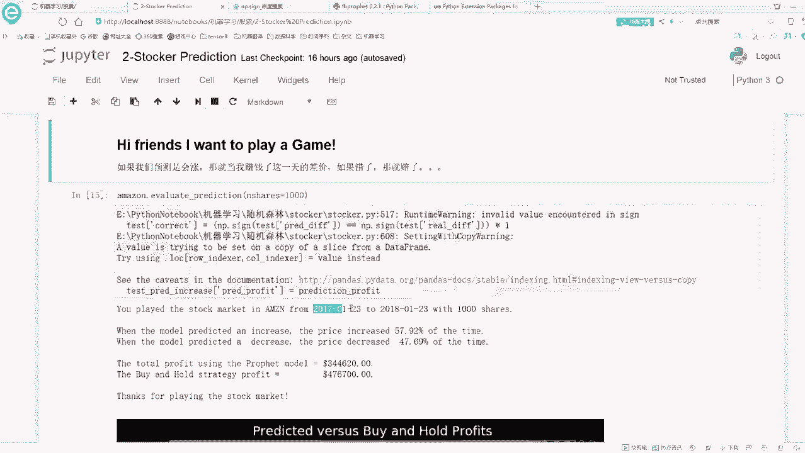

## 量化评估与最优参数选择

仅凭可视化对比不够精确，我们需要量化评估指标。这里我们主要关注**测试集误差（test error）**，因为它反映了模型在未知数据上的泛化能力。

以下是不同 `changepoint_prior_scale` 值对应的训练误差和测试误差：

| changepoint_prior_scale | 训练误差 (Train Error) | 测试误差 (Test Error) |
| :---------------------- | :--------------------- | :-------------------- |
| 0.001                   | 较高                   | 最高                  |
| 0.005                   | 降低                   | 较高                  |
| 0.05 (默认)             | 进一步降低             | 127.60                |
| 0.1                     | 低                     | 降低                  |
| 0.2                     | 最低                   | **127.60 (但趋势显示可能更低)** |

**分析**：
1.  随着 `cp_scale` 增大，训练误差持续下降，符合预期（模型更贴合训练数据）。
2.  测试误差并非单调变化。在默认值 `0.05` 附近，测试误差开始显著下降。我们的实验显示，当参数增加到 `0.2` 时，测试误差可能比默认值更低。
3.  **选择策略**：应选择**测试误差最小**对应的参数值作为最优参数。

## 扩展实验与最终确定

为了找到更优值，我们扩大了参数搜索范围（`0.25`, `0.4`, ..., `0.8`）。实验发现，当 `changepoint_prior_scale` 增加到约 `0.7` 时，测试误差达到了最低点（约66），之后趋于稳定。


因此，对于当前的数据集和预测任务，**最优参数应设置为 `0.7`**。使用此参数重新训练模型后，预测值（1263）与真实值（1294）的差距比使用默认参数时更小，验证了调参的有效性。

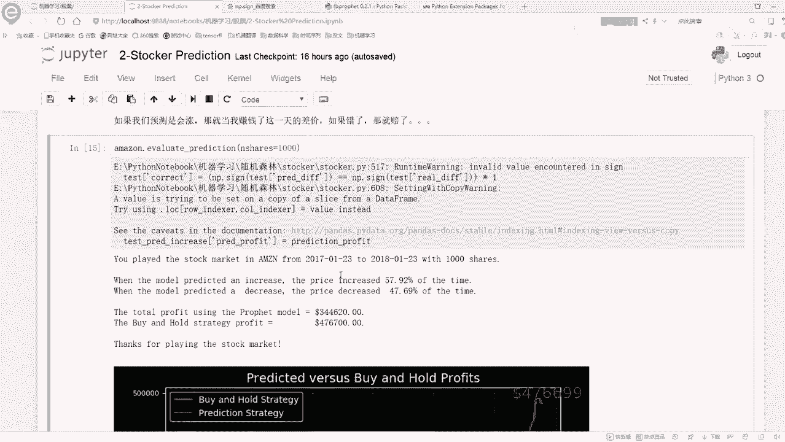

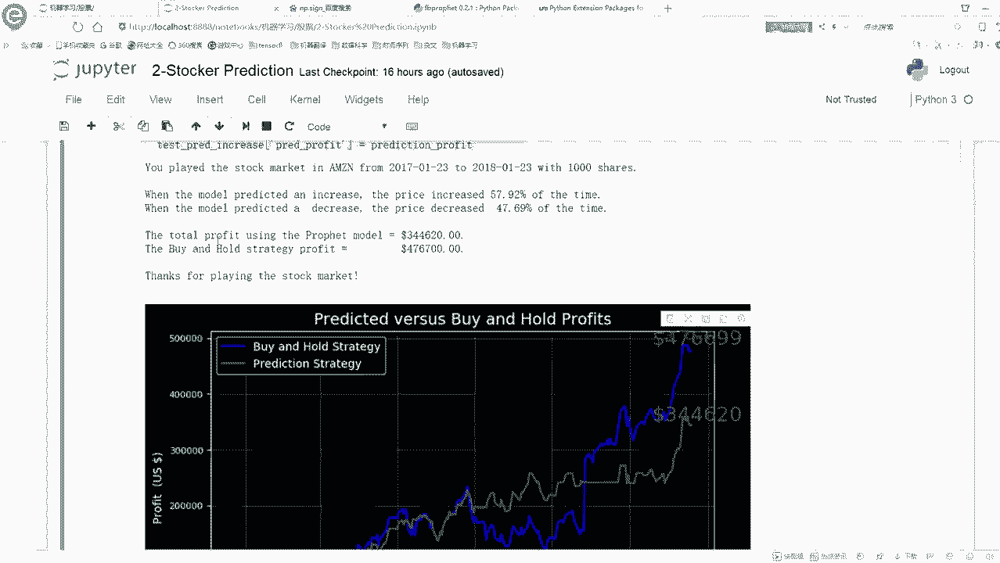

## 模型应用与思考

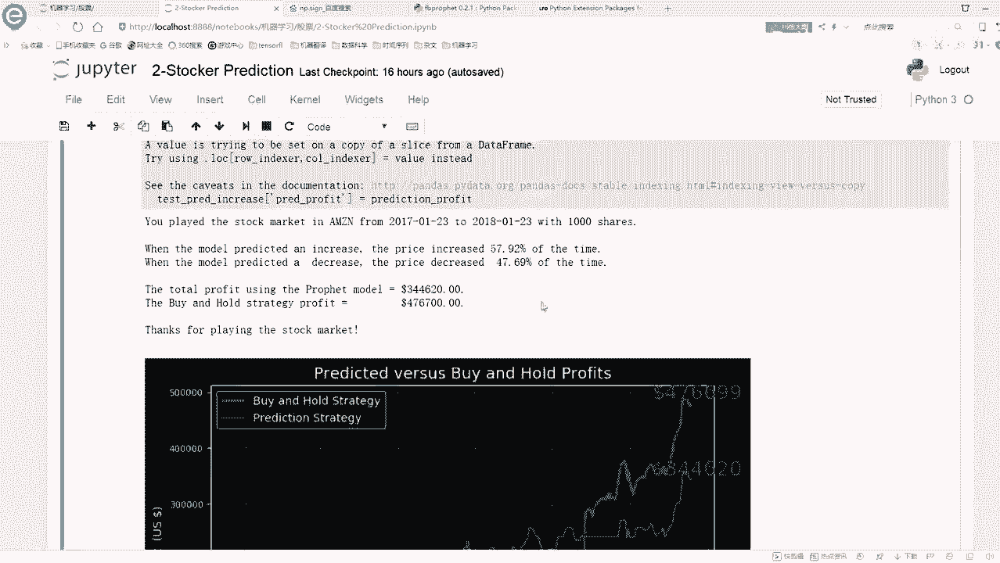

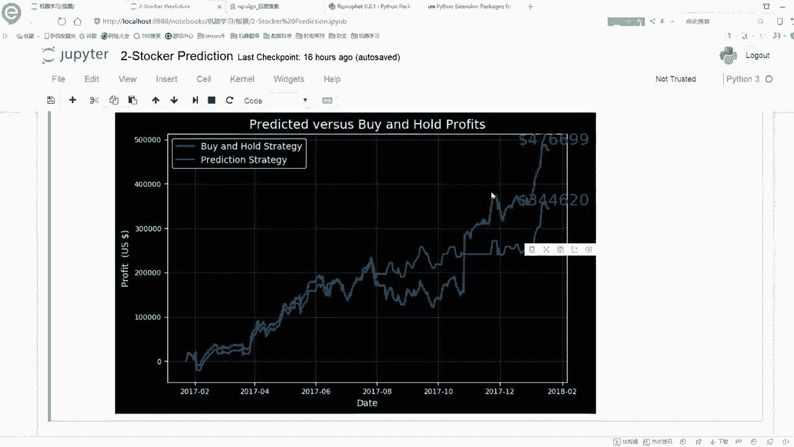

调参完成后，我们可以用优化后的模型进行更多有趣的分析：

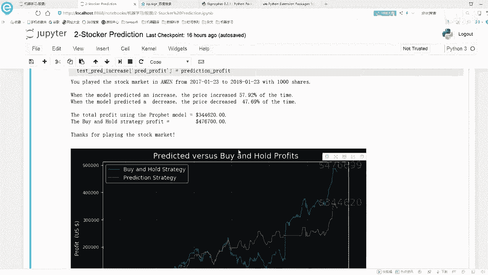

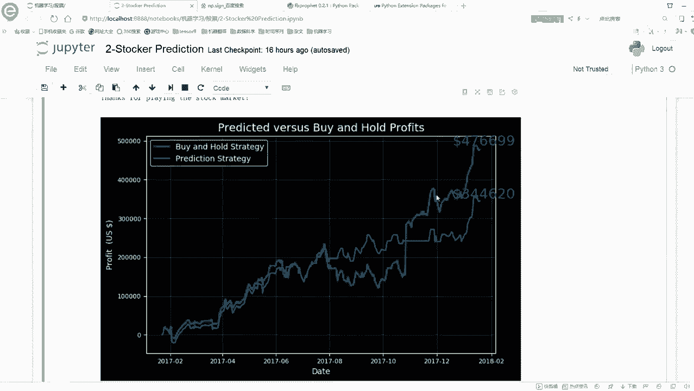

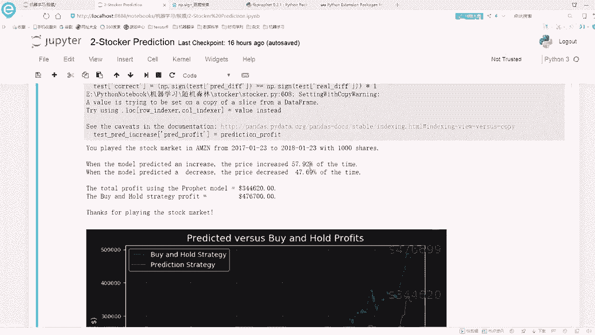

1.  **模拟交易策略**：根据模型每日的涨跌预测模拟买卖股票，可以计算策略的累计收益，并与简单持有（Buy & Hold）策略对比。
2.  **长期预测**：模型可以预测未来数月甚至更长时间的趋势，但需注意，预测期越长，不确定性区间（`yhat_lower`, `yhat_upper`）会越大。

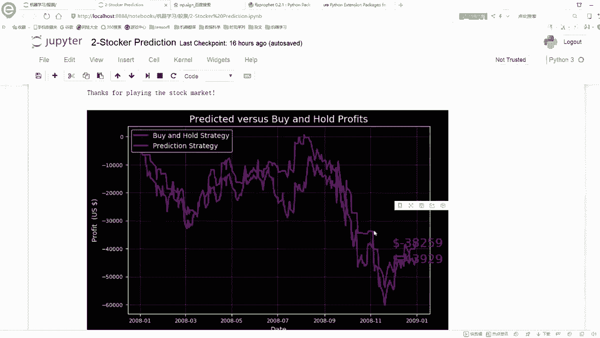

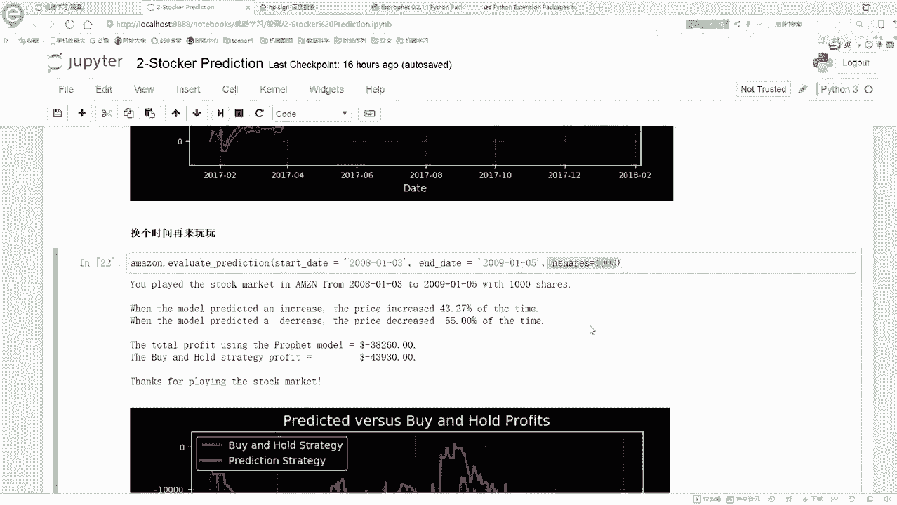

```python
# 示例：预测未来10天的价格
future = model.make_future_dataframe(periods=10)
forecast = model.predict(future)
print(forecast[['ds', 'yhat', 'yhat_lower', 'yhat_upper']].tail(10))
```

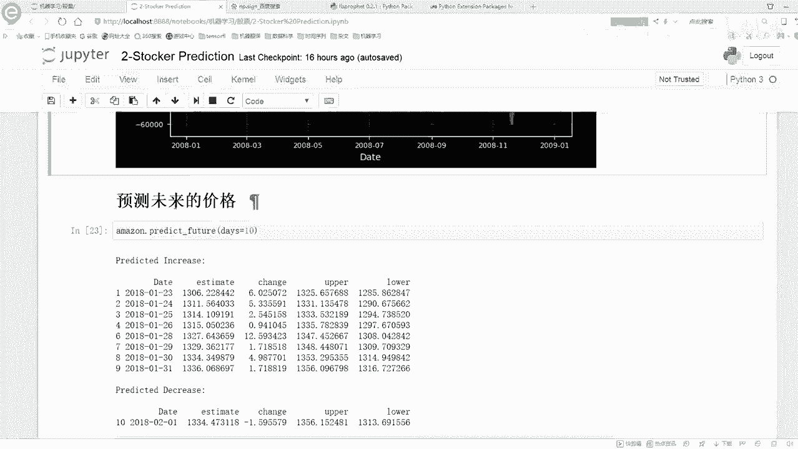

## 总结

本节课中我们一起学习了Prophet模型的核心调参技巧。我们深入探讨了 `changepoint_prior_scale` 参数如何控制模型对趋势突变的灵敏度，并通过可视化对比和误差量化分析，找到了针对特定数据集的最优参数值（本例中为 `0.7`）。这个过程清晰地展示了：
*   **参数过小**导致欠拟合，模型无法捕捉趋势。
*   **参数过大**导致过拟合，模型泛化能力差。
*   **调参目标**是找到测试误差最小的平衡点。

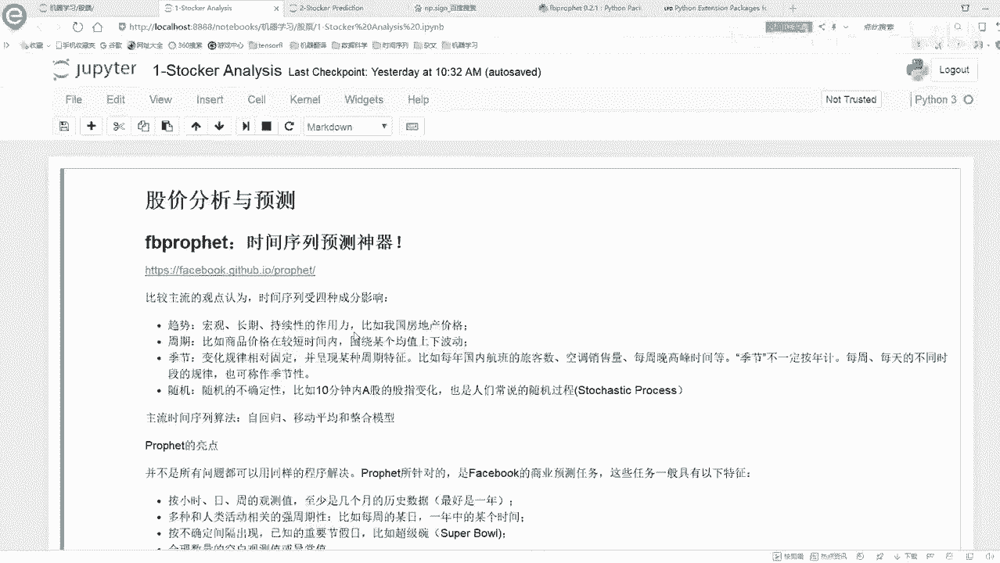

最后，我们也将优化后的模型应用于简单的策略回测和长期预测中。要深入掌握Prophet，建议结合官方文档进行实践，通过动手调整不同参数、尝试不同数据集来深化理解。记住，对于股票这类复杂时间序列的预测，模型可以提供有价值的趋势参考，但将其作为绝对化的交易工具仍需谨慎。