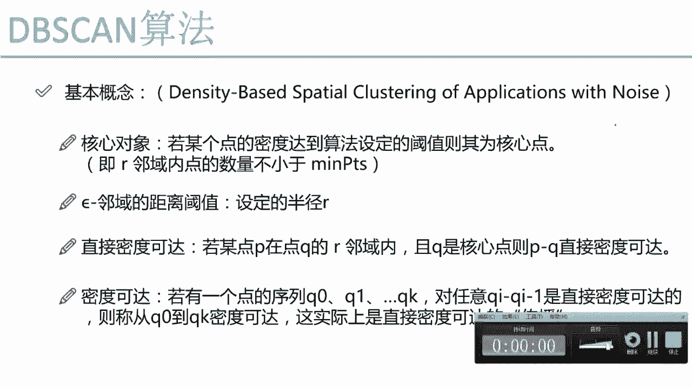
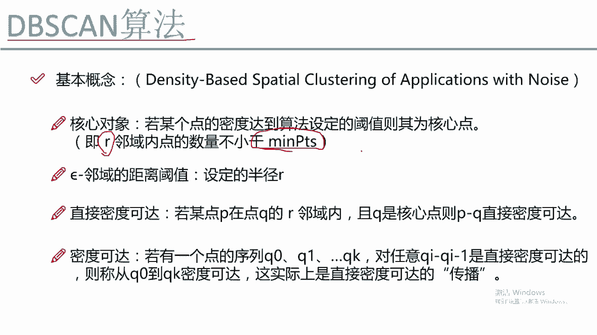
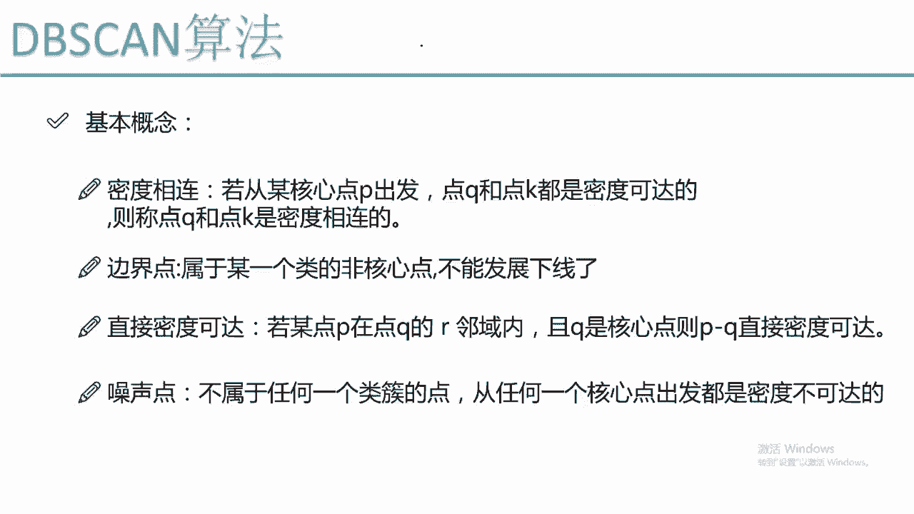
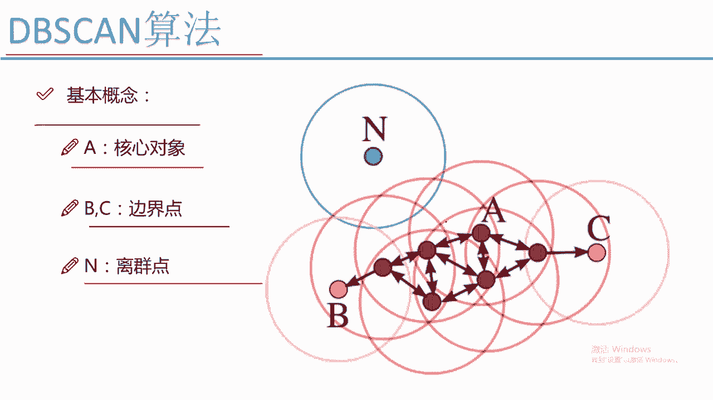

# Python金融量化分析：P61：DBSCAN聚类算法 🎯

在本节课中，我们将学习一种非常强大且实用的聚类算法——DBSCAN。我们将详细解释其核心概念、工作原理，并与之前学过的K-Means算法进行对比，帮助你理解其优势和应用场景。

## 概述 📋

上一节我们介绍了K-Means算法及其一些缺点。本节中，我们将学习DBSCAN算法，它是一种基于密度的聚类方法，能够有效克服K-Means的某些局限性，并且非常适合用于异常检测。

## DBSCAN基本概念

DBSCAN的全称是“基于密度的带有噪声点的空间聚类”。该算法通过考察数据点的密度分布来形成簇，并能识别出噪声点。

### 核心参数

DBSCAN算法需要我们指定两个核心参数：

*   **半径 (eps)**：用于定义每个点的邻域范围。
*   **最小样本数 (min_samples)**：定义一个点成为“核心对象”所需邻域内的最少点数。

### 核心概念定义

以下是理解DBSCAN的关键概念：

*   **核心对象**：如果一个点在以其为中心、半径为 `eps` 的圆形邻域内，包含的数据点数量不少于 `min_samples`，则该点被称为核心对象。
    *   **公式描述**：对于点 `P`，若其 `eps`-邻域内的点数 `N(P, eps) >= min_samples`，则 `P` 是核心对象。
*   **直接密度可达**：如果点 `P` 在核心对象 `Q` 的 `eps`-邻域内，则称 `P` 从 `Q` 出发是直接密度可达的。
*   **密度可达**：如果存在一个点的序列 `P1, P2, ..., Pn`，其中 `P1 = Q`, `Pn = P`，并且每个 `Pi+1` 从 `Pi` 出发都是直接密度可达的，则称 `P` 从 `Q` 出发是密度可达的。这类似于“传销”网络中发展下线的关系。
*   **密度相连**：如果存在一个核心对象 `O`，使得点 `P` 和点 `Q` 都从 `O` 出发是密度可达的，则称 `P` 和 `Q` 是密度相连的。
*   **边界点**：属于某一个簇（从某个核心对象密度可达），但其本身不是核心对象的点。它无法再发展新的“下线”。
*   **噪声点/离群点**：不属于任何簇的点。即从任何一个核心对象出发，都无法密度可达该点。

## DBSCAN工作原理图示 🖼️

为了更好地理解上述概念，我们通过一个图示来说明DBSCAN的工作流程：

1.  算法随机选择一个未被访问的点（例如点A）。
2.  如果点A是一个核心对象（其邻域内点数 ≥ `min_samples`），则以此为核心开始创建一个新的簇。所有从A密度可达的点（如A‘， A‘‘， A‘‘‘）都被归入该簇。
3.  然后，算法会依次考察这些新加入的点。如果它们也是核心对象，则将其邻域内尚未分类的点也纳入当前簇中（继续发展“下线”）。这个过程不断重复，直到簇不能再扩张为止。此时，像点B和点C这样的边界点，由于不是核心对象，扩张过程在它们这里停止。
4.  如果最初选择的点A不是核心对象，则它被暂时标记为噪声。
5.  算法重复上述过程，直到所有点都被访问过。最终，像点N这样无法被任何核心对象“触及”的点，被标记为噪声点或离群点。

## DBSCAN的优势与应用 💡

了解了DBSCAN的原理后，我们来看看它的主要优势和典型应用场景。

### 与K-Means的对比

*   **无需指定簇数量 (K)**：DBSCAN最大的优点是不需要像K-Means那样预先指定要聚成多少类（K值），簇的数量由算法根据数据密度自动发现。
*   **能识别任意形状的簇**：K-Means倾向于发现球状簇，而DBSCAN可以发现任意形状的簇，只要该区域密度足够高。
*   **内置噪声处理**：DBSCAN能直接识别并过滤掉噪声点，而K-Means会将每个点都强行归入某一个簇。

### 主要应用

*   **异常检测**：由于DBSCAN能有效识别离群点，因此非常适用于信用卡欺诈检测、网络入侵识别等异常检测任务。
*   **地理信息分析**：例如，根据地理位置密度发现城市热点区域。
*   **处理复杂形状的数据集**：当数据簇的形状不规则时，DBSCAN通常比K-Means有更好的效果。

## 算法参数选择注意 ⚠️

虽然DBSCAN避免了设置K值的麻烦，但参数 `eps`（半径）和 `min_samples`（最小样本数）的选择同样至关重要，会直接影响聚类结果。

*   `eps` 值过小：会导致许多点无法被归入任何簇，大多数点被识别为噪声。
*   `eps` 值过大：会使所有点合并成一个大簇。
*   `min_samples` 值过小：容易将噪声点误判为核心对象，形成过多小簇。
*   `min_samples` 值过大：会迫使算法将本应成簇的区域标记为噪声。

通常，`min_samples` 可以根据数据集维度来设定一个起始值（如维度D的两倍），而 `eps` 可以通过分析数据点之间的距离分布（如K-距离图）来辅助选择。

## 总结 🎓

本节课中，我们一起学习了DBSCAN聚类算法。我们首先介绍了其基于密度的核心思想，并详细解释了核心对象、密度可达、边界点和噪声点等关键概念。通过图示，我们了解了DBSCAN如何像“发展下线”一样逐步形成簇。最后，我们对比了DBSCAN与K-Means的优劣，并指出了DBSCAN在无需指定簇数和异常检测方面的强大优势，同时也提醒了其参数调优的重要性。掌握DBSCAN将为你处理复杂形状数据集和异常检测任务提供有力的工具。