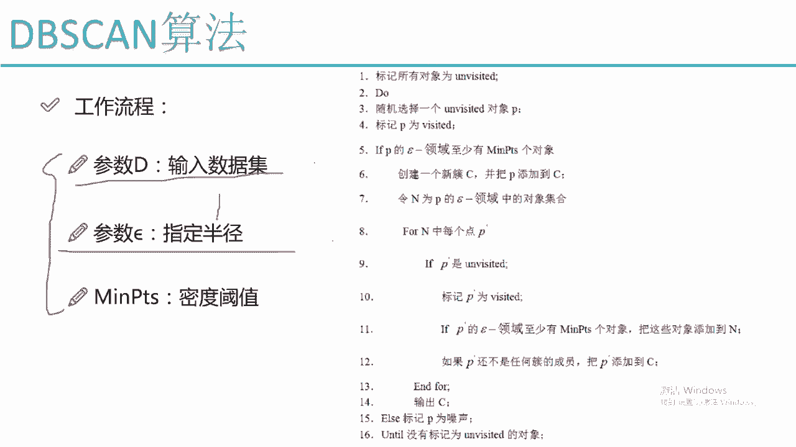
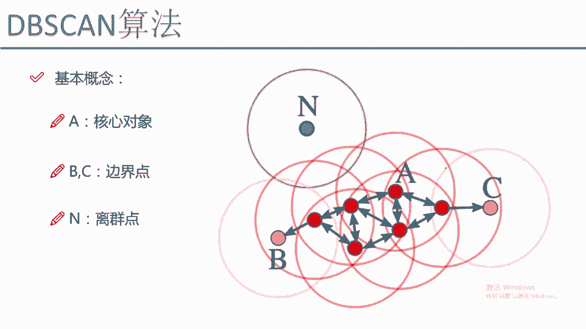
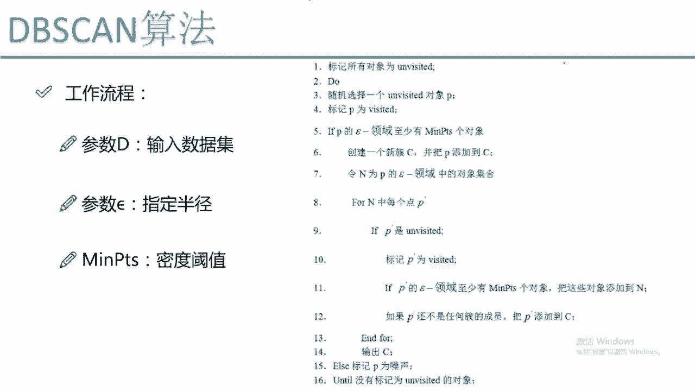
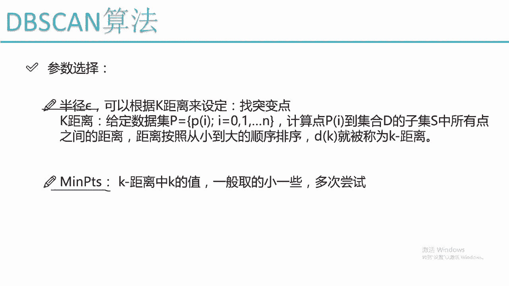
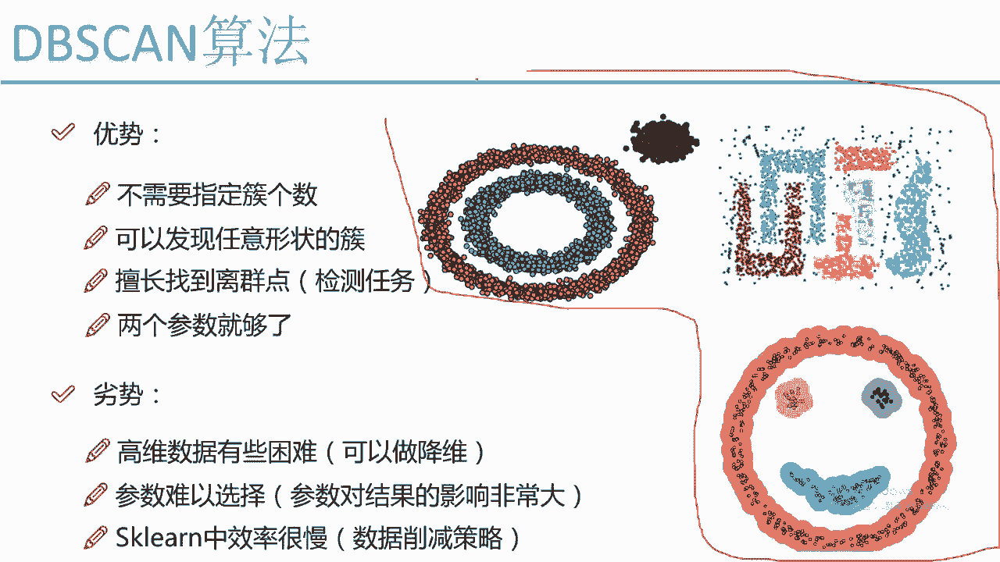

# Python金融量化分析：P62：DBSCAN工作流程

## 📖 概述
在本节课程中，我们将学习DBSCAN算法的核心工作流程。DBSCAN是一种基于密度的聚类算法，它能够发现任意形状的簇，并识别出噪声点。我们将详细解析其工作原理、参数含义以及优缺点。

---

## 🔧 算法输入参数
DBSCAN算法主要需要三个输入参数。

*   **数据集**：这是任何聚类算法都需要的基础输入。
*   **半径（eps）**：算法基于“画圈”寻找邻近点的思想，这个半径定义了“圈”的大小。其公式表示为：`eps`。
*   **最小点数（min_samples）**：这是一个密度阈值，表示在指定半径`eps`的圆形邻域内，最少需要有多少个点才能将一个点定义为核心对象。其公式表示为：`min_samples`。

---

## 🔄 算法迭代流程
上一节我们介绍了算法的输入参数，本节中我们来看看DBSCAN是如何一步步进行聚类的。其工作流程可以概括为以下几个步骤：

1.  **初始化标记**：将数据集中的所有数据点标记为“未访问”。
2.  **随机选择起点**：从数据集中随机选择一个未被访问的点`P`，并将其标记为“已访问”。
3.  **判断核心对象**：检查点`P`在`eps`半径内的邻域中是否包含至少`min_samples`个点（包括`P`自身）。
    *   如果**是**，则点`P`被认定为核心对象，并以此为核心开始构建一个新的簇`C`。
    *   如果**否**，则点`P`被暂时标记为噪声点（后续可能被其他核心对象吸收）。
4.  **扩展簇（发展“下线”）**：如果`P`是核心对象，则进行以下操作：
    *   将`P`加入新簇`C`。
    *   获取`P`的`eps`邻域内的所有点，记为集合`N`。
    *   遍历集合`N`中的每一个点：
        *   如果该点未被访问，则将其标记为“已访问”。
        *   如果该点本身也是一个核心对象（即其`eps`邻域内也有至少`min_samples`个点），则将其邻域内的所有点也加入到集合`N`中（即“发展下线”）。
        *   如果该点尚未属于任何簇，则将其加入到当前簇`C`中。
    *   这个过程持续进行，直到集合`N`中的所有点都被处理完毕，当前簇`C`不再扩大。此时，一个完整的簇就形成了。
5.  **处理剩余点**：返回步骤2，从剩余的“未访问”点中随机选择一个，重复上述过程，直到所有数据点都被标记为“已访问”。

> **形象比喻**：可以将DBSCAN的过程比作“发展下线”。一个核心对象（“头目”）在其影响力范围（`eps`半径）内发展成员（“下线”）。如果“下线”本身也是核心对象（有独立发展能力），则会继续发展自己的“下线”，所有被关联到的点都属于同一个“组织”（簇）。无法被任何核心对象发展，或自身影响力不足（非核心对象且未被任何簇包含）的点，则被视为“散兵游勇”（噪声点）。

---

## ⚙️ 参数选择策略
DBSCAN的效果很大程度上依赖于参数`eps`和`min_samples`的选择。以下是参数选择的一些思路：

*   **半径（eps）的选择**：这是最关键的参数。`eps`值过大会导致多个簇被合并，值过小则会导致许多点被识别为噪声。
    *   **K-距离图法**：一种常用的方法是计算每个点到其第`K`个最近邻的距离（`K`通常等于`min_samples`），然后将所有点的这个距离进行排序并绘制成折线图。寻找图中距离发生突然增大的“拐点”，该拐点对应的距离值通常可以作为`eps`的参考值。
*   **最小点数（min_samples）的选择**：这个参数相对容易设置。在`sklearn`中，通常建议从一个较小的值开始尝试，例如4、5或10。它至少应该大于数据集的维度。

> **注意**：在实际应用中，参数选择往往需要结合领域知识和多次实验来确定，很难一次性选到最优值。

---

## ✅ 算法优势与劣势
通过前面的学习，我们了解了DBSCAN的工作流程。现在，我们来总结一下它的优点和局限性。

**优势：**

*   **无需预先指定簇数量**：与K-Means不同，DBSCAN能自动发现数据中的簇的个数。
*   **能发现任意形状的簇**：基于密度的特性使其能够识别出球形、环形、带状等任意形状的簇。
*   **能够识别噪声点**：算法天然地将不属于任何密集区域的点标记为噪声（离群点），在`sklearn`中通常用标签`-1`表示。
*   **参数较少**：核心参数只有两个（`eps`和`min_samples`）。

**劣势：**

*   **对高维数据处理困难**：在高维空间中，所有点之间的距离都趋于相似，使得“密度”的概念变得模糊，这被称为“维数灾难”。同时，计算量会急剧增加，可能导致内存溢出或速度缓慢。
*   **参数敏感且难以调优**：特别是`eps`参数，对聚类结果影响巨大，且没有通用的最佳选择方法。
*   **对密度差异大的数据集效果不佳**：如果数据集中不同簇的密度差异显著，很难找到一个全局的`eps`值来同时很好地分割所有簇。

---

## 🎯 总结
本节课中，我们一起学习了DBSCAN聚类算法的工作流程。我们从其核心思想——“基于密度”和“发展下线”入手，逐步剖析了算法的参数定义、迭代步骤，并探讨了参数选择的策略。最后，我们总结了DBSCAN既能发现任意形状簇、识别噪声点的强大优势，也指出了其对参数敏感、处理高维数据困难的局限性。在实际金融量化分析或数据挖掘任务中，当数据分布不规则且需要识别离群点时，DBSCAN通常是比K-Means更优的选择。