# ABAQUS Python脚本教程：P1：批量创建分析步 🚀

在本教程中，我们将学习如何使用ABAQUS的Python脚本功能，批量创建大量参数相同的分析步。这在处理需要数十甚至上百个分析步的模型（如隧道开挖模拟）时，可以极大地提高效率，避免重复操作和人为错误。

## 概述与背景

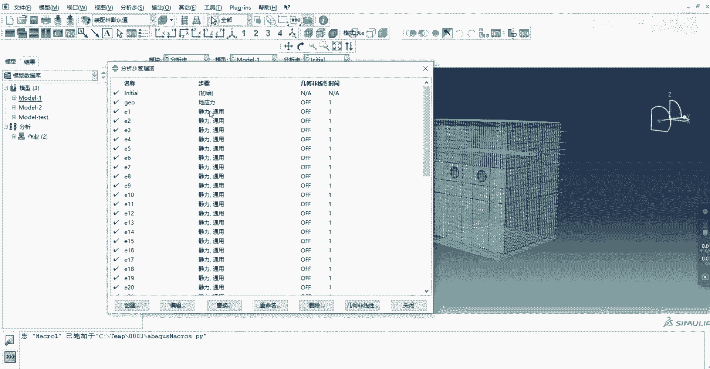

上一节我们介绍了批量创建分析步的必要性。本节中，我们来看看具体的实现方法。我们将以一个隧道模型为例，该模型在初始地应力分析步之后，需要创建49个参数完全相同的静力通用分析步。手动创建这些分析步非常耗时，而使用Python脚本则可以一键完成。

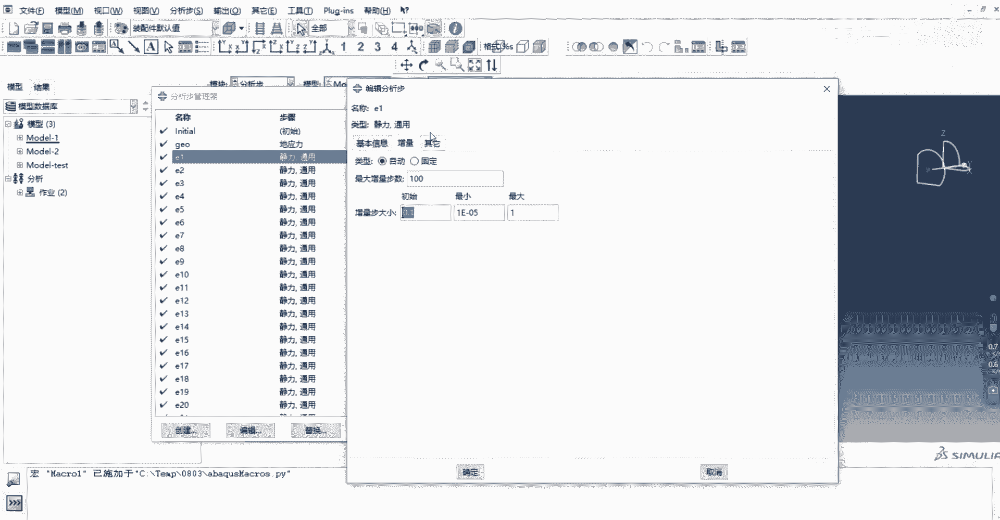

## 第一步：录制宏脚本

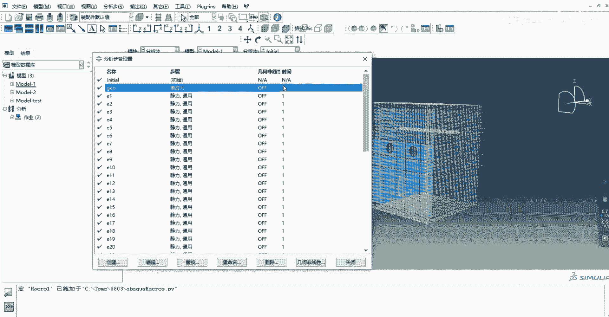

ABAQUS的“宏管理器”可以录制我们的操作并生成Python代码。这是我们编写批量脚本的基础。

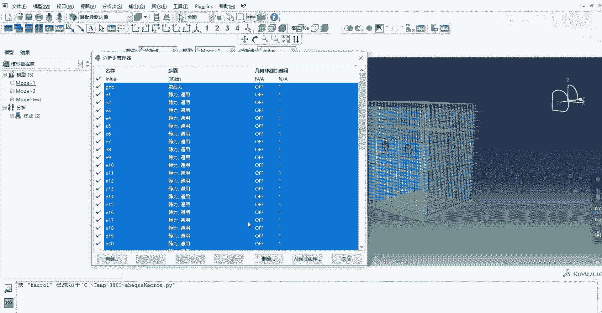

以下是创建宏的步骤：

1.  在ABAQUS/CAE界面中，点击菜单栏的 **文件(File)** -> **宏管理器(Macro Manager)**。
2.  在弹出的窗口中点击 **创建(Create)**。这将开始录制你的所有操作。
3.  按照常规操作，手动创建你需要的分析步类型。在本例中，我们先创建一个“地应力”分析步，再创建一个“静力通用”分析步。
4.  创建完成后，在宏管理器中点击 **停止录制(Stop Recording)**。

此时，ABAQUS会在你的工作目录下生成一个 `.py` 文件，里面记录了刚才所有操作的Python代码。

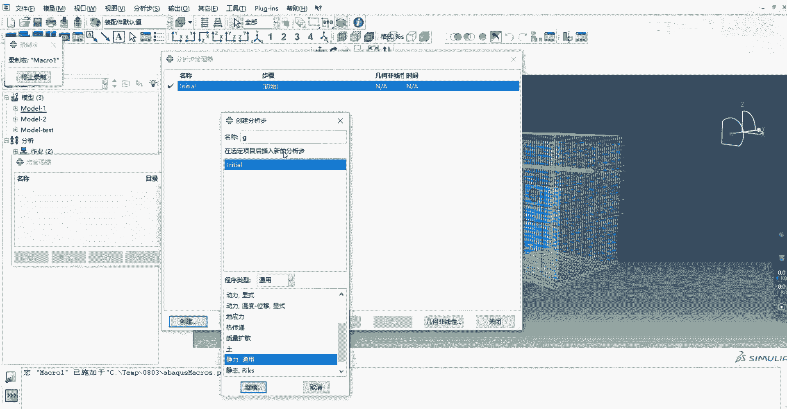

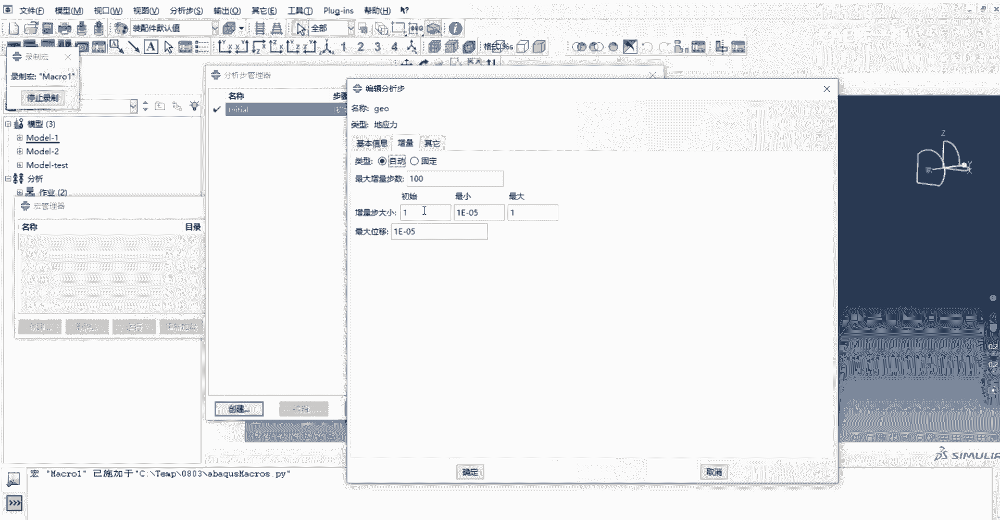

## 第二步：理解与精简脚本

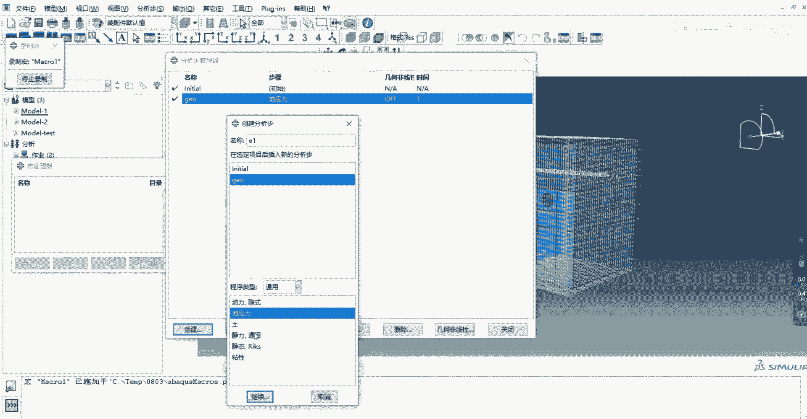

打开生成的 `.py` 文件，你会看到类似以下的代码结构：

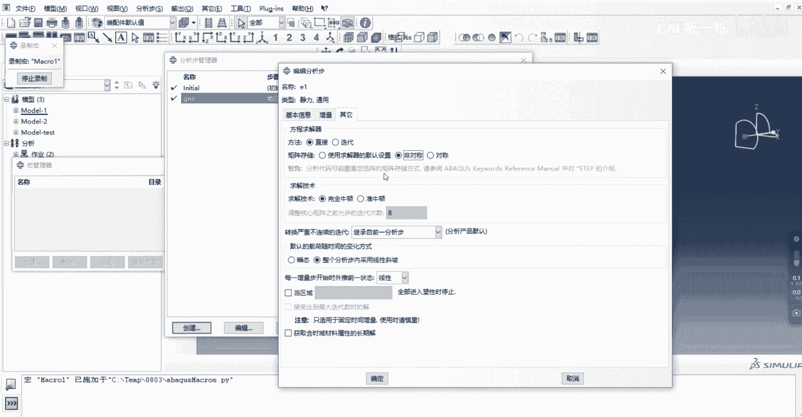

```python
# 导入ABAQUS Python接口库
from abaqus import *
from abaqusConstants import *
from caeModules import *

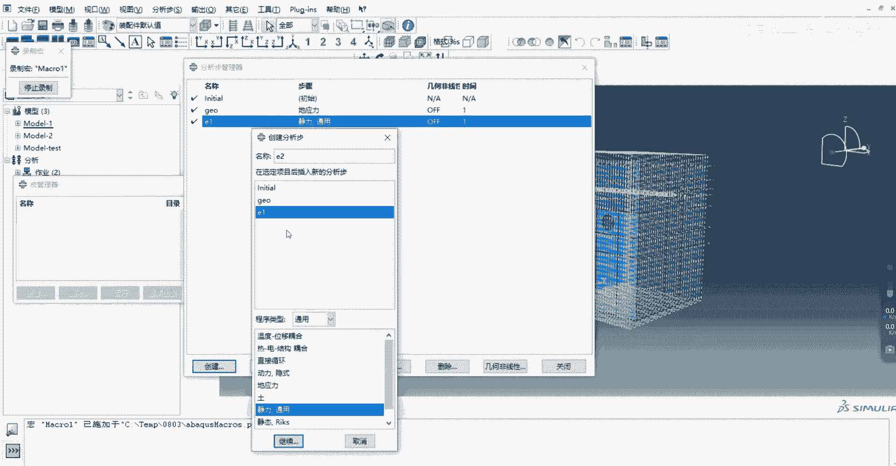

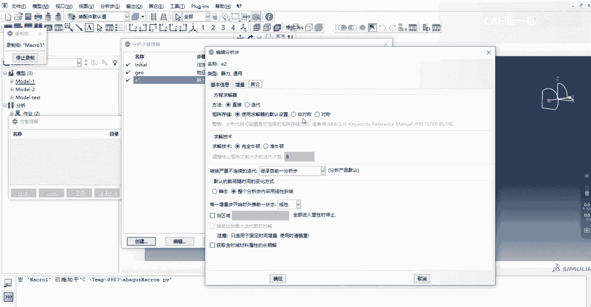

# 录制操作生成的代码
session.Viewport(name='Viewport: 1', origin=(0.0, 0.0), width=200, height=100)
...
mdb.models['Model-1'].StaticStep(name='Initial', previous='Initial', 
    initialInc=0.1, nlgeom=ON)
mdb.models['Model-1'].StaticStep(name='E1', previous='Initial', 
    initialInc=0.1, nlgeom=ON, unsymm=ON)
```

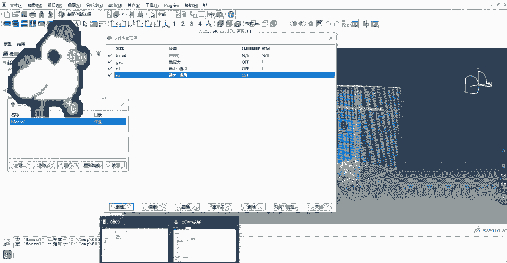

我们需要对这段代码进行精简和修改：
*   **删除注释和无关语句**：删除所有以 `#` 开头的注释行，以及像 `session.Viewport` 这类与创建分析步无关的界面操作语句。
*   **移除函数封装**：录制生成的代码通常被包裹在一个函数定义（如 `def Macro1():`）中。我们需要删除 `def Macro1():` 这一行及其对应的缩进，让核心代码直接暴露出来。
*   **合并连续语句**：确保创建分析步的核心参数（如 `name`, `previous`, `initialInc`）在同一行或逻辑清晰的多行中。

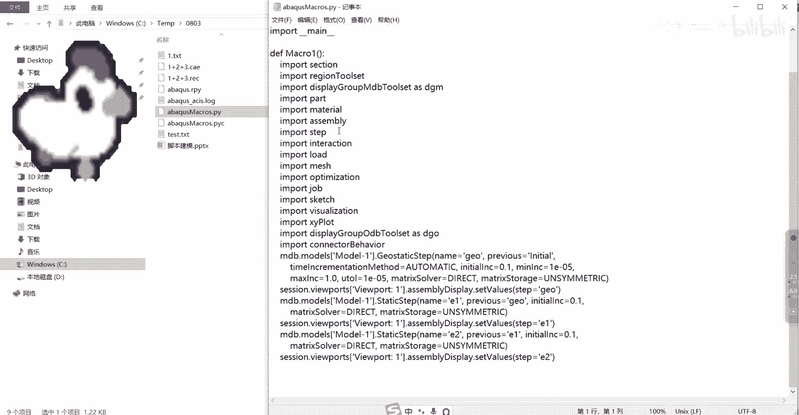

精简后的核心代码应类似于：
```python
from abaqus import *
from abaqusConstants import *
from caeModules import *

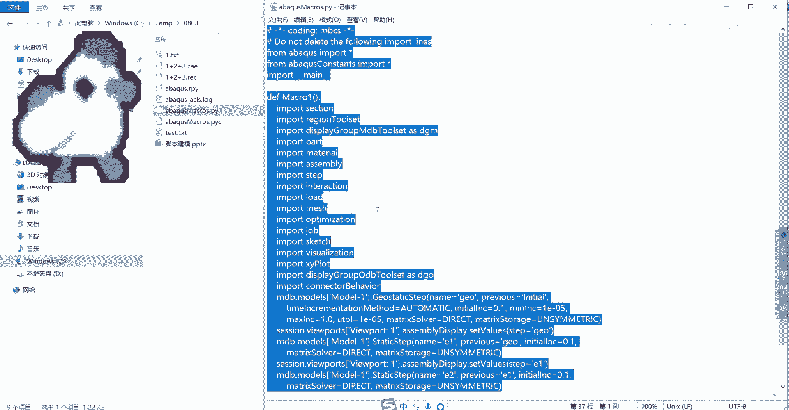

mdb.models['Model-1'].StaticStep(name='Initial', previous='Initial', initialInc=0.1, nlgeom=ON)
mdb.models['Model-1'].StaticStep(name='E1', previous='Initial', initialInc=0.1, nlgeom=ON, unsymm=ON)
```

## 第三步：引入循环实现批量创建

精简后的脚本只创建了两个分析步。为了实现批量创建，我们需要引入 `for` 循环。

以下是修改脚本的关键步骤：

1.  **确定循环范围**：我们需要创建从 `E2` 到 `E49` 的分析步。在Python中，这可以用 `range(2, 50)` 表示，即从2开始，到50结束（不包含50）。
2.  **修改名称和前置步**：在循环体内，分析步的名称 `name` 应动态生成，例如 `'E' + str(i)`。前置分析步 `previous` 也应动态指向前一个步，例如 `'E' + str(i-1)`。
3.  **应用循环结构**：使用 `for i in range(start, end):` 的语法包裹创建分析步的代码。

修改后的完整脚本如下：

```python
from abaqus import *
from abaqusConstants import *
from caeModules import *

# 创建初始分析步
mdb.models['Model-1'].StaticStep(name='Initial', previous='Initial', initialInc=0.1, nlgeom=ON)
# 创建第一个通用分析步 E1
mdb.models['Model-1'].StaticStep(name='E1', previous='Initial', initialInc=0.1, nlgeom=ON, unsymm=ON)

# 使用循环批量创建 E2 至 E49 分析步
for i in range(2, 50):
    stepName = 'E' + str(i)          # 当前分析步名称，如 E2
    prevStepName = 'E' + str(i-1)    # 前置分析步名称，如 E1
    mdb.models['Model-1'].StaticStep(name=stepName, previous=prevStepName, 
                                     initialInc=0.1, nlgeom=ON, unsymm=ON)
```

**代码解释**：
*   `range(2, 50)`：生成一个从2到49的整数序列。
*   `str(i)`：将整数 `i` 转换为字符串，以便与字母 `'E'` 连接。
*   在循环中，每次都用新的 `stepName` 和 `prevStepName` 创建分析步。

## 第四步：运行与验证脚本

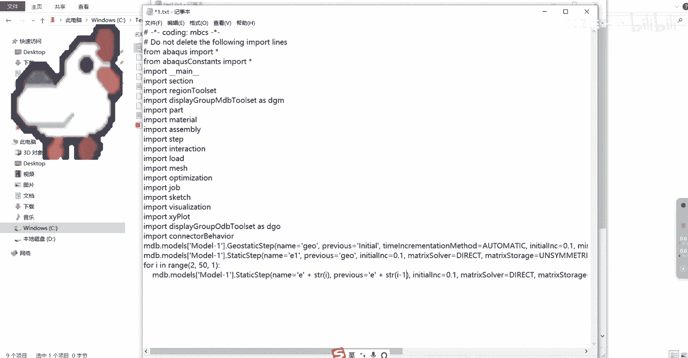

将编写好的脚本复制到ABAQUS/CAE界面下方的命令行接口（Python命令行）中，按回车键逐行执行。你也可以通过 **文件(File)** -> **运行脚本(Run Script)** 来执行整个 `.py` 文件。

执行成功后，你可以在模型树中看到从 `Initial`、`E1` 到 `E49` 的所有分析步都已创建完成，其参数均与脚本中设置的一致。

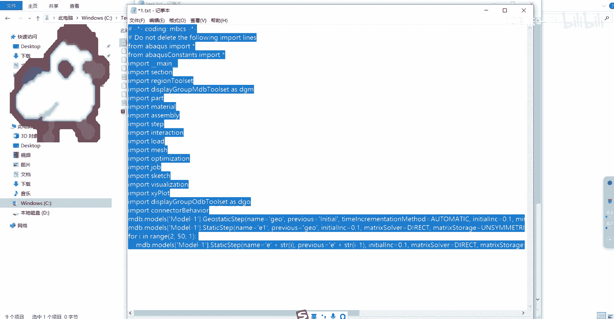

## 灵活应用与总结

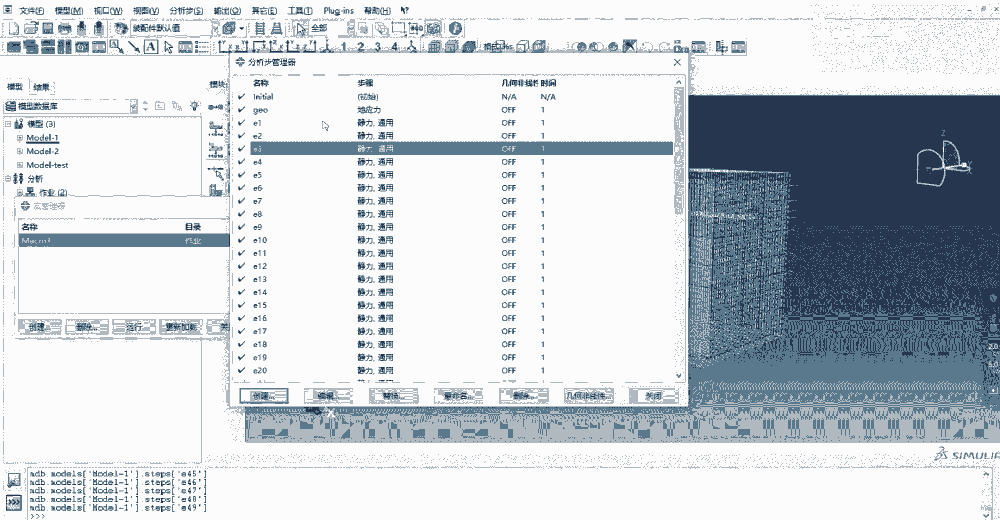

本节课中我们一起学习了使用Python脚本批量创建ABAQUS分析步的全流程。

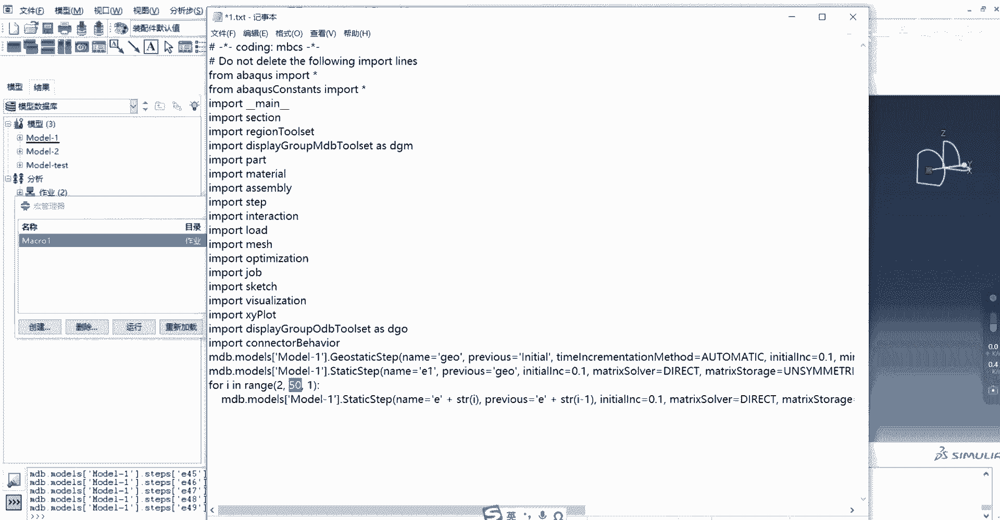

这个脚本非常灵活，你可以通过修改 `range()` 函数中的参数来轻松控制创建分析步的数量。例如，要创建100个分析步，只需将循环改为 `for i in range(2, 101):`。

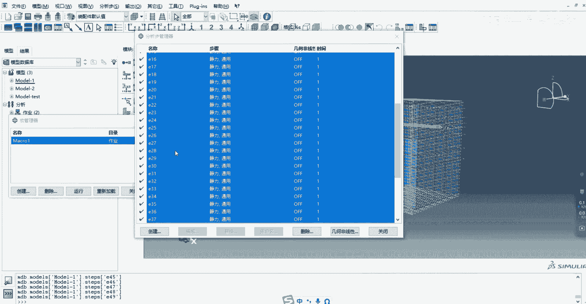

总结一下关键点：
1.  **录制宏**是快速获取操作对应Python代码的捷径。
2.  **精简脚本**，只保留核心对象创建语句。
3.  **引入循环**是实现批量化操作的核心，通过字符串拼接动态生成名称。
4.  此方法不仅适用于创建分析步，其思路同样可以应用于批量创建载荷、边界条件、交互属性等重复性操作。

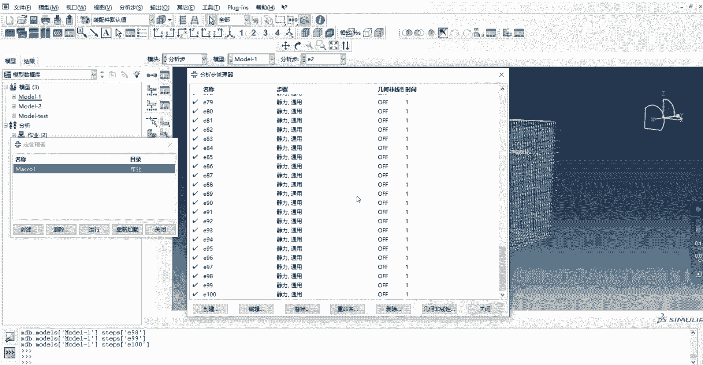

掌握这个技巧，能让你在处理大型复杂模型的重复设置任务时事半功倍。