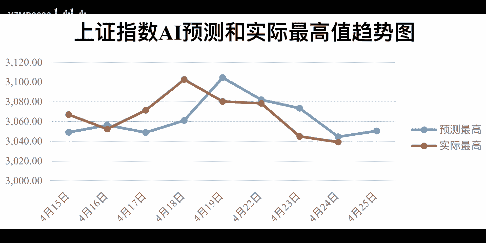
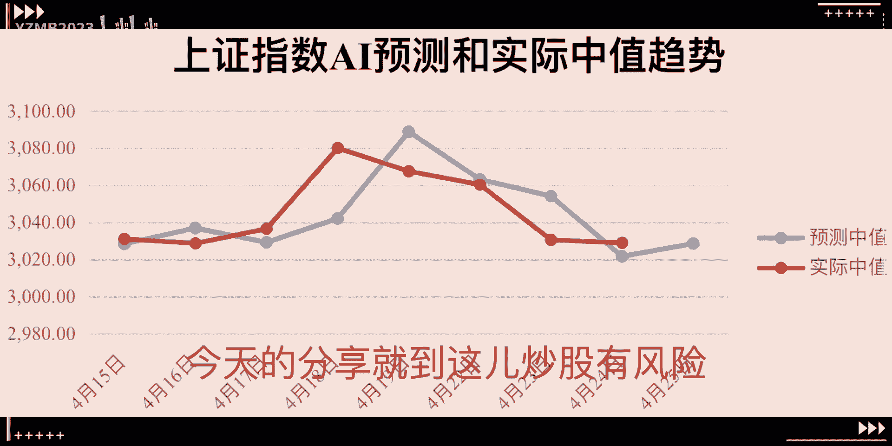
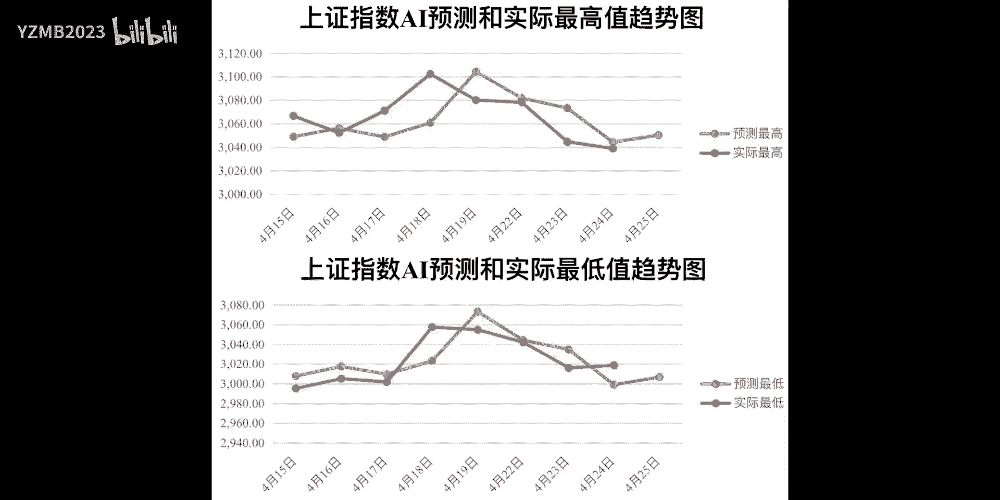

# AI 助力量化交易：P1：AI预测与量化交易入门指南 🧭



在本节课中，我们将要学习如何结合人工智能预测与量化交易策略来辅助股票投资决策。我们将从核心概念出发，逐步介绍从预测到执行的全过程，并强调风险管理的重要性。

## 概述

AI预测如同航海的潮汐表，能帮助我们预测股票未来的最高价与最低价。它依赖大量历史数据和机器学习算法，虽不能保证百分之百准确，但能提供重要的方向指引。

## 从预测到策略

上一节我们介绍了AI预测的概念，本节中我们来看看如何将预测转化为可执行的交易计划。

量化交易策略需根据AI的预测结果来制定。例如，当预测价格将上涨时，计划买入；预测价格将下跌时，计划卖出。这个策略如同清晰的航海图，为交易提供明确的行动指南。

## 策略的代码实现

有了明确的策略后，我们需要将其转化为计算机能够理解和执行的指令。

Python因其强大的数据处理能力，成为编写交易代码的合适选择。以下是一个简单的策略代码框架示例：

```python
# 示例：基于预测信号的简单交易逻辑
if predicted_price > current_price:
    action = "BUY"
elif predicted_price < current_price:
    action = "SELL"
else:
    action = "HOLD"
```

## 策略的回测与模拟

写好代码后，不能直接用于实盘交易，必须先进行验证。

这个过程称为回测，即使用历史数据模拟策略在过去的表现。如果回测结果良好，可以进行模拟交易，这如同在海上试航，帮助熟悉操作流程和市场反应。

## 风险管理

在股市中航行，必须时刻准备应对风浪，风险管理就是我们的安全装备。

核心的风险管理工具是**止损点**。其公式可表示为：
**止损价格 = 入场价格 × (1 - 止损比例)**
当市场价格触及止损点时，应果断卖出，以保护投资本金免受更大损失。

## 策略的持续优化

市场环境不断变化，我们的策略也不能一成不变。

需要定期评估策略效果，并根据最新的市场状况与AI预测结果进行动态调整，以确保策略持续有效。



## 总结



本节课中我们一起学习了AI预测与量化交易结合的基本框架。AI预测提供方向，量化策略制定明确计划，代码实现自动化，回测验证可行性，风险管理保障安全，持续优化适应市场。这套方法如同为投资之旅安装了智能导航系统，运用得当，可以帮助投资者在复杂的股市中更稳健地航行。

请记住，股市投资存在风险，本教程提及的方法仅为辅助决策的工具，不构成任何投资建议。