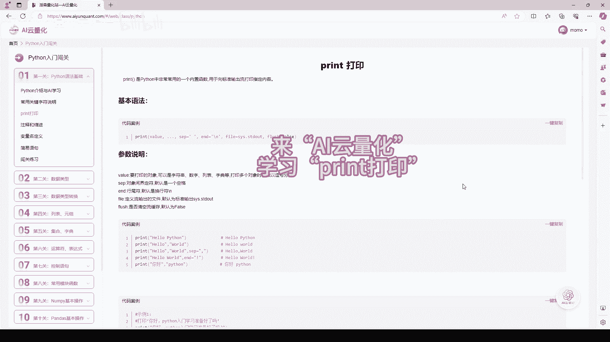
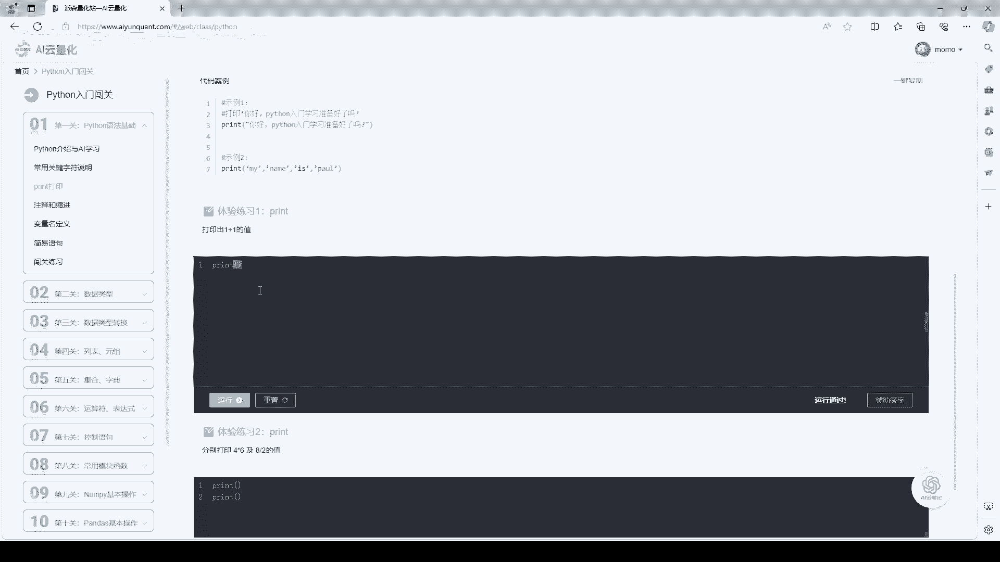
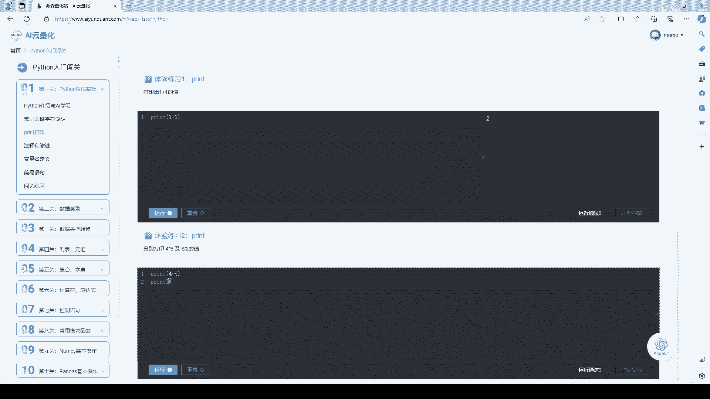
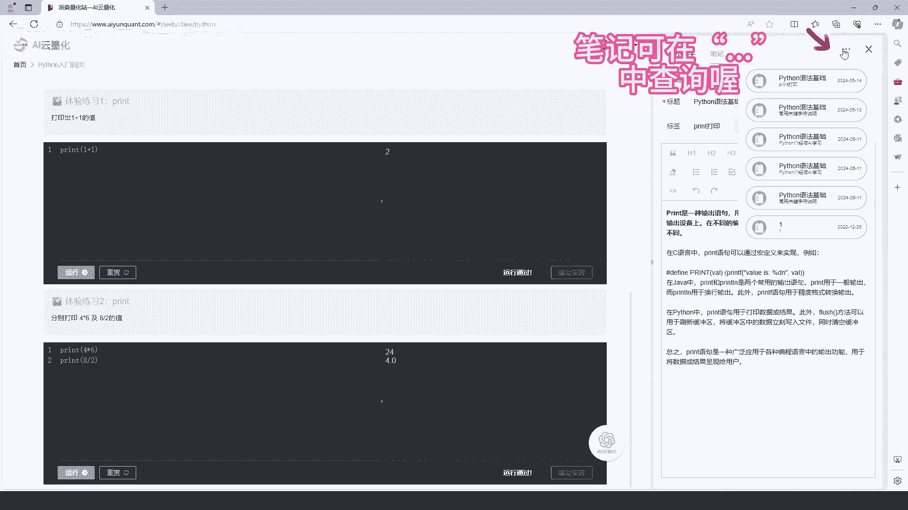
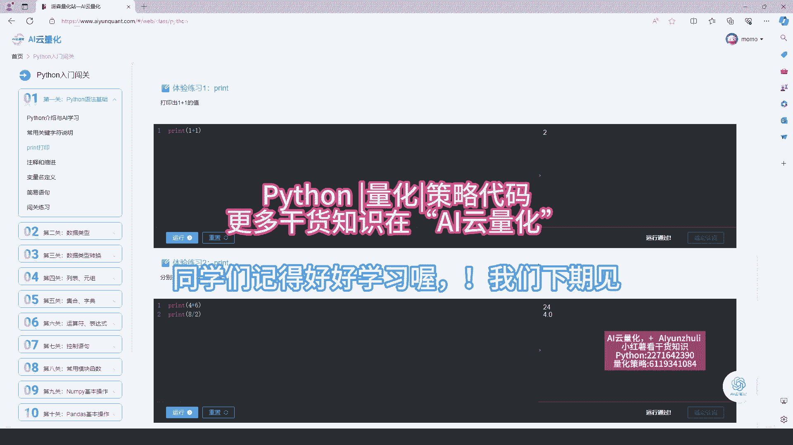

# AI云量化-print打印：P1：Python量化云编程

在本节课中，我们将要学习Python编程中最基础也是最重要的一个功能：`print`函数。它是我们与程序进行交互、查看数据结果的主要窗口，对于量化分析和数据处理至关重要。

## 概述

`print`函数是Python的内置函数，用于将指定的信息输出到控制台。在量化编程中，我们经常使用它来查看数据、调试代码和输出计算结果。



## `print`函数的基本用法

`print`函数的基本语法非常简单，其核心作用是输出括号内的内容。

```python
print(要打印的内容)
```

例如，如果我们想输出“Hello World”，可以这样写：

```python
print("Hello World")
```



执行这行代码后，控制台就会显示字符串 `Hello World`。

## `print`函数的进阶特性

上一节我们介绍了`print`函数的基本用法，本节中我们来看看它的一些进阶特性，这些特性能让我们的输出更加灵活和清晰。

### 1. 打印多个内容

`print`函数可以一次性输出多个项目，它们默认会用一个空格分隔。



```python
print("苹果", "香蕉", "橙子")
```
执行结果会是：`苹果 香蕉 橙子`。

### 2. 修改分隔符

我们可以通过 `sep` 参数来改变多个项目之间的分隔符号。

```python
print("苹果", "香蕉", "橙子", sep=", ")
```
执行结果会是：`苹果, 香蕉, 橙子`。

### 3. 控制结束符



默认情况下，`print`函数在输出结束后会自动换行。我们可以通过 `end` 参数来改变这个行为。

```python
print("Hello", end=" ")
print("World")
```
这两行代码执行后，会在同一行输出：`Hello World`。

## 在量化编程中的应用示例

了解了`print`函数的基本和进阶用法后，我们来看一个在量化分析中的简单应用。

假设我们计算了一个股票的投资回报率，可以使用`print`来清晰地展示结果。



```python
stock_name = "ABC公司"
initial_price = 100
current_price = 120
return_rate = (current_price - initial_price) / initial_price * 100

print("股票名称:", stock_name)
print("初始价格:", initial_price, "当前价格:", current_price)
print("投资回报率:", return_rate, "%", sep="")
```

这段代码会输出：
```
股票名称: ABC公司
初始价格: 100 当前价格: 120
投资回报率: 20.0%
```

## 总结

本节课中我们一起学习了Python中`print`函数的使用。我们从最基本的输出字符串开始，逐步学习了如何打印多个内容、如何使用`sep`和`end`参数自定义输出格式。最后，我们看到了一个在量化分析中输出计算结果的简单示例。掌握`print`函数是进行有效编程和调试的第一步，请务必多加练习。