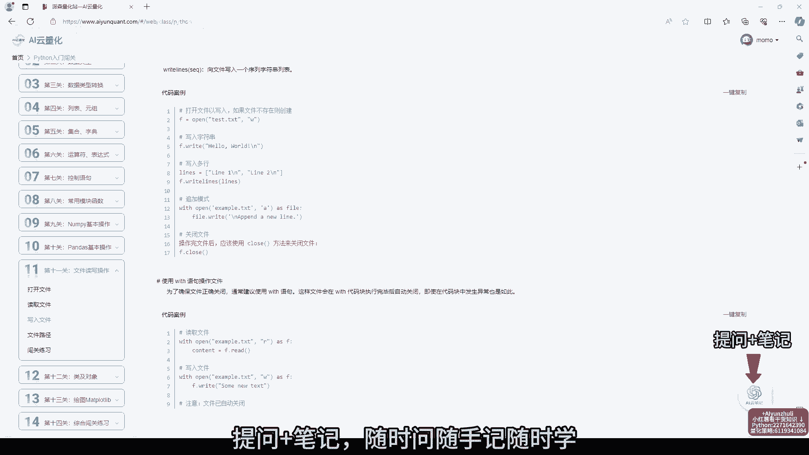
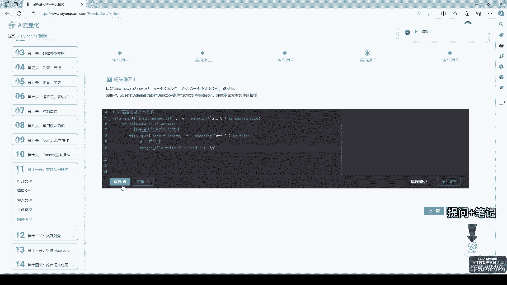
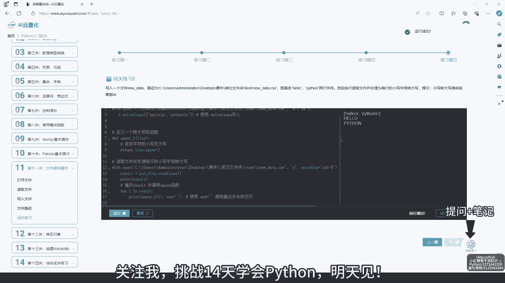

# AI云量化：第11关：文件读写操作 📂

在本节课中，我们将要学习Python中至关重要的文件读写操作。这是将程序运行结果持久化保存、读取外部数据（如股票数据、配置文件）的基础，是量化策略开发中不可或缺的一环。

## 概述

文件操作允许程序与计算机的存储系统交互，实现数据的长期保存和读取。我们将学习如何打开文件、读取内容、写入内容以及安全地关闭文件。

上一节我们介绍了函数与模块的封装，本节中我们来看看如何通过文件操作与外部数据进行交互。

## 打开与关闭文件



在Python中，操作文件的第一步是使用 `open()` 函数打开它。这个函数返回一个文件对象，后续的读写操作都基于这个对象进行。操作完成后，必须关闭文件以释放系统资源。

**核心语法**如下：
```python
file_object = open('filename.txt', 'mode')
# 进行读写操作...
file_object.close()
```
其中，`‘mode’` 参数决定了文件的打开模式，例如只读（`‘r’`）、写入（`‘w’`）或追加（`‘a’`）。

为了确保文件在任何情况下都能被正确关闭，推荐使用 `with` 语句。它会在代码块执行完毕后自动关闭文件，即使发生异常也不例外。

以下是使用 `with` 语句的示例：
```python
with open('filename.txt', 'r') as file:
    content = file.read()
# 文件在此处已自动关闭
```

## 读取文件内容

打开文件后，我们可以使用多种方法来读取其内容。选择哪种方法取决于你的具体需求，例如是读取全部内容、逐行读取还是读取指定大小的数据。

以下是几种常用的文件读取方法：
*   **`read()`**：一次性读取文件的全部内容，返回一个字符串。
*   **`readline()`**：每次读取文件的一行内容。
*   **`readlines()`**：一次性读取所有行，并返回一个由每行字符串组成的列表。

## 写入与追加内容

向文件写入内容同样重要。我们需要使用写入（`‘w’`）或追加（`‘a’`）模式来打开文件。**注意**：以 `‘w’` 模式打开一个已存在的文件会**清空**其原有内容。

写入操作主要通过 `write()` 和 `writelines()` 方法完成。

以下是写入操作的示例：
```python
with open('data.txt', 'w') as file:
    file.write('Hello, World!\n')  # 写入字符串，注意换行符\n
    file.writelines(['Line 1\n', 'Line 2\n'])  # 写入一个字符串列表
```



## 综合闯关练习

理论学习之后，实践是检验掌握程度的最好方式。本课程每一关都配备了综合练习题，这些题目融合了前面所学的知识。

在练习时，如果遇到代码错误，请耐心仔细检查。网站配备了辅助答案和详细的讲解，右下角的“艾云笔记”功能也支持随时提问和记录心得，帮助你利用碎片化时间巩固知识。

## 学习资源与社区

本学习平台不仅提供Python基础课程，还包含量化策略、证券数学、计算机科学等丰富的知识库和代码案例。

想一起坚持打卡学习的小伙伴，可以联系我加入学习社群，共同进步。视频内容可以调整倍速播放，请根据自身情况好好学习。

## 总结



本节课中我们一起学习了Python文件读写操作的核心知识。我们掌握了如何使用 `open()` 函数和 `with` 语句安全地打开和关闭文件，学会了 `read()`， `readline()`， `write()` 等关键方法进行数据读取与写入。

请务必复盘这些知识点，并通过练习题加以巩固。掌握文件操作，将为后续处理真实的金融市场数据文件打下坚实基础。