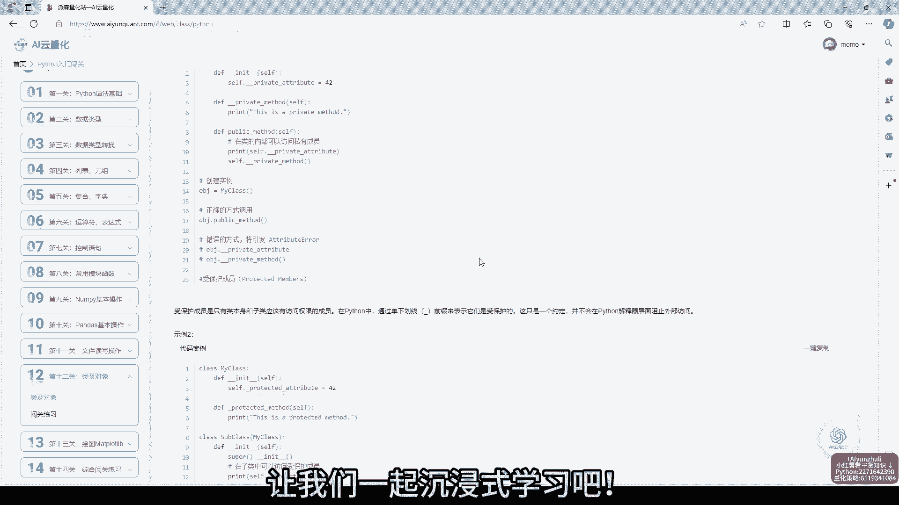
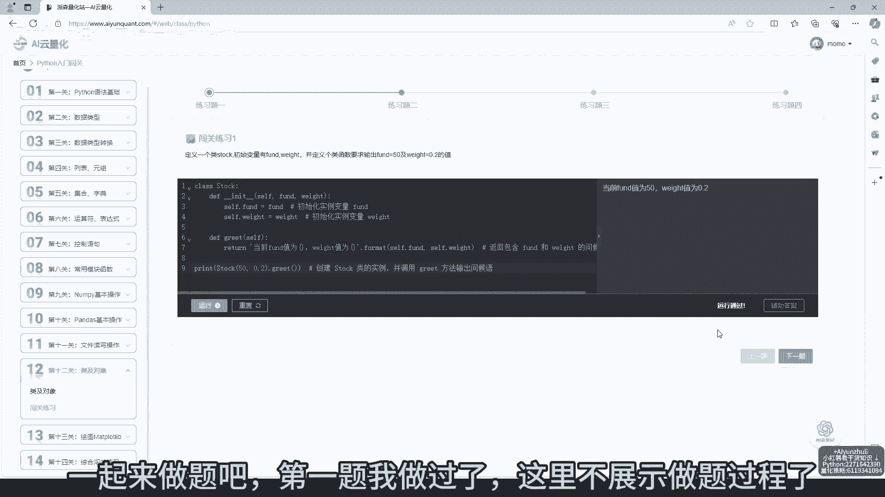
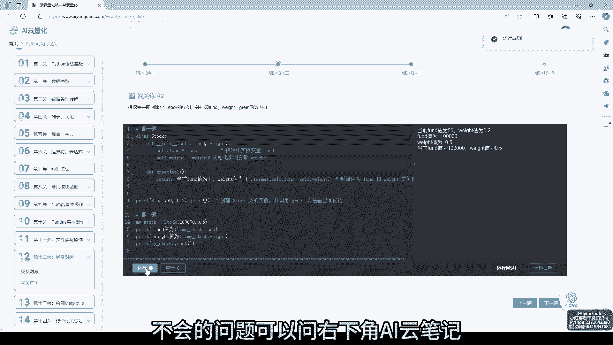
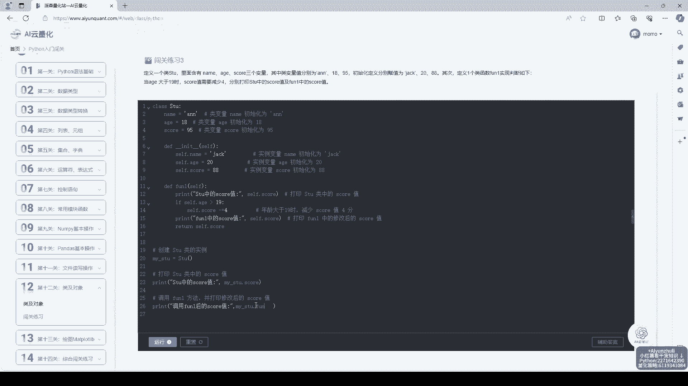
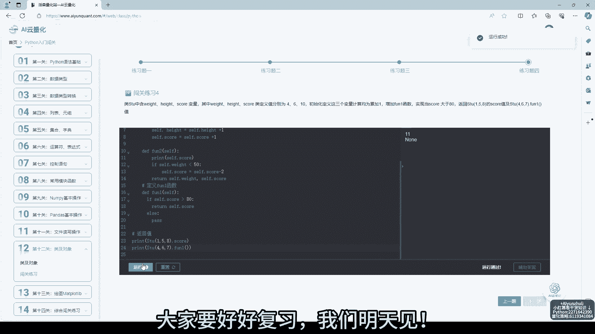

# AI云量化：第12关：类及对象

在本节课中，我们将学习Python编程中一个核心且强大的概念：**类与对象**。这是面向对象编程的基础，能帮助我们更好地组织代码、模拟现实世界，并编写出更高效、可复用的量化策略。

## 课程概述

面向对象编程是一种将数据和操作数据的方法捆绑在一起的编程范式。**类**是创建对象的蓝图，而**对象**是根据这个蓝图创建的具体实例。理解它们对于构建复杂的量化分析模型至关重要。

上一节我们介绍了函数和模块化编程，本节中我们来看看如何使用类和对象将数据和功能进一步封装。



## 核心概念：类与对象

一个**类**定义了一类对象的属性和方法。我们可以将其理解为一个自定义的数据类型。



一个**对象**是类的具体实例，拥有类所定义的属性和具体值。

以下是定义一个简单类和创建对象的基本语法：

```python
# 定义一个名为 ‘Strategy‘ 的类
class Strategy:
    # 初始化方法，用于设置对象的初始属性
    def __init__(self, name, capital):
        self.name = name  # 策略名称属性
        self.capital = capital  # 初始资金属性

    # 一个类的方法，用于描述策略
    def describe(self):
        return f"策略'{self.name}'的初始资金为{self.capital}元。"

# 根据Strategy类创建一个具体的对象
my_strategy = Strategy("双均线策略", 100000)



# 调用对象的方法
print(my_strategy.describe())
```

运行以上代码，将输出：`策略‘双均线策略’的初始资金为100000元。`。这里，`Strategy`是类，`my_strategy`是根据这个类创建的对象。

## 学习资源与建议

网站提供了丰富的学习材料，每个关键知识点都配有可运行的代码案例，建议通过实践来加深理解。



以下是利用网站资源高效学习的几个要点：

*   **沉浸式学习**：利用网站的交互式环境，动手修改并运行代码案例。
*   **习题巩固**：完成每节配套的练习题，检验知识掌握程度。
*   **随时提问**：遇到不理解的问题，可以使用网站右下角的“嗨云笔记”功能随时提问。
*   **碎片化学习**：网站还提供了大量免费的量化策略、数学及计算机科学干货知识，适合利用业余时间拓展学习。

## 课程总结



本节课我们一起学习了Python中**类**与**对象**的基本概念。我们了解到，类是创建对象的模板，而对象是类的具体表现。通过定义属性和方法，我们可以用类来模拟量化策略等复杂实体，使代码结构更清晰、更易于管理。

距离完成14天Python学习挑战还剩两天，请务必复习巩固已学知识。持续练习是掌握编程的关键。