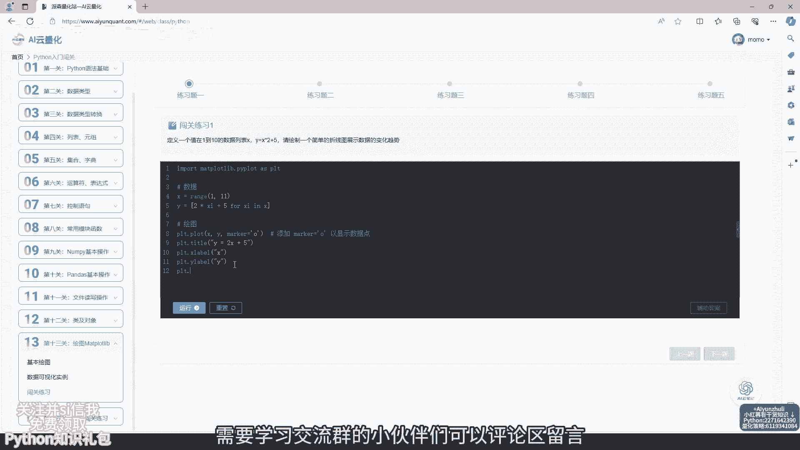
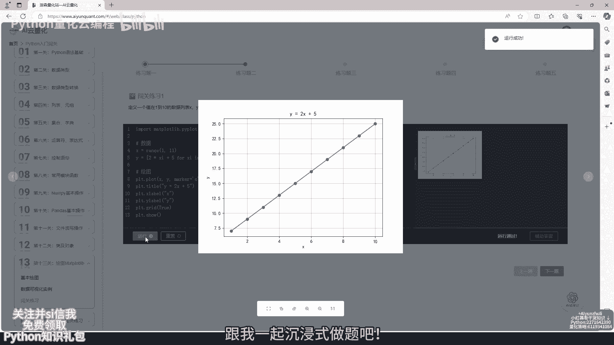
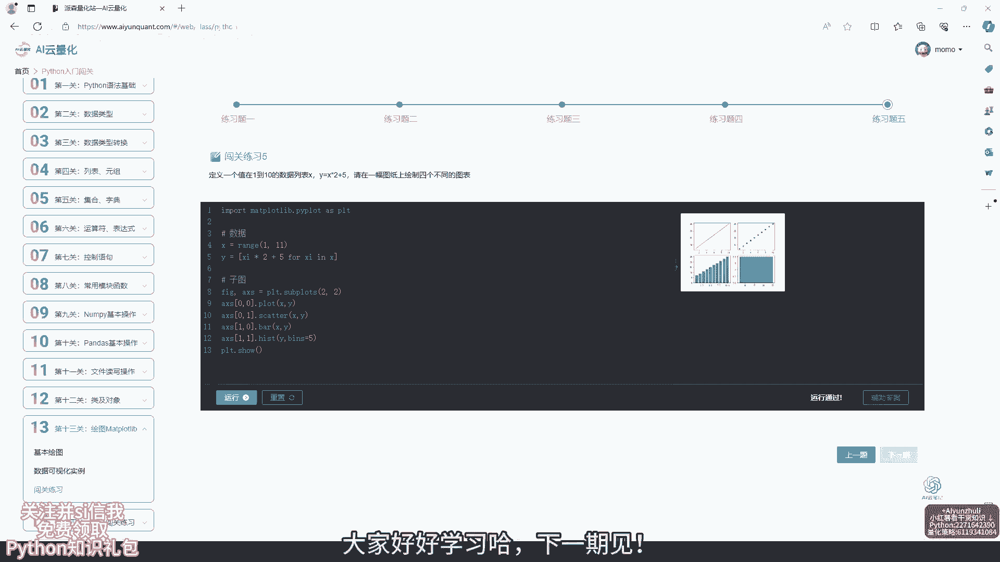

# AI云量化：第13关：📊 绘图Matplotlib

在本节课中，我们将要学习Python中一个非常重要的数据可视化库——Matplotlib。通过它，我们可以将数据转化为图表，这对于量化策略分析至关重要。我们将从基础概念开始，逐步学习如何创建和定制图表。

---

## 概述

Matplotlib是Python中最流行的绘图库之一，它提供了丰富的接口来创建静态、动态和交互式的图表。在量化分析中，图表能帮助我们直观地理解数据趋势、回测结果和策略表现。

上一节我们介绍了数据处理的基础知识，本节中我们来看看如何将处理好的数据用图表清晰地展示出来。

---

## 核心概念与基本用法

Matplotlib的核心是`pyplot`模块，它提供了一套类似MATLAB的绘图函数。一个最简单的绘图流程包括创建图形、绘制数据点或线条，然后显示或保存图形。

以下是创建一个简单折线图的基本步骤：

1.  **导入模块**：首先需要导入Matplotlib的`pyplot`模块。
    ```python
    import matplotlib.pyplot as plt
    ```
2.  **准备数据**：定义要绘制的X轴和Y轴数据。
    ```python
    x = [1, 2, 3, 4, 5]
    y = [2, 4, 6, 8, 10]
    ```
3.  **绘制图形**：使用`plot`函数绘制数据，并用`show`函数显示图形。
    ```python
    plt.plot(x, y)
    plt.show()
    ```

---


## 常用图表类型

Matplotlib可以绘制多种类型的图表，以适应不同的数据分析需求。

以下是几种在量化分析中常用的图表类型及其创建方法：

*   **折线图**：用于展示数据随时间或其他连续变量的变化趋势。
    ```python
    plt.plot(x, y) # 创建折线图
    ```
*   **柱状图**：用于比较不同类别之间的数据。
    ```python
    plt.bar(categories, values) # 创建柱状图
    ```
*   **散点图**：用于观察两个变量之间的关系或分布。
    ```python
    plt.scatter(x, y) # 创建散点图
    ```
*   **直方图**：用于展示数据的分布情况。
    ```python
    plt.hist(data, bins=10) # 创建直方图，bins指定分组数量
    ```

---

## 图表定制化

为了让图表更清晰、更专业，我们经常需要添加标题、坐标轴标签、图例，并调整线条样式和颜色。



以下是一些常见的图表定制方法：

*   **添加标题和标签**：
    ```python
    plt.title('策略收益曲线') # 图表标题
    plt.xlabel('时间') # X轴标签
    plt.ylabel('收益率') # Y轴标签
    ```
*   **添加图例**：当有多条线时，需要用图例区分。
    ```python
    plt.plot(x1, y1, label='策略A')
    plt.plot(x2, y2, label='策略B')
    plt.legend() # 显示图例
    ```
*   **设置线条样式**：可以控制线条的颜色、类型和标记点。
    ```python
    plt.plot(x, y, color='red', linestyle='--', marker='o')
    # color: 颜色，linestyle: 线型（如‘-’， ‘--’）， marker: 数据点标记
    ```

---



## 在量化策略中的应用

在量化交易中，Matplotlib常用于可视化策略回测结果，例如绘制资产净值曲线、回撤曲线、收益分布图等，帮助开发者评估策略性能。

假设我们有一个策略的每日收益率序列`returns`和累计净值序列`net_value`。

以下是绘制策略净值曲线的示例：

```python
import matplotlib.pyplot as plt
import numpy as np

# 模拟数据：交易日和对应的策略净值
trading_days = range(1, 101) # 100个交易日
strategy_net_value = 100 + np.cumsum(np.random.randn(100) * 0.5) # 模拟净值序列

plt.figure(figsize=(10, 6)) # 设置图形大小
plt.plot(trading_days, strategy_net_value, linewidth=2, label='策略净值')
plt.axhline(y=100, color='gray', linestyle=':', label='初始净值') # 添加基准线
plt.title('量化策略净值曲线')
plt.xlabel('交易日')
plt.ylabel('净值')
plt.grid(True, alpha=0.3) # 添加网格线
plt.legend()
plt.show()
```

---

## 学习资源与工具

为了更高效地学习，可以利用一些在线工具和资源。在线代码编辑器可以免去本地安装的麻烦，而闯关练习则能帮助巩固所学知识。每个知识点都配有详细的代码案例讲解。



---

## 总结

本节课中我们一起学习了Matplotlib绘图库的基础知识。我们了解了其核心概念，学会了如何创建折线图、柱状图等常用图表，并掌握了定制图表样式（如添加标题、标签、图例）的方法。最后，我们看到了Matplotlib在量化策略分析中的一个简单应用示例——绘制策略净值曲线。数据可视化是量化分析中不可或缺的一环，掌握Matplotlib将为你后续的策略开发和评估打下坚实基础。