# AI云量化：第2关：Python数据类型与量化策略代码学习

在本节课中，我们将要学习Python编程中的基础数据类型，并了解如何将这些知识应用到量化策略代码的编写中。理解数据类型是编写任何程序，包括量化交易策略的第一步。

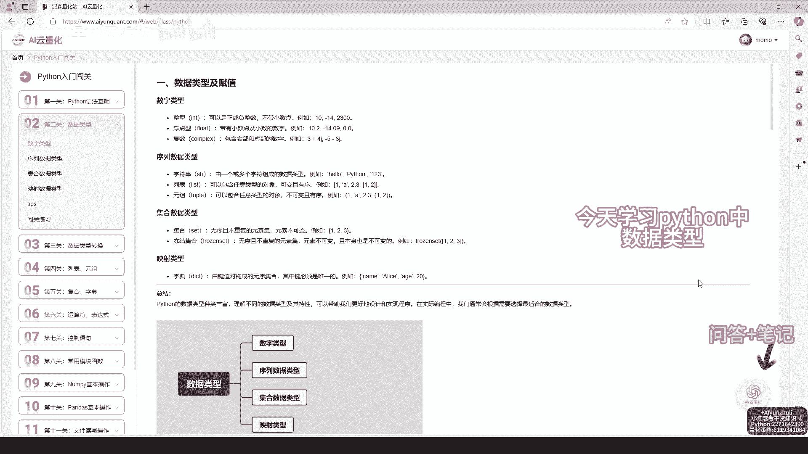

## 数据类型基础

上一节我们介绍了量化编程的基本概念，本节中我们来看看Python中的基础数据类型。数据类型决定了变量可以存储什么种类的数据以及能进行哪些操作。

Python中常见的基础数据类型包括：

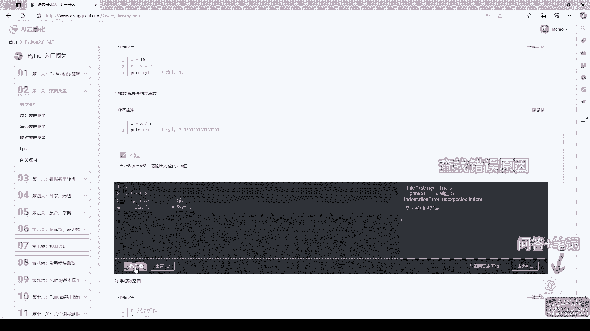

*   **整数 (int)**：表示没有小数部分的数字，例如 `10`、`-5`、`0`。
*   **浮点数 (float)**：表示带有小数部分的数字，例如 `3.14`、`2.0`、`-0.001`。
*   **字符串 (str)**：表示文本信息，由一系列字符组成，需要用单引号 `'` 或双引号 `"` 括起来，例如 `'Hello'`、`"量化交易"`。
*   **布尔值 (bool)**：表示逻辑值，只有两种可能：`True`（真）或 `False`（假）。

在代码中，我们可以直接为变量赋值，Python会自动判断其类型。

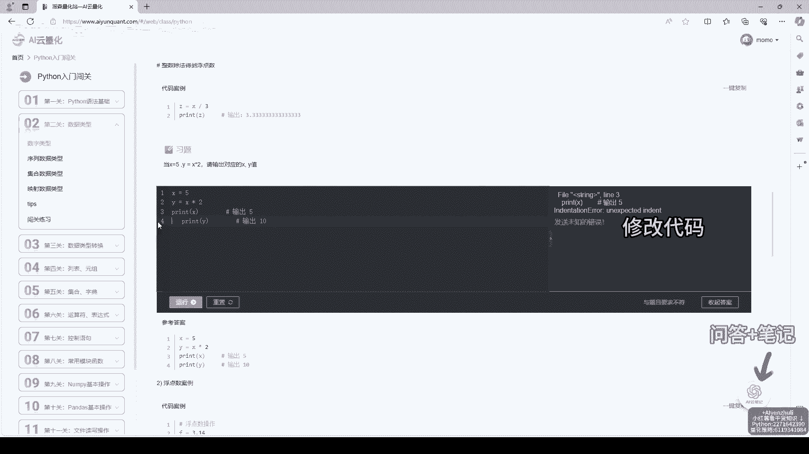

```python
# 整数
position = 100
# 浮点数
price = 25.68
# 字符串
stock_name = "AAPL"
# 布尔值
is_rising = True
```

## 数据类型的查看与转换

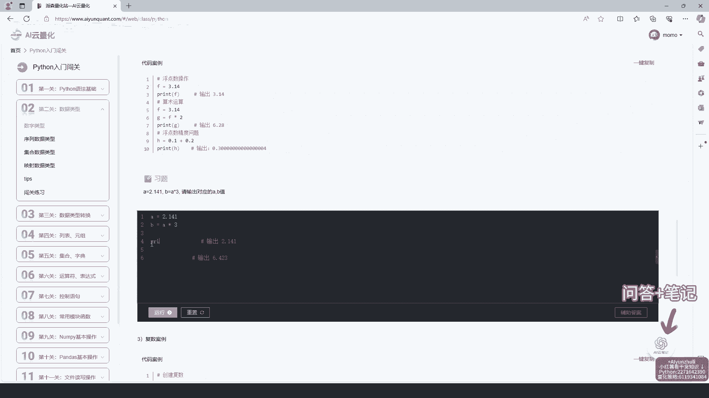

在编写策略时，我们经常需要确认数据的类型，或者在类型之间进行转换以满足计算需求。

使用 `type()` 函数可以查看任何变量或值的数据类型。

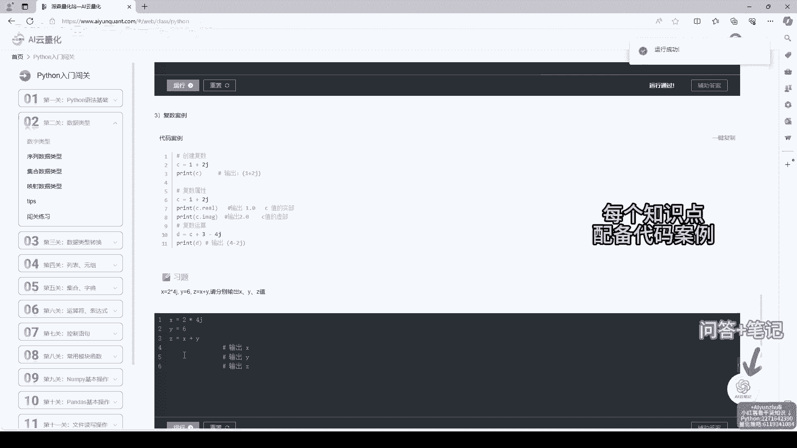

```python
print(type(position))  # 输出：<class 'int'>
print(type(price))     # 输出：<class 'float'>
```

有时我们需要进行类型转换。例如，将字符串形式的数字转换为整数或浮点数进行计算，或者将数字转换为字符串进行输出。

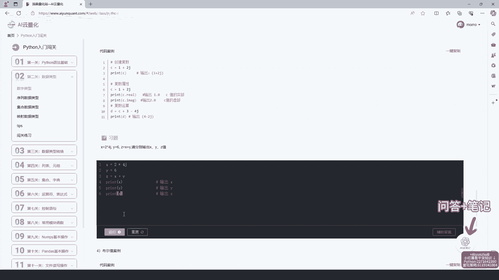

以下是常用的类型转换函数：

*   `int()`：将数据转换为整数。
*   `float()`：将数据转换为浮点数。
*   `str()`：将数据转换为字符串。

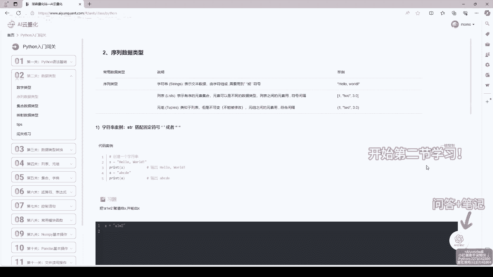

```python
# 字符串转换为数字进行计算
price_str = "100.5"
price_float = float(price_str)
print(price_float * 2)  # 输出：201.0

# 数字转换为字符串进行拼接
trade_info = "价格：" + str(price_float)
print(trade_info)  # 输出：价格：100.5
```

## 列表：管理数据序列

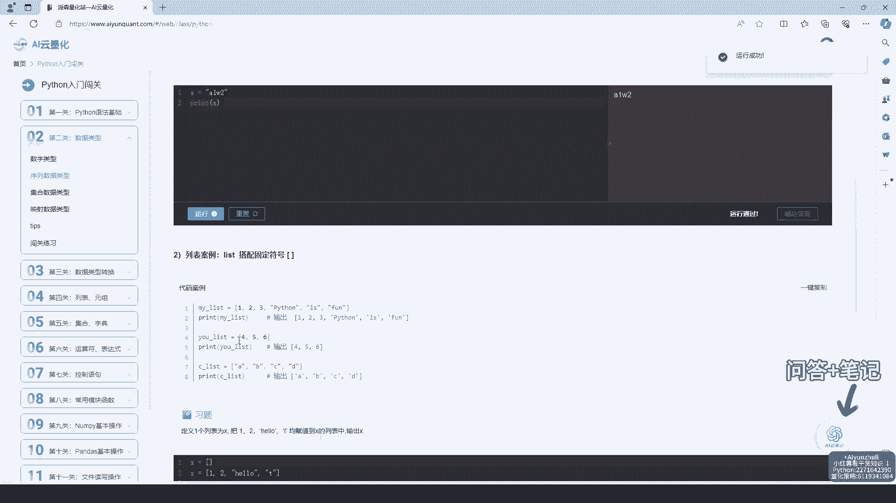

在量化分析中，我们经常需要处理一系列数据，例如一支股票多天的价格。这时就需要用到**列表 (list)**。

列表是一个有序的集合，可以存放任意类型的数据，并用方括号 `[]` 表示。

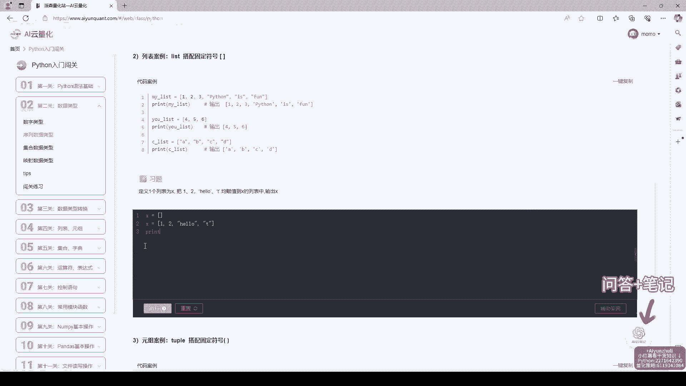

```python
# 创建一个价格列表
price_list = [100.5, 102.3, 101.8, 105.0]
# 创建一个混合列表（实践中应尽量避免）
mixed_list = [1, "AAPL", True, 200.5]
```

我们可以通过索引（从0开始计数）来访问列表中的单个元素。

```python
first_price = price_list[0]  # 获取第一个元素，100.5
third_price = price_list[2]  # 获取第三个元素，101.8
```

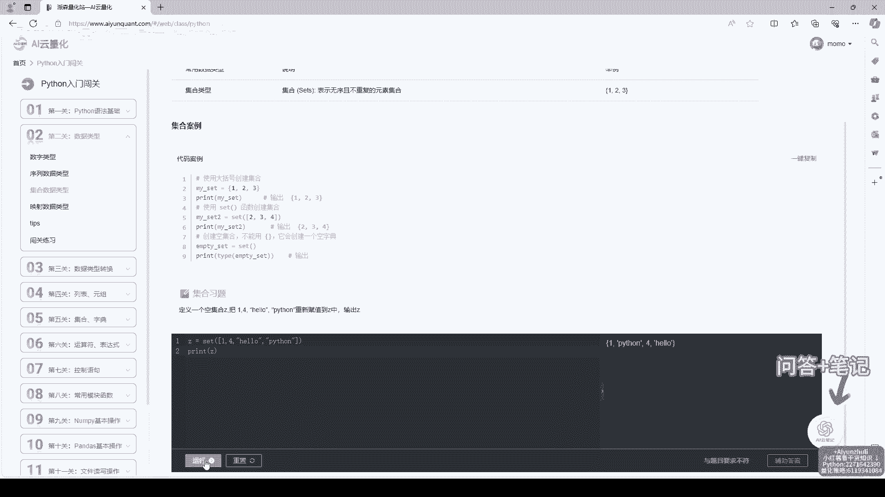

列表拥有强大的功能，以下是一些基本操作：

*   **添加元素**：使用 `append()` 方法在列表末尾添加新元素。
*   **获取长度**：使用 `len()` 函数获取列表中元素的数量。
*   **列表切片**：使用 `[start:end]` 的语法获取列表的一部分子集。

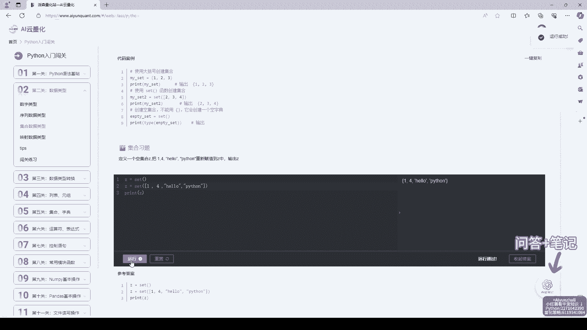

```python
# 添加一个新的收盘价
price_list.append(107.2)
print(price_list)  # 输出：[100.5, 102.3, 101.8, 105.0, 107.2]

# 获取列表长度（即有多少个价格数据）
num_days = len(price_list)
print(f"共有{num_days}天的数据")  # 输出：共有5天的数据

# 切片：获取前3天的价格
first_three = price_list[0:3]
print(first_three)  # 输出：[100.5, 102.3, 101.8]
```

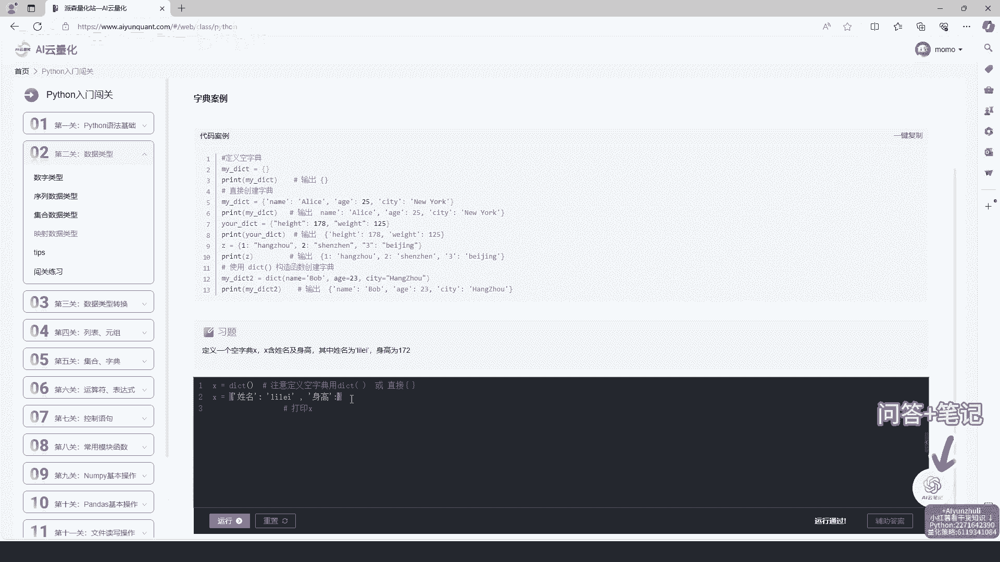

## 字典：组织键值对数据

当我们想通过一个特定的“键”来查找对应的“值”时，例如通过股票代码查找其当前价格，**字典 (dict)** 是最合适的数据结构。

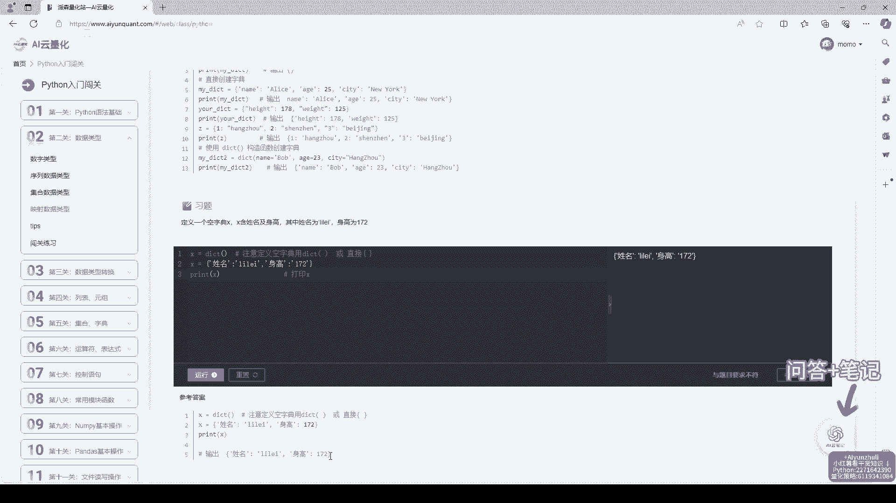

字典使用花括号 `{}` 表示，其中的元素以 `键: 值` 的形式成对出现。

```python
# 创建一个股票持仓字典
portfolio = {
    "AAPL": 150,   # 键“AAPL”对应值150（股）
    "GOOGL": 45,   # 键“GOOGL”对应值45
    "TSLA": 80     # 键“TSLA”对应值80
}
```

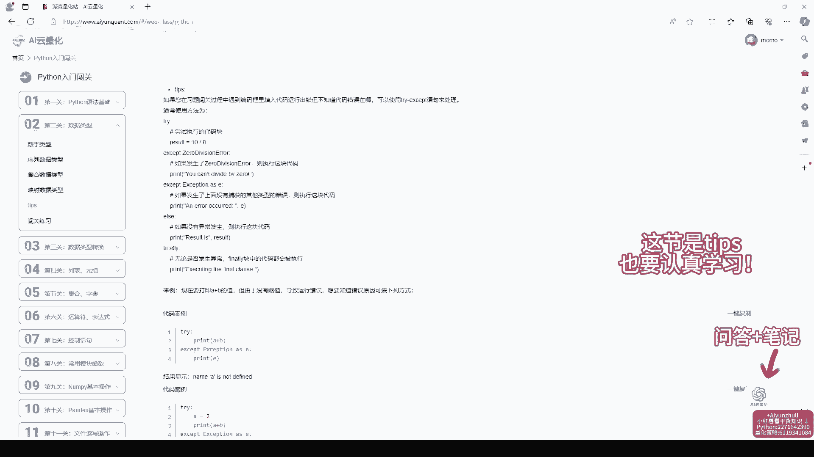

通过键可以快速访问、修改或添加字典中的值。

```python
# 访问键“AAPL”对应的持仓数量
aapl_shares = portfolio["AAPL"]
print(aapl_shares)  # 输出：150

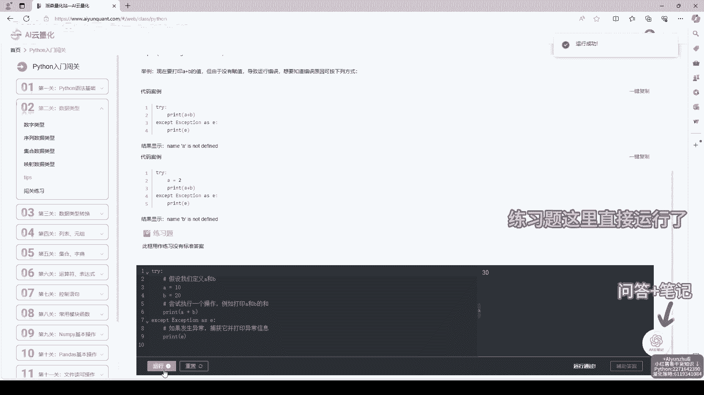

# 修改“TSLA”的持仓
portfolio["TSLA"] = 75

# 添加一个新的股票持仓
portfolio["MSFT"] = 120
```

## 在量化策略中的应用

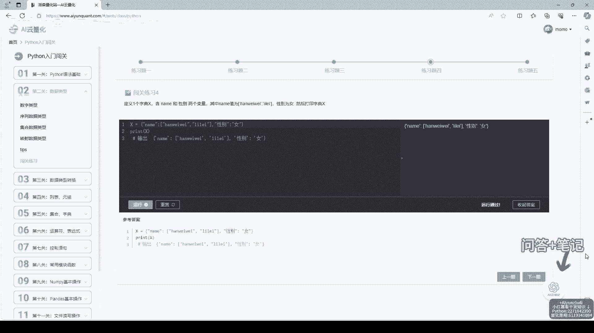

理解了这些基础数据类型后，我们就可以开始构建量化策略的雏形。一个简单的策略可能涉及跟踪价格列表、根据条件判断买卖点、并记录交易结果。

假设我们有一个每日价格列表，我们计算其简单移动平均，并制定一个规则：当今日价格超过平均价格时，视为看涨信号。

```python
# 示例：简单的价格突破策略逻辑
price_history = [95, 98, 102, 101, 105, 108, 107, 110]

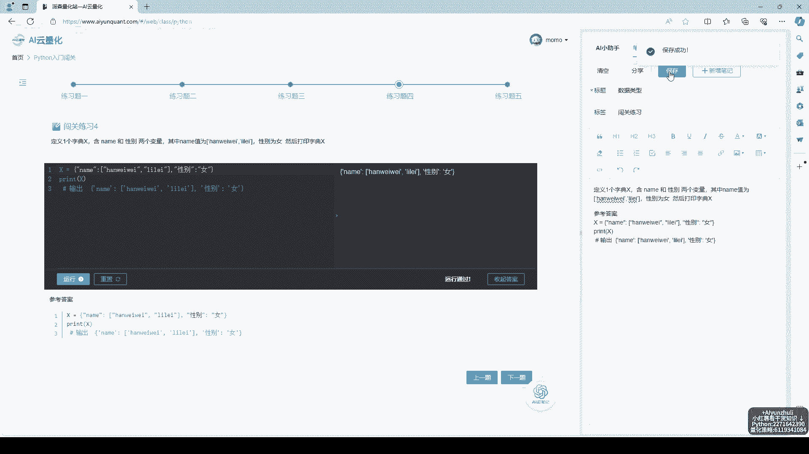

# 计算最近5天的平均价格
lookback = 5
recent_prices = price_history[-lookback:]  # 使用切片获取最后5个价格
average_price = sum(recent_prices) / len(recent_prices)

current_price = price_history[-1]  # 最新价格
signal = current_price > average_price  # 产生一个布尔值信号

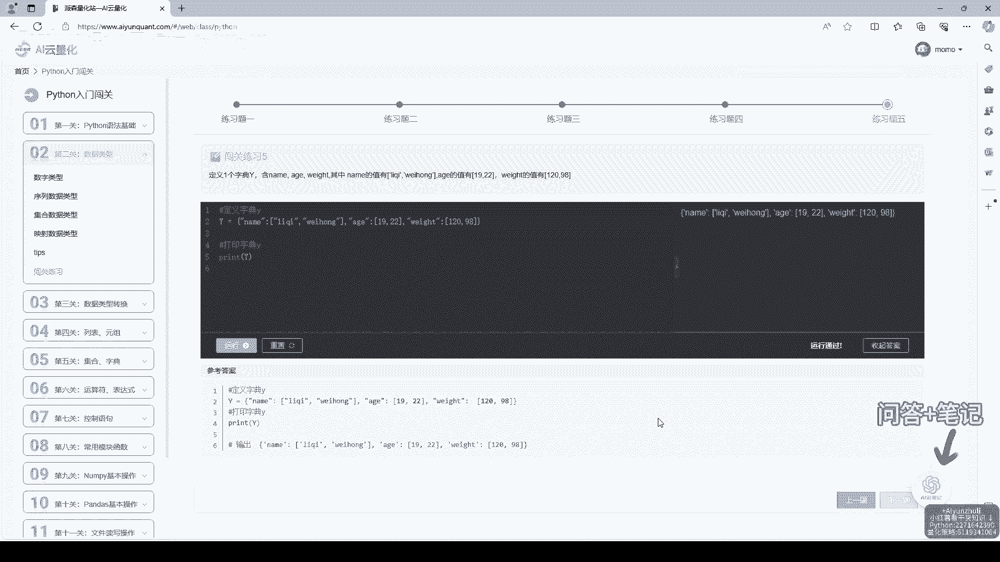

print(f"近期平均价：{average_price:.2f}")
print(f"当前价：{current_price}")
print(f"是否看涨：{signal}")
```

在这个例子中，我们综合运用了列表（存储价格）、数值计算（求平均值）、比较操作（`>`）和布尔值（存储信号），构成了策略的核心逻辑。

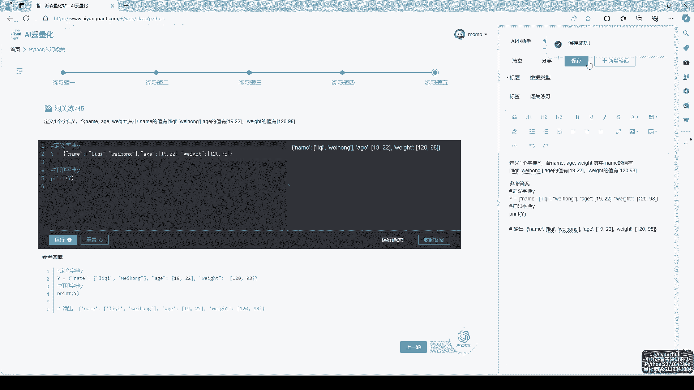

## 总结

本节课中我们一起学习了Python量化编程的基石——数据类型。

我们首先认识了整数、浮点数、字符串和布尔值这些基本类型，学会了如何使用 `type()` 查看类型以及用 `int()`, `float()`, `str()` 进行转换。

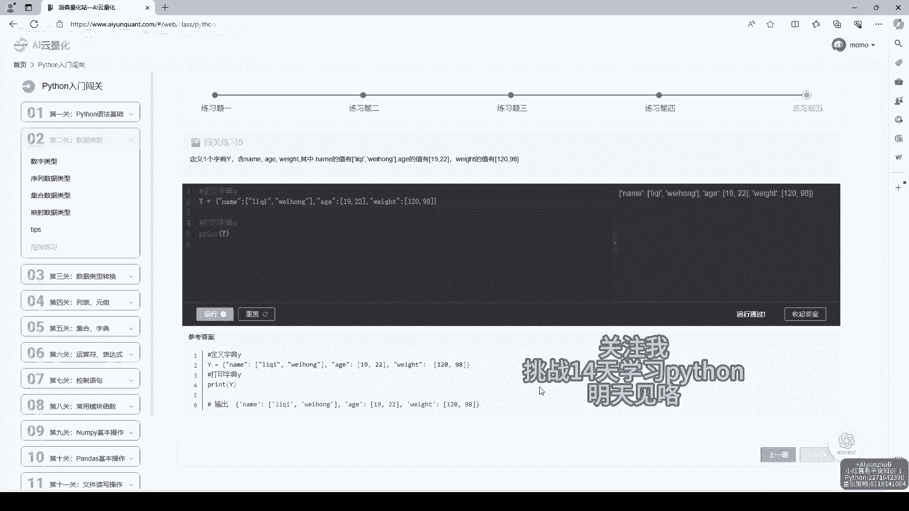

接着，我们探索了两种重要的数据结构：用于存储有序序列的**列表 (list)** 和用于存储键值对映射的**字典 (dict)**，并掌握了它们的基本操作，如索引、添加元素和切片。

最后，我们通过一个简单的价格突破策略示例，看到了如何将这些数据类型组合起来，形成策略逻辑的雏形。牢固掌握这些概念，是后续编写更复杂、更自动化量化交易策略的必要前提。