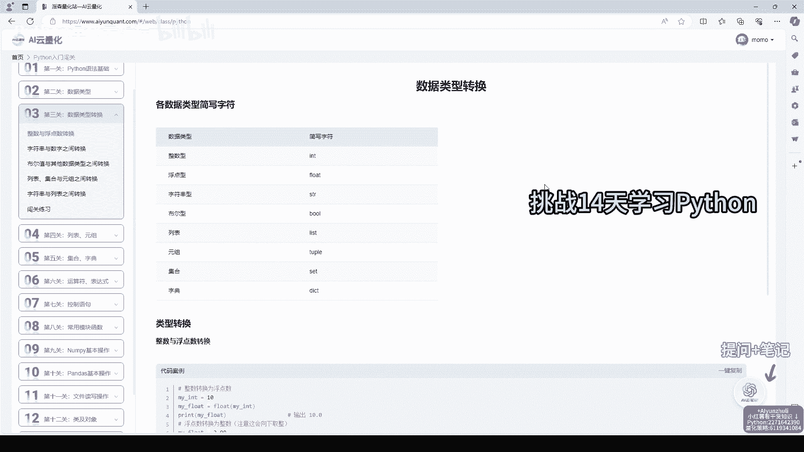
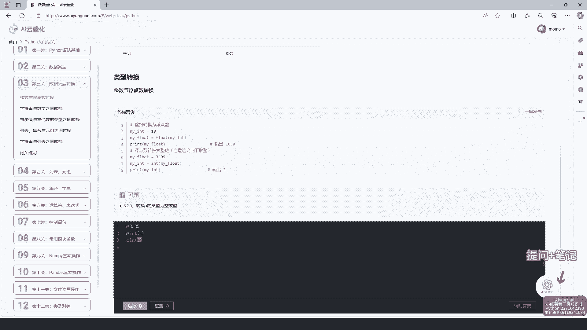
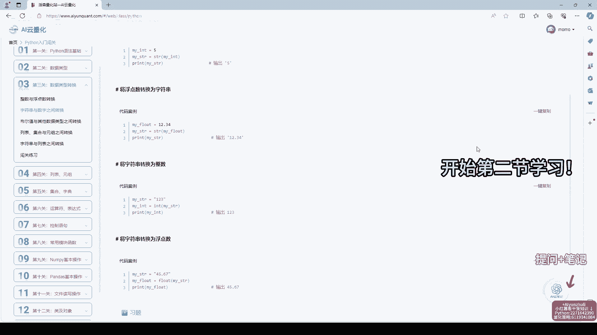
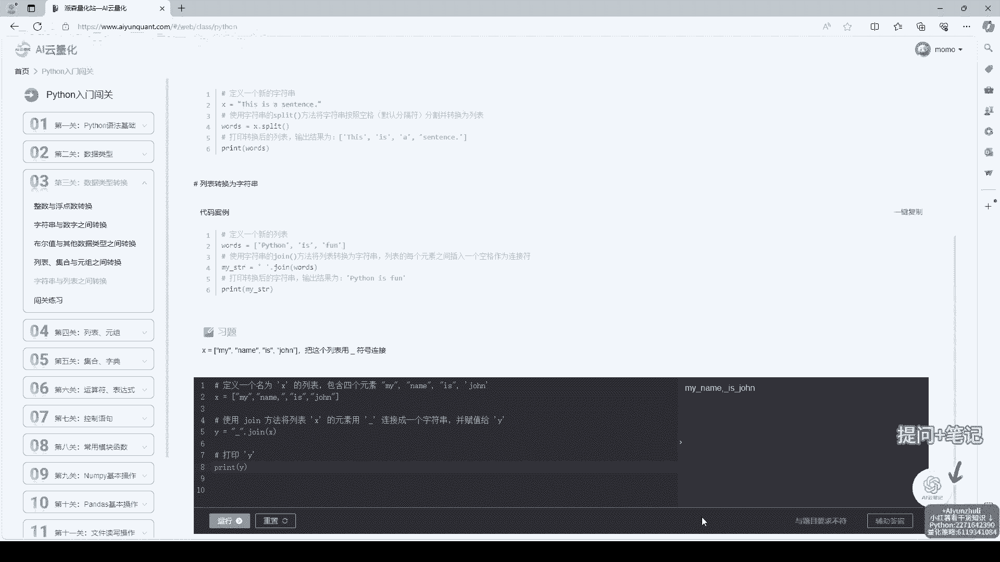
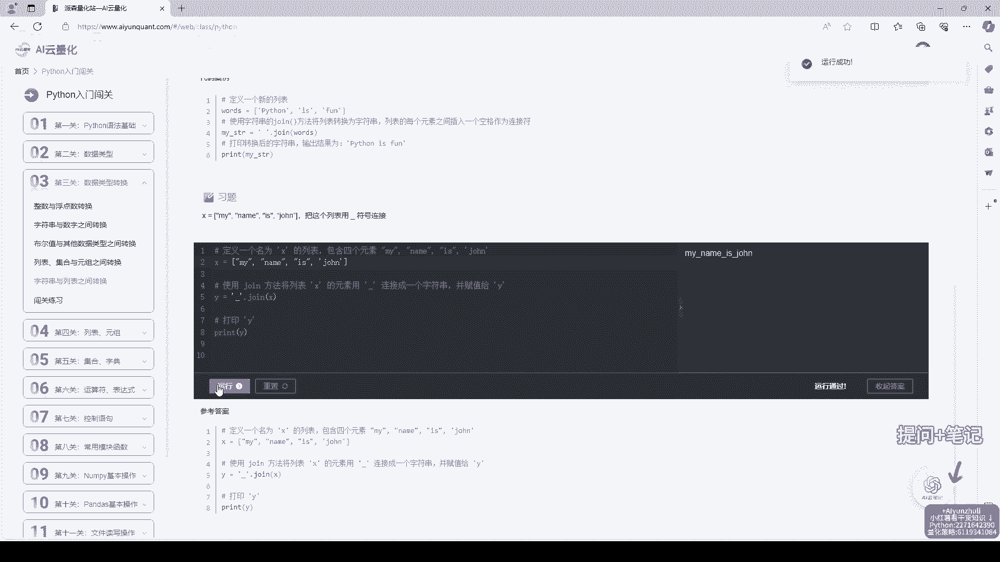
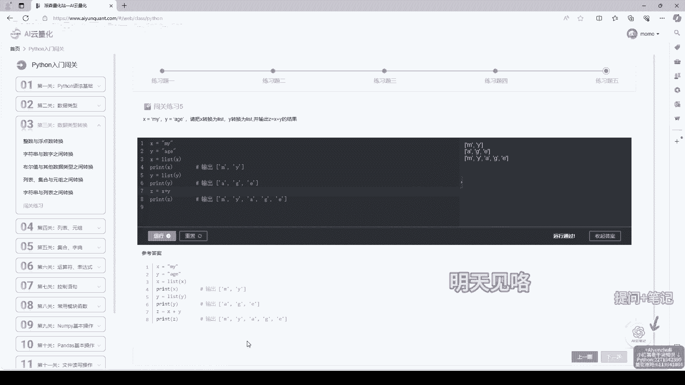

# AI云量化：第3关：数据类型转换

在本节课中，我们将要学习Python编程中一个非常基础且重要的概念——数据类型转换。理解并掌握不同类型数据之间的转换，是编写量化策略代码的必备技能。

## 概述

在Python中，数据有不同的类型，例如整数、浮点数、字符串等。不同类型的数据有不同的用途和操作方式。有时，我们需要将一种类型的数据转换为另一种类型，以便进行计算或处理。这个过程就叫做**数据类型转换**。



上一节我们介绍了Python的基本数据类型，本节中我们来看看如何在这些类型之间进行转换。

## 数据类型转换的核心方法

Python提供了几个内置函数，可以方便地进行数据类型转换。以下是三个最常用的转换函数：

1.  **`int()`**：将其他类型的数据转换为整数。
2.  **`float()`**：将其他类型的数据转换为浮点数。
3.  **`str()`**：将其他类型的数据转换为字符串。



### 1. 转换为整数 (int)

`int()`函数可以将浮点数或由数字组成的字符串转换为整数。转换浮点数时，它会直接舍弃小数部分。

以下是使用`int()`函数的示例：



```python
# 将浮点数转换为整数
a = 3.14
b = int(a)
print(b)  # 输出：3
print(type(b))  # 输出：<class 'int'>

# 将数字字符串转换为整数
c = “123”
d = int(c)
print(d)  # 输出：123
print(type(d))  # 输出：<class ‘int’>
```

### 2. 转换为浮点数 (float)

`float()`函数可以将整数或由数字组成的字符串转换为浮点数。

以下是使用`float()`函数的示例：

```python
# 将整数转换为浮点数
a = 10
b = float(a)
print(b)  # 输出：10.0
print(type(b))  # 输出：<class 'float'>

# 将数字字符串转换为浮点数
c = “3.14”
d = float(c)
print(d)  # 输出：3.14
print(type(d))  # 输出：<class ‘float’>
```

### 3. 转换为字符串 (str)



`str()`函数几乎可以将任何类型的数据转换为字符串。这在需要将数字与文本拼接时非常有用。

以下是使用`str()`函数的示例：

```python
# 将整数转换为字符串
a = 100
b = str(a)
print(b)  # 输出：“100”
print(type(b))  # 输出：<class 'str'>



# 将浮点数转换为字符串
c = 2.718
d = str(c)
print(d)  # 输出：“2.718”
print(type(d))  # 输出：<class ‘str’>
```

## 转换中的注意事项

在进行数据类型转换时，有一些情况需要特别注意，否则程序可能会出错。

以下是几种常见的需要注意的情况：

*   **字符串内容必须“像”数字**：试图将包含非数字字符（如字母、符号）的字符串转换为`int`或`float`会导致错误。
    ```python
    # 这会报错：ValueError
    int(“abc”)
    float(“12.34.56”)
    ```
*   **布尔值的转换**：布尔值`True`和`False`在转换为数字时，分别对应`1`和`0`。
    ```python
    print(int(True))   # 输出：1
    print(int(False))  # 输出：0
    print(float(True)) # 输出：1.0
    ```
*   **隐式类型转换**：在某些运算中，Python会自动进行类型转换。例如，整数和浮点数做运算，结果会自动提升为浮点数。
    ```python
    result = 5 + 2.5  # 整数5被隐式转换为5.0
    print(result)     # 输出：7.5
    print(type(result)) # 输出：<class ‘float’>
    ```

## 在量化策略中的应用

在量化策略代码中，数据类型转换非常常见。例如，我们从网络API或数据文件中读取到的价格、成交量等数据，最初可能是字符串格式。为了进行计算（如计算移动平均线、收益率），我们必须先将它们转换为数值类型（`int`或`float`）。



假设我们从一段文本数据中获取了股票价格：

```python
price_str = “150.25”  # 字符串格式的价格
# 为了计算，需要转换为浮点数
price_float = float(price_str)
# 现在可以进行数值计算了
increased_price = price_float * 1.1  # 价格上涨10%
print(f“新价格：{increased_price}”)
```

## 总结

本节课中我们一起学习了Python的数据类型转换。我们掌握了三个核心转换函数：`int()`、`float()`和`str()`，了解了它们的基本用法和需要注意的细节。记住，将数据转换为正确的类型是进行有效计算和逻辑处理的前提，这在量化策略开发中至关重要。请多加练习，熟悉这些转换操作。