# AI云量化：第5关：集合与字典 📚

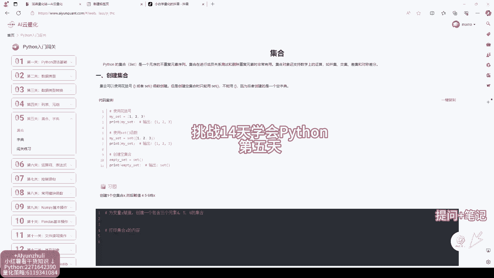

在本节课中，我们将要学习Python中两种重要的数据结构：集合（Set）和字典（Dictionary）。它们是编写量化策略代码时，用于高效存储和处理数据的核心工具。我们将通过简单的例子来理解它们的概念、特性和基本操作。

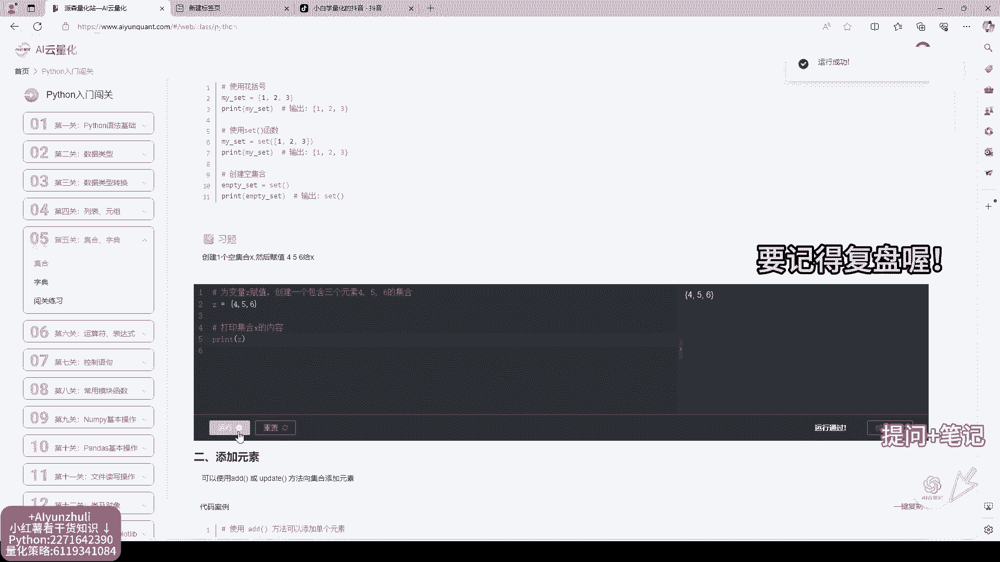

---

## 集合（Set）的概念与特性 🔗

上一节我们介绍了列表和元组，它们都是有序的数据集合。本节中我们来看看集合。集合是一个**无序**且**元素唯一**的容器。这意味着集合中的元素没有固定顺序，并且不会重复。

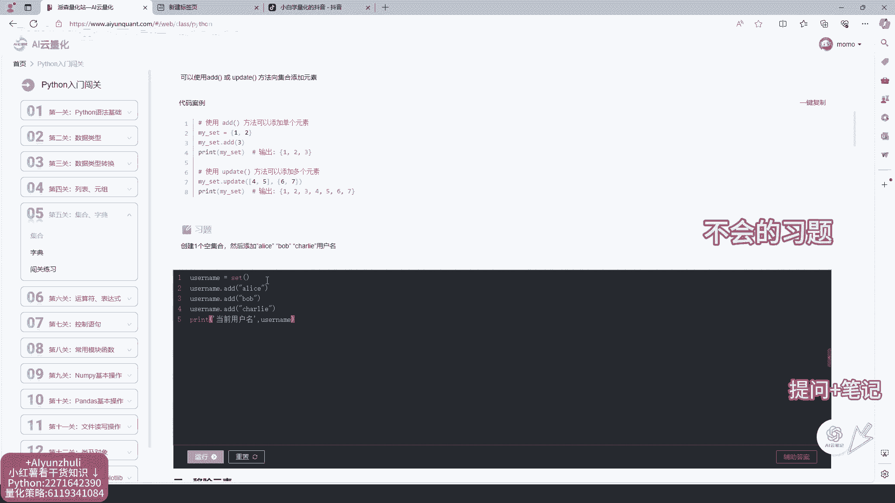

集合的核心特性可以用以下公式表示：
**集合 = {元素1, 元素2, ...}**， 其中元素具有**唯一性**和**无序性**。

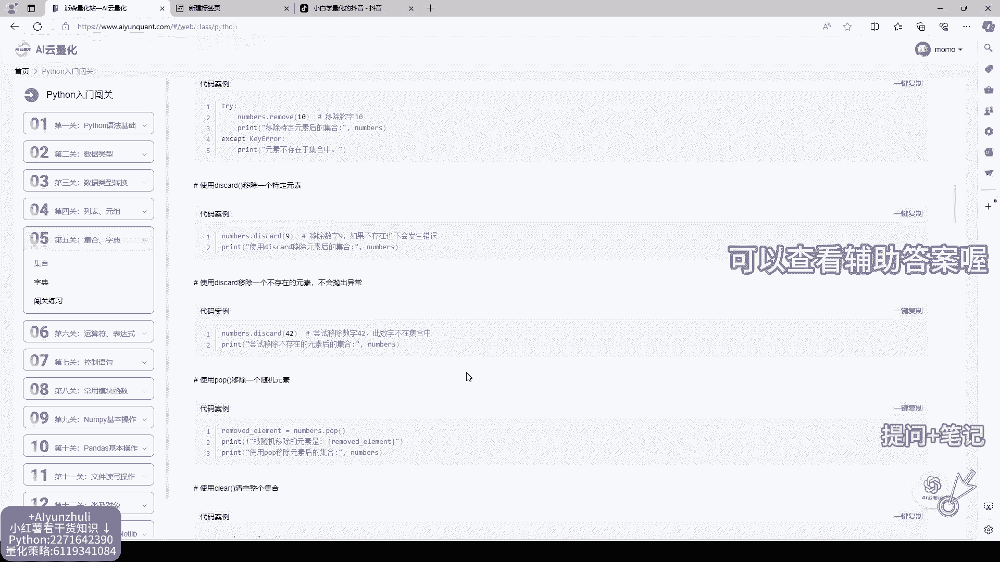

以下是集合的一些关键特点：

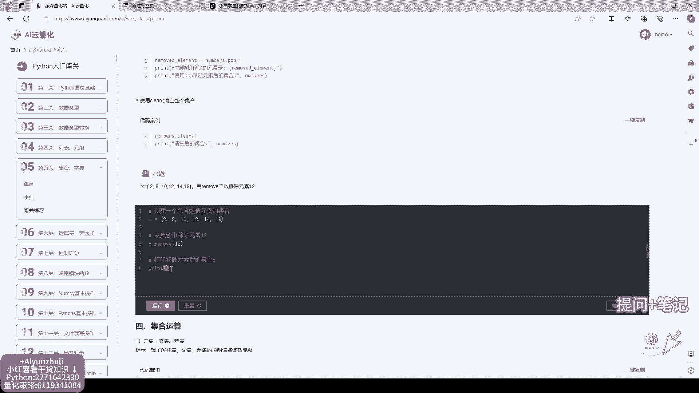

*   **无序性**：集合中的元素没有索引，不能通过位置来访问。
*   **唯一性**：集合会自动去除重复的元素。
*   **可变性**：可以添加或删除集合中的元素。

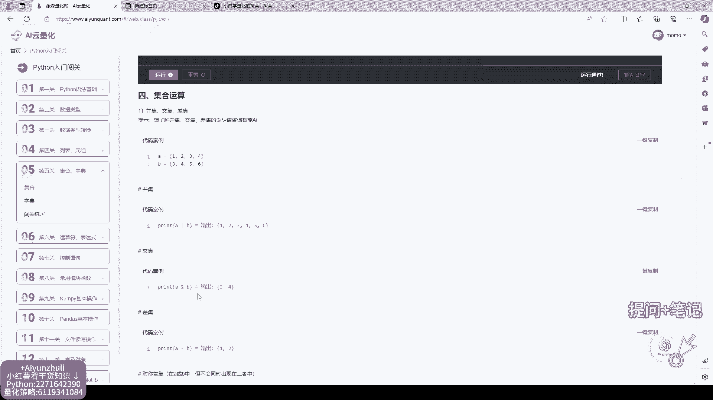

---

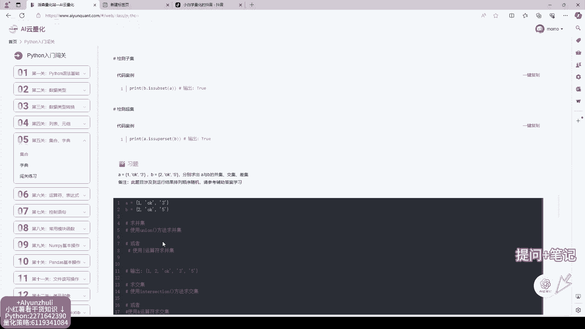

## 集合的基本操作 ⚙️

了解了集合的概念后，我们来学习如何创建和使用它。集合使用花括号 `{}` 创建，或者使用 `set()` 函数。

以下是创建集合和进行基本操作的代码示例：

```python
# 创建一个集合
my_set = {1, 2, 3, 3, 4}  # 重复的3会被自动去除
print(my_set)  # 输出: {1, 2, 3, 4}

# 添加元素
my_set.add(5)
print(my_set)  # 输出: {1, 2, 3, 4, 5}

# 删除元素
my_set.remove(2)  # 如果元素不存在会报错
my_set.discard(10) # 安全删除，元素不存在也不会报错
print(my_set)  # 输出: {1, 3, 4, 5}

# 集合的常用操作：交集、并集、差集
set_a = {1, 2, 3}
set_b = {3, 4, 5}

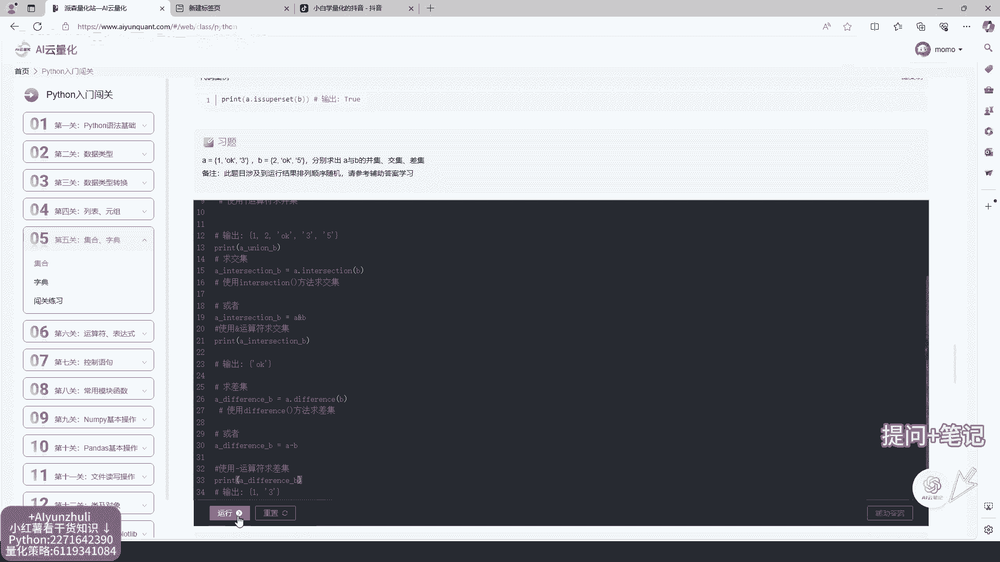

print(set_a & set_b)  # 交集，输出: {3}
print(set_a | set_b)  # 并集，输出: {1, 2, 3, 4, 5}
print(set_a - set_b)  # 差集（在a中但不在b中），输出: {1, 2}
```

---

## 字典（Dictionary）的概念与特性 📖

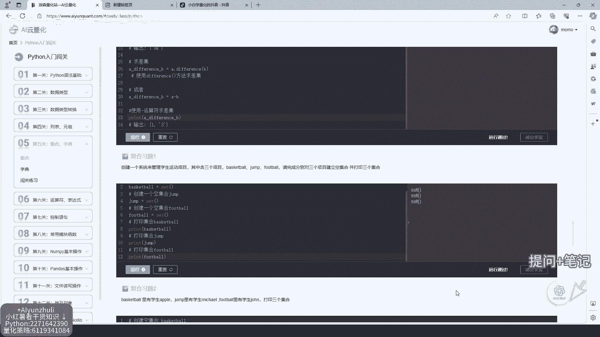

集合用于存储独立的、不重复的值。但在量化分析中，我们经常需要将数据（如股票代码）与对应的值（如价格）关联起来。这时就需要用到字典。

字典是一种**键值对（Key-Value Pair）** 的集合。每个键（Key）都是唯一的，用于查找对应的值（Value）。你可以把字典想象成一个真实的字典，通过“单词”（键）来查找“释义”（值）。

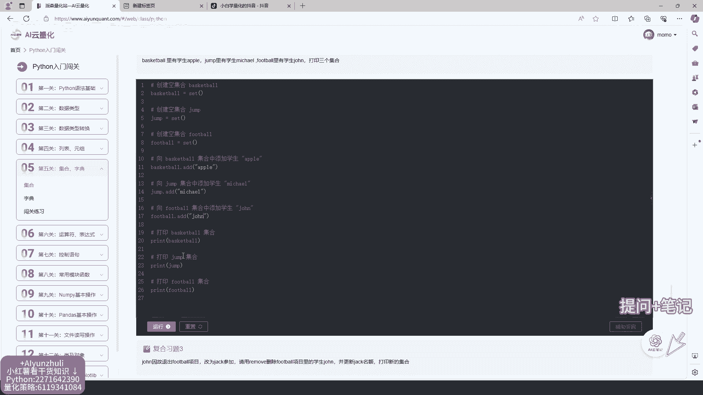

字典的核心结构可以用以下公式表示：
**字典 = {键1: 值1, 键2: 值2, ...}**

---

## 字典的基本操作 🛠️

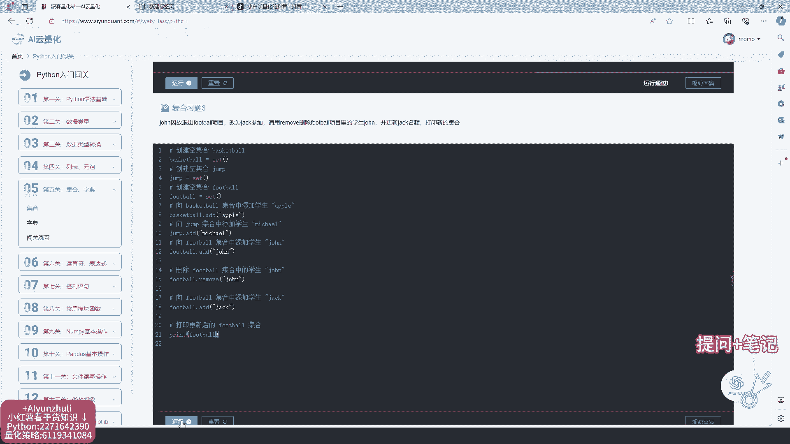

现在，让我们学习如何创建和操作字典。字典同样使用花括号 `{}` 创建，但内部是 `键: 值` 的形式。

以下是字典的基本操作示例：

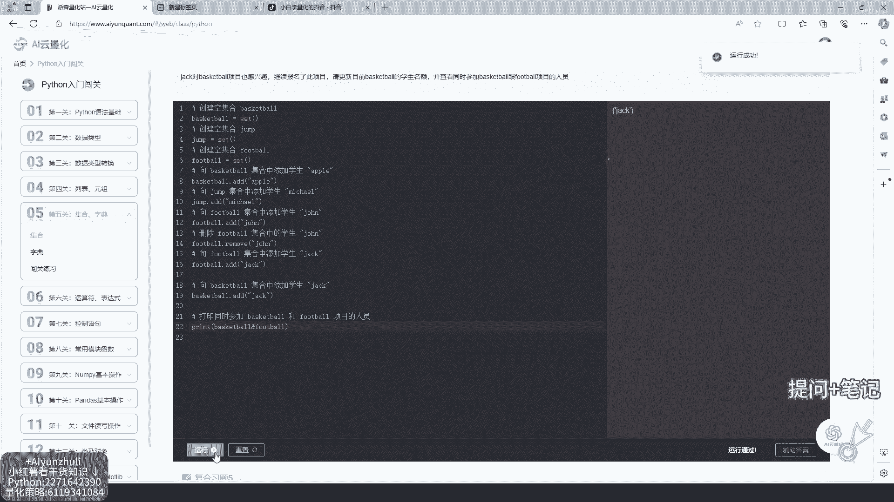

```python
# 创建一个字典，记录股票代码和名称
stock_dict = {'AAPL': '苹果公司', 'GOOGL': '谷歌公司', 'TSLA': '特斯拉公司'}
print(stock_dict)

# 通过键来访问值
company_name = stock_dict['AAPL']
print(company_name)  # 输出: 苹果公司

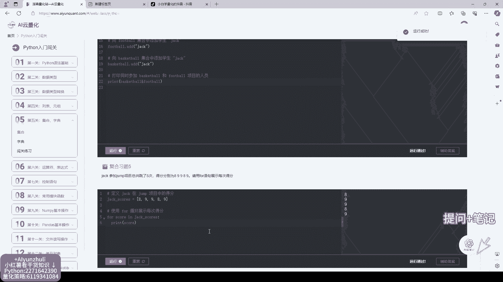

# 添加或修改键值对
stock_dict['MSFT'] = '微软公司'  # 添加新条目
stock_dict['TSLA'] = '特斯拉汽车公司'  # 修改已有条目的值
print(stock_dict)

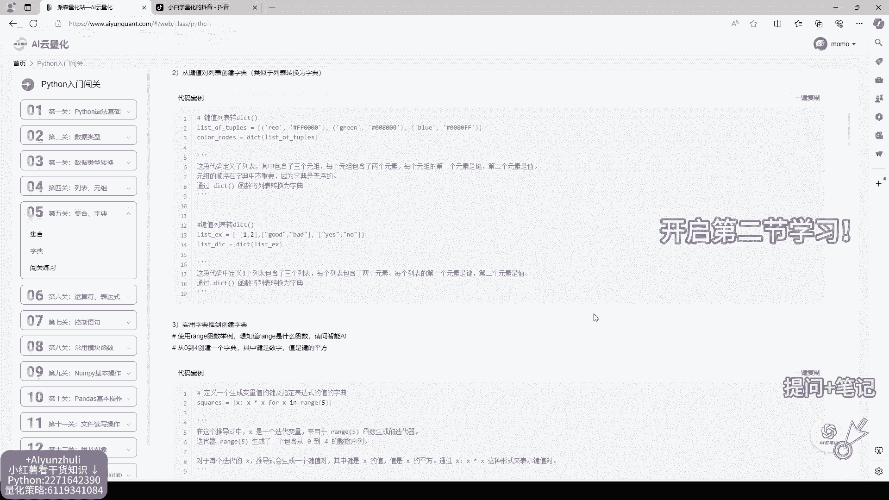

# 删除键值对
del stock_dict['GOOGL']
print(stock_dict)

# 安全地获取值（避免键不存在时报错）
price = stock_dict.get('AMZN', '未找到该股票代码')
print(price)  # 输出: 未找到该股票代码

# 遍历字典
print("所有股票代码：")
for code in stock_dict.keys(): # 遍历所有键
    print(code)

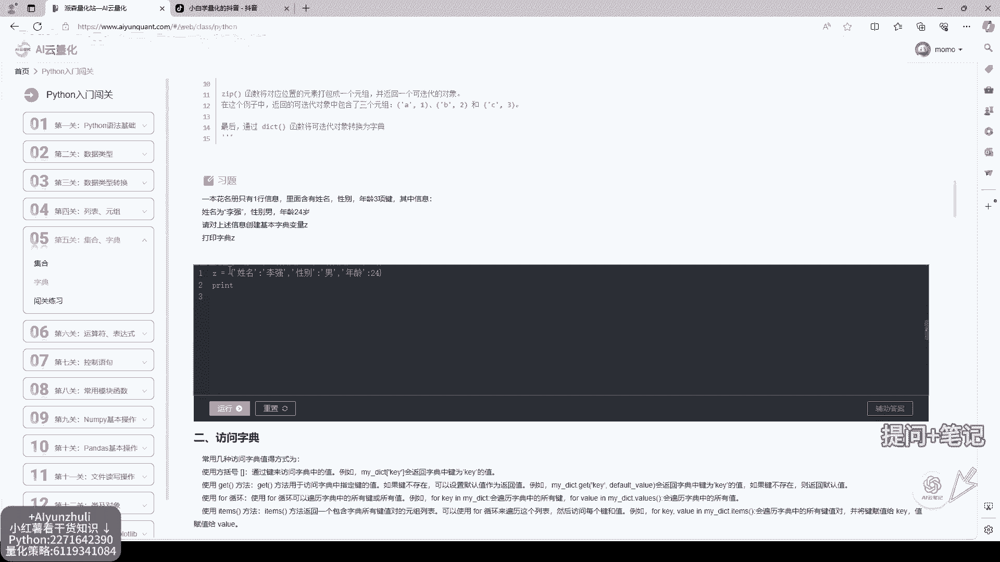

print("\n所有公司名称：")
for name in stock_dict.values(): # 遍历所有值
    print(name)

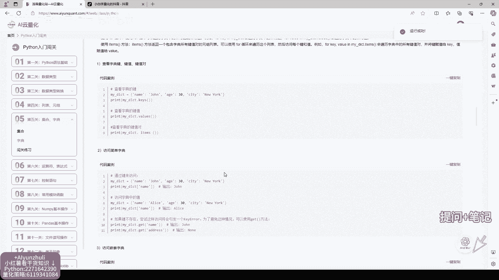

print("\n代码与公司对应关系：")
for code, name in stock_dict.items(): # 同时遍历键和值
    print(f"{code}: {name}")
```

---

## 在量化策略中的应用示例 💹

学习了集合和字典的基本操作后，我们来看一个简单的量化场景应用。

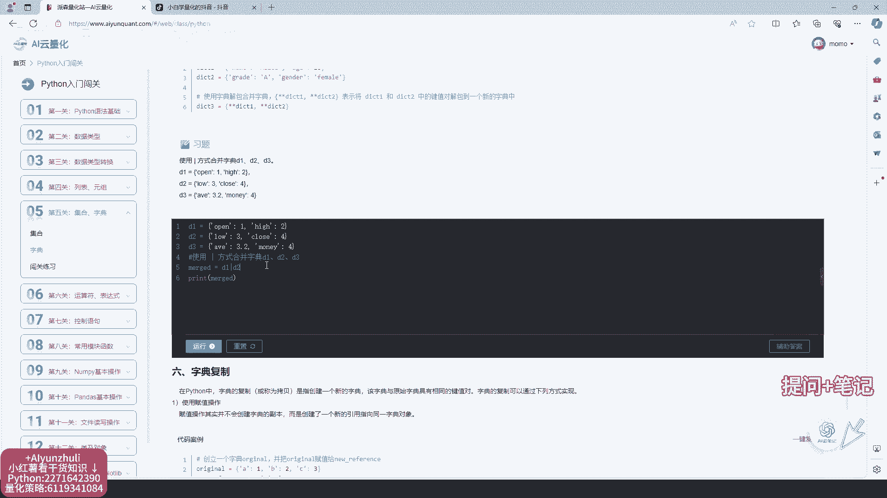

假设我们需要管理一个股票池，并记录每只股票的最新价格。

```python
# 使用集合管理股票池（确保股票代码不重复）
stock_pool = {'AAPL', 'MSFT', 'TSLA', 'NVDA'}
print(f"股票池: {stock_pool}")

# 使用字典记录股票价格
stock_price = {
    'AAPL': 175.25,
    'MSFT': 330.12,
    'TSLA': 210.45,
    'NVDA': 450.78
}

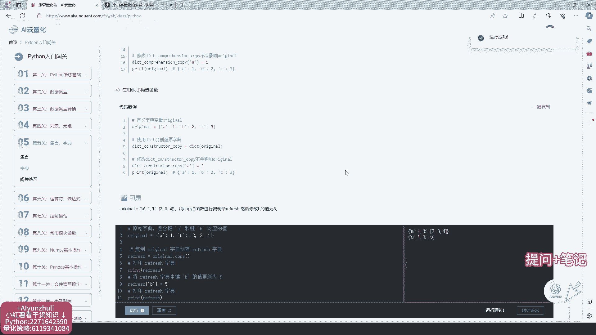

# 策略逻辑示例：找出价格高于200美元的股票
high_price_stocks = {}
for code, price in stock_price.items():
    if price > 200:
        high_price_stocks[code] = price

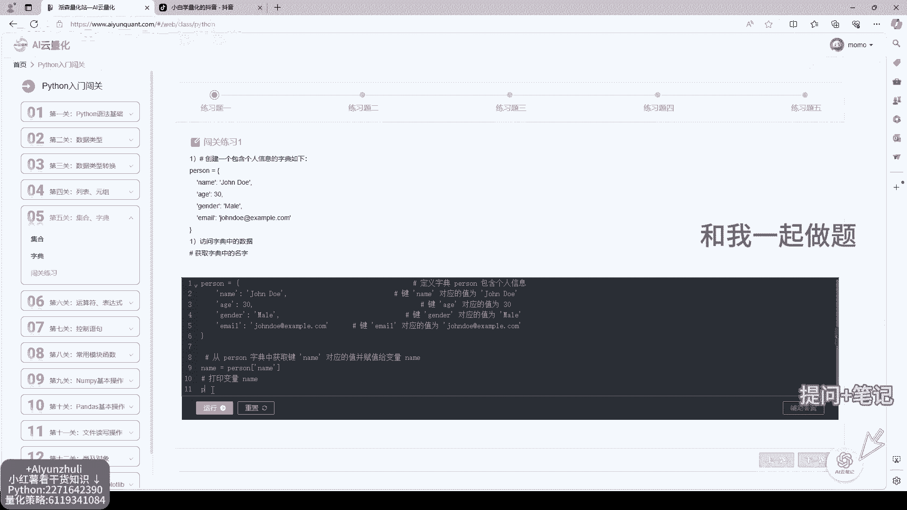

print(f"价格高于200美元的股票: {high_price_stocks}")

# 更新股票池：添加一只新股票
new_stock = 'AMZN'
stock_pool.add(new_stock)
# 同时更新价格字典
stock_price[new_stock] = 135.60
print(f"更新后的股票池: {stock_pool}")
print(f"更新后的价格字典: {stock_price}")
```

---

## 总结 🎯

本节课中我们一起学习了Python中两个强大的数据结构：
1.  **集合（Set）**：用于存储无序且唯一的元素，常用于去重和集合运算（如交集、并集）。
2.  **字典（Dictionary）**：用于存储键值对，通过唯一的键来高效访问对应的值，非常适合管理具有映射关系的数据，如股票代码与价格。

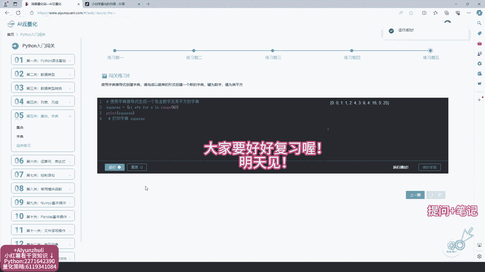

掌握它们将帮助你更有效地组织和处理量化策略中的数据。在接下来的学习中，我们会将这些数据结构应用到更复杂的策略逻辑中。